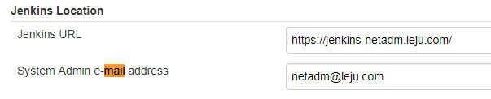
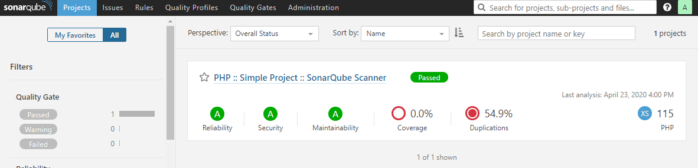
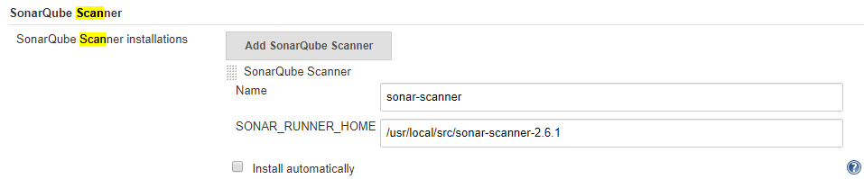
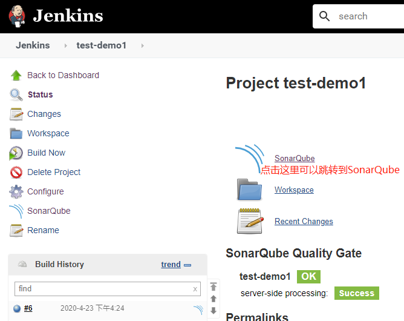

# 笔记

**Devops简介**

Devops是Development和Operations的组合，也就是开发和运维的简写。

Devops是一组针对企业研发人员、运维人员和测试人员的工作理念，是他们在应用开发、代码部署和质量测试等整条生命周期中协作和沟通的最佳实践，Devops强调整个组织的合作以及交付和基础设施变更的自动化，从而实现持续集成、持续部署和持续交付。

能更快、更好的交付软件。

通过自动化软件交付和架构变更的流程，使得构建、测试、发布软件能够更加快捷、频繁和可靠。

Devops四大平台：代码托管（GitHub/GitLab/SVN）、项目管理（jira）、运维平台（腾讯蓝鲸/开源平台）、持续交付（Jenkins/GitLab）

**什么是Devops**


**持续集成（Continuous Integration）**

指多名开发者在开发不同功能代码的过程中，可以频繁的将代码合并到一起且互不影响。原来用SVN，现在用Git


**持续部署（Continuous Deployment）**

基于某种工具或平台实现代码自动构建、测试和部署到线上环境以实现交付高质量的产品。持续部署在某种程度上代表了一个开发团队的更新迭代速率。比如Jenkins


**持续交付（Continuous Delivery）**

在持续部署的基础上，将产品交付到线上环境，因此持续交付是产品价值的一种交付，是产品价值的一种盈利的实现。


# 部署Jenkins

Jenkins是一个自动化服务器，是一个比较成熟的CI工具（也可以是CD）。能够实现自动化集成发布。建立好流水线后，期间无需运维人员接入，开发人员随时发布部署。

部分应用场景：

- 集成svn/git客户端实现源代码下载检出
- 集成maven/ant/gradle/npm等构建工具实现源码编译打包单元测试
- 集成sonarqube对源代码进行质量检查（味道、复杂度、新增bug等）
- 集成saltstack/ansible实现自动化部署发布
- 集成jmeter/soar/kubernetes/...
- 可以自定义插件或脚本通过Jenkins传参运行

**安装GDK**

```BASH
[10.208.3.21 root@test-4:~]# yum install ./jdk-8u191-linux-x64.rpm
[10.208.3.21 root@test-4:~]# cat /etc/profile.d/java.sh
export JAVA_HOME=/usr/java/jdk1.8.0_191-amd64
export PAHT=$JAVA_HOME:/bin:$JAVA_HOME/jre/bin:$PATH
export CLASSPATH=.$CLASSPATH:$JAVA_HOME/lib:$JAVA_HOME/jre/lib:$JAVA_HOME/lib/tools.jar
[10.208.3.21 root@test-4:~]# source /etc/profile.d/java.sh
```

yum安装Jenkins

```BASH
清华源查看了解，直接安装
yum install https://mirrors.tuna.tsinghua.edu.cn/jenkins/redhat-stable/jenkins-2.222.1-1.1.noarch.rpm
systemctl enable jenkins.service #设置jenkins服务为自启动服务
systemctl start jenkins.service #启动jenkins服务
```

通过war包形式启动Jenkins

```BASH
[10.208.3.21 root@test-4:~]# mkdir -p /opt/jenkins/logs
[10.208.3.21 root@test-4:~]# echo "export JENKINS_HOME="/opt/jenkins"" >> /etc/profile.d/jenkins.sh
[10.208.3.21 root@test-4:~]# source /etc/profile.d/jenkins.sh
[10.208.3.21 root@test-4:~]# java -Dcom.sun.management.jmxremote -Dcom.sun.management.jmxremote.port=12345 -Dcom.sun.management.jmxremote.authenticate=false -Dcom.sun.management.jmxremote.ssl=false -Djava.rmi.server.hostname=10.208.3.20 -jar /root/jenkins-2.222.1.war --httpPort=8080 --webroot=${JENKINS_HOME}/war --pluginroot ${JENKINS_HOME}/plugins &
```

启动之后，日志输出中会显示下Jenkins的一个初始密码，用于解锁Jenkins


**访问Jenkins页面http://10.208.3.21:8080**

开始可能显示"Jenkins正在启动,请稍后..."，等等就好了


**过一会显示“解锁Jnekins”，在此时输入密码，如果不记得了，可以去提示的路径中去看**


**安装插件"**

点击“选择插件来安装”，然后一个插件都不选，直接下一步。这些插件的下载地址都在国外，安装会等很长时间，而且很可能会安装失败，伺候我们可以导入下载好的插件来安装。


如果上面点击了“安装推荐的插件”，但是最后很多插件都安装失败了，也没有关系，登录Jenkins之后手动安装也行。


**创建一个管理员用户**


**设置Jenkins的URL**

我设置好了域名映射，所以直接写成了域名


**登录Jenkins**

我访问https://jenkins-netadm.leju.com/，输入用户名和密码


**安装gitlab和blue ocean插件**


安装这些软件的时候，那些推荐安装的软件，也会被一起装上

在安装更新的时候可以切换到其他页面，更新还会继续在后台运行，访问这个链接可以查看https://jenkins-netadm.leju.com/updateCenter/

**配置jenkins权限**

这是基于角色的权限管理，先创建角色和用户，给角色授权，然后把用户添加到角色中。

先安装“Role-based Authorization Strategy”插件


**更改授权策略为基于角色**


**创建角色**


**分配权限为READ**


**创建用户**

Jenkins--系统管理--管理用户


将用户分配到role中


**用刚创建的用户测试登录**


**设置管理员邮箱**

系统管理--系统设置




**添加凭据（已经将Jnekins服务器上root用户的公钥已经放到gitlab中了）**


**创建一个项目**

选择freestyle


然后在Build这里输入一个shell命令，然后点击保存，其余什么都不动


构建一下看看效果


这里可以看到构建历史


查看控制台输出


将源码管理方式选择成git，然后添加仓库、私钥、并指定分支


点击构建，并查看结果


代码被Jenkins从Gitlab上克隆下来了

```BASH
[10.208.3.24 root@test-6:/tmp]# ll /opt/jenkins/workspace/test-demo1/
total 8
-rw-r--r-- 1 root root 42 2020-04-21 23:06:34 index.html
-rw-r--r-- 1 root root  8 2020-04-21 23:06:34 README.md
[10.208.3.24 root@test-6:/tmp]# 
[10.208.3.24 root@test-6:/tmp]# cat /opt/jenkins/workspace/test-demo1/index.html 
<h1>Hello World</h1>
<h1>Hello World</h1>
```

**简单的模拟一次版本替换**

> 1、克隆代码
>
> 2、停止目标业务服务器应用
>
> 3、将代码拷贝到业务服务器服务器
>
> 5、启动目标业务服务器引用


# Pipeline

Pipeline是帮助Jenkins实现CI到CD转变的重要角色，死运维在Jenkins2.x版本的核心插件，简单来说Pipeline就是一套运行于Jenkins上的工作流框架，将原本独立运行于单个或多个节点的任务练级起来，实现单个任务难以完成的复杂编排和任务可视化，Pipeline的实现方式是一套Groovy DSL，任何发布流程都可以表述为一段Groovy脚本。

**Pipeline优势**

可持续性：Jenkins的重启或者中断不影响已经执行的Pipeline Job

支持暂停：Pipeline可以选择停止并等待人工输入或批准后再继续执行。

可扩展：通过Groovy编程更容易扩展插件。

并行执行：通过groovy脚本可以实现step，stage间的并行执行，和更复杂的相互依赖关系。

安装Pipeline插件


创建Pipeline


**生成pipeline语句**

点击pipeline syntax


选择Sample Step，然后输入相应的参数，最后点击Generate Pipeline Script，下面出现的代码就是pipeline语句，将其复制即可。


**pipeline中获取代码并分发部署**

```BASH
pipeline {
   agent any

   stages {
      stage('code clone') {
         steps {
            git credentialsId: '4eaf63a6-52b2-4d8b-ba14-26322a3135e0', url: 'ssh://git@gitlab-netadm.leju.com:2223/test/testapp1.git'
         }
      }
      stage('stop app') {
         steps {
            sh 'ssh -o StrictHostKeyChecking=no 10.208.3.21 /usr/local/src/apache-tomcat-7.0.88/bin/catalina.sh stop'
            sh 'ssh -o StrictHostKeyChecking=no 10.208.3.23 /usr/local/src/apache-tomcat-7.0.88/bin/catalina.sh stop'
         }
      }
      stage('code deploy') {
         steps {K
            sh 'cd /opt/jenkins/workspace/pipeline-test/ && scp -o StrictHostKeyChecking=no ./index.html 10.208.3.21:/data/jsp/test/testapp/'
            sh 'cd /opt/jenkins/workspace/pipeline-test/ && scp -o StrictHostKeyChecking=no ./index.html 10.208.3.23:/data/jsp/test/testapp/'
         }
      }
      stage('start app') {
         steps {
            sh 'ssh -o StrictHostKeyChecking=no 10.208.3.21 /usr/local/src/apache-tomcat-7.0.88/bin/catalina.sh start'
            sh 'ssh -o StrictHostKeyChecking=no 10.208.3.23 /usr/local/src/apache-tomcat-7.0.88/bin/catalina.sh start'
         }
      }
   }
}
```


这是构建的master分支中的commit版本


之后我在git中又提交了一次代码，然后重新构建


代码的commit也变成新的了


访问业务也可以看到变化


此时因为某些原因我需要还原


# sonarqube

支持对下面这些语言进行静态代码分析

Java, JavaScript, C#, TypeScript, Kotlin, Ruby, Go, Scala, Flex, Python, PHP, HTML, CSS, XML and VB.NET


[10.208.3.24 root@test-6:~]# useradd -s /sbin/nologin -m sonarqube

[10.208.3.24 root@test-6:~]# vim /etc/security/limits.conf
sonarqube  -   nofile  65536
sonarqube  -   noproc  2048

[10.208.3.24 root@test-6:~]# vim /etc/sysctl.conf 
vm.max_map_count=262144
fs.file-max=65536


7.9.x版本不在支持MySQL

(root@localhost) [(none)]>create database sonar default character set utf8 collate utf8_general_ci;

(root@localhost) [(none)]>create user sonar@'127.0.0.1' IDENTIFIED BY '123123';

(root@localhost) [(none)]>grant all privileges on sonar.* to sonar@'127.0.0.1';

(root@localhost) [(none)]>flush privileges;


[10.208.3.24 root@test-6:/usr/local]# cd /usr/local/src/

[10.208.3.24 root@test-6:/usr/local/src]# unzip sonarqube-6.5.zip

[10.208.3.24 root@test-6:/usr/local/src]# ln -s sonarqube-6.5 sonarqube

[10.208.3.24 root@test-6:/usr/local/src]# chown -R sonarqube: sonarqube

[10.208.3.24 root@test-6:/usr/local/src]# vim sonarqube/conf/sonar.properties

sonar.jdbc.username=sonar
sonar.jdbc.password=123123

sonar.jdbc.url=jdbc:mysql://127.0.0.1:3306/sonar?useUnicode=true&characterEncoding=utf8&rewriteBatchedStatements=true&useConfigs=maxPerformance&useSSL=false

sonar.web.host=0.0.0.0

sonar.web.port=9000

[10.208.3.24 root@test-6:/usr/local/src]# sonarqube/bin/linux-x86-64/sonar.sh start

[10.208.3.24 root@test-6:/usr/local/src]# ss -lntup | grep 9000
tcp    LISTEN     0      25       :::9000                 :::*                   users:(("java",pid=9569,fd=98))


登录web页面


查看已安装的插件

[10.208.3.24 root@test-6:/usr/local/src]# ll sonarqube/extensions/plugins/
total 44832
-rw-r--r-- 1 root root      129 2017-08-01 12:00:14 README.txt
-rw-r--r-- 1 root root 11069007 2017-07-31 09:43:56 sonar-csharp-plugin-5.10.1.1411.jar
-rw-r--r-- 1 root root  1618672 2017-07-31 09:43:54 sonar-flex-plugin-2.3.jar
-rw-r--r-- 1 root root  4900103 2017-08-01 06:19:44 sonar-java-plugin-4.12.0.11033.jar
-rw-r--r-- 1 root root  3261889 2017-08-01 06:19:44 sonar-javascript-plugin-3.1.1.5128.jar
-rw-r--r-- 1 root root  3733262 2017-07-31 09:43:54 sonar-php-plugin-2.10.0.2087.jar
-rw-r--r-- 1 root root  4024311 2017-08-01 06:19:44 sonar-python-plugin-1.8.0.1496.jar
-rw-r--r-- 1 root root  3233128 2017-07-31 09:43:54 sonar-scm-git-plugin-1.2.jar
-rw-r--r-- 1 root root  6676141 2017-08-01 07:48:40 sonar-scm-svn-plugin-1.5.0.715.jar
-rw-r--r-- 1 root root  7368250 2017-08-01 06:19:44 sonar-xml-plugin-1.4.3.1027.jar


根据需要安装插件

比如中文、python、php等等


安装sonar-scanner

[10.208.3.24 root@test-6:/usr/local/src]# unzip sonar-scanner-2.6.1.zip

[10.208.3.24 root@test-6:/usr/local/src]# vim sonar-scanner-2.6.1/conf/sonar-scanner.properties 

sonar.host.url=http://10.208.3.24:9000
sonar.sourceEncoding=UTF-8


准备测试代码

[10.208.3.24 root@test-6:/usr/local/src]# unzip sonar-examples-master.zip 

[10.208.3.24 root@test-6:/usr/local/src]# cd sonar-examples-master/projects/languages/php/php-sonar-runner
[10.208.3.24 root@test-6:/usr/local/src/sonar-examples-master/projects/languages/php/php-sonar-runner]# tree
.
├── README.md
├── sonar-project.properties
├── src
│   └── Math.php
└── validation.txt

```BASH
[10.208.3.24 root@test-6:/usr/local/src/sonar-examples-master/projects/languages/php/php-sonar-runner]# cat sonar-project.properties 	##执行scanner的时候，它会读取这个信息
sonar.projectKey=org.sonarqube:php-simple-sq-scanner
sonar.projectName=PHP :: Simple Project :: SonarQube Scanner
sonar.projectVersion=1.0
sonar.sources=src
sonar.language=php
sonar.sourceEncoding=UTF-8
```


执行扫描

```BASH
[10.208.3.24 root@test-6:/usr/local/src/sonar-examples-master/projects/languages/php/php-sonar-runner]# /usr/local/src/sonar-scanner-2.6.1/bin/sonar-scanner 
INFO: Scanner configuration file: /usr/local/src/sonar-scanner-2.6.1/conf/sonar-scanner.properties
INFO: Project root configuration file: /usr/local/src/sonar-examples-master/projects/languages/php/php-sonar-runner/sonar-project.properties
INFO: SonarQube Scanner 2.6.1
INFO: Java 1.8.0_191 Oracle Corporation (64-bit)
INFO: Linux 3.10.0-957.27.2.el7.x86_64 amd64
INFO: User cache: /root/.sonar/cache
INFO: Load global settings
INFO: Load global settings (done) | time=75ms
INFO: User cache: /root/.sonar/cache
INFO: Load plugins index
INFO: Load plugins index (done) | time=4ms
INFO: SonarQube server 6.5.0
INFO: Default locale: "en_US", source code encoding: "UTF-8"
INFO: Process project properties
INFO: Load project repositories
INFO: Load project repositories (done) | time=27ms
INFO: Load quality profiles
INFO: Load quality profiles (done) | time=29ms
INFO: Load active rules
INFO: Load active rules (done) | time=782ms
INFO: Load metrics repository
INFO: Load metrics repository (done) | time=105ms
WARN: SCM provider autodetection failed. No SCM provider claims to support this project. Please use sonar.scm.provider to define SCM of your project.
INFO: Publish mode
INFO: Project key: org.sonarqube:php-simple-sq-scanner
INFO: -------------  Scan PHP :: Simple Project :: SonarQube Scanner
INFO: Load server rules
INFO: Load server rules (done) | time=175ms
INFO: Language is forced to php
INFO: Base dir: /usr/local/src/sonar-examples-master/projects/languages/php/php-sonar-runner
INFO: Working dir: /usr/local/src/sonar-examples-master/projects/languages/php/php-sonar-runner/.sonar
INFO: Source paths: src
INFO: Source encoding: UTF-8, default locale: en_US
INFO: Index files
INFO: 1 file indexed
INFO: Quality profile for php: Sonar way
INFO: Sensor SonarJavaXmlFileSensor [java]
INFO: Sensor SonarJavaXmlFileSensor [java] (done) | time=0ms
INFO: Sensor PHP sensor [php]
INFO: 1 source files to be analyzed
INFO: 1/1 source files have been analyzed
INFO: No PHPUnit test report provided (see 'sonar.php.tests.reportPath' property)
INFO: No PHPUnit coverage reports provided (see 'sonar.php.coverage.reportPaths' property)
INFO: Sensor PHP sensor [php] (done) | time=599ms
INFO: Sensor Analyzer for "php.ini" files [php]
INFO: Sensor Analyzer for "php.ini" files [php] (done) | time=2ms
INFO: Sensor Zero Coverage Sensor
INFO: Sensor Zero Coverage Sensor (done) | time=13ms
INFO: Sensor CPD Block Indexer
INFO: Sensor CPD Block Indexer (done) | time=0ms
INFO: No SCM system was detected. You can use the 'sonar.scm.provider' property to explicitly specify it.
INFO: Calculating CPD for 1 file
INFO: CPD calculation finished
INFO: Analysis report generated in 65ms, dir size=31 KB
INFO: Analysis reports compressed in 9ms, zip size=10 KB
INFO: Analysis report uploaded in 298ms
INFO: ANALYSIS SUCCESSFUL, you can browse http://10.208.3.24:9000/dashboard/index/org.sonarqube:php-simple-sq-scanner
INFO: Note that you will be able to access the updated dashboard once the server has processed the submitted analysis report
INFO: More about the report processing at http://10.208.3.24:9000/api/ce/task?id=AXGmDb_k9mokw4N2vqpA
INFO: Task total time: 4.355 s
INFO: ------------------------------------------------------------------------
INFO: EXECUTION SUCCESS
INFO: ------------------------------------------------------------------------
INFO: Total time: 5.516s
INFO: Final Memory: 46M/191M
INFO: ------------------------------------------------------------------------
```


然后就可以去sonarqube中看这个项目的信息了



在Jenkins中添加设置Sonarqube插件


在Jenkins中添加SonarScanner

系统管理--全局工具设置

如果还没有安装sonarscanner且网络没问题，可以选择自动安装



更改项目，在项目中的Build中，添加“Execute SonarQube Scanner”


```BASH
sonar.projectKey=test-demo1
sonar.projectName=test-demo1
sonar.projectVersion=1.0
sonar.sources=./
sonar.language=php
sonar.sourceEncoding=UTF-8
```

构建




