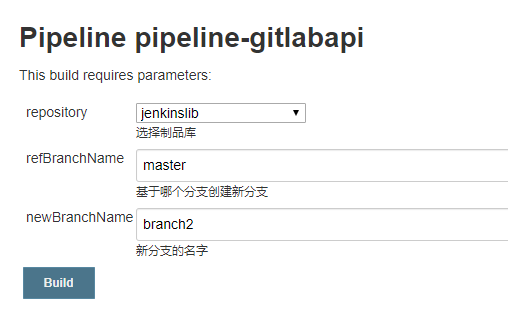

**调用GitLab API创建分支**

API的参考：<你GitLab的URL>/help/api/branches.html

Jenkinsfile

```GROOVY
[10.208.3.24 root@test-6:~/jenkinslib]# cat Jenkinsfiles/gitlab_api.jenkinsfile 
@Library('jenkinslib@master')
def tools = new org.devops.tools()
def gitlab = new org.devops.gitlab()
def toemail = new org.devops.toemail()

pipeline {
    agent { node{label "scanner"} }
	options {
		timeout(time: 1, unit: 'HOURS') 
		timestamps()
		buildDiscarder(logRotator(numToKeepStr: '10'))
	}
	parameters {
		choice(name: 'repository', choices: 'jenkinslib\nsimple-java-maven-app\nTestapp1', description: '选择仓库')
		string(name: 'refBranchName', defaultValue: '', description: '基于此分支创建新分支')
		string(name: 'newBranchName', defaultValue: '', description: '新分支的名字')
	}
    stages {
		stage('CreateNewBranch') {
			steps {
				script {
					projectId = gitlab.GetProjectId(repository)
					gitlab.CreateBranch(projectId,newBranchName,refBranchName)
				}
			}
		}
    }
}
```

共享库

```GROOVY
[10.208.3.24 root@test-6:~/jenkinslib]# cat src/org/devops/gitlab.groovy
package org.devops

//封装HTTP
def HttpReq(reqType,reqUrl,reqBody){
	def gitServer = "https://gitlab-netadm.leju.com/api/v4"
	def tools = new org.devops.tools()
	withCredentials([string(credentialsId: 'gitlab-root-token2', variable: 'gitlabToken')]) {
		result = httpRequest(
					customHeaders: [[maskValue: true, name: 'PRIVATE-TOKEN', value: "${gitlabToken}"]],
					httpMode: reqType,
					contentType: "APPLICATION_JSON",
					consoleLogResponseBody: true,
					ignoreSslErrors: true,
					requestBody: reqBody,
					//quiet: true,
					url: "${gitServer}/${reqUrl}")
	}
	return result
}

//更改提交状态
def ChangeCommitStatus(projectId,commitSha,status){
	def tools = new org.devops.tools()
	commitApi = "projects/${projectId}/statuses/${commitSha}?state=${status}"
	response = HttpReq('POST',commitApi,'')
	tools.PrintMes("Status: ${response.status}","green")
	tools.PrintMes("Content: ${response.content}","green")
	return response
}

//获取项目ID
def GetProjectId(projectName) {
	apiUrl = "projects?search=${projectName}"
	response = HttpReq('GET',apiUrl,'')
    response = readJSON text: """${response.content}"""
	result = response[0]["id"]
	println(result)
	return result
}

//列出分支
def ListRepositoryBranch(projectId){
	apiUrl = "projects/${projectId}/repository/branches"
	response = HttpReq('GET',apiUrl,'')
	response = readJSON text: """${response.content}"""
	result = response["name"]
	println("当前分支有: ${result}")
	return result
}

//创建分支
def CreateBranch(projectId,newBranchName,refBranchName) {
	apiUrl = "projects/${projectId}/repository/branches?branch=${newBranchName}&ref=${refBranchName}"
	response = HttpReq('POST',apiUrl,'')
	response = readJSON text: """${response.content}"""
	branchList = ListRepositoryBranch(projectId)
	for (name in branchList) {
		if (name == newBranchName) {
			println("Create ${newBranchName} success.")
		}
	}
}
```



