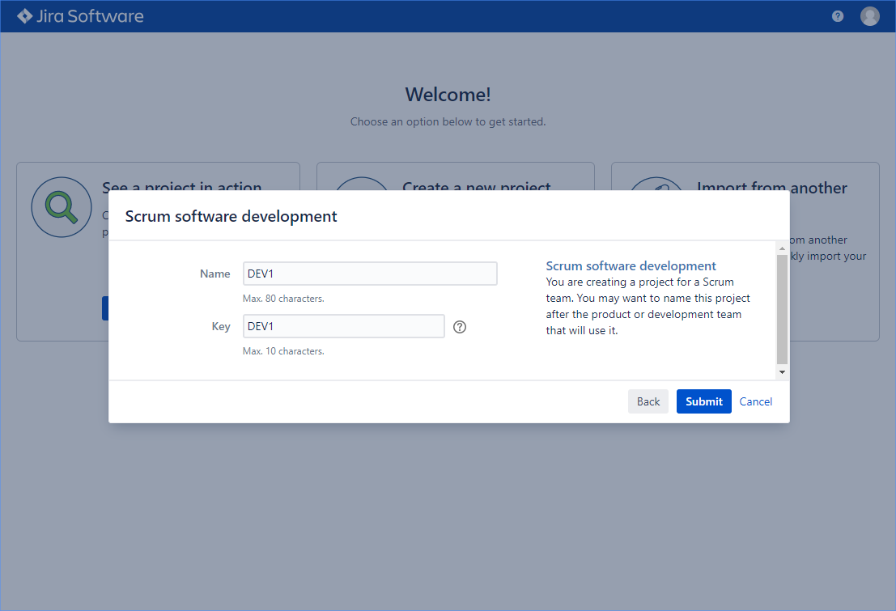
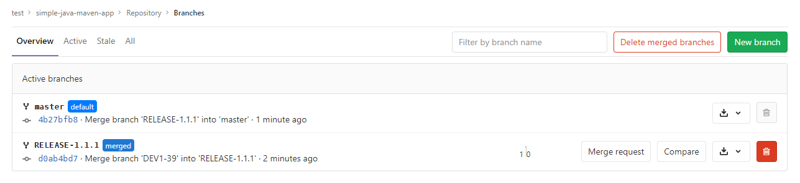

# 部署Jira

**基础操作**

```BASH
[10.208.3.19 root@test-2:/usr/local]# useradd -rM jira -s /sbin/nologin
[10.208.3.19 root@test-2:/usr/local]# tar -xf atlassian-jira-software-8.8.1.tar.gz
[10.208.3.19 root@test-2:/usr/local]# ln -s atlassian-jira-software-8.8.1-standalone jira
[10.208.3.19 root@test-2:/usr/local]# mkdir jira/home
[10.208.3.19 root@test-2:/usr/local]# chown -R jira: jira/
[10.208.3.19 root@test-2:/usr/local]# echo 'export JIRA_HOME=/usr/local/jira/home' > /etc/profile.d/jira.sh
[10.208.3.19 root@test-2:/usr/local]# source /etc/profile.d/jira.sh
```

**更改Jira监听的端口**

默认jira会监听在8080端口，下面我将服务器端口更改为8089，Connector端口更改为8090。

```XML
[10.208.3.19 root@test-2:/usr/local]# vim /usr/local/jira/conf/server.xml
<Server port="8089" shutdown="SHUTDOWN">
...
   <Service name="Catalina">
      <Connector port="8090"
         maxThreads="150"
         minSpareThreads="25"
         connectionTimeout="20000"
         enableLookups="false"
         maxHttpHeaderSize="8192"
         protocol="HTTP/1.1"
         useBodyEncodingForURI="true"
         redirectPort="8443"
         acceptCount="100"
         disableUploadTimeout="true"/>
```

**配置数据库**

必须是mysql，不能是mariadb或者percona，否则即便是在安装的时候测试成功了，最后也会报错

```mysql
create database jira;
create user jira@'10.208.3.%' identified by '123123';
grant all on jira.* to jira@'10.208.3.%';
```

更改mysql配置文件并重启mysql

```none
[mysqld]
default-storage-engine=INNODB
character_set_server=utf8mb4
innodb_default_row_format=DYNAMIC
innodb_large_prefix=ON
innodb_file_format=Barracuda
innodb_log_file_size=2G
sql_mode = NO_AUTO_VALUE_ON_ZERO
```

**拷贝MySQL JDBC driver到Jira安装目录，并启动Jira**

```BASH
[10.208.3.19 root@test-2:/usr/local]# cp /software/Jira/mysql-connector-java-5.1.49.jar /usr/local/jira/lib/
[10.208.3.19 root@test-2:/usr/local]# jira/bin/start-jira.sh 
```

**在浏览器中访问<Jira_url>，开始安装Jira**


输入license，如果没有，就点击generate a Jira trial license生成一个license，这会生成一个试用license


AAABeA0ODAoPeNp9kUFvgkAQhe/8CpJe2sOSBYtBE5K2QCstohHqqZctjroNApldbP33RdAUq3jb2d1575s3NxGT6pjtVDpQdTo0B0Odqo4bqwY1qLJCgGydFwWgFvAEMgHegkueZ7YXxt5sOvMjTwnLzSfgZPkuAIVNdMXJM8kSGbIN2KnV06k1MHTdelhtGE+1JN8oXxyZdtY3LTFZMwEuk2DvAQg1iU6Vg3W8K6DWdCbjsTdz/Mfg+OT9FBx3rb4+oYMjhzeubDtAIsAtoO/aT8GzRZwX0yXx6I2SuW+OGsoC80WZSG1fEJEv5TdD0CpZvgVbYgnNt+54LoR4aZIKMpOQsSzpmOYKzVmSB59qrsB3Iy8kgW7eG72+1Veqyj69uSIcSYYS0F6yVIAywRXLuGDNhFuWlvVRcRDqw/+9pQ3FvILadxgnUUA1LRbIxSFFF0SCvKi1XysINTpAqLfNku4+hmrLtKbuWsOlgNvm7b4/zab+BQAzCeMwLAIUamMOwIctEc6sl5cg04rmgF9yN7sCFDuYFfgiThzj82BYbUy0HLFQS4LVX02ia


设置邮箱


安装完成了，此时可以创建项目了


授权的信息


**Jira本身通过Git插件实现集成**

- 效果：
  - 能够实现在Jira系统对应的任务下面创建特性分支
  - 在创建特性分支的时候名称包含Jira ID自动关联

- 不足：
  - 插件不稳定，资源消耗大
  - 手动创建分支，增加人员成本

**舍弃Jira能省的Git插件，触发Jenkins执行相关操作**

- 效果：
  - 在Jira上创建的故事/任务，会自动在对应的代码仓库创建特性分支。
  - 在Jira上创建release，并将关联到故事/任务之后，会自动在对应的代码仓库创建release分支，与合并请求（特性分支-->release分支）。
- 实现：
  - 配置Jira Webhook触发Jenkins，Jenkins通过流水线调度Webhook操作GitLab。

**这里使用的开发流程**

如果有新特性或修复bug，全部新建特性分支，在特性分支中进行操作。新特性开发完成或BUG修复完成后，新建一个release分支，将特性分支合并到release分支，并在release分支进行测试，测试成功后将release分支发布到生产。最后将release分支合并到master分支上。


**下面几个实验，Jira、Jenkins、GitLab之间的调用关系**

Jira产生的创建类型的webhook

- 在Jira上创建模块，模块名称就是gitlab上仓库的名称。

- Jira创建issue（任务/故事），关联对应模块。创建之后会通过Webhook触发Jenkins执行流水线。

- Jenkins根据模块名称在对应的仓库中创建分支，分支名称就是IssueName。

Jira产生的更新类型的webhook

- Jira更新issue信息（比如描述、凭据），更新之后会通过Webhook触发Jenkins执行流水线，Jenkins根据模块名称在对应的中创建分支（IssueName），如果同名分支已存在就不执行创建操作。

- Jira更新issue中的fixVersion（releases中创建的内容，如果不存在与releases中，就立即新建一个），更新之后会通过Webhook触发Jenkins执行流水线，Jenkins根据模块名称在对应的仓库中创建release分支（名称就是fixVersion的值），并创建特性分支（issueName）到release分支的Merge Request。

# Jira通过webhook触发Jenkins在GitLab上创建分支，分支名称与是Jira中的问题名称

**在Jira上创建一个Webhook，并选择该Webhook会被什么类型的事件触发**

URL：https://jenkins-netadm.leju.com/generic-webhook-trigger/invoke?token=jira-devops-service&projectKey=${project.key}


**Jenkinsfile**

```GROOVY
[10.208.3.24 root@test-6:~/jenkinslib]# cat Jenkinsfiles/jira.jenkinsfile
@Library('jenkinslib@master')
def tools = new org.devops.tools()
def gitlab = new org.devops.gitlab()
pipeline {
    agent { node{label "scanner"} }
	options {
		timeout(time: 1, unit: 'HOURS') 
		timestamps()
		buildDiscarder(logRotator(numToKeepStr: '10'))
	}
    triggers {
        GenericTrigger(
        	genericVariables: [
                [key: "webHookData", value: "\$", expressionType: "JSONPath", regexpFilter: "", defaultValue: ""]
            ],
        	genericRequestVariables: [
                [key: "projectKey", regexpFilter: ""]
            ],
            genericHeaderVariables: [
            ],
            token: 'jira-devops-service',
            causeString: 'Triggered on Jira',
            printContributedVariables: true,
            printPostContent: true,
            silentResponse: true
        )
    }
    stages {
        stage('FilterData') {
            steps{
                script{
					response = readJSON text: """${webHookData}"""
					env.eventType = response["webhookEvent"]
					tools.PrintMes("${eventType}","green")
					switch (eventType){
						case("jira:issue_created"):
							env.issueName = response["issue"]["key"]
							env.userName = response["user"]["name"]
							env.moduleNames = response["issue"]["fields"]["components"]
							env.fixVersion = response["issue"]["fields"]["fixVersions"]
							tools.PrintMes("Trigger by ${userName} ${eventType} ${issueName}","green")
							currentBuild.description = "Trigger by ${userName} ${eventType} ${issueName}"
							break
						case("jira:issue_updated"):
							env.issueName = response["issue"]["key"]
							env.userName = response["user"]["name"]
							env.moduleNames = response["issue"]["fields"]["components"]
							env.fixVersion = response["issue"]["fields"]["fixVersions"]
							tools.PrintMes("Trigger by ${userName} ${eventType} ${issueName}","green")
							currentBuild.description = "Trigger by ${userName} ${eventType} ${issueName}"
							break
					}
                }
            }
        }
		stage('CreateBranchOrMR'){
			when {
				anyOf {
					environment name: 'eventType', value: 'jira:issue_created'   //issue 创建 /更新
					environment name: 'eventType', value: 'jira:issue_updated'
				}
			}
			steps {
				script{
					def projectIds = []
					projectName = moduleNames 
					fixVersion = readJSON text: """${fixVersion}"""
					println(fixVersion.size())

					//获取GitLab项目ID
					def projects = readJSON text: """${moduleNames}"""
					println(projects)
					for (project in projects){
						projectName = project["name"]
						println(projectName)
						currentBuild.description += "\n project: ${projectName}"
						try {
							projectId = gitlab.GetProjectId(projectName)
							println(projectId)
							projectIds.add(projectId)
						} catch(e){
							println(e)
							println("未获取到项目ID，请检查模块名称！")
						}
					}
					println(projectIds)
					if (fixVersion.size() == 0) {
                        for (id in projectIds){
							searchResult = gitlab.SearchRepositoryBranch(id,"${issueName}")
							if (searchResult == 'true') {
								println("已存在${issueName}分支.")
                            	currentBuild.description += "\n 该特性分支已存在, 未进行创建 --> ${id} --> ${issueName}"
							} else {
                            	println("新建特性分支--> ${id} --> ${issueName}")
                            	currentBuild.description += "\n 新建特性分支--> ${id} --> ${issueName}"
                            	gitlab.CreateBranch(id,"${issueName}","master")
							}
                        }
                    } else {
                        fixVersion = fixVersion[0]['name']
                        println("Issue关联release操作,Jenkins创建合并请求")
                        currentBuild.description += "\n Issue关联release操作,Jenkins创建合并请求 \n ${issueName} --> RELEASE-${fixVersion}" 
                        for (id in projectIds){
							searchResult = gitlab.SearchRepositoryBranch(id,"ELEASE-${fixVersion}")
							if (searchResult == 'true') {
								println("已存在RELEASE-${fixVersion}分支.")
                            	currentBuild.description += "\n 该特性分支已存在, 未进行创建 --> ${id} --> RELEASE-${fixVersion}"
							} else {
                            	println("创建RELEASE-->${id} -->${fixVersion}分支")
                            	gitlab.CreateBranch(id,"RELEASE-${fixVersion}","master")
                            		
                           		println("创建合并请求 ${issueName} ---> RELEASE-${fixVersion}")
                           		gitlab.CreateMr(id,"${issueName}","RELEASE-${fixVersion}","${issueName}--->RELEASE-${fixVersion}")
							}
						}
                    }
				}
			}
		}
    }
}
```

**GitlabAPI共享库（只列出了上面涉及到的方法）**

```GROOVY
[10.208.3.24 root@test-6:~/jenkinslib]# cat src/org/devops/gitlab.groovy 
package org.devops

//封装HTTP
def HttpReq(reqType,reqUrl,reqBody){
	def gitServer = "https://gitlab-netadm.leju.com/api/v4"
	def tools = new org.devops.tools()
	withCredentials([string(credentialsId: 'gitlab-root-token2', variable: 'gitlabToken')]) {
		result = httpRequest(
					customHeaders: [[maskValue: true, name: 'PRIVATE-TOKEN', value: "${gitlabToken}"]],
					httpMode: reqType,
					contentType: "APPLICATION_JSON",
					consoleLogResponseBody: true,
					ignoreSslErrors: true,
					requestBody: reqBody,
					//quiet: true,
					url: "${gitServer}/${reqUrl}")
	}
	return result
}

//获取项目ID
def GetProjectId(projectName) {
	apiUrl = "projects?search=${projectName}"
	response = HttpReq('GET',apiUrl,'')
    response = readJSON text: """${response.content}"""
	result = response[0]["id"]
	println(result)
	return result
}

//搜索分支
def SearchRepositoryBranch(projectId,searchKey){
	apiUrl = "projects/${projectId}/repository/branches?search=${searchKey}"
	response = HttpReq('GET',apiUrl,'')
	response = readJSON text: """${response.content}"""
	if (response.size() == 0) {
		println("不存在匹配${searchKey}关键字的分支")
		return 'false'
	} else {
		result = response["name"]
		println("匹配${searchKey}关键字的分支有: ${result}")
		return 'true'
	}	
}

//创建分支
def CreateBranch(projectId,newBranchName,refBranchName) {
	apiUrl = "projects/${projectId}/repository/branches?branch=${newBranchName}&ref=${refBranchName}"
	response = HttpReq('POST',apiUrl,'')
	response = readJSON text: """${response.content}"""
	branchList = ListRepositoryBranch(projectId)
	for (name in branchList) {
		if (name == newBranchName) {
			println("Create ${newBranchName} success.")
		}
	}
}
```

**在Jira上创建问题**

在Jria上创建项目（不需要和GitLab上的仓库同名）




创建组件（在我们的示例中这表示为GitLab上面的仓库名称）


在项目中创建问题

下面我选择了两个组件（gitlab上存在的两个仓库），根据需要选择几个都行


点击创建之后Jenkins就会被Jira通过Webhook触发，从而在GitLab上创建分支，分支的名字就是问题的名字，咱们创建的问题名字是DEV1-31（自动生成的）


**实际效果**

从Jenkins的构建历史可以看出，第一次触发时成功创建，第二次触发（更新信息了）是因为已存在所以未创建


**GitLab上两个仓库的分支的确已经创建成功**

Tips：上下两个图中，DEV1-31分支旁边的时间不一样，不用因为这个有疑惑。这时间表示分支上一次更新时什么时候（如果是新创建的分支就表示它的父分支上一次更新是什么时候）


# Jira自动创建GitLab合并请求

Jenkinsfile

```GROOVY
[10.208.3.24 root@test-6:~/jenkinslib]# cat Jenkinsfiles/jira.jenkinsfile 
@Library('jenkinslib@master')
def tools = new org.devops.tools()
def gitlab = new org.devops.gitlab()
pipeline {
    agent { node{label "scanner"} }
	options {
		timeout(time: 1, unit: 'HOURS') 
		timestamps()
		buildDiscarder(logRotator(numToKeepStr: '10'))
	}
    triggers {
        GenericTrigger(
        	genericVariables: [
                [key: "webHookData", value: "\$", expressionType: "JSONPath", regexpFilter: "", defaultValue: ""]
            ],
        	genericRequestVariables: [
                [key: "projectKey", regexpFilter: ""]
            ],
            genericHeaderVariables: [
            ],
            token: 'jira-devops-service',
            causeString: 'Triggered on Jira',
            printContributedVariables: true,
            printPostContent: true,
            silentResponse: true
        )
    }
    stages {
        stage('FilterData') {
            steps{
                script{
					response = readJSON text: """${webHookData}"""
					env.eventType = response["webhookEvent"]
					tools.PrintMes("${eventType}","green")
					switch (eventType){
						case("jira:issue_created"):
							env.issueName = response["issue"]["key"]
							env.userName = response["user"]["name"]
							env.moduleNames = response["issue"]["fields"]["components"]
							env.fixVersion = response["issue"]["fields"]["fixVersions"]
							tools.PrintMes("Trigger by ${userName} ${eventType} ${issueName}","green")
							currentBuild.description = "Trigger by ${userName} ${eventType} ${issueName}"
							break
						case("jira:issue_updated"):
							env.issueName = response["issue"]["key"]
							env.userName = response["user"]["name"]
							env.moduleNames = response["issue"]["fields"]["components"]
							env.fixVersion = response["issue"]["fields"]["fixVersions"]
							tools.PrintMes("Trigger by ${userName} ${eventType} ${issueName}","green")
							currentBuild.description = "Trigger by ${userName} ${eventType} ${issueName}"
							break
					}
                }
            }
        }
		stage('CreateBranchOrMR'){
			when {
				anyOf {
					environment name: 'eventType', value: 'jira:issue_created'   //issue 创建 /更新
					environment name: 'eventType', value: 'jira:issue_updated'
				}
			}
			steps {
				script{
					def projectIds = []
					projectName = moduleNames 
					fixVersion = readJSON text: """${fixVersion}"""
					println(fixVersion.size())

					//获取GitLab项目ID
					def projects = readJSON text: """${moduleNames}"""
					println(projects)
					for (project in projects){
						projectName = project["name"]
						println(projectName)
						currentBuild.description += "\n project: ${projectName}"
						try {
							projectId = gitlab.GetProjectId(projectName)
							println(projectId)
							projectIds.add(projectId)
						} catch(e){
							println(e)
							println("未获取到项目ID, 请检查模块名称!“)
						}
					}
					println(projectIds)
					if (fixVersion.size() == 0) {
                        for (id in projectIds){
							searchResult = gitlab.SearchRepositoryBranch(id,"${issueName}")
							if (searchResult == 'true') {
								println("已存在${issueName}分支.")
                            	currentBuild.description += "\n 该特性分支已存在, 未创建 --> ${id} --> ${issueName}"
							} else {
								println("新建特性分支--> ${id} --> ${issueName}")
								currentBuild.description += "\n 新建特性分支--> ${id} --> ${issueName}"
								gitlab.CreateBranch(id,"${issueName}","master") 
							}
                        }
                    } else {
                        fixVersion = fixVersion[0]['name']
                        println("Issue关联release操作, Jenkins创建合并请求")
                        for (id in projectIds){
							//创建RELEASE分支
							searchResult = gitlab.SearchRepositoryBranch(id,"RELEASE-${fixVersion}")
							if (searchResult == 'true') {
								println("已存在RELEASE-${fixVersion}分支.")
                            	currentBuild.description += "\n 该特性分支已存在, 未创建 --> ${id} --> RELEASE-${fixVersion}"
							} else {
                            	println("创建RELEASE-->${id} -->${fixVersion}分支")
								currentBuild.description += "\n 新建特性分支--> ${id} --> RELEASE-${fixVersion}"
                            	gitlab.CreateBranch(id,"RELEASE-${fixVersion}","master")
							}
							//创建特性分支到RELEASE分支的合并请求
							result = gitlab.SearchMergeRequest(id,"${issueName}","RELEASE-${fixVersion}",'opened')
							if (result == 'true') {
								println("已存在${issueName}到RELEASE-${fixVersion}分支的合并请求")
                        		currentBuild.description += "\n 已存在 ${id} --> ${issueName} --> RELEASE-${fixVersion}合并请求, 未创建" 
							} else {
                           		println("´´½¨ºÏ²¢ÇëÇó ${id} --> ${issueName} ---> RELEASE-${fixVersion}")
                        		currentBuild.description += "\n Issue关联release, Jenkins创建合并请求 ${id} --> ${issueName} --> RELEASE-${fixVersion}" 
                           		gitlab.CreateMergeRequest(id,"${issueName}","RELEASE-${fixVersion}","${issueName}--->RELEASE-${fixVersion}")
							}
						}
                    }
				}
			}
		}
    }
}
```

共享库（只列出了涉及到的方法）

```GROOVY
[10.208.3.24 root@test-6:~/jenkinslib]# cat src/org/devops/gitlab.groovy 
package org.devops

//封装HTTP
def HttpReq(reqType,reqUrl,reqBody){
	def gitServer = "https://gitlab-netadm.leju.com/api/v4"
	def tools = new org.devops.tools()
	withCredentials([string(credentialsId: 'gitlab-root-token2', variable: 'gitlabToken')]) {
		result = httpRequest(
					customHeaders: [[maskValue: true, name: 'PRIVATE-TOKEN', value: "${gitlabToken}"]],
					httpMode: reqType,
					contentType: "APPLICATION_JSON",
					consoleLogResponseBody: true,
					ignoreSslErrors: true,
					requestBody: reqBody,
					//quiet: true,
					url: "${gitServer}/${reqUrl}")
	}
	return result
}

//获取项目ID
def GetProjectId(projectName) {
	apiUrl = "projects?search=${projectName}"
	response = HttpReq('GET',apiUrl,'')
    response = readJSON text: """${response.content}"""
	result = response[0]["id"]
	println(result)
	return result
}

//列出分支
def ListRepositoryBranch(projectId){
	apiUrl = "projects/${projectId}/repository/branches"
	response = HttpReq('GET',apiUrl,'')
	response = readJSON text: """${response.content}"""
	result = response["name"]
	println("分支ID: ${projectId}, 当前包含: ${result}分支")
	return result
}


//搜索分支
def SearchRepositoryBranch(projectId,searchKey){
	apiUrl = "projects/${projectId}/repository/branches?search=${searchKey}"
	response = HttpReq('GET',apiUrl,'')
	response = readJSON text: """${response.content}"""
	if (response.size() == 0) {
		println("不存在匹配${searchKey}关键字的分支")
		return 'false'
	} else {
		result = response["name"]
		println("匹配${searchKey}关键字的分支有: ${result}")
		return 'true'
	}	
}

//创建分支
def CreateBranch(projectId,newBranchName,refBranchName) {
	apiUrl = "projects/${projectId}/repository/branches?branch=${newBranchName}&ref=${refBranchName}"
	response = HttpReq('POST',apiUrl,'')
	response = readJSON text: """${response.content}"""
	branchList = ListRepositoryBranch(projectId)
	for (name in branchList) {
		if (name == newBranchName) {
			println("Create ${newBranchName} success.")
		}
	}
}

//搜索合并请求
def SearchMergeRequest(projectId,sourceBranch,targetBranch,state) {
	apiUrl = "projects/${projectId}/merge_requests?scope=all&state=${state}&source_branch=${sourceBranch}&target_branch=${targetBranch}"
	response = HttpReq('GET',"${apiUrl}",'')
	response = readJSON text: """${response.content}"""
	if (response.size() == 0) {
		println("不存在${sourceBranch}到${targetBranch}分支的合并请求")
		return 'false'
	} else {
		println("存在${sourceBranch}到${targetBranch}分支的合并请求")
		return 'true'
	}	
}

//创建合并请求MR
def CreateMergeRequest(projectId,sourceBranch,targetBranch,title) {
	println("${projectId}, ${sourceBranch}, ${targetBranch}, ${title}")
	//其实单独通过URL里传递参数也可以是想，但是如果参数中有一些特殊字符就会有问题了，所以改为使用requestbody来传递参数
	//apiUrl = "projects/${projectId}/merge_requests?source_branch=${sourceBranch}&target_branch=${targetBranch}&title=${title}"
	apiUrl = "projects/${projectId}/merge_requests"
	reqBody = """{"source_branch": "${sourceBranch}", "target_branch": "${targetBranch}", "title": "${title}"}"""
	//response = HttpReq('POST',"${apiUrl}",'')
	response = HttpReq('POST',"${apiUrl}",reqBody)
	response = readJSON text: """${response.content}"""
}
```

**在Jira上创建Release**

这里的release，对应jenkinsfile中的fixversion，fixversion的值就是这个release的名称


为问题添加Fix Version


更改后，就会Jira就会通过Webhook触发Jenkins上的pipeline

执行结果如下

`#78`是创建Issue的（之前实验讲的，此时为配合新实验在做一次），而`#79`就是添加一个fixversion


**GitLab上分支已经创建了，MergeRequest也已经生成了**


**FQA**

我没有在创建MergeRequest的时候指定分派给哪个用户，如果有需要增加即可。

如果创建ISSUE的时候，同时选择了fixversion，pipeline会执行成功。release分支会创建、MergeRequest也会生成，但是原分支不会创建。MergeRequest里不会显示报错，但是会提示源分支不存在，而且几乎不存在这种需求。


不支持同时指定两个fixversion。即便指定了，也只会对第一个fixversion进行操作

# 自动清理已合并的特性分支

Jira上的release发布，这个release（也就是fixversion）关联的issue会通过webhook触发Jenkins执行清理已合并的特性分支（只删除特性分支，不会删除release分支）。

注意：特性分支到release分支的合并操作需要手动执行；release分支与master分支的合并操作需要手动执行（执行完这步之后特性分支才是merged的）。当这两个条件都满足后，在Jira上发布release才会将已合并的特性分支清理掉。

**Jenkinsfile**

```GROOVY
@Library('jenkinslib@master')
def tools = new org.devops.tools()
def gitlab = new org.devops.gitlab()
def jira = new org.devops.jira()
pipeline {
    agent { node{label "scanner"} }
	options {
		timeout(time: 1, unit: 'HOURS') 
		timestamps()
		buildDiscarder(logRotator(numToKeepStr: '10'))
	}
    triggers {
        GenericTrigger(
        	genericVariables: [
                [key: "webHookData", value: "\$", expressionType: "JSONPath", regexpFilter: "", defaultValue: ""]
            ],
        	genericRequestVariables: [
                [key: "projectKey", regexpFilter: ""]
            ],
            genericHeaderVariables: [
            ],
            token: 'jira-devops-service',
            causeString: 'Triggered on Jira',
            printContributedVariables: true,
            printPostContent: true,
            silentResponse: true
        )
    }
    stages {
        stage('FilterData') {
            steps{
                script{
					response = readJSON text: """${webHookData}"""
					env.eventType = response["webhookEvent"]
					tools.PrintMes("${eventType}","green")
					switch (eventType){
						case("jira:issue_created"):
							env.issueName = response["issue"]["key"]
							env.userName = response["user"]["name"]
							env.moduleNames = response["issue"]["fields"]["components"]
							env.fixVersion = response["issue"]["fields"]["fixVersions"]
							tools.PrintMes("Trigger by ${userName} ${eventType} ${issueName}","green")
							currentBuild.description = "Trigger by ${userName} ${eventType} ${issueName}"
							break
						case("jira:issue_updated"):
							env.issueName = response["issue"]["key"]
							env.userName = response["user"]["name"]
							env.moduleNames = response["issue"]["fields"]["components"]
							env.fixVersion = response["issue"]["fields"]["fixVersions"]
							tools.PrintMes("Trigger by ${userName} ${eventType} ${issueName}","green")
							currentBuild.description = "Trigger by ${userName} ${eventType} ${issueName}"
							break
						case("jira:version_released"):
							env.versionName = response["version"]["name"]
							currentBuild.description = "Triggre by ${eventType} ${versionName}"
							break
						default:
							println('Hello World!')
					}
                }
            }
        }
		stage('DeleteBranch'){
			when {
				environment name: 'eventType', value: 'jira:version_released'
			}
			steps{
				script{
					//通过Jira的API获取issueName,在AP中使用了JQL，因为URL不能传递特殊字符，所以下面的%20表示空格, %3D表示等于
					println("project%20%3D%20${projectKey}%20AND%20fixVersion%20%3D%20${versionName}%20AND%20issuetype%20%3D%20Task")
					response = jira.RunJql("project%20%3D%20${projectKey}%20AND%20fixVersion%20%3D%20${versionName}%20AND%20issuetype%20%3D%20Task")
					response = readJSON text: """${response.content}"""
					//创建一个叫做issuee的map类型变量
					issues = [:]
					for ( issue in response['issues']){
						println(issue["key"])
						println(issue["fields"]["components"])
						issues[issue["key"]] = []		//将每个issue的名字都作为issue变量中的key, 这些key的值就是对应issue中关联的组件名(仓库名)

						//获取issue关联的模块
						for (component in issue["fields"]["components"] ){
							issues[issue["key"]].add(component["name"])
						}
					}
					println(issues)
					for (issue in issues.keySet()){				//获取issues变量中每个key的名字
						for (projectName in issues[issue]){		//获取这些key对应的值(仓库名)
							//println(projectName)
							//repoName = projectName.split()[0]
							//println(repoName)
							projectId = gitlab.GetProjectId(projectName)		//获取仓库的ID
							response = gitlab.SearchProjectBranchesInfo(projectId,issue)	//渠道仓库中分支的信息, 分支名就是jira issue的名字

							println(response[projectId][0]['merged'])			//如果分支是merge的(RELEASE合并到了master), 则删除分支
							if (response[projectId][0]['merged'] == false){
								println("${projectName} --> ${issue} -->此分支未合并, 暂不清理!")
								currentBuild.description += "\n ${projectName} --> ${issue} -->此分支未合并, 暂不清理!"
							} else {
							    println("${projectName} --> ${issue} -->此分支已合并, 准备清理!")
								currentBuild.description += "\n ${projectName} --> ${issue} -->此分支已合并, 准备清理!"
							    gitlab.DeleteBranch(projectId,issue)

								searchResult = gitlab.SearchRepositoryBranch(projectId,issue)		//最后判断特性分支是否删除成功
								if (searchResult == 'true') {
									currentBuild.description += "\n ${projectId}-->${issue}分支删除失败"
									error("${projectId}-->${issue}分支删除失败")
								} else {
									currentBuild.description += "\n ${projectId}-->${issue}分支删除成功"
									println("${projectId}-->${issue}分支删除成功")
								}
							}
						}
						/*
						try{
							println("创建合并请求 ${projectId} -->  RELEASE-${versionName}  ---> master")
							result = gitlab.CreateMergeRequest(projectId,"RELEASE-${versionName}","master","RELEASE-${versionName}--->master")
							result = readJSON text: """${result}"""
							mergeId = result["iid"]
							gitlab.AcceptMergeRequest(projectId,mergeId)
							sleep 15
						} catch(e) {
							println(e)
						}
						*/
					}
				}
			}
		}
		stage('CreateBranchOrMR'){
			when {
				anyOf {
					environment name: 'eventType', value: 'jira:issue_created'   //issue 创建 /更新
					environment name: 'eventType', value: 'jira:issue_updated'
				}
			}
			steps {
				script{
					def projectIds = []
					projectName = moduleNames 
					fixVersion = readJSON text: """${fixVersion}"""
					println(fixVersion.size())

					//获取GitLab项目ID
					def projects = readJSON text: """${moduleNames}"""
					println(projects)
					for (project in projects){
						projectName = project["name"]
						println(projectName)
						currentBuild.description += "\n project: ${projectName}"
						try {
							projectId = gitlab.GetProjectId(projectName)
							println(projectId)
							projectIds.add(projectId)
						} catch(e){
							println(e)
							println("未获取到项目ID, 请检查模块名称!")
						}
					}
					println(projectIds)
					if (fixVersion.size() == 0) {
                        for (id in projectIds){
							searchResult = gitlab.SearchRepositoryBranch(id,"${issueName}")
							if (searchResult == 'true') {
								println("已存在${issueName}分支.")
                            	currentBuild.description += "\n 该特性分支已存在, 未创建 --> ${id} --> ${issueName}"
							} else {
                            	println("新建特性分支--> ${id} --> ${issueName}")
                            	currentBuild.description += "\n 新建特性分支--> ${id} --> ${issueName}"
                            	gitlab.CreateBranch(id,"${issueName}","master")
							}
                        }
                    } else {
                        fixVersion = fixVersion[0]['name']
                        println("Issue关联release操作, Jenkins创建合并请求")
                        for (id in projectIds){
							//创建RELEASE分支
							searchResult = gitlab.SearchRepositoryBranch(id,"RELEASE-${fixVersion}")
							if (searchResult == 'true') {
								println("已存在RELEASE-${fixVersion}分支.")
                            	currentBuild.description += "\n 该特性分支已存在, 未创建 --> ${id} --> RELEASE-${fixVersion}"
							} else {
                            	println("创建RELEASE-->${id} -->${fixVersion}分支")
                            	currentBuild.description += "\n 新建特性分支--> ${id} --> RELEASE-${fixVersion}"
                            	gitlab.CreateBranch(id,"RELEASE-${fixVersion}","master")
							}
							//创建特性分支到RELEASE分支的合并请求
							result = gitlab.SearchMergeRequest(id,"${issueName}","RELEASE-${fixVersion}",'opened')
							if (result == 'true') {
								println("已存在${issueName}到RELEASE-${fixVersion}分支的合并请求")
                        		currentBuild.description += "\n 已存在 ${id} --> ${issueName} --> RELEASE-${fixVersion}合并请求, 未创建" 
							} else {
                           		println("创建合并请求 ${id} --> ${issueName} ---> RELEASE-${fixVersion}")
                        		currentBuild.description += "\n Issue关联release, Jenkins创建合并请求 ${id} --> ${issueName} --> RELEASE-${fixVersion}" 
                           		gitlab.CreateMergeRequest(id,"${issueName}","RELEASE-${fixVersion}","${issueName}--->RELEASE-${fixVersion}")
							}
						}
                    }
				}
			}
		}
    }
}
```

**Jira api的共享库**

```GROOVY
package org.devops

//封装HTTP请求
def HttpReq(reqType,reqUrl,reqBody){
    def jiraServer = "http://10.208.3.19:8090/rest/api/2"
    result = httpRequest authentication: 'jira-user-admin',
		httpMode: reqType,
        contentType: "APPLICATION_JSON",
        consoleLogResponseBody: true,
        ignoreSslErrors: true,
        requestBody: reqBody,
    	//quiet: true,
        url: "${jiraServer}/${reqUrl}"
    return result
}

def RunJql(jqlCoutent){
	apiUrl = "search?jpl=${jqlCoutent}"
	response = HttpReq("GET",apiUrl,'')
	return response
}
```

gitlab共享库

```GROOVY
package org.devops

//封装HTTP
def HttpReq(reqType,reqUrl,reqBody){
	def gitServer = "https://gitlab-netadm.leju.com/api/v4"
	def tools = new org.devops.tools()
	withCredentials([string(credentialsId: 'gitlab-root-token2', variable: 'gitlabToken')]) {
		result = httpRequest(
					customHeaders: [[maskValue: true, name: 'PRIVATE-TOKEN', value: "${gitlabToken}"]],
					httpMode: reqType,
					contentType: "APPLICATION_JSON",
					consoleLogResponseBody: true,
					ignoreSslErrors: true,
					requestBody: reqBody,
					//quiet: true,
					url: "${gitServer}/${reqUrl}")
	}
	return result
}

//更改提交状态
def ChangeCommitStatus(projectId,commitSha,status){
	def tools = new org.devops.tools()
	commitApi = "projects/${projectId}/statuses/${commitSha}?state=${status}"
	response = HttpReq('POST',commitApi,'')
	tools.PrintMes("Status: ${response.status}","green")
	tools.PrintMes("Content: ${response.content}","green")
	return response
}

//获取项目ID
def GetProjectId(projectName) {
	apiUrl = "projects?search=${projectName}"
	response = HttpReq('GET',apiUrl,'')
    response = readJSON text: """${response.content}"""
	result = response[0]["id"]
	println(result)
	return result
}

//列出分支
def ListRepositoryBranch(projectId){
	apiUrl = "projects/${projectId}/repository/branches"
	response = HttpReq('GET',apiUrl,'')
	response = readJSON text: """${response.content}"""
	result = response["name"]
	println("分支ID: ${projectId}, 当前包含: ${result}分支")
	return result
}


//搜索分支, 判断分支是否存在
def SearchRepositoryBranch(projectId,searchKey){
	apiUrl = "projects/${projectId}/repository/branches?search=${searchKey}"
	response = HttpReq('GET',apiUrl,'')
	response = readJSON text: """${response.content}"""
	if (response.size() == 0) {
		println("不存在匹配${searchKey}关键字的分支")
		return 'false'
	} else {
		result = response["name"]
		println("匹配${searchKey}关键字的分支有: ${result}")
		return 'true'
	}	
}

//搜索分支，返回信息
def SearchProjectBranchesInfo(projectId,searchKey) {
	def branchUrl =  "projects/${projectId}/repository/branches?search=${searchKey}"
	response = HttpReq("GET",branchUrl,'').content
	def branchInfo = readJSON text: """${response}"""
	def branches = [:]
	branches[projectId] = []
	if(branchInfo.size() ==0){
	    return branches
	} else {
	    for (branch in branchInfo){
	        //println(branch)
	        branches[projectId] += ["branchName":branch["name"],
	                                "commitMes":branch["commit"]["message"],
	                                "commitId":branch["commit"]["id"],
	                                "merged": branch["merged"],
	                                "createTime": branch["commit"]["created_at"]]
	    }
	    return branches
	}
}

//创建分支
def CreateBranch(projectId,newBranchName,refBranchName) {
	apiUrl = "projects/${projectId}/repository/branches?branch=${newBranchName}&ref=${refBranchName}"
	response = HttpReq('POST',apiUrl,'')
	response = readJSON text: """${response.content}"""
	branchList = ListRepositoryBranch(projectId)
	for (name in branchList) {
		if (name == newBranchName) {
			println("Create ${newBranchName} success.")
		}
	}
}

//搜索合并请求
def SearchMergeRequest(projectId,sourceBranch,targetBranch,state) {
	apiUrl = "projects/${projectId}/merge_requests?scope=all&state=${state}&source_branch=${sourceBranch}&target_branch=${targetBranch}"
	response = HttpReq('GET',"${apiUrl}",'')
	response = readJSON text: """${response.content}"""
	if (response.size() == 0) {
		println("不存在${sourceBranch}到${targetBranch}分支的合并请求")
		return 'false'
	} else {
		println("存在${sourceBranch}到${targetBranch}分支的合并请求")
		return 'true'
	}	
}

//创建合并请求MR
def CreateMergeRequest(projectId,sourceBranch,targetBranch,title) {
	println("${projectId}, ${sourceBranch}, ${targetBranch}, ${title}")
	//其实单独通过URL里传递参数也可以是想，但是如果参数中有一些特殊字符就会有问题了，所以改为使用requestbody来传递参数
	//apiUrl = "projects/${projectId}/merge_requests?source_branch=${sourceBranch}&target_branch=${targetBranch}&title=${title}"
	apiUrl = "projects/${projectId}/merge_requests"
	reqBody = """{"source_branch": "${sourceBranch}", "target_branch": "${targetBranch}", "title": "${title}"}"""
	//response = HttpReq('POST',"${apiUrl}",'')
	response = HttpReq('POST',"${apiUrl}",reqBody)
	response = readJSON text: """${response.content}"""
}

//允许合并
def AcceptMergeRequest(projectId,mergeId){
	def apiUrl = "projects/${projectId}/merge_requests/${mergeId}/merge"
	HttpReq('PUT',apiUrl,'')
}

//获取用户ID
def GetUserId(username) {
	apiUrl = "users?username=${username}"
	response = HttpReq('GET',apiUrl,'')
	response = readJSON text: """${response.content}"""
	println(response[0]["id"])
	return response[0]["id"]
}

//删除分支
def DeleteBranch(projectId,branchName){
    apiUrl = "/projects/${projectId}/repository/branches/${branchName}"
    response = HttpReq("DELETE",apiUrl,'').content
    println(response)
}
```

**在Jira上创建issue**


**添加fix version**

在实际工作中，应该是将特性分支开发完成后，在创建release分支的，此时为了延时直接创建了。


**此时GitLab上特性分支和release分支都已经创建**


**GitLab行已经有了特性分支到RELEASE分支的MergeRequest，此时点击合并**


新建一个release分支到master分支的MergeRequest


**合并release分支到master分支**


此时release分支和特性分支都是merge的了


在Jira上发布fixversion


此时去GitLab可以看到特性分支已经被移除了，只剩下了master分支和release分支



下面是Jenkins上三次流水线，分别对应在Jira上的三次操作（创建issue、关联fixversion、发布）


