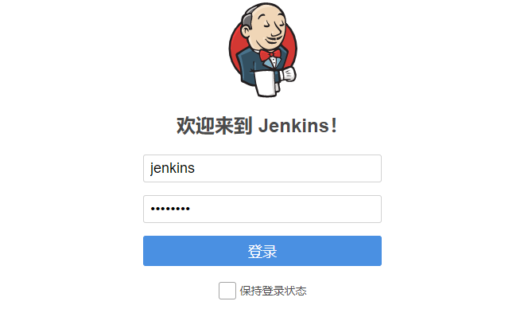

# 安装完Jenkins，登录后显示一片空白



解决方法是：访问https://jenkins-netadm.leju.com/restart，点击yes，来重启Jnekins，然后登录就正常了


过一会就会显示登陆页面，输入用户名和密码之后，就可以进去了，显示如下


# 安装插件失败

如果安装插件慢或者失败，就更改源。这个思路没有问题，但是要具体看更改成哪个源。

网上有一些文章里说，更改成清华源，可这完全不解决问题。更新站点中填写的URL对应的是一个JSON文件，文件里放的是所有插件的列表，Jenkins下载这个JSON之后，就相当于内部有个插件列表了，下载插件的时候知道去找谁。清华源中的这个JSON文件好像是完全复制了一份官方的，改成清华源的URL也是去找官方下载，只不过下载JSON本身的速度快了一些。

网上还有一些文章里说，在内部搭建一个代理，将访问官方插件站点URL的流量代理到清华源，最后在Jenkins主机的hosts文件中添加这个的映射记录，通过这种方式实现加速。但是这也是不可以的，因为JSON中的每个插件都是有SHA的，做个代理照样不行，下载的时候Jenkins会提示sha有问题。

为了解决这个问题，社区提供了一个URL，它解决了上面说的所有问题，设置成这个所有问题都没了：https://jenkins-zh.gitee.io/update-center-mirror/tsinghua/update-center.json

系统管理--插件管理--高级--升级站点


# 卸载或升级Jenkins插件导致Jenkins启动失败

当出现启动失败，抛出excption时，可以尝试进行如下操作：

将security禁用，具体操作步骤如下：

1. 停止jenkins (最方便的方式就是直接stop容器.)
2. 切换到 $JENKINS_HOME 目录，找到config.xml文件并打开 .
3. 搜索 `<useSecurity>true</useSecurity>`这个字段.将true改成false
4. 去掉`authorizationStrategy`和` securityRealm `这两个字段
5. 重启jenkins

jenkins重启后将处于无安全配置状态，任何人都拥有全部的操作权限。

如果上述操作仍未生效, 请尝试重命名或者删除 config.xml 文件.


```BASH
com.thoughtworks.xstream.mapper.CannotResolveClassException: com.michelin.cio.hudson.plugins.rolestrategy.RoleBasedAuthorizationStrategy
	at com.thoughtworks.xstream.mapper.DefaultMapper.realClass(DefaultMapper.java:79)
	at com.thoughtworks.xstream.mapper.MapperWrapper.realClass(MapperWrapper.java:30)
	at com.thoughtworks.xstream.mapper.DynamicProxyMapper.realClass(DynamicProxyMapper.java:55)
	at com.thoughtworks.xstream.mapper.MapperWrapper.realClass(MapperWrapper.java:30)
	at com.thoughtworks.xstream.mapper.PackageAliasingMapper.realClass(PackageAliasingMapper.java:88)
	at com.thoughtworks.xstream.mapper.MapperWrapper.realClass(MapperWrapper.java:30)
	at com.thoughtworks.xstream.mapper.ClassAliasingMapper.realClass(ClassAliasingMapper.java:79)
	at com.thoughtworks.xstream.mapper.MapperWrapper.realClass(MapperWrapper.java:30)
	at com.thoughtworks.xstream.mapper.MapperWrapper.realClass(MapperWrapper.java:30)
	at com.thoughtworks.xstream.mapper.MapperWrapper.realClass(MapperWrapper.java:30)
	at com.thoughtworks.xstream.mapper.MapperWrapper.realClass(MapperWrapper.java:30)
	at com.thoughtworks.xstream.mapper.MapperWrapper.realClass(MapperWrapper.java:30)
	at com.thoughtworks.xstream.mapper.MapperWrapper.realClass(MapperWrapper.java:30)
	at com.thoughtworks.xstream.mapper.ArrayMapper.realClass(ArrayMapper.java:74)
	at com.thoughtworks.xstream.mapper.MapperWrapper.realClass(MapperWrapper.java:30)
	at com.thoughtworks.xstream.mapper.MapperWrapper.realClass(MapperWrapper.java:30)
	at com.thoughtworks.xstream.mapper.MapperWrapper.realClass(MapperWrapper.java:30)
	at com.thoughtworks.xstream.mapper.MapperWrapper.realClass(MapperWrapper.java:30)
	at com.thoughtworks.xstream.mapper.MapperWrapper.realClass(MapperWrapper.java:30)
	at com.thoughtworks.xstream.mapper.MapperWrapper.realClass(MapperWrapper.java:30)
	at com.thoughtworks.xstream.mapper.SecurityMapper.realClass(SecurityMapper.java:71)
	at com.thoughtworks.xstream.mapper.MapperWrapper.realClass(MapperWrapper.java:30)
	at com.thoughtworks.xstream.mapper.MapperWrapper.realClass(MapperWrapper.java:30)
	at com.thoughtworks.xstream.mapper.MapperWrapper.realClass(MapperWrapper.java:30)
	at hudson.util.XStream2$CompatibilityMapper.realClass(XStream2.java:379)
	at com.thoughtworks.xstream.mapper.MapperWrapper.realClass(MapperWrapper.java:30)
	at hudson.util.xstream.MapperDelegate.realClass(MapperDelegate.java:43)
	at com.thoughtworks.xstream.mapper.MapperWrapper.realClass(MapperWrapper.java:30)
	at com.thoughtworks.xstream.mapper.CachingMapper.realClass(CachingMapper.java:48)
	at hudson.util.RobustReflectionConverter.determineType(RobustReflectionConverter.java:458)
	at hudson.util.RobustReflectionConverter.doUnmarshal(RobustReflectionConverter.java:324)
Caused: jenkins.util.xstream.CriticalXStreamException: com.michelin.cio.hudson.plugins.rolestrategy.RoleBasedAuthorizationStrategy : com.michelin.cio.hudson.plugins.rolestrategy.RoleBasedAuthorizationStrategy
---- Debugging information ----
message             : com.michelin.cio.hudson.plugins.rolestrategy.RoleBasedAuthorizationStrategy
cause-exception     : com.thoughtworks.xstream.mapper.CannotResolveClassException
cause-message       : com.michelin.cio.hudson.plugins.rolestrategy.RoleBasedAuthorizationStrategy
class               : hudson.model.Hudson
required-type       : hudson.model.Hudson
converter-type      : hudson.util.RobustReflectionConverter
path                : /hudson/authorizationStrategy
line number         : 9
version             : not available
-------------------------------
	at hudson.util.RobustReflectionConverter.doUnmarshal(RobustReflectionConverter.java:353)
	at hudson.util.RobustReflectionConverter.unmarshal(RobustReflectionConverter.java:267)
	at com.thoughtworks.xstream.core.TreeUnmarshaller.convert(TreeUnmarshaller.java:72)
	at com.thoughtworks.xstream.core.AbstractReferenceUnmarshaller.convert(AbstractReferenceUnmarshaller.java:65)
	at com.thoughtworks.xstream.core.TreeUnmarshaller.convertAnother(TreeUnmarshaller.java:66)
	at com.thoughtworks.xstream.core.TreeUnmarshaller.convertAnother(TreeUnmarshaller.java:50)
	at com.thoughtworks.xstream.core.TreeUnmarshaller.start(TreeUnmarshaller.java:134)
	at com.thoughtworks.xstream.core.AbstractTreeMarshallingStrategy.unmarshal(AbstractTreeMarshallingStrategy.java:32)
	at com.thoughtworks.xstream.XStream.unmarshal(XStream.java:1189)
	at hudson.util.XStream2.unmarshal(XStream2.java:161)
	at hudson.util.XStream2.unmarshal(XStream2.java:132)
	at com.thoughtworks.xstream.XStream.unmarshal(XStream.java:1173)
	at hudson.XmlFile.unmarshal(XmlFile.java:180)
Caused: java.io.IOException: Unable to read /var/lib/jenkins/config.xml
	at hudson.XmlFile.unmarshal(XmlFile.java:183)
	at hudson.XmlFile.unmarshal(XmlFile.java:163)
	at jenkins.model.Jenkins.loadConfig(Jenkins.java:3149)
	at jenkins.model.Jenkins.access$1200(Jenkins.java:318)
	at jenkins.model.Jenkins$13.run(Jenkins.java:3250)
	at org.jvnet.hudson.reactor.TaskGraphBuilder$TaskImpl.run(TaskGraphBuilder.java:169)
	at org.jvnet.hudson.reactor.Reactor.runTask(Reactor.java:296)
	at jenkins.model.Jenkins$5.runTask(Jenkins.java:1131)
	at org.jvnet.hudson.reactor.Reactor$2.run(Reactor.java:214)
	at org.jvnet.hudson.reactor.Reactor$Node.run(Reactor.java:117)
	at jenkins.security.ImpersonatingExecutorService$1.run(ImpersonatingExecutorService.java:59)
	at java.util.concurrent.ThreadPoolExecutor.runWorker(ThreadPoolExecutor.java:1149)
	at java.util.concurrent.ThreadPoolExecutor$Worker.run(ThreadPoolExecutor.java:624)
	at java.lang.Thread.run(Thread.java:748)
Caused: org.jvnet.hudson.reactor.ReactorException
	at org.jvnet.hudson.reactor.Reactor.execute(Reactor.java:282)
	at jenkins.InitReactorRunner.run(InitReactorRunner.java:50)
	at jenkins.model.Jenkins.executeReactor(Jenkins.java:1164)
	at jenkins.model.Jenkins.<init>(Jenkins.java:964)
	at hudson.model.Hudson.<init>(Hudson.java:85)
	at hudson.model.Hudson.<init>(Hudson.java:81)
	at hudson.WebAppMain$3.run(WebAppMain.java:262)
Caused: hudson.util.HudsonFailedToLoad
	at hudson.WebAppMain$3.run(WebAppMain.java:279)
```

# Jenkins无法登陆报错： unable to find valid certification path to requested target

sun.security.provider.certpath.SunCertPathBuilderException: unable to find valid certification path to requested target


**描述一下Jenkins的部署环境**

Jenkins的地址是10.208.3.24:8080，我通过反代https://jenkins-netadm.leju.com来访Jenkins（Jenkins上的站点URL已经配置https://jenkins-netadm.leju.com了）。

**故障现象**

Jenkins在上面的描述的环境里一直运行的好好的。但最近因为我们公司的证书要到期了，我更换了一下新的证书（在Nginx上），然后Jenkins就无法访问了，提示上面的错误。我测试了一下这个反向代理下面的zabbix、grafana、prometheus、ldap等等站点都没问题。就单单Jenkins登录不上了。

**问题分析**

在网上找了一堆资料，发现是新证书引起的

启动Jenkins的JVM会连接https://jenkins-netadm.leju.com站点，如果无法检验它的SSL证书的话就会有上面的这个问题。

> 当JAVA环境无法校验HTTPS站点的证书时（不确定它是不是有效站点），JVM会报这个错误（JVM会感到困惑，因为它不是Java“受信任”列表中可以提供这些证书的人之一）。如果站点是通过内部ROOT CA签发的时候可能会出现这个情况。

那为什么JVM无法校验这个证书呢？

出现这种情况是因为颁发机构使用了一个中间证书对服务器证书进行了签名，而这个中间证书并不存在于与JAVA一起发布的著名可信证书颁发机构的证书库中。JAVA无法使用证书库中的证书对站点的证书进行校验。

不光光是JAVA环境无法对这个站点进行校验，就是linux也一样，我在linux使用curl访问https://jenkins-netadm.leju.com，报错如下：

```BASH
$ curl https://jenkins-netadm.leju.com
curl: (60) Peer's Certificate issuer is not recognized.
More details here: http://curl.haxx.se/docs/sslcerts.html

curl performs SSL certificate verification by default, using a "bundle"
 of Certificate Authority (CA) public keys (CA certs). If the default
 bundle file isn't adequate, you can specify an alternate file
 using the --cacert option.
If this HTTPS server uses a certificate signed by a CA represented in
 the bundle, the certificate verification probably failed due to a
 problem with the certificate (it might be expired, or the name might
 not match the domain name in the URL).
If you'd like to turn off curl's verification of the certificate, use
 the -k (or --insecure) option.
```

**解决方法一、将新证书颁发者CA的证书导入到Java环境中**

因为我们知道certififcate是“有效的”，所以我们可以直接将此证书导入到JVM中。这样做时，我们告诉JVM这是一个“受信任的”证书，并“忽略”它的任何问题。

1、对CA证书的格式进行转换，你需要根据情况调整参数，如果CA证书本身就是PEM格式的，就不用转换了

```bash
openssl x509 -inform DER-in /tmp/star_leju_com_27825549/DigiCertCA.crt -outform PEM > 1.pem
```

2、为Jenkins单独复制一份keystore

```BASH
mkdir $JENKINS_HOME/keystore/
cp $JAVA_HOME/jre/lib/security/cacerts $JENKINS_HOME/keystore/
```

3、添加证书到keystore

```BASH
keytool -import -alias 给这个CA证书分配一个名字 -keystore $JENKINS_HOME/keystore/cacerts -file ~/root_ca.pem
```

4、为Jenkins添加启动参数，对于Debian/Ubuntu是/etc/default/jenkins，对于Centos是/etc/sysconfig/jenkins。如果是直接jar包启动，可以将参数加到命令行

```BASH
echo 'JAVA_ARGS="$JAVA_ARGS -Djavax.net.ssl.trustStore=$JENKINS_HOME/keystore/cacerts"' >> /etc/default/jenkins
```

5、重新启动Jenkins

```BASH
service jenkins restart
```

**解决方法二、将新证书颁发者CA的证书导入到域名证书中，让Nginx加载**

nginx上的配置加载的证书是/etc/certs/xing.leju.com.pem

```BASH
[10.208.3.11 root@dns-lvs-1:/etc/certs]# grep ssl_certificate /etc/nginx/nginx.conf
ssl_certificate /etc/certs/xing.leju.com.pem;
```

我将CA证书的内容导入到/etc/certs/xing.leju.com.pem一份

```BASH
[10.208.3.11 root@dns-lvs-1:/etc/certs]# cat star_leju_com_27825549/DigiCertCA.crt  >> /etc/certs/xing.leju.com.pem 
[10.208.3.11 root@dns-lvs-1:/etc/certs]# cat /etc/certs/xing.leju.com.pem
-----BEGIN CERTIFICATE-----
MIIGqTCCBZGgAwIBAgIQD4+BTu7i7ISNc4hcPBEjSzANBgkqhkiG9w0BAQsFADBN
...............................略...............................
jklPNFflQMsdbdKu9v+0pjyN9CudwL6oL9DUnm7uylNQbzHw34RKbtTwd6515gX1
MIha305+0yVqz9W3e7F6JfGKSx94FbZiFlnFPNc=
-----END CERTIFICATE-----
-----BEGIN CERTIFICATE-----
MIIElDCCA3ygAwIBAgIQAf2j627KdciIQ4tyS8+8kTANBgkqhkiG9w0BAQsFADBh
...............................略...............................
c+LJMto4JQtV05od8GiG7S5BNO98pVAdvzr508EIDObtHopYJeS4d60tbvVS3bR0
j6tJLp07kzQoH3jOlOrHvdPJbRzeXDLz
-----END CERTIFICATE-----
```

附上[Nginx官网上的一段话](http://nginx.org/en/docs/http/configuring_https_servers.html#chains)

Some browsers may complain about a certificate signed by a well-known certificate authority, while other browsers may accept the certificate without issues. This occurs because the issuing authority has signed the server certificate using an intermediate certificate that is not present in the certificate base of well-known trusted certificate authorities which is distributed with a particular browser. In this case the authority provides a bundle of chained certificates which should be concatenated to the signed server certificate. The server certificate must appear before the chained certificates in the combined file.

