# 授权管理

## 使用Role-based Authorization Strategy授权

**安装插件**


**Manage Jenkins--Configure Global Security，选择基于角色的策略**

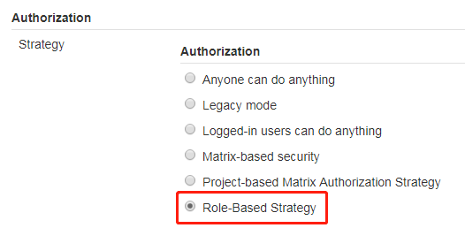

**Manage Jenkins--Manage and Assign Roles页面中，Magage Roles用来对Role的权限进行管理/更改。Assign Roles用来将用户添加到指定的Role中。**

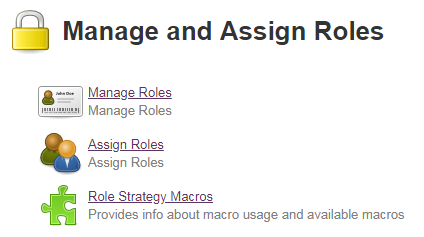

**Manage Roles中有三块内容**

1、Global roles：基于全局的角色，客户设置多种权限

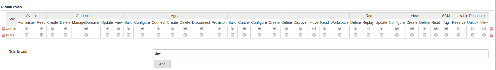

- Global roles-Overall-Read：是查看所有Jenkins页面的必要权限。如果比勾选这个选项，即便把除了Administer之外的其他权限都勾选了，也无法在页面上进行配置。

- Global roles-Overall-Administer：超级管理员权限，拥有所有权限。

2、Item roles：基于Item（Jenkins上创建的项目）的角色，比如可以设置project1下面的用户只能操匹配pattern的Jenkins任务。

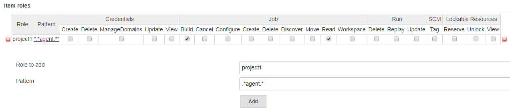

3、Node roles：设置Jenkins节点相关权限的角色。

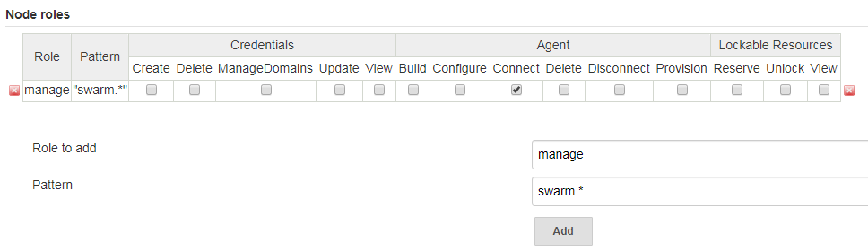

**Assign Roles中是用来将用户添加到相应的role中**

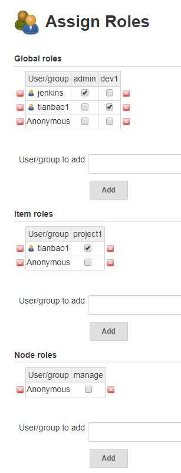

**当一个用户同时具有Global roles和Item roles时，它们之间是如何协作的呢？**

我做了个测试：

- 将用户只加入到一个Item roles，即便勾选了所有权限，用户登录时也会提示xxx is missing the Overall/Read permission。
- 将用户加入到一个Global roles，勾选了Overall的Read权限。然后创建了一个Item roles勾选了Job的Build和Read权限。最终用户就可以执行某些项目的构建了。
- 将用户加入到Global roles，勾选了Overall的Read权限，Job的Read和Build权限。然后创建了一个Item roles，只勾选了Read权限。最终发现用户可以对所有项目可见，且都可以Build。

通过这些测试，可以说明，Global roles会覆盖Item roles的配置。如果，用户的Global roles授予了Job-Read权限时，则对所有Item都具有了可读权限，不论用户设置了几个项目权限。因此，如果希望基于项目纬度进行权限控制。在Global roles上不要勾选Overall-Read以外的所有内容。

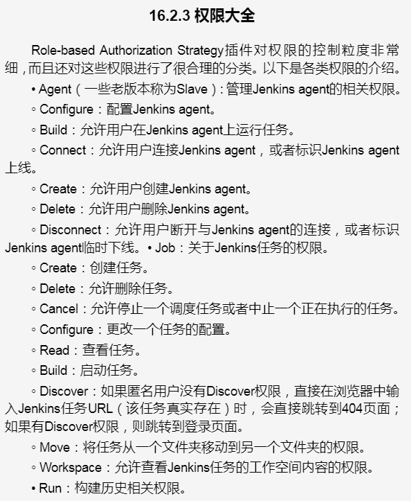

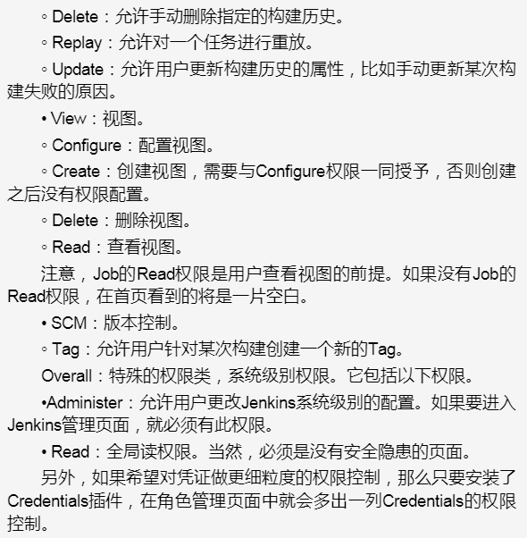

# 认证管理

如果没有设置Jenkins进行安全检查，name任何能打开Jenkins页面的人都可以做任何事情。所以在搭建好Jenkins后，我们需要做的第一件事就是打开Jenkins的安全检查。

进入Manage Jenkins--Configure Global Security页面，选择认证策略和授权策略

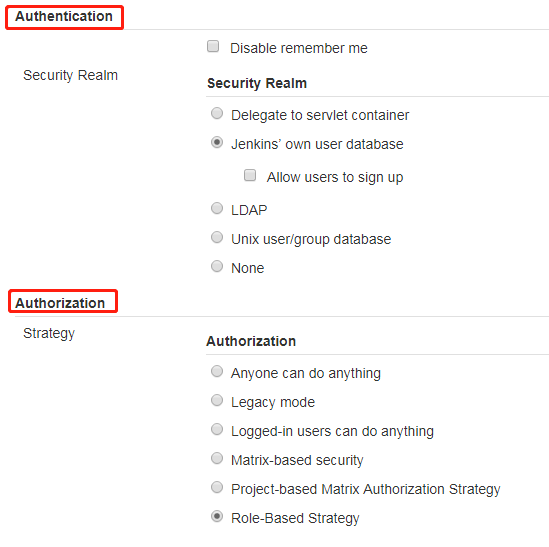

## 使用Jenkins自带的数据库

在Manage Jenkins--Configure Global Security上勾选Jenkins’ own user database。另外如果允许用户自行注册，则勾选Allow users to sign up。

如果需要创建用户，就到Manage Jenkins--Manage Users--Create User

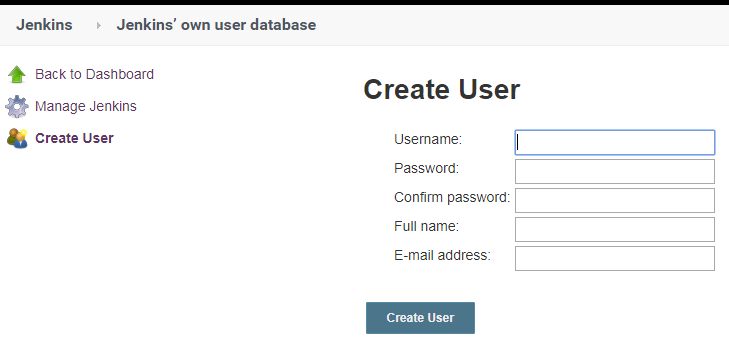

## 使用LDAP认证

> 一旦更改为LDAP认证，原先所有用户（包括管理员）都无法登录了。所以除非有绝对把握，否则随意更改生产Jenkins的认证方式

我的LDAP中没有设置group相关信息

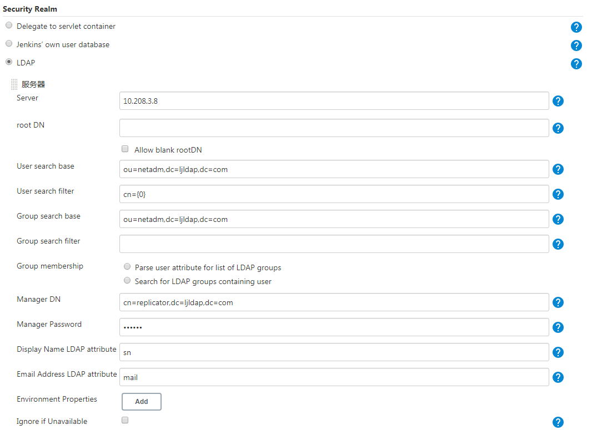

点击测试，总是不成功。

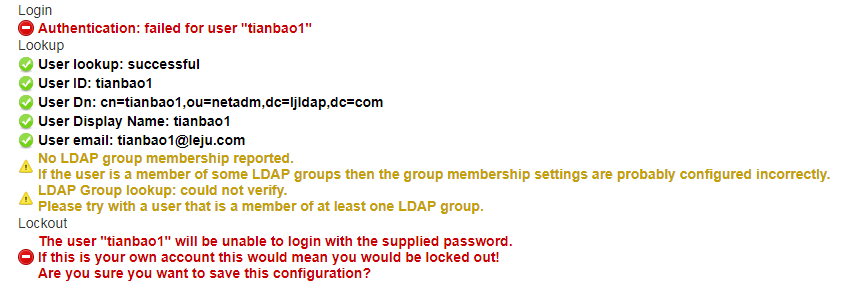

后来排查出来，这是因为我之前写了一条访问控制：

```BASH
[10.208.3.18 root@test-1:~]# cat /etc/openldap/slapd.d/cn\=config/olcDatabase\=\{2\}hdb.ldif
# AUTO-GENERATED FILE - DO NOT EDIT!! Use ldapmodify.
# CRC32 231067b1
dn: olcDatabase={2}hdb
objectClass: olcDatabaseConfig
objectClass: olcHdbConfig
olcDatabase: {2}hdb
olcDbDirectory: /var/lib/ldap
olcDbIndex: objectClass eq,pres
olcDbIndex: ou,cn,mail,surname,givenname eq,pres,sub
olcDbIndex: entryUUID eq
structuralObjectClass: olcHdbConfig
entryUUID: b9632c7c-a88fdd5-103sd9-8852-dddffg701233f10
creatorsName: cn=config
createTimestamp: 20191022085730Z
olcRootPW:: e1NTSEF9aDhRaGJlNW45asldfuoj9NVhKcFRNT1hvfasdFAGFDsdSlRtZi8=
olcSuffix: dc=ljldap,dc=com
olcRootDN: cn=Admin,dc=ljldap,dc=com
olcSizeLimit: 5000
olcAccess: {0}to dn.children="dc=ljldap,dc=com" by dn.base="cn=
 replicator,dc=ljldap,dc=com" read by anonymous auth
entryCSN: 20200503085936.954418Z#000000#000#000000
modifiersName: gidNumber=0+uidNumber=0,cn=peercred,cn=external,cn=auth
modifyTimestamp: 20200503095936Z
```

上面授权的含义是cn=replicator,dc=ljldap,dc=com可以读取dc=ljldap,dc=com的子条目。匿名用户需要认证。可以我没有指定认证了的用户有什么权限（其实我之前对接grafana、zabbix的时候都是上面这个配置，可能时候Jenkins的测试机制另有不同的。我不知道如果不更改直接应用，可不可以登录ldap，我直接更改访问控制了）。

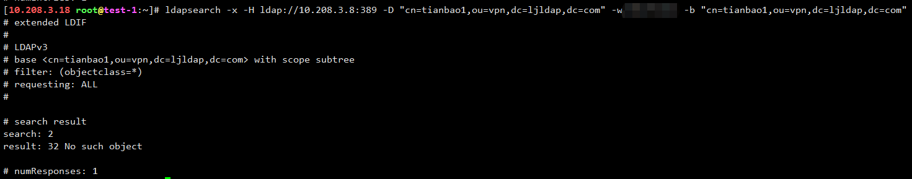

所以我需要更改一下访问控制

```BASH
cat << EOF | ldapmodify -Y EXTERNAL -H ldapi:///
dn: olcDatabase={2}hdb,cn=config
changetype: modify
replace: olcAccess
olcAccess: {0}to dn.children="dc=ljldap,dc=com"
  by self read
  by dn.base="cn=replicator,dc=ljldap,dc=com" read
  by anonymous auth
EOF
```

更改后如下

```BASH
[10.208.3.18 root@test-1:~]# cat /etc/openldap/slapd.d/cn\=config/olcDatabase\=\{2\}hdb.ldif
# AUTO-GENERATED FILE - DO NOT EDIT!! Use ldapmodify.
# CRC32 231067b1
dn: olcDatabase={2}hdb
objectClass: olcDatabaseConfig
objectClass: olcHdbConfig
olcDatabase: {2}hdb
olcDbDirectory: /var/lib/ldap
olcDbIndex: objectClass eq,pres
olcDbIndex: ou,cn,mail,surname,givenname eq,pres,sub
olcDbIndex: entryUUID eq
structuralObjectClass: olcHdbConfig
entryUUID: b9632c7c-88f5-1039-8852-dd1701233f10
creatorsName: cn=config
createTimestamp: 20191022085730Z
olcRootPW:: e1NTSEF9aDhRaGJlNW45a0RNbDhEeWwvNVhKcFRNT1hvSlRtZi8=
olcSuffix: dc=ljldap,dc=com
olcRootDN: cn=Admin,dc=ljldap,dc=com
olcSizeLimit: 5000
olcAccess: {0}to dn.children="dc=ljldap,dc=com" by self read by dn.base="cn=
 replicator,dc=ljldap,dc=com" read by anonymous auth
entryCSN: 20200503085936.954418Z#000000#000#000000
modifiersName: gidNumber=0+uidNumber=0,cn=peercred,cn=external,cn=auth
modifyTimestamp: 20200503085936Z
```

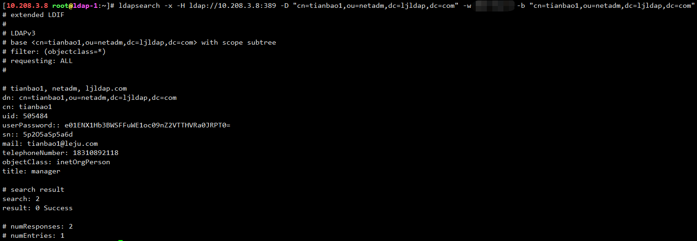

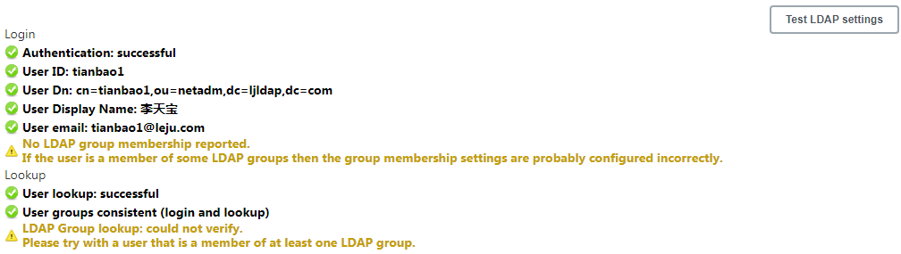

## 使用GitLab认证

**使用管理员登录GitLab，在Admin Area--Applications中创建appliccation**

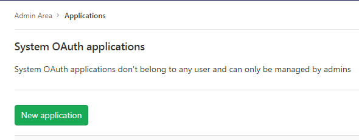

**URL要写为`<jenkins_url>/securityRealm/finishLogin`，勾选其它全部（为了方便就全勾选了）**

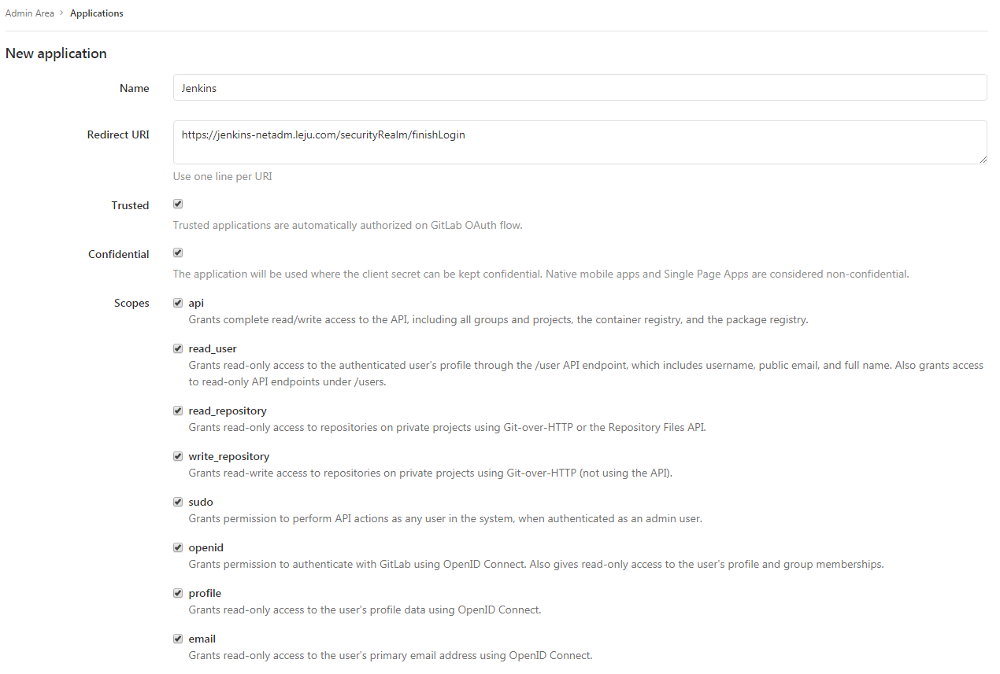

**记录下面面的Application ID和Secret，后面会用到**

2cdd3f13641f0969c337099d26cfdd15c04c72ff02a1940febaf92338578363a

ee7f85ac5f3af3fcb7e7c5c07ebf2a904c37a4ac50971693b2ac5ad214ee42b7

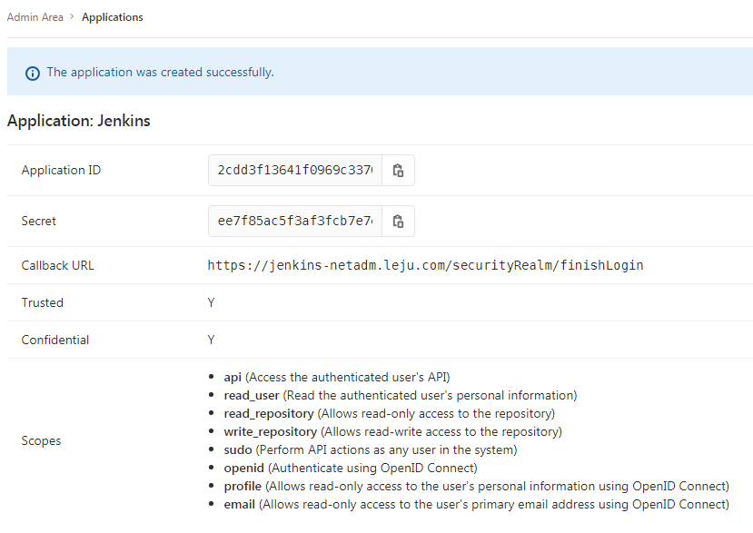

**Jenkins安装插件：Gitlab Authentication**

**在Manage Jenkins -- Configure Global Security，使用Gitlab authentication plugin**

Client ID是上面记录的Application ID，Client Secret是上面记录的Secret。

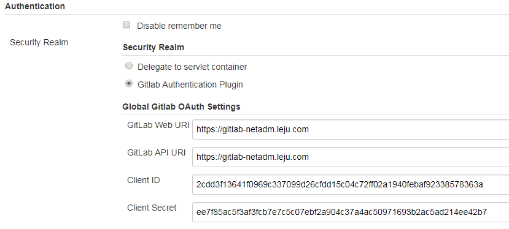

**重新登录Jenkins**

使用的用户名和密码都是GitLab上的。

我输入的是https://jenkins-netadm.leju.com，但是跳转到了https://gitlab-netadm.leju.com

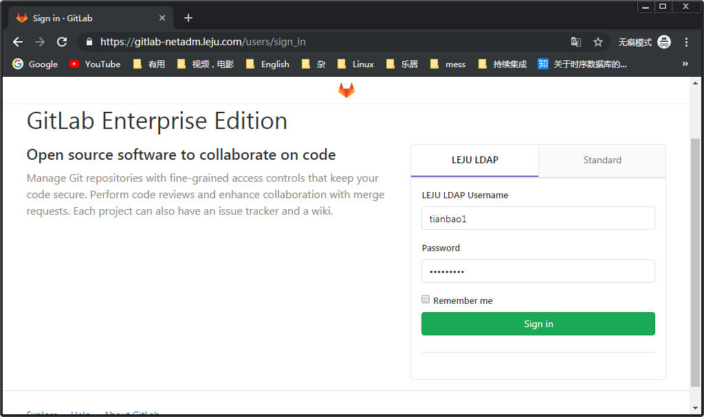

我输入了正确的用户名和密码之后，会跳转会Jenkins

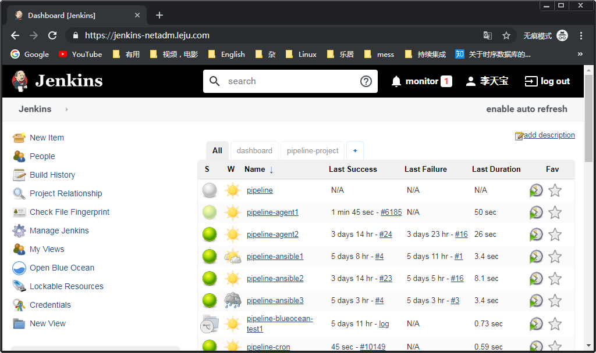

## 使用GitHub认证

**登录GitHub，使用个人账户登录，访问Settings--Developer sttings，在OAuth Apps中创建一个应用**

**URL要写为`<jenkins_url>/securityRealm/finishLogin`，勾选其它全部（为了方便就全勾选了）**

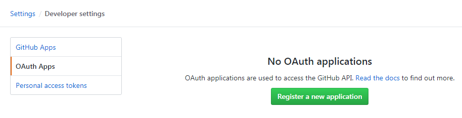

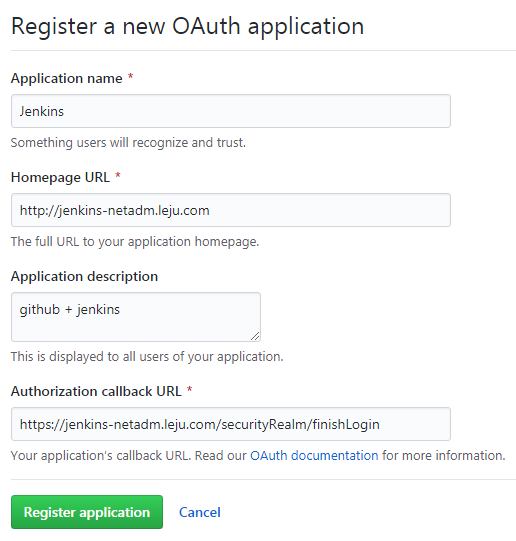

**记录下面面的Application ID和Secret，后面会用到**

3147e939f885e8cd8cdf

a1a00963911d50dceacdf8007ffba24e65ea3fdd

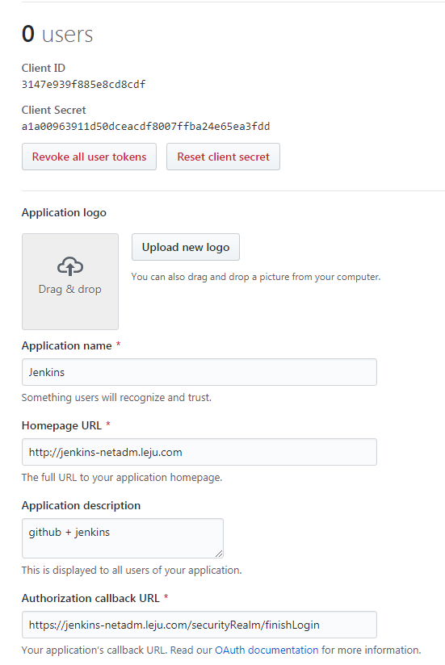

**安装插件：GitHub Authentication**

**在Manage Jenkins -- Configure Global Security，使用Gitlab authentication plugin**

Client ID是上面记录的Application ID，Client Secret是上面记录的Secret。

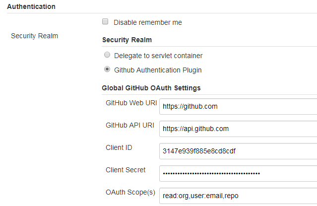

**重新登录Jenkins**

使用的用户名和密码都是GitHub上的。

我输入的是https://jenkins-netadm.leju.com，但是跳转到了https://githun.com/xxxxx

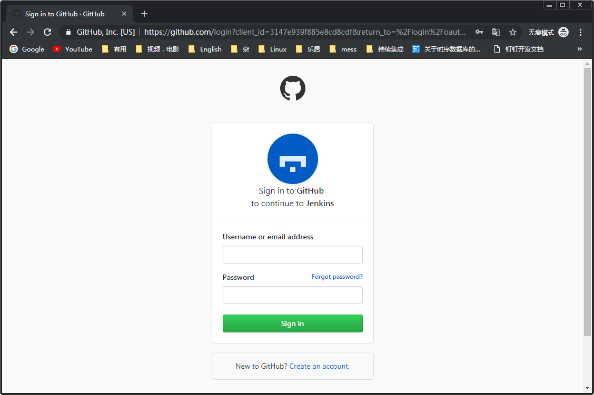

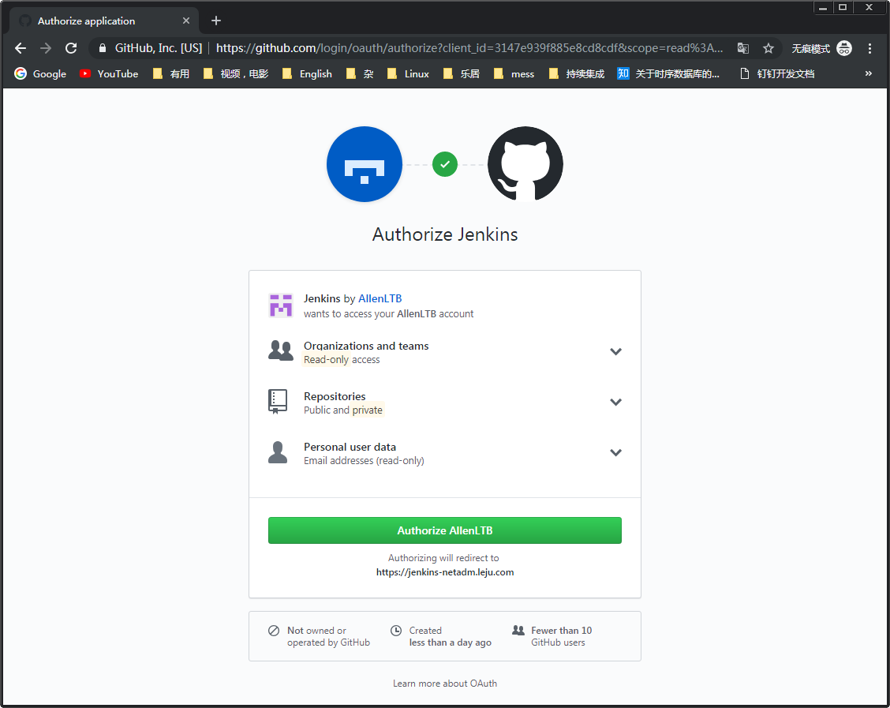

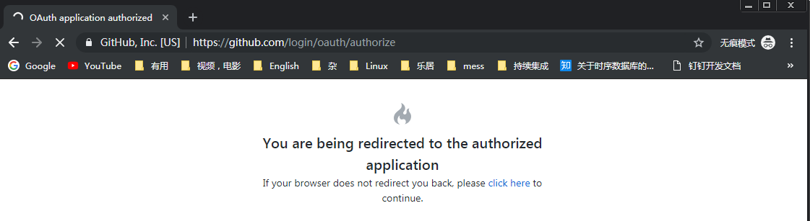

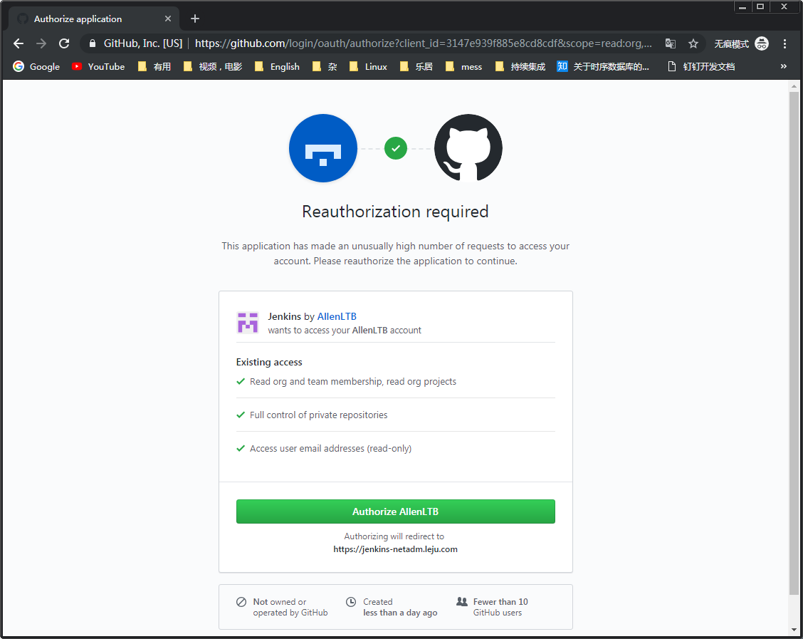

我登陆上了，但此时提示我没有权限

这是因为我现在使用的是Role-Based进行授权。而我并没有把这个用户放到Admin里。此时使用其他用户是登录不上Jenkins的，但是GitHub用户又没有权限。所以这个Jenkins我们是不上去了。

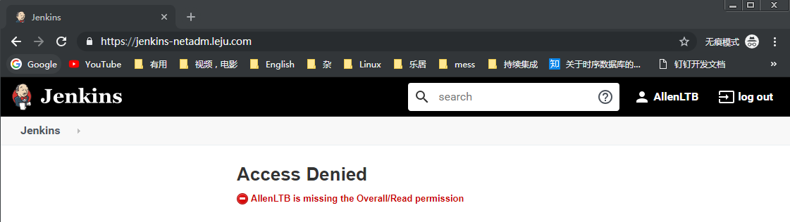

但幸运的是，我更改认证方式的那个web页面并没有关闭，也没有logout，所以我可以使用那个页面给github用户进行授权

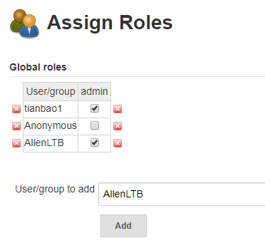

最终登陆成功

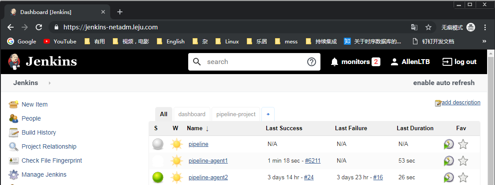


# 实例：集成LDAP认证和Role-based授权

1、在设置ldap之前我将授权更改为只要是登录用户就可以做任何事情

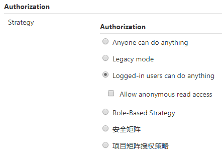

2、然后对接LDAP成功后，使用tianbao1登录后可以做任何事情。

3、我将授权改为Role-Based Strategy


本来我还怕一旦更改为Role-Based Strategy，就无法登录了，因为我并没有把当前登录的tianbao1用户加入到role中呢。然后我查看了一下当前tianbao1用户现在处于一个admin的角色，并且admin是管理员权限。

4、我使用其他的LDAP用户登录Jenkins，发现提示没有权限

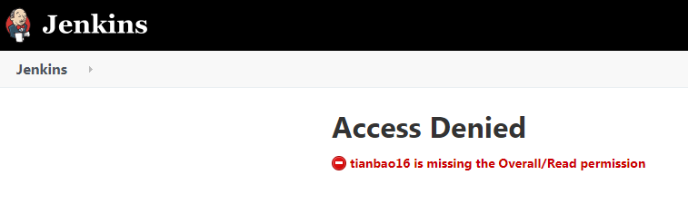

# Jenkins监控

## 使用Monitoring插件监控

此插件提供的监控纬度有：内存、CPU、系统负载、HTTP响应时间、系统进程、线程数、当前请求数量等。但是没有告警功能。

安装插件

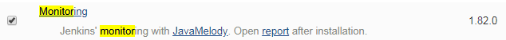

安装好插件之后，就可以在Manage Jenkins菜单下找到

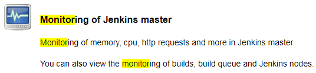

点进入只有可以看到

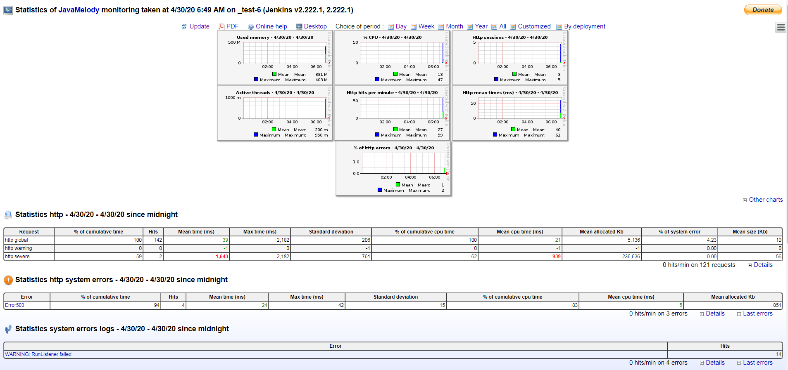

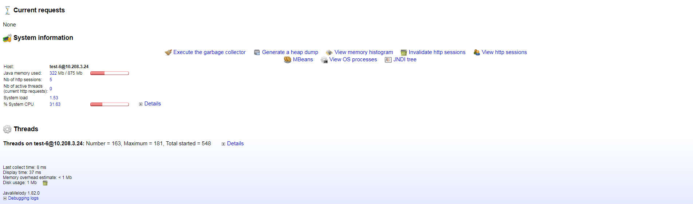

## 使用Prometheus监控

安装Prometheus插件

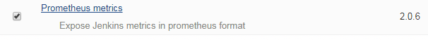

进入Manage Jenkins--Configure System，配置Prometheus，这里可以配置Jenkins暴露给prometheus的接口。

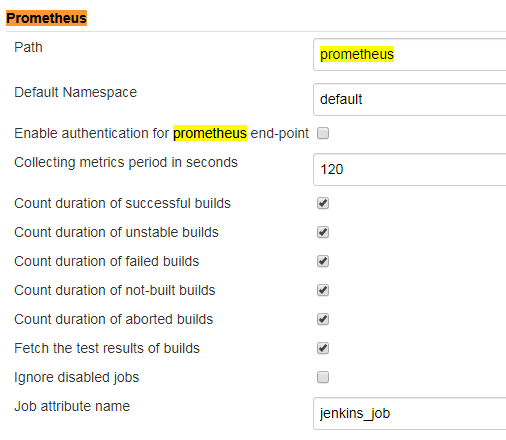

在Prometheus中配置target

```YAML
scrape_configs:
  - job_name: 'jenkins'
    scrape_interval: 5s
    metrics_path: /prometheus
    static_configs:
      - targets: ['10.208.3.24:8080']
```

下载[dashboard](https://grafana.com/grafana/dashboards/306/revisions)并导入，监控效果如下

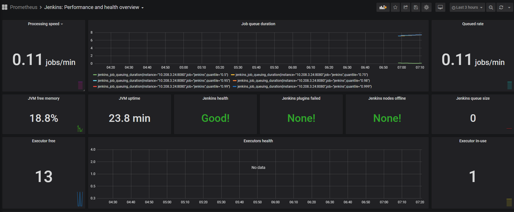


初次之外，还应该对Jenkins所在主机进行CPU、内存、磁盘等指标的监控。

下面这就是因为Jenkins主机硬盘空间不足导致的Jenkins异常退出。

```BASH
2020-04-30 00:29:00.450+0000 [id=4876]	SEVERE	hudson.model.Executor#run: Executor #-1 for master: Unexpected executor death
java.io.IOException: No space left on device
	at sun.nio.ch.FileDispatcherImpl.write0(Native Method)
	at sun.nio.ch.FileDispatcherImpl.write(FileDispatcherImpl.java:60)
	at sun.nio.ch.IOUtil.writeFromNativeBuffer(IOUtil.java:93)
	at sun.nio.ch.IOUtil.write(IOUtil.java:65)
	at sun.nio.ch.FileChannelImpl.write(FileChannelImpl.java:211)
	at hudson.util.FileChannelWriter.write(FileChannelWriter.java:73)
	at java.io.WriterRunning from: /root/jenkins.war
```

关于磁盘空间不足的这个问题，其实登录Jnekins的Manager Jenkins页面就可以看到。这个页面里经常会显示一些提示或告警。

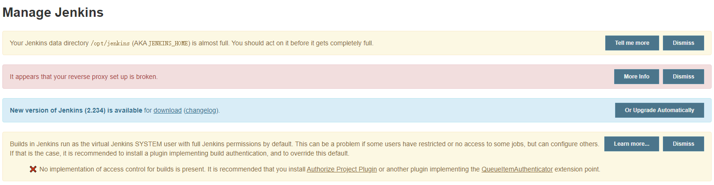

当空间不足的时候，master节点是无法工作的

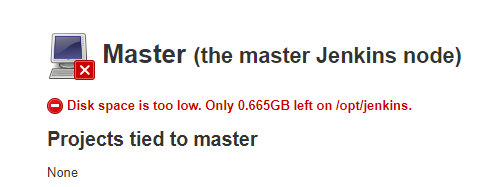

# Jenkins备份

## JENKINS_HOME

JENKINS_HOME的所有数据都是存放在文件中的，所以Jenkins备份就是备份JENKINS_HOME目录

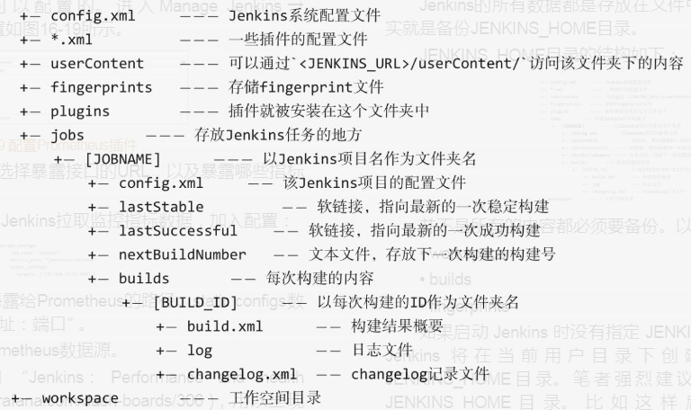

以下目录是可以不备份的

- workspace

- builds

- figerprints

如果在启动Jenkins是没有指定JENKINS_HOME环境变量，nameJenkins会在当前用户的家目录下创建一个.jenkins的目录作为JENKINS_HOME目录。

## 使用Periodic Backup插件进行备份

安装插件

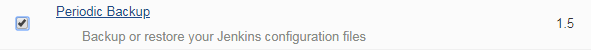

之后访问Manage Jenkins会看见多出来一个


点进去之后点击Configure进行配置


# 语言设置

我安装完Jenkins之后，Jenkins页面中既有英文，也有中文，看起来很难受。

**设置语言为英文**

安装插件

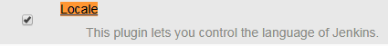

系统管理 ／ 系统设置，找到Locale，输入“Default Language”为“en_US”，并勾选“Ignore browser preference and force this language to all users“

**设置语言为中文**

安装插件


系统管理 ／ 系统设置，找到Locale，输入“Default Language”为“zh_CN”，并勾选“Ignore browser preference and force this language to all users“


https://github.com/William-Yeh/ansible-prometheus

https://github.com/timonwong/prometheus-webhook-dingtalk