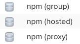
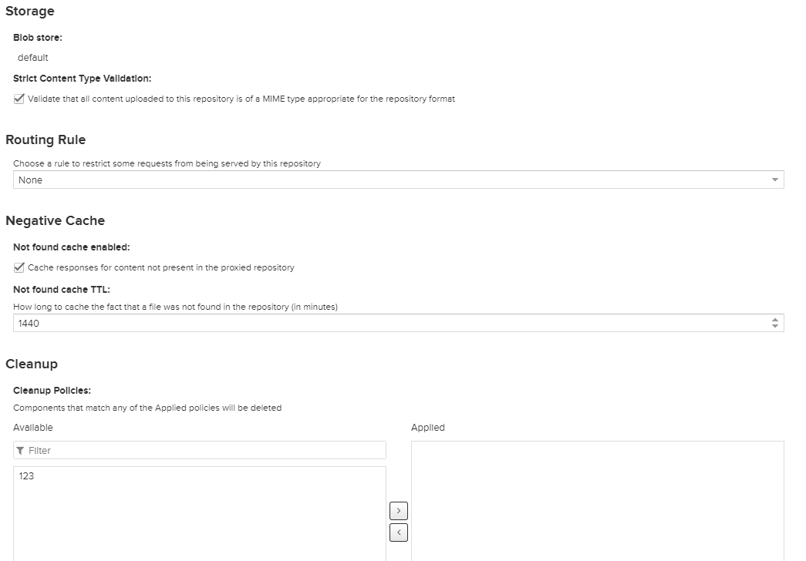

# 制品介绍

开发软件中没有制品仓库和制造业中没有仓库是一样的。你不会奢望在没有仓库的情况下开办工厂，软件开发也一样。制品仓库保存了你每次构建的结果，并且确保你拥有可用的构建。

制品库可以跟源代码协同进行版本化控制，可以与本地各构建工具和云上的持续集成，持续部署无缝结合，

制品仓库位于 DevOps 工具链的集成阶段，尽管其在构思阶段可被用来表示你想使用的工具是可用状态。

# Nexus介绍

转自：https://www.cnblogs.com/wincai/p/5599282.html

要了解Nexus不得不提到Maven，Maven是一个优秀的构建工具、依赖管理工具、项目信息管理工具。

Maven和Nexus之间的关系，需要从Maven的依赖管理功能说起。通过在Pom中指定坐标的形式将jar引入到项目中。要经历怎样一个流程呢？从哪里寻找jar？下载的jar放到哪里？

这引出了仓库的概念，maven通过仓库来统一管理各种构件。Maven的仓库分为本地仓库和远程仓库。


当Maven根据坐标寻找构件时，它首先会查看本地仓库，如果本地仓库存在此构件，则直接使用；如果本地仓库不存在此构件，或者需要查看是否有更新的构件版本，Maven会去远程仓库查找，发现需要的构件之后，下载到本地仓库再使用（当maven从存储库中下载组件时（如依赖项或插件），它也会下载该组件的POM。给定组件的POM后，Maven可以下载该组件所依赖的任何其他组件。）。


到了这里，问题的答案也就出来了。

首先，Nexus是一种远程仓库，根据上段的介绍，我们已经知道远程仓库的作用。在远程仓库中，默认的是中央仓库，中央仓库是Maven核心自带的远程仓库。那就使用中央仓库不就得了吗，为什么我们要安装Nexus呢？

我们从项目实际开发来看：

1.一些无法从外部仓库下载的构件，例如内部的项目还能部署到私服上，以便供其他依赖项目使用。

2. 为了节省带宽和时间，在局域网内架设一个私有的仓库服务器，用其代理所有外部的远程仓库。当本地Maven项目需要下载构件时，先去私服请求，如果私服没有，则再去远程仓库请求，从远程仓库下载构件后，把构件缓存在私服上。这样，及时暂时没有Internet链接，由于私服已经缓存了大量构件，整个项目还是可以正常使用的。同时，也降低了中央仓库的负荷。

Nexus仅仅是私服的一种，它支持三种仓库类型：

- hosted（宿主仓库库） ：存放本公司开发的jar包（正式版本、测试版本）

- proxy（代理仓库）：代理中央仓库、Apache下测试版本的jar包

- group（组仓库）：使用时连接组仓库，包含Hosted（宿主仓库）和Proxy（代理仓库）



**maven项目组件的坐标**

坐标就好比每一个Java构件的身份证一样。Maven的世界是拥有非常多的Java构件的，可能是jar、可能是war、也可能是其他的一些东西。假如Maven中没有坐标的概念，我们是无法来区分这些构件的，所以我们要唯一标识每一个构件。不然就和传统的手工方式一样，你需要spring就去spring下载spring的包，需要mysql又去mysql下载mysql的包，没有统一的规范又怎么能够自动化的去依赖这些构件。

Maven便给我们制定了一套规则那就是使用坐标进行唯一标识。Maven的坐标元素包括groupId、artifactId、version、packaging、classfier。只要我们提供正确的坐标元素，Maven就能找到对应的构件，首先去你的本地仓库查找，没有的话再去远程仓库下载。如果没有配置远程仓库，会默认从中央仓库地址(http://repo1.maven.org/maven2)下载构件，该中央仓库包含了世界上大部分流行的开源项目构件，但不一定所有构件都有。

在我们自己开发项目的时候，也是要给我们的项目定义坐标的，这是强制性要求，只有这样，其他项目才能引用该项目的构件。

Maven坐标为各种构件引入了秩序，任何一个构件都必须明确定义自己的坐标，而一组Maven坐标是通过一些元素定义的，它们是groupId、artifactId、version、packaging、class-sifer。下面是一组坐标定义：

```XML
<groupId>com.mycompany.app</groupId>  
  <artifactId>my-app</artifactId>  
  <packaging>jar</packaging>  
 <version>0.0.1-SNAPSHOT</version>  
```

各个坐标元素：

- groupId：定义当前Maven项目隶属项目、组织。例如，由apache software foundatio的maven项目生产的软件组件可在groupId下写org.apache.maven
- artifactId：软件组件的标识符，描述性名称，定义实际项目中的一个模块。groupId和artifactId的组合对于特定项目是唯一的。
- version: 该元素定义Maven项目当前所处的版本，如nexus-indexer-2.0.0.jar是nexus-indexer的2.0.0版本。版本也可以具有字符数字限定符，通常用于表示发行版状态。这种限定符的一个示例是类似nexus-indexer-2.0.0-BETA.jar版本，其中BETA表示对软件组件使用者有意义到的测试阶段。需要注意的是，Maven定义了一套完整的版本规范，以及快照（SNAPSHOT）的概念。
- packaging：定义Maven项目打包的方式，首先，打包方式通常与所生成构件的文件扩展名对应，如上例中的packaging为jar，最终的文件名为nexus-indexer-2.0.0-BETA-SNAPSHOT.jar。也可以打包成zip、war、ear等。当不定义packaging的时候，Maven会使用默认值jar
- classifier：该元素用来帮助定义构建输出的一些附件。附属构件与主构件对应，如上例中的主构件为nexus-indexer-2.0.0-BETA-SNAPSHOT.jar，该项目可能还会通过一些插件生成如nexus-indexer-2.0.0-BETA-SNAPSHOT-javadoc.jar、nexus-indexer-2.0.0-BETA-SNAPSHOT-sources.jar，这样附属构件也就拥有了自己唯一的坐标。

groupId、artifactId、version简称为GAV。

**依赖**

依赖的组件，依赖里面写的就是所依赖组件的坐标

```XML
<dependencies>  
    <dependency>  
      <groupId>junit</groupId>  
      <artifactId>junit</artifactId>  
      <version>3.8.1</version>  
      <scope>test</scope>  
    </dependency>  
 </dependencies>  
```

**NEXUS中的资产**

Maven项目中的pom算是资产的一部分，包含元数据的重要补充。

实际的存档文件pom.xml是与组件（jar/war包）关联的资产。

但是，更复杂的格式具有与组件（jar包）关联的众多资产（pom），例如，maven存储库中的典型JAR组件至少有POM和JAR文件定义-两者均构成属于同一组件的单独资产。其他文件（例如JavaDoc或Source JAR文件）是属于同一组件的重要资产。

示例如下：通过repository、format、group、name、version来标识一个组件，下面有多个资产（jar、md5、sha1、pom.....）

API：http://10.208.3.247:8881/service/rest/v1/components/bWF2ZW4taG9zdGQ6NjhiZjJjY2IwOTEzYzc3NmIwN2Q1ZTM2ZTc1ODI0ZGM

```JSON
{
    "id":"bWF2ZW4taG9zdGQ6NjhiZjJjY2IwOTEzYzc3NmIwN2Q1ZTM2ZTc1ODI0ZGM",
    "repository":"maven-hostd",
    "format":"maven2",
    "group":"com.mycompany.app",
    "name":"my-app",
    "version":"1.0-20200507.074626-1",
    "assets":[
        {
            "downloadUrl":"http://10.208.3.247:8881/repository/maven-hostd/com/mycompany/app/my-app/1.0-SNAPSHOT/my-app-1.0-20200507.074626-1.jar",
            "path":"com/mycompany/app/my-app/1.0-SNAPSHOT/my-app-1.0-20200507.074626-1.jar",
            "id":"bWF2ZW4taG9zdGQ6MWE2ODc0ZDMxYmE4NDY4MWFmNGY5ZGEyNWFlNGQ3ZTc",
            "repository":"maven-hostd",
            "format":"maven2",
            "checksum":{
                "sha1":"ef668812a6aaa6845f214944c119e65729c83405",
                "md5":"db0d232641fb10dab16a7c1b3509f98a"
            }
        },
        {
            "downloadUrl":"http://10.208.3.247:8881/repository/maven-hostd/com/mycompany/app/my-app/1.0-SNAPSHOT/my-app-1.0-20200507.074626-1.jar.md5",
            "path":"com/mycompany/app/my-app/1.0-SNAPSHOT/my-app-1.0-20200507.074626-1.jar.md5",
            "id":"bWF2ZW4taG9zdGQ6YTI2YTA0MWJmMTQ1MjczMWMyYjMzNjc2YmU2ZmJiZDg",
            "repository":"maven-hostd",
            "format":"maven2",
            "checksum":{
                "sha1":"495808a941fb75cb22c0c98580fc29ab3d3c318c",
                "md5":"4b94ea20b4c5087f6bfd19a79db7d83f"
            }
        },
        {
            "downloadUrl":"http://10.208.3.247:8881/repository/maven-hostd/com/mycompany/app/my-app/1.0-SNAPSHOT/my-app-1.0-20200507.074626-1.jar.sha1",
            "path":"com/mycompany/app/my-app/1.0-SNAPSHOT/my-app-1.0-20200507.074626-1.jar.sha1",
            "id":"bWF2ZW4taG9zdGQ6YTJhMzBkZjgyMTE1MjA1NjZiM2U2ZmJmNjAwODYxMDY",
            "repository":"maven-hostd",
            "format":"maven2",
            "checksum":{
                "sha1":"36812e27e61ac6a50e253ce72e8086219d744968",
                "md5":"c4482054f4b854e5286ac3b13e154a03"
            }
        },
        {
            "downloadUrl":"http://10.208.3.247:8881/repository/maven-hostd/com/mycompany/app/my-app/1.0-SNAPSHOT/my-app-1.0-20200507.074626-1.pom",
            "path":"com/mycompany/app/my-app/1.0-SNAPSHOT/my-app-1.0-20200507.074626-1.pom",
            "id":"bWF2ZW4taG9zdGQ6NGRhN2E3YWJiMGI0ODIwMzVmODU2Zjg4YzQ4YzI2NzI",
            "repository":"maven-hostd",
            "format":"maven2",
            "checksum":{
                "sha1":"14acbecaaa7e8c21533cef4a02450a6d452a51e0",
                "md5":"949a7aa2d9211d8ddc44f9b9ce1aaf3e"
            }
        },
        {
            "downloadUrl":"http://10.208.3.247:8881/repository/maven-hostd/com/mycompany/app/my-app/1.0-SNAPSHOT/my-app-1.0-20200507.074626-1.pom.md5",
            "path":"com/mycompany/app/my-app/1.0-SNAPSHOT/my-app-1.0-20200507.074626-1.pom.md5",
            "id":"bWF2ZW4taG9zdGQ6NDkzMWEyNDBjNWJhOTYxMTA2NDczOGU2NGYzNDIyYjE",
            "repository":"maven-hostd",
            "format":"maven2",
            "checksum":{
                "sha1":"dadcebd53c2dac8d19708f13cfcabfa015e653f8",
                "md5":"6b597f9a040d86ff71e077463a62d108"
            }
        },
        {
            "downloadUrl":"http://10.208.3.247:8881/repository/maven-hostd/com/mycompany/app/my-app/1.0-SNAPSHOT/my-app-1.0-20200507.074626-1.pom.sha1",
            "path":"com/mycompany/app/my-app/1.0-SNAPSHOT/my-app-1.0-20200507.074626-1.pom.sha1",
            "id":"bWF2ZW4taG9zdGQ6NjU2MTE5NDJlOTE2ZWJjN2NlYjI5YjQxYzg2YmFiMWI",
            "repository":"maven-hostd",
            "format":"maven2",
            "checksum":{
                "sha1":"c2d095e5ea0ab1df3c06fa24d6f897f036f76fe1",
                "md5":"f2ee7b3d1f1f8f0308671e990dcec112"
            }
        }
    ]
}
```

# 安装Nexus

**docker方式**

```BASH
$ docker run -d --restart always -p 8881:8081 --name nexus -v /usr/local/nexus/nexus-data:/nexus-data sonatype/nexus3
```

# 对接LDAP认证


点击Verify user mapping可以看到用户列表


点击Verify login可以看到登录成功的提示


在用户中选择源，为用户授权


# 配置邮箱


# 上传制品

上传制品的方式：

- 使用maven
- 使用API
- 使用插件

## 使用mvn命令上传制品

**在nexus上创建一个Repositories**


**配置maven-hostd认证**

在settings.xml中。server.id == repository.id

```XML
</servers>
  <server>
    <id>maven-hostd</id>
    <username>admin</username>
    <password>123456</password>
  </server>
</servers>
```

**设置pipeline**

```GROOVY
stage('Build') {
    steps{
        script{
            //开始构建
            buildHome = tool "mvn-3.6.3"
            build.Build("mvn","clean install")

            //上传制品
            def jarName = sh(script: "cd target ; ls *.jar",returnStdout: true).trim()
            def pom = readMavenPom file: 'pom.xml'
            pomVersion = "${pom.version}"
            pomArtifact = "${pom.artifactId}"
            pomPackaging = "${pom.packaging}"
            pomGroupId = "${pom.groupId}"
            println("${pomGroupId}-${pomArtifact}-${pomVersion}-${pomPackaging}")

            sh """
                export PATH=/usr/java/jdk1.8.0_212-amd64/bin:$PATH
                cd target/
                ${buildHome}/bin/mvn deploy:deploy-file -Dmaven.test.skip=true \
                -Dfile=${jarName} -DgroupId=${pomGroupId} -DgeneratePom=true \
                -DartifactId=${pomArtifact} -Dversion=${pomVersion} \
                -Dpackaging=${pomPackaging} -DrepositoryId=maven-hostd \
                -Durl=http://10.208.3.247:8881/repository/maven-hostd
            """
        }
    }
}
```

Console中关于上传制品，实际执行的命令是：

```
/usr/local/apache-maven-3.6.3/bin/mvn deploy:deploy-file -Dmaven.test.skip=true -Dfile=my-app-1.0-SNAPSHOT.jar -DgeneratePom=true -DgroupId=com.mycompany.app -DartifactId=my-app -Dversion=1.0-SNAPSHOT -Dpackaging=jar -DrepositoryId=maven-hostd -Durl=http://10.208.3.247:8881/repository/maven-hostd
```

在实际的情况下，更多则是二进制制品本身需要带pom.xml或者不带的情况，一般也可以使用-DpomFile=pom.xml用于指定特定的pom文件。如果仅仅上传二进制制品的情况下，可根据实际的使用需要进行调整，只需将generatePom设定为false即可。

最终效果


注意：pom.xml文件中添加如下部署管理distributionManagement相关的信息（加入到projects段中），即可直接通过mvn deploy:deploy来进行部署。如果不设定此项，执行mvn deploy的时候则会提示repository element was not specified in the POM inside distributionManagement element的错误信息。

## 使用Jenkins插件上传制品

**安装插件：Nexus Artifact Uploader**

**添加凭据**


**pipeline**

```GROOVY
stage('Build') {
    steps{
        script{
            //开始构建
            buildHome = tool "mvn-3.6.3"
            build.Build("mvn","clean install")

            //上传制品
            def jarName = sh(script: "cd target ; ls *.jar",returnStdout: true).trim()
            def pom = readMavenPom file: 'pom.xml'
            def repoName = "maven-hostd"
            pomVersion = "${pom.version}"
            pomArtifact = "${pom.artifactId}"
            pomPackaging = "${pom.packaging}"
            pomGroupId = "${pom.groupId}"
            println("${pomGroupId}-${pomArtifact}-${pomVersion}-${pomPackaging}")

            def filePath = "target/${jarName}"
            nexusArtifactUploader artifacts: [[artifactId: "${pomArtifact}",
                                               classifier: '',
                                               file: "${filePath}",
                                               type: "${pomPackaging}"]],
                                  credentialsId: 'nexus-user-admin',
                                  groupId: "${pomGroupId}",
                                  nexusUrl: '10.208.3.247:8881',
                                  nexusVersion: 'nexus3',
                                  protocol: 'http',
                                  repository: "${repoName}",
                                  version: "${pomVersion}"

        }
    }
}
```


插件只会上传制品，不会把pom生成好


# 发布制品

**安装插件：Maven Artifact ChoiceListProvider (Nexus)**

**配置一个凭据**

用于下载制品时进行用户密码的认证


**配置参数化的pipeline**

使用的是Extensible Choice，这个是安装插件后得到的，它会向Extensible Choice Parameter插件中添加一个ChoiceListProvider参数。


所有参数输入后，点击List files Now可以看到制品列表


配置Jenkinsfile

```GROOVY
[10.208.3.24 root@test-6:~/jenkinslib]# cat Jenkinsfiles/download.jenkinsfile 
@Library('jenkinslib@master')
def tools = new org.devops.tools()
pipeline {
    agent {node{label "slave-10.208.3.18"}}		//选择Ansible节点，下载后方便直接部署
    options {
        timeout(time: 1, unit: 'HOURS')
        timestamps()
        buildDiscarder(logRotator(numToKeepStr: '10'))
    }
    stages {
        stage('Download Artifact') {
            steps {
                script {
					tools.PrintMes("下载制品","green")
                    withCredentials([string(credentialsId: "nexus-user-admin-password-string", 
                        variable: "nexusPassword")]){
                        println("${artifactUrl}")
                        sh """
                            wget --user=admin --password=${nexusPassword} ${artifactUrl}
                            ls -l *.jar
                        """ 
                    }
                }
            }
        }
		stage('Deploy') {
			steps {
				script {
					tools.PrintMes("Ansible部署","green")
                    //这里可以根据实际情况使用Ansible或其他软件进行批量部署
				}
			}
		}
    }
}
```

**进行构建**


**这种方式部署的好处**

因为我们部署的制品（jar、war...）只在制品库里的，不是我们手动在pipeline通过shell命令进行备份的。所以这种方式方便回退。

如果这次部署的新版本有问题了。直接选择上一个正常版本进行replay，Jenkins会重新执行pipeline，而且不会弹出选择参数的步骤，参数还会是上次我们选择的（上次我们选择的就是好的制品对应的URL，只要制品库没问题，下载的就一定是正确的制品），从而实现回退。

那种在pipeline中通过shell命令，取时间戳、创建目录、拷贝文件的备份方式，无法直接通过replay实现回退。

# 制品晋级

流程：

- 安装插件：Maven Artifact ChoiceListProvider (Nexus)

- 选择要晋级的制品

- 解析生成坐标

- 上传到发布仓库


**pipeline**

关于生成坐标这块，也可以通过让用户输入参数的方式完成。如果内部没有形成坐标的规范，不建议使用下面这种方式。

```GROOVY
stages {
    stage('Promote Artifact') {
        steps {
            script {
                //晋级策略
                if ("${promoteType}" == "snapshot -> release") {
                    tools.PrintMes("下载制品","green")
                    withCredentials([string(credentialsId: "nexus-user-admin-password-string",
                        variable: "nexusPassword")]){
                        println("${artifactUrl}")
                        sh """
                            wget --user=admin --password=${nexusPassword} ${artifactUrl}
                            ls -l *.jar
                        """
                    }
                    println(artifactUrl)
                    //这部分就是在通过一些方式取值，生成新制品坐标的各个元素
                    newArtificatUrl = artifactUrl - 'http://10.208.3.247:8881/repository/maven-hostd/'
                    jarName = newArtificatUrl.split('/').toList()[-1]
                    pomPackaging = newArtificatUrl.split('\\.').toList()[-1]
                    pomVersion = newArtificatUrl.split('/').toList()[-2].replace("SNAPSHOT","RELEASE")
                    pomArtifact = newArtificatUrl.split('/').toList()[-3]
                    pomGroupId = newArtificatUrl.split('/').toList()[0..2].join(".")
                    repoName = 'maven-releases'
                    println("${repoName} ${pomGroupId} ${pomArtifact} ${pomVersion} ${pomPackaging}")
                    //使用生成的各个参数进行进行上传
                    buildHome = tool "mvn-3.6.3"
                    sh """
                        "${buildHome}"/bin/mvn deploy:deploy-file -Dmaven.test.skip=true -Dfile="${jarName}" \
                        -DgroupId="${pomGroupId}" -DartifactId="${pomArtifact}" -Dversion="${pomVersion}" \
                        -Dpackaging="${pomPackaging}" -DrepositoryId="${repoName}" \
                        -Durl=http://10.208.3.247:8881/repository/"${repoName}"
                    """
                }
            }
        }
    }
}
```


# 封装Nexus REST API示例

目标：打印指定制品下所有资产的URL

Jenkinsfile

```groovy
[10.208.3.24 root@test-6:~/jenkinslib]# cat Jenkinsfiles/nexusapi.jenkinsfile 
@Library('jenkinslib@master')
def tools = new org.devops.tools()
def nexusapi = new org.devops.nexusapi()

pipeline {
	agent {node{label "slave-10.208.3.18"}}
    options {
        timeout(time: 1, unit: 'HOURS')
        timestamps()
        buildDiscarder(logRotator(numToKeepStr: '10'))
    }
	parameters {
		choice(name: 'repository', choices: 'maven-hostd\nmaven-releases', description: '选择制品库')
	}
	stages {
		stage("Nexus API"){
			steps{
				script{
					componentId = nexusapi.GetComponentsList("${repository}")
					nexusapi.GetComponentDownloadUrl("${componentId}")
				}
			}
		}
	}
}
```

共享库

```GROOVY
package org.devops

def HttpReq(reqType,reqUrl,reqBody){
    def nexusServer = "http://10.208.3.247:8881/service/rest"
    result = httpRequest authentication: 'nexus-user-admin',
	    httpMode: reqType,
        contentType: "APPLICATION_JSON",
        consoleLogResponseBody: true,
        ignoreSslErrors: true,
        requestBody: reqBody,
        //quiet: true,
        url: "${nexusServer}/${reqUrl}"
    return result
}

def GetComponentsList(repository) {
	apiUrl = "v1/components?repository=${repository}"
    response = HttpReq("GET",apiUrl,'')
	result = readJSON text: """${response.content}"""
	result = result["items"]
	for (component in result) {
		if (component["group"] == "com.mycompany.app" && 
			component["name"] == "my-app" && 
			component["version"] == "1.0-20200507.074626-1") {
			println(component["id"])
			return component["id"]
		}
	}
	//println("${result}")
}

def GetComponentDownloadUrl(componentId) {
	apiUrl = "v1/components/${componentId}"
    response = HttpReq("GET",apiUrl,'')
	result = readJSON text: """${response.content}"""
	result = result["assets"]["downloadUrl"]
	result.each{
		 println it
	}
}
```

效果：


# 使用远端仓库

**创建一个阿里云的远端仓库**




**设置一个group类型的仓库**

访问这个仓库的，会按照这个顺序查找制品

- maven-realeases
- maven-hostd
- maven-snapshots
- maven-aliyun
- maven-central


在maven的setting.xml上设置

```BASH
<mirrors>
  <mirror>
    <id>maven_internal_public</id>
    <name>maven_internal_public</name>
    <url>http://10.208.3.247:8881/repository/maven-public/</url>
    <mirrorOf>*</mirrorOf>
  </mirror>
<servers>
	<server>
    	<id>maven_internal_public</id>
    	<username>admin</username>
    	<password>admin123</password>
	</server>
</servers>
```

指定的时候直接会从http://10.208.3.247:8881/repository/maven-public/下载。

# Nexus备份与恢复

Nexus中普通数据信息和元数据是分开存储的，前者保存在blob中，而后者保存在数据库中。而在备份的时候二者必须同时进行备份，在备份策略中必须要同时包含两者才能保证数据的完整性。而关于Nexus数据也可以分成如下两类进行备份：

**blob数据**

普通数据信息在Nexus中是保存在blob中的，所以此部分数据必须进行备份，blob的典型配置中，此目录对应着Nexus的数据目录的blobs子目录。

**元数据**

元数据在Nexus中是在数据库中进行保存的，为了保证数据的完整性，Nexus需要同时将数据库中的数据进行导出和备份
备份步骤

## 数据备份步骤

转载自：https://blog.csdn.net/liumiaocn/article/details/90345130

**1、使用管理员用户创建数据库meta数据的执行任务**

可根据需要设定任务执行的方式，比如此处设定为每日3:15执行，将数据导出至/nexus-data/metabackup中，可以看到任务的状态为waiting


**2、运行创建的执行任务导出数据到事前配置的目录中**
但是也可以手动执行，进入Task详细页面，点击Run按钮即可实时执行备份操作


进入到容器内部可以看到生成的/nexus-data/metabackup目录和其下文件如下所示


**3、备份安装时的配置信息以及数据目录**

**4、备份所有的blob数据信息**

直接使用tar命令将/nexus-data/blobs目录下的所有目录打包进行备份。

**5、将所有的备份信息进行统一的存储和管理**

注意事项：对于数据库的写权限会临时的挂起直至备份结束才会恢复，因此备份的任务的执行应该在非业务时间进行。

## 最为便捷备份方式

更为便捷的备份方式为直接备份整个/nexus-data目录即可，建议将此卷挂载出来，作为备份对象，详细的各目录的说明信息如下所示：


## 日志

Nexus日志保存在/nexus-data/log目录中，主要分为如下几种：

- jvm.log：JVM标准输出、错误和线程导出的信息记录在此日志文件之中

- nexus.log：应用日志，日志信息包含标准日志输出字段比如时间/日志级别/相关线程/类与消息详细信息等。

- request.log：用于通过http方式的访问请求进行记录的日志信息，包含客户机信息、用户和HTTP请求属性（状态码与user-agent等header）等

- karaf.log：Apache Karaf容器日志文件信息

## 恢复

1、停止nexus服务：service nexus stop

2、移除$data-dir/db中的下列目录：

- accesslog
- analytics
- audit
- component
- config
- security

3、将备份目录中的所有.bak文件拷贝到$data-dir/restore-from-backup。

4、删除$data-dir/blobs下的所有文件，然后将备份的Blob文件解压到$data-dir/blobs。

5、重启nexus。

如果将整个/nexus-data数据卷进行备份的情况，恢复则是在Nexus服务停止的状况下，直接替换该目录，然后重启服务即可恢复Nexus服务。

设置共享

# 二进制制品管理：清除策略

可以参考：https://blog.csdn.net/liumiaocn/article/details/90483255

**创建清除策略**


Format：设置这个清除策略可以应用到什么格式的组件上。

Published Before：将清除限制为指定天数之前已发布到NXRM的组件(blob更新日期)

Last Downloaded Before：将清理限制在最后一次下载时间距今超过指定天数的组件，或从来没有下载过的制品的上传日期超过给定的天数。

Release Type：设置这个清除策略可以清除什么发布版本类型（release、snopshot）的组件上

Asset Name Matcher：将清理限制为具有至少一个与指定正则表达式模式匹配的资产名称的组件。

最后点击Prevew results，选择关联的仓库，查看当前如果指定这个测试都会清除什么内容，这只是测试的。

**为仓库管理清除策略**


**创建执行的任务**

之后可以点击Run来立即执行，或者按照设置的策略定期调度执行了。


**压缩Blob存储**

清除过去组件之后，空间不会自动释放，需要设置Compact-Block-Store任务进行压缩空间才行


