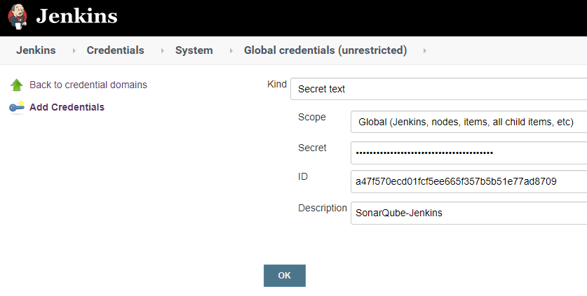
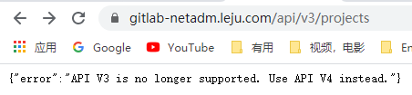
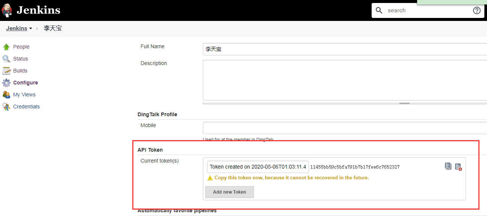
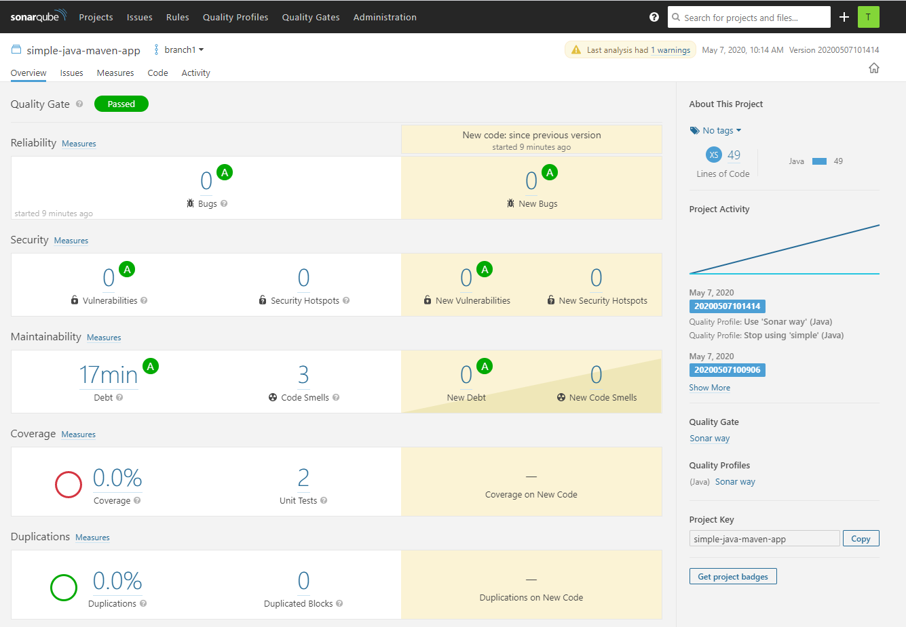

# SonarQube介绍

SonarQube是一个代码质量管理工具，能对20多种编程语言源码（Java, JavaScript, C#, TypeScript, Kotlin, Ruby, Go, Scala, Flex, Python, PHP, HTML, CSS, XML and VB.NET）进行code Smells、Bug、安全漏洞方便的静态分析。

**架构**

1、一台SonarQube Server启动的3个主要过程：

- web服务器，供开发人员、管理人员浏览高质量的快照并配置SonarQube实例

- 基于Elasticsearch的Search Server从UI进行后退搜索

- Compute Engine服务器，负责处理代码分析报告并将其保存在SonarQube数据库中。

2、一个SonarQube数据库要存储：

- SonarQube实例的配置（安全性、插件设置等）
- 项目，视图等质量快照。

3、服务器上安装了多个SonarQube插件，可能包括语言，SCM，集成，身份验证和管理插件。

4、在构建/持续集成服务器上运行一个或多个SonarScanner，以分析项目。


**SonarQube的版本**

- 社区版

- 企业版

- 数据中心版

# 部署SonarQube7.9.3 LTS

**调整系统参数**

```BASH
[10.208.3.24 root@test-6:~]# vim /etc/security/limits.conf
sonarqube  -   nofile  65536
sonarqube  -   noproc  4096
[10.208.3.24 root@test-6:~]# vim /etc/sysctl.conf 
vm.max_map_count=262144
fs.file-max=65536
##如果使用systemd管理，则需要在unit文件中加入下面这些
[10.208.3.24 root@test-6:~]# vim /usr/lib/systemd/system/sonarqube.service
LimitNOFILE=65536
LimitNPROC=4096
```

**配置数据库**

```BASH
[10.208.3.27 root@zabbix-2:~]# sudo -u postgres /usr/pgsql-11/bin/psql -U postgres -c "create role sonarqube with password '123123';"
[10.208.3.27 root@zabbix-2:~]# sudo -u postgres /usr/pgsql-11/bin/psql -U postgres -c "grant all privileges on database sonarqube to sonarqube;"
[10.208.3.27 root@zabbix-2:~]# sudo -u postgres /usr/pgsql-11/bin/psql -U postgres -c "create database sonarqube owner sonarqube;"
[10.208.3.27 root@zabbix-2:~]# sudo -u postgres /usr/pgsql-11/bin/psql -U postgres -c "alter role sonarqube login;"
[10.208.3.27 root@zabbix-2:~]# vim /var/lib/pgsql/11/data/pg_hba.conf
host  sonarqube   sonarqube    10.208.3.0/24     md5
[10.208.3.27 root@zabbix-2:~]# systemctl reload postgresql-11.service
```

注：SonarQube7.9开始不在支持MySQL（支持postgres）。

**安装并配置SonarQube**

```BASH
[10.208.3.18 root@test-1:~]# useradd -s /sbin/nologin -m sonarqube		//必须使用非root用户运行sonarqube，因为启动sonarqube会启动es，而es不能使用root运行。
[10.208.3.18 root@test-1:/usr/local]# cd /usr/local/src/
[10.208.3.18 root@test-1:/usr/local/src]# unzip /root/sonarqube-7.9.3.zip -d /usr/local/
[10.208.3.18 root@test-1:/usr/local/src]# ln -s sonarqube-7.9.3 sonarqube
[10.208.3.18 root@test-1:/usr/local/src]# chown -R sonarqube:sonarqube ./sonarqube
[10.208.3.18 root@test-1:/usr/local/sonarqube]# grep "^[^#]" conf/sonar.properties
sonar.jdbc.username=sonarqube
sonar.jdbc.password=123123
sonar.jdbc.url=jdbc:postgresql://10.208.3.27:5432/sonarqube
sonar.web.context=/sonarqube
sonar.web.port=9000
sonar.web.javaOpts=-server
wrapper.java.command=/usr/java/jdk-11.0.7/bin/java
```

**配置System的Unit文件**

```BASH
[10.208.3.18 root@test-1:/usr/local/sonarqube]# cat /usr/lib/systemd/system/sonarqube.service 
[Unit]
Description=SonarQube service
After=syslog.target network.target
[Service]
Type=simple
User=sonarqube
Group=sonarqube
PermissionsStartOnly=true
ExecStart=/usr/java/jdk-11.0.7/bin/java -Xms32m -Xmx32m -Djava.net.preferIPv4Stack=true -jar /usr/local/sonarqube/lib/sonar-application-7.9.3.jar
StandardOutput=syslog
LimitNOFILE=65536
LimitNPROC=8192
TimeoutStartSec=5
Restart=always
[Install]
WantedBy=multi-user.target
```

**启动SonarQube**

```BASH
[10.208.3.18 root@test-1:/usr/local/sonarqube]# systemctl restart sonarqube.service 
[10.208.3.18 root@test-1:/usr/local/sonarqube]# ss -lntup | grep 9000
tcp    LISTEN   0    25    :::9000    :::*    users:(("java",pid=125488,fd=119))
```

**登录web页面**

默认用户名/密码为：admin


如果在登陆的时候提示如下：

```BASH
“bedded database should be used for evaluation purpose only
The embedded database will not scale, it will not support upgrading to newer versions of SonarQube, and there is no support for migrating your data out of it into a different database engine. ”
```

这说明SonarQube当前使用的是内嵌数据库，这只能用作延时。如果要在生产环境中使用，需要重新配置数据库，让SonarQube使用pg或其他才可以。


**查看已安装的插件**

```BASH
[10.208.3.18 root@test-1:/usr/local/sonarqube]# ll extensions/plugins/
total 87988
-rw-r--r-- 1 sonarqube sonarqube      224 2020-03-24 08:24:12 README.txt
-rw-r--r-- 1 sonarqube sonarqube   287504 2020-03-24 08:24:38 sonar-auth-github-plugin-1.5.0.870.jar
-rw-r--r-- 1 sonarqube sonarqube  3388540 2020-03-24 08:24:38 sonar-auth-saml-plugin-1.1.0.181.jar
-rw-r--r-- 1 sonarqube sonarqube  4094975 2020-03-24 08:24:38 sonar-csharp-plugin-7.15.0.8572.jar
-rw-r--r-- 1 sonarqube sonarqube  7015434 2020-03-24 08:24:38 sonar-css-plugin-1.1.1.1010.jar
-rw-r--r-- 1 sonarqube sonarqube  1544789 2020-03-24 08:24:38 sonar-flex-plugin-2.5.1.1831.jar
-rw-r--r-- 1 sonarqube sonarqube  3903342 2020-03-24 08:24:38 sonar-go-plugin-1.1.1.2000.jar
-rw-r--r-- 1 sonarqube sonarqube  1727846 2020-03-24 08:24:38 sonar-html-plugin-3.1.0.1615.jar
-rw-r--r-- 1 sonarqube sonarqube    15098 2020-03-24 08:24:38 sonar-jacoco-plugin-1.0.2.475.jar
-rw-r--r-- 1 sonarqube sonarqube  8302745 2020-03-24 08:24:38 sonar-java-plugin-5.13.1.18282.jar
-rw-r--r-- 1 sonarqube sonarqube  6866969 2020-03-24 08:24:38 sonar-javascript-plugin-5.2.1.7778.jar
-rw-r--r-- 1 sonarqube sonarqube  7595999 2020-03-24 08:24:38 sonar-kotlin-plugin-1.5.0.315.jar
-rw-r--r-- 1 sonarqube sonarqube   300503 2020-03-24 08:24:38 sonar-ldap-plugin-2.2.0.608.jar
-rw-r--r-- 1 sonarqube sonarqube  5105268 2020-03-24 08:24:38 sonar-php-plugin-3.2.0.4868.jar
-rw-r--r-- 1 sonarqube sonarqube  2752167 2020-03-24 08:24:38 sonar-python-plugin-1.14.1.3143.jar
-rw-r--r-- 1 sonarqube sonarqube 10036210 2020-03-24 08:24:40 sonar-ruby-plugin-1.5.0.315.jar
-rw-r--r-- 1 sonarqube sonarqube  9202024 2020-03-24 08:24:40 sonar-scala-plugin-1.5.0.315.jar
-rw-r--r-- 1 sonarqube sonarqube  2622236 2020-03-24 08:24:38 sonar-scm-git-plugin-1.8.0.1574.jar
-rw-r--r-- 1 sonarqube sonarqube  7229293 2020-03-24 08:24:38 sonar-scm-svn-plugin-1.9.0.1295.jar
-rw-r--r-- 1 sonarqube sonarqube  2239156 2020-03-24 08:24:40 sonar-typescript-plugin-1.9.0.3766.jar
-rw-r--r-- 1 sonarqube sonarqube  3580236 2020-03-24 08:24:38 sonar-vbnet-plugin-7.15.0.8572.jar
-rw-r--r-- 1 sonarqube sonarqube  2242738 2020-03-24 08:24:40 sonar-xml-plugin-2.0.1.2020.jar
```

**根据需要安装插件**

比如中文、python、php等等

SonarQube--Administration--Marketplace


除了在在线安装插件之外，还可以手工导入。这在网络质量不好或者在线无法搜索到的的时候可以使用。

方法：可以直接下载xxxx该插件（jar包），放到服务器的<sonarqube_install_dir>/extensions/plugins 目录，重启 SonarQube 即可。

# 安装sonar-scanner-4.3.0.2102

scanner是一个工具，不是daemon，只在执行扫描的时候启动即可。

```BASH
[10.208.3.18 root@test-1:~]# unzip sonar-scanner-cli-4.3.0.2102-linux.zip -d /usr/local/
[10.208.3.18 root@test-1:~]# cd /usr/local/
[10.208.3.18 root@test-1:/usr/local]# ln -s sonar-scanner-4.3.0.2102-linux/ sonarscanner
[10.208.3.18 root@test-1:/usr/local]# vim sonarscanner/conf/sonar-scanner.properties 
sonar.host.url=http://10.208.3.24:9000
sonar.sourceEncoding=UTF-8
```

# SonarQube认证

## 使用LDAP认证

认证机制是：用户登录时，首先使用外部系统对其进行认证，如果外部系统不可达或者没有定义这个用户，则使用SonarQube内部系统对其进行认证。

参考：https://docs.sonarqube.org/display/SONARQUBE67/LDAP+Plugin

**安装LDAP插件**


**更改conf/sonar.properties**

```INI
sonar.security.realm=LDAP			//必须配制成LDAP，不能更改为别的字符
ldap.url=ldap://10.208.3.13:389
ldap.bindDn=cn=replicator,dc=ljldap,dc=com
ldap.bindPassword=123456
ldap.user.baseDn=ou=netadm,dc=ljldap,dc=com
ldap.user.request=(&(objectClass=inetOrgPerson)(cn={login}))
ldap.user.realNameAttribute=cn
ldap.user.emailAttribute=mail
```

**重启SonarQube**

只有就可以使用LDAP用户登录了，但是用户默认始于sonar-user组，权限很小，可以根据需要将其加入到管理员组中


## 使用GitLab认证

**在GitLab上配置Application**

Redirect URI中，URL部分是固定的，域名需要是在SonarQube中配置的。

下面这个域名是我在Nginx上做了代理的。将访问sonarqube-netadm.leju.com的请求转发个到10.208.3.18:9000/sonarqube


将Application ID和Secret记录下面会需要

`daf41913cb7df16df12e6da9237c15eb8a49231af9de036497d1d5302aa1d5c6`

`9a22d777d5dbd52c612f6de028f785911575b9186de33de25990636257b6c58b`


**在SonarQube上安装插件**

安装之后需要重启才可以生效


**配置GitLab的地址**


**配置Server base URL**


**登录测试**

这会跳转到GitLab上


## 使用GitHub认证

参考：https://docs.sonarqube.org/7.9/instance-administration/delegated-auth/

**在GitHub上生成clientID和Secret，并指定URL**


**在SonarQube上安装插件**


**将GitHubt生成的ID和Secret配置到上面**

注意，SonarQube的必须通过HTTPS访问，且SonarQube的UR了必须是公共的HTTPS URL（我理解GitHub必须可以解析这个域名）

最终我也没有执行对接成功，始终提示“You're not authorized to access this page. Please contact the administrator.”


# 本地使用SonarScanner

**准备测试代码**

```BASH
[10.208.3.24 root@test-6:/usr/local/src]# unzip sonar-examples-master.zip 
[10.208.3.24 root@test-6:/usr/local/src]# cd sonar-examples-master/projects/languages/php/php-sonar-runner
[10.208.3.24 root@test-6:/usr/local/src/sonar-examples-master/projects/languages/php/php-sonar-runner]# tree
.
├── README.md
├── sonar-project.properties
├── src
│   └── Math.php
└── validation.txt
```

**在项目目录下，创建一个名为sonar-project.properties的文件，配置参数如下：**

```BASH
[10.208.3.24 root@test-6:/usr/local/src/sonar-examples-master/projects/languages/php/php-sonar-runner]# cat sonar-project.properties 	##执行scanner的时候，它会读取这个信息
sonar.projectKey=org.sonarqube:php-simple-sq-scanner
sonar.projectName=PHP :: Simple Project :: SonarQube Scanner
sonar.projectVersion=1.0
sonar.sources=src
sonar.language=php
sonar.sourceEncoding=UTF-8
```

注：这些参数也可以在命令行中指定参数：

```bash
-Dsonar.projectName
-Dsonar.host.url
-Dsonar.projectKey
-Dsonar.projectName
-Dsonar.sources
-Dsonar.language
-Dsonar.sourceEncoding
-Dsonar.projectVersion
-Dsonar.login
-Dsonar.passwordd
-Dsonar.sourceEncoding
-Dsonar.link.homepage
-Dsonar.projectDescription
-Dsonar.java.binaries			##指定类
-Dsonar.java.test.binaries		##指定测试类
-Dsonar.java.surefire.report	##指定测试报告位置
```

**执行扫描**

```BASH
[10.208.3.24 root@test-6:/usr/local/src/sonar-examples-master/projects/languages/php/php-sonar-runner]# /usr/local/src/sonar-scanner-2.6.1/bin/sonar-scanner 
INFO: Scanner configuration file: /usr/local/src/sonar-scanner-2.6.1/conf/sonar-scanner.properties
INFO: Project root configuration file: /usr/local/src/sonar-examples-master/projects/languages/php/php-sonar-runner/sonar-project.properties
INFO: SonarQube Scanner 2.6.1
INFO: Java 1.8.0_191 Oracle Corporation (64-bit)
INFO: Linux 3.10.0-957.27.2.el7.x86_64 amd64
INFO: User cache: /root/.sonar/cache
INFO: Load global settings
INFO: Load global settings (done) | time=75ms
INFO: User cache: /root/.sonar/cache
INFO: Load plugins index
INFO: Load plugins index (done) | time=4ms
INFO: SonarQube server 6.5.0
INFO: Default locale: "en_US", source code encoding: "UTF-8"
INFO: Process project properties
INFO: Load project repositories
INFO: Load project repositories (done) | time=27ms
INFO: Load quality profiles
INFO: Load quality profiles (done) | time=29ms
INFO: Load active rules
INFO: Load active rules (done) | time=782ms
INFO: Load metrics repository
INFO: Load metrics repository (done) | time=105ms
WARN: SCM provider autodetection failed. No SCM provider claims to support this project. Please use sonar.scm.provider to define SCM of your project.
INFO: Publish mode
INFO: Project key: org.sonarqube:php-simple-sq-scanner
INFO: -------------  Scan PHP :: Simple Project :: SonarQube Scanner
INFO: Load server rules
INFO: Load server rules (done) | time=175ms
INFO: Language is forced to php
INFO: Base dir: /usr/local/src/sonar-examples-master/projects/languages/php/php-sonar-runner
INFO: Working dir: /usr/local/src/sonar-examples-master/projects/languages/php/php-sonar-runner/.sonar
INFO: Source paths: src
INFO: Source encoding: UTF-8, default locale: en_US
INFO: Index files
INFO: 1 file indexed
INFO: Quality profile for php: Sonar way
INFO: Sensor SonarJavaXmlFileSensor [java]
INFO: Sensor SonarJavaXmlFileSensor [java] (done) | time=0ms
INFO: Sensor PHP sensor [php]
INFO: 1 source files to be analyzed
INFO: 1/1 source files have been analyzed
INFO: No PHPUnit test report provided (see 'sonar.php.tests.reportPath' property)
INFO: No PHPUnit coverage reports provided (see 'sonar.php.coverage.reportPaths' property)
INFO: Sensor PHP sensor [php] (done) | time=599ms
INFO: Sensor Analyzer for "php.ini" files [php]
INFO: Sensor Analyzer for "php.ini" files [php] (done) | time=2ms
INFO: Sensor Zero Coverage Sensor
INFO: Sensor Zero Coverage Sensor (done) | time=13ms
INFO: Sensor CPD Block Indexer
INFO: Sensor CPD Block Indexer (done) | time=0ms
INFO: No SCM system was detected. You can use the 'sonar.scm.provider' property to explicitly specify it.
INFO: Calculating CPD for 1 file
INFO: CPD calculation finished
INFO: Analysis report generated in 65ms, dir size=31 KB
INFO: Analysis reports compressed in 9ms, zip size=10 KB
INFO: Analysis report uploaded in 298ms
INFO: ANALYSIS SUCCESSFUL, you can browse http://10.208.3.24:9000/dashboard/index/org.sonarqube:php-simple-sq-scanner
INFO: Note that you will be able to access the updated dashboard once the server has processed the submitted analysis report
INFO: More about the report processing at http://10.208.3.24:9000/api/ce/task?id=AXGmDb_k9mokw4N2vqpA
INFO: Task total time: 4.355 s
INFO: ------------------------------------------------------------------------
INFO: EXECUTION SUCCESS
INFO: ------------------------------------------------------------------------
INFO: Total time: 5.516s
INFO: Final Memory: 46M/191M
INFO: ------------------------------------------------------------------------
```

**查看分析结果**

可以再sonarqube中看这个项目的信息了


# 在Jenkins中使用SonarQube

**添加设置SonarQube插件**


**设置SonarQube Server**

Manage Jenkins--Configure System


**设置SonarQube Scanner**

Manage Jenkins--Configure Global Security

如果还没有安装SonarQube Scanner且网络没问题，可以选择自动安装


**示例：在free systel的项目中使用SonarQube**

更改项目，在项目中的Build中，添加“Execute SonarQube Scanner”


```GROOVY
sonar.projectKey=test-demo1
sonar.projectName=test-demo1
sonar.projectVersion=1.0
sonar.sources=./
sonar.language=php
sonar.sourceEncoding=UTF-8
```

开始构建


**示例：在Pipeline的项目中执行SonarQube**

即便项目目录下没有sonar-project.properties文件也没关系，因为已经在命令行中指定了。

```GROOVY
pipeline {
   agent any
    stages {
      stage('Code Check') {
         steps {
            script {
                def sonarHome = tool name: 'sonar-scanner', type: 'hudson.plugins.sonar.SonarRunnerInstallation'
                dir('/usr/local/src/sonar-examples-master/projects/languages/php/php-sonar-runner'){
                    sh """
                    ${sonarHome}/bin/sonar-scanner \
                    -Dsonar.projectKey='org.sonarqube:php-simple-sq-scanner3' \
                    -Dsonar.projectName='PHP :: Simple Project :: SonarQube Scanner3' \
                    -Dsonar.projectVersion='1.0' \
                    -Dsonar.sources='src' \
                    -Dsonar.language='php' \
                    -Dsonar.sourceEncoding='UTF-8'
                    """
                }
            }
         }
      }
    }
}
```


# Jenkins集成SonarQube

**共享库文件**

```GROOVY
package org.devops
def Scan(projectNmae,projectDesc,projectPath,projectLanguage,SonarServer,Coding,extraAgruments){
	def scannerHome = "/usr/local/sonarscanner"
	def sonarData = sh(script: "date +%Y%m%d%H%M%S", returnStdout: true).trim()
	withSonarQubeEnv("${SonarServer}") {
		sh """
			${scannerHome}/bin/sonar-scanner \
			-Dsonar.host.url="${SONAR_HOST_URL}" \
			-Dsonar.projectKey="${projectNmae}" \
			-Dsonar.projectName="${projectNmae}" \
			-Dsonar.projectVersion="${sonarData}" \
			-Dsonar.sources="${projectPath}" \
			-Dsonar.language="${projectLanguage}" \
        	-Dsonar.sourceEncoding="${Coding}" \
        	-Dsonar.projectVersion="${sonarData}" \
        	-Dsonar.login="${SONAR_AUTH_TOKEN}" ${extraAgruments}
		"""
	}
}
```

**Jenkinsfile**

```GROOVY
[10.208.3.24 root@test-6:~/jenkinslib]# cat Jenkinsfile2 
@Library('jenkinslib@master')
def build = new org.devops.build()
def tools = new org.devops.tools()
def gitlab = new org.devops.gitlab()
def toemail = new org.devops.toemail()
def sonar = new org.devops.sonarqube()
if ( "${runOpts}" =="GitlabPush" ) {
	branchName = branch - '/refs/heads/'
	currentBuild.description = "Trigger by ${buildUser} - ${branch}"
    gitlab.ChangeCommitStatus(projectId,commitSha,"running")
}
pipeline {
    agent { node{label "scanner"} }
	options {
		timeout(time: 1, unit: 'HOURS') 
		timestamps()
		buildDiscarder(logRotator(numToKeepStr: '10'))
	}
    triggers {
        GenericTrigger(
        	genericVariables: [
                [key: "branch", value: "\$.ref", expressionType: "JSONPath", regexpFilter: "", defaultValue: ""],
                [key: "buildUser", value: "\$.user_username", expressionType: "JSONPath", regexpFilter: "", defaultValue: ""],
                [key: "srcUrl", value: "\$.project.git_ssh_url", expressionType: "JSONPath", regexpFilter: "", defaultValue: ""],
                [key: "projectId", value: "\$.project.id", expressionType: "JSONPath", regexpFilter: "", defaultValue: ""],
                [key: "commitSha", value: "\$.checkout_sha", expressionType: "JSONPath", regexpFilter: "", defaultValue: ""],
                [key: "before", value: "\$.before", expressionType: "JSONPath", regexpFilter: "", defaultValue: ""],
                [key: "after", value: "\$.after", expressionType: "JSONPath", regexpFilter: "", defaultValue: ""],
                [key: "object_kind", value: "\$.object_kind", expressionType: "JSONPath", regexpFilter: "", defaultValue: ""],
                [key: "mailUser", value: "\$.user_email", expressionType: "JSONPath", regexpFilter: "", defaultValue: ""]
            ],
        	genericRequestVariables: [
                [key: "runOpts", regexpFilter: ""]
            ],
            genericHeaderVariables: [
            ],
            token: 'demon-maven-service_PUSH',
            causeString: 'Triggered on $branch',
            printContributedVariables: true,
            printPostContent: true,
            silentResponse: true,
			regexpFilterText: '$object_kind $before $after',
			regexpFilterExpression: '^push\\s(?!0{40}).{40}\\s(?!0{40}).{40}$'
        )
    }
    stages {
        stage('Checkout') {
            steps{
                script{
                    tools.PrintMes("${branchName}","green")
                    checkout([$class: 'GitSCM', branches: [[name: "${branchName}"]],
                              doGenerateSubmoduleConfigurations: false, extensions: [], submoduleCfg: [],
                              userRemoteConfigs: [[credentialsId: '4eaf63a6-52b2-4d8b-ba14-26322a3135e0',
                              url: "${srcUrl}"]]])
                }
            }
        }
        stage('Build') {
            steps{
                script{
                    buildHome = tool "mvn-3.6.3"
                    sh """
						export PATH=/usr/java/jdk1.8.0_212-amd64/bin:$PATH
						${buildHome}/bin/mvn clean install
					"""
                }
            }
        }
		stage('CodeScan'){
			steps {
				script{
					tools.PrintMes("代码扫描","green")
					sonar.Scan('simple-java-maven-app','simple-java-maven-app','src','java','Sonar-Server','UTF-8', 
    '-Dsonar.java.binaries=target/classes -Dsonar.java.test.binaries=target/test-classes -Dsonar.java.surefire.report=target/surefire-reports')
				}
			}
		}
    }
	post {
		success{
			script{
				tools.PrintMes("success","green")
				gitlab.ChangeCommitStatus(projectId,commitSha,"success")
				toemail.toemail("${mailUser}")
			}
		}
		failure{
			script{
				tools.PrintMes("failed","red")
				gitlab.ChangeCommitStatus(projectId,commitSha,"failed")
				toemail.toemail("${mailUser}")
			}
		}
		aborted{
			script{
				tools.PrintMes("canceled","buie")
				gitlab.ChangeCommitStatus(projectId,commitSha,"canceled")
				toemail.toemail("${mailUser}")
			}
		}
	}
}
```

**最终效果**


# 多SonarQube需求

测试环境、生产环境使用不同的SonarQube，实现方法：

**方法1**

在Jenkins中设置多个SonarQube Server

Manage Jenkins--Configure System


在pipeline中执行扫描的时候，针对不同的环境，将Sonar-Server替换成不同环境对应的名称即可。我在共享库里定义了方法。这个值会传过去。

		stage('CodeScan'){
			steps {
				script{
					tools.PrintMes("代码扫描","green")
					sonar.Scan('simple-java-maven-app','simple-java-maven-app','src','java','Sonar-Server','UTF-8', 
	'-Dsonar.java.binaries=target/classes -Dsonar.java.test.binaries=target/test-classes -Dsonar.java.surefire.report=target/surefire-reports')
				}
			}
		}
**方法2**

另一种方法就是直接更改共享库，然后还是在pipeline中传参。


# SonarQube安全设置

SonarQube服务默认允许任何人执行源码分析，这在生产环境中使用会有隐患，可以通过下面几种方式安全性。

## 强制要求必须登录SonarQube

用管理员账号登录SonarQube，打开Administration > Configuration > General Settings > Security，开启Force user authentication，点击Save保存生效。

开启该选项后，不允许匿名运行mvn sonar:sonar代码扫描，必须提供SonarQube Token。


## 修改默认的项目可见性为private

用管理员账号登录SonarQube，打开Administration > Projects > Management，修改Default visibility of new projects为private。

这样新建项目后，只有该项目的授权用户才能看到该项目的代码。

对已有的项目，打开项目级别的Adminstration > Permissions，手工修改项目可见性。

## 去掉Anyone组的权限

用管理员账号登录SonarQube，打开Administration > Security > Global Permissions，去掉Anyone组的所有权限。

## 去掉Project Creator的权限

用管理员账号登录SonarQube，打开Administration > Security > Permission Templates，打开Default template，去掉Project Creator的所有权限。

## 设置项目账号权限

用管理员账号登录SonarQube，打开项目级别的Adminstration > Permissions，选择Users，输入用户名称查询，然后设置该用户权限。一般只需要设置Browse，See Source Code和Execute Analysis即可。

在按项目作多租户隔离的场景，需要为每个项目在SonarQube上创建一个用户，并设置只有该用户才有相应权限。

## 为用户生成Token

在按项目作多租户隔离的场景，需要为每个项目在SonarQube上创建一个用户，并使用该用户的Token来作代码扫描。

进入SonarQube，在个人设置页面中的Security tab页面，输入Token Name，并点击Generate来生成Token。

生成的Token需要保存下来，之后不会在重复出现了。

`a0d0008ac82c645324b674475254169dc6de03b3`


**之后Jenkins只能通过Token与SonarQube集成**

在Jenkins上先添加Credential（类型为Secret text，Secret为Token，id随便输入一个，描述就是以后显示的名称）



然后在Manage Jenkins--Configure System中为SonarQube Server添加上token


pipeline也要更改一下，执行的命令中，增加`-Dsonar.login='a0d0008ac82c645324b674475254169dc6de03b3'`

```GROOVY
pipeline {
   agent any
    stages {
      stage('Code Check') {
         steps {
            script {
                def sonarHome = tool name: 'sonar-scanner', type: 'hudson.plugins.sonar.SonarRunnerInstallation'
                dir('/usr/local/src/sonar-examples-master/projects/languages/php/php-sonar-runner'){
                    withSonarQubeEnv('Sonar-Server') {
                        sh """
                        ${sonarHome}/bin/sonar-scanner \
                        -Dsonar.host.url=${SONAR_HOST_URL} \
                        -Dsonar.projectKey='org.sonarqube:php-simple-sq-scanner3' \
                        -Dsonar.projectName='PHP :: Simple Project :: SonarQube Scanner3' \
                        -Dsonar.projectVersion='1.0' \
                        -Dsonar.login=${SONAR_AUTH_TOKEN} \
                        -Dsonar.sources='src' \
                        -Dsonar.language='php' \
                        -Dsonar.sourceEncoding='UTF-8'
                        """
                    }
                }
            }
         }
      }
    }
}
```

withSonarQubeEnv是一个环境变量包装器，读取的是我们在“Manage Jenkins--Configure System中为SonarQube Server”中配置的变量。在他的闭包内，我们可以使用以下变量。

- SONAR_HOST_URL：SonarQube服务器地址
- SONAR_AUTH_TOKEN：SonarQube认证所需要的Token

# 将分析报告推送到GitLab上

如果希望每一次代码的commit都进行分析，并将分析结果与该commit关联起来，那么可以使用SonarQube的GitLab插件，它可以将SonarQube的分析结果推送到GitLab上。

Only SonarQube < 7.7, because preview mode is removed

## Sonar GitLab Plugin安装

在SonarQube上安装该插件安装方式很简单。

- 方式一：可以直接下载 sonar-gitlab-plugin-2.1.0 该插件（jar包），放到服务器上<sonarqube_install_dir>/extensions/plugins 目录，重启 SonarQube 即可。

- 方式二：admin 登录 SonarQube，点击 配置 —> 系统 —> 更新中心 —> Available —> Search，输入 GitLab，在列表中点击 install 安装，安装完毕后重启 SonarQube 即可。

注意：该插件sonar-gitlab-plugin 兼容 SonarQube 的版本信息需要参考[它在GitHub上的项目信息](https://github.com/gabrie-allaigre/sonar-gitlab-plugin)

我才用的是方式一，在拷贝并重启之后，SonarQube--Administration--Systen--Update Center--Installed中可以看到


## 配置SonarQube GitLab插件

### 设置GitLab URL

SonarQube--Administration--Configuration--General settings--GitLab中设置GitLab url


### 设置GitLab User Token

> 建议为SonarQube连接GitLab创建一个专门的用户，且授予这个用户项目的权限，这个实验里为了省事就不设置了。
>
> 不同版本的GitLab中，设置Token的位置可能不一样，仔细找找就好。


设置好之后，会显示出Token（`QYbdCQizdarWsxg7uCej`）。这个Token需要保存好，以后不会在显示出来了。而且在这个界面的下方可以看到刚刚设置的Token，如果点击Revoke就会撤销。


最后将生成的Token输入到SonarQube上


## 更改Pipeline

配置好SonarQube GitLab插件后，需要为SonarQube-scanner添加一些参数，以告诉他将分析结果关联到GitLab的相应commit上

```groovy
pipeline {
   agent any

   stages {
      stage('Code Clone') {
          steps {
            git branch: 'branch', credentialsId: '4eaf63a6-52b2-4d8b-ba14-26322a3135e0', url: 'ssh://git@gitlab-netadm.leju.com:2223/test/testapp1.git'
          }
      }
      stage('Code Check') {
         steps {
            script {
                def sonarHome = tool name: 'sonar-scanner', type: 'hudson.plugins.sonar.SonarRunnerInstallation'
                def GIT_COMMIT_ID = sh (
                    script: "git rev-parse HEAD",
                    returnStdout: true
                )
            withSonarQubeEnv('Sonar-Server') {
                sh """
                ${sonarHome}/bin/sonar-scanner -Dsonar.host.url=${SONAR_HOST_URL} \
                -Dsonar.login=${SONAR_AUTH_TOKEN} -Dsonar.analysis.mode=preview \
                -Dsonar.gitlab.ref_name=branch -Dsonar.gitlab.project_id=3\
                -Dsonar.projectName=Testapp1 -Dsonar.gitlab.commit_sha=${GIT_COMMIT_ID}
                """
            }
            }
         }
      }
   }
}
```

说明：

首先通过sh步骤获取代码的commit ID，然后在执行扫描时加入如下参数：

- -Ssonar.analysis.mode：分析报告模式，值为preview，代表将结果推送到GitLab。官方标注SonarQube6.6之后被废弃（奇怪的得是，6.7仍然需要加上它）。

- -Dsonar.gitlab.ref_name：分支名称

- -Dsonar.gitlab.project_id：GitLab上对应的项目id。

- -Dsonar.projectName：对应SonarQube上面的项目名称

- -Dsonar.gitlab.commit_sha：代码的commit id。

注意：sonar.gitlab.*参数为插件可用变量，每个变量有不同的用户，具体可以参考[sonar-gitlab-plugin](https://github.com/gabrie-allaigre/sonar-gitlab-plugin#plugins-properties)

## 查看分析结果

点击Build now运行构建，等SonarQube分析完成后，我们就可以在GitLab响应的commit页面上的代码行或commit区看到分析结果了。


关于分析结果是显示在行内还是评论区，有SonarQube GitLab插件的配置决定。

注意：信息全部在GitLab上了，SonarQube上面看不到项目的分析结果。

## FQA

## 查看项目project id的方法

方法1：去GitLab上查看（最方便快捷）


方法2：发送get请求

- 查询指定项目：https://gitlab.com/api/v3/projects?private_token=xxxx&search=projectname
- 查询完整列表：https://gitlab.com/api/v3/projects?per_page=500&private_token=xxxx

## API版本不匹配

执行流水线报错如下：

```BASH
INFO: ------------------------------------------------------------------------
INFO: EXECUTION FAILURE
INFO: ------------------------------------------------------------------------
INFO: Total time: 2.618s
INFO: Final Memory: 43M/136M
INFO: ------------------------------------------------------------------------
ERROR: Error during SonarQube Scanner execution
ERROR: Failed to execute project builder: com.talanlabs.sonar.plugins.gitlab.CommitProjectBuilder
ERROR: Caused by: Unable to perform GitLab WS operation
ERROR: Caused by: https://gitlab-netadm.leju.com/api/v3/projects
ERROR: 
ERROR: To see the full stack trace of the errors, re-run SonarQube Scanner with the -e switch.
ERROR: Re-run SonarQube Scanner using the -X switch to enable full debug logging.
[Pipeline] }
WARN: Unable to locate 'report-task.txt' in the workspace. Did the SonarScanner succeeded?
```

访问https://gitlab-netadm.leju.com/api/v3/projects的时候提示要使用API V4



解决方法：

1、更换gitlab为版本的。

2、在反代上做一个rewrite

我选择的是方法2，而且成功了

```BASH
upstream gitlab_server {
    server 10.208.3.20:80;
    keepalive 16;
}
server {
    listen 80;
    server_name gitlab-netadm.leju.com;
    rewrite ^(.*) https://$host$1 permanent;
}
server {
    listen 443 ssl;
    server_name gitlab-netadm.leju.com;
    ssl_certificate /etc/certs/xing.leju.com.pem;
    ssl_certificate_key /etc/certs/xing.leju.com.key;
    ssl_protocols TLSv1 TLSv1.1 TLSv1.2;
    ssl_session_cache shared:SSL_SESSION:10M;
    ssl_session_timeout 5m;
    ssl_ciphers  HIGH:!aNULL:!MD5;
    client_max_body_size 30M;
    location /api/v3/ {
        rewrite /(api)/v3/(.*) /$1/v4/$2 last;		##这是关键点
    }
    location / {
        proxy_pass http://gitlab_server;
        proxy_next_upstream_timeout 60;
        proxy_buffering off;
        proxy_request_buffering off;
        proxy_http_version 1.1;
        proxy_set_header Connection "";
        proxy_set_header Host $host;
        proxy_set_header X-Real-IP $remote_addr;
        proxy_set_header X-Forwarded-For $proxy_add_x_forwarded_for;
    }
}
```

之后可以请求了


# 在SonarQube上管理项目

## SonarQube API参考文档

`<你的sonarqube_server_domain>/web_api/api/`，文档中描述了API的信息


```javascript
//查找项目
api/projects/search?projects=${projectName}
//创建项目
api/projects/create?name=${projectName}&project=${projectName}
//更新语言规则集
api/qualityprofiles/add_project?language=${language}&qualityProfile=${qualityProfile}&project=${projectName}
//项目授权
api/permissions/apply_template?projectKey=${projectKey}&templateName=${templateName}
//更新质量阈
api/qualitygates/select?projectKey=${projectKey}&gateId=${gateId}
```

## 质量配置（规则）Quality Profiles

SonarQube就是使用这里定义的规则对代码进行评估的。

我们可以新建一个新的配置


新建之后可以看到，在java语言下（上面选择的是java）多出了一个配置，但是因为没有添加规则，所以rules显示为0


点击进去之后可以配置规则，点击Activate可以激活规则，点击Deactivate可以关闭规则


规则配置完成后，可以再项目中，选择本项目默认应用的规则


## Quality Gate质量阈

上面的Quality Profiles是配置规则集的，SonarQube用规则集来对代码进行评判。而这个Quality Gate是进行阈值配置的，比如如果达到了阈值的设定就转换为故障状态。

**创建一个Quality Gate，这里可以选择引用给哪些项目**

具体的指标是在这里配置，下面就是配置了一个：如果Code Smells超过了1个，就失败


在项目中也可以定义应用哪个Quality Gate


扫描的结果超过了我设定的阈值，显示错误


## 暂停pipeline直到代码质量检测通过

### 通过waitForQualityGate()实现（推荐）

如果代码有问题，那对坏代码进行构建是没有意义还消耗Jenkins资源的。如果想让Jenkins根据SonarQube扫描的结果做出一些决断，可以使用waitForQualityGate()方法实现，这会使用POST API告诉Jenkins。详细清参考：https://sonarqube-netadm.leju.com/sonarqube/documentation/project-administration/webhooks/

注：其实Jenkins是可以通过插件知道SonarQube的检测结果的，但是这块无法在流水线中直接调用。


**想要在流水线中根据扫描结果做一些绝对，需要按照下面步骤进行一些操作**

**在SonarQube上配置一个指向`<your Jenkins instance>/sonarqube-webhook/`的webhook**

1、在Jenkins的用户生成API Token

11455bb59c5bfa791b7b17fee6c7652327



2、在SonarQube上指定这个Token

下面这张图是在全局指定Webhook，还可以在项目中指定（项目--Administration--Webhooks）。项目级别的Webhook并不会取代全局级别的webhook。两个级别的所有Webhook都会被调用。


**更改pipeline（新增一个stage并调用waitForQualityGate()方法即可）**

```GROOVY
stage('Quality Gate') {
	steps {
		script {
			def qg = waitForQualityGate()
			if (qg.status != 'OK') {
				error "Pipeline aborted due to quality gate failure: ${qg.status}"
			} else if (qg.status == 'OK'){
				tools.PrintMes("quality gate: ${qg.status}","green")
			}
		}
	}
}
```

**日志**

构建失败了，因为我在SonarQube上调整了一下项目的Quality Gate，如果有Code Smell就是故障。这个项目一共有3个code smell所以无法构建。


在SonarQube上也可以看到这个Webhook的调用情况


点击Show recent deliveries只有就可以看到调用的情况


展开之后可以看到每次POST发送的内容

```JSON
{
  "serverUrl": "https://sonarqube-netadm.leju.com",
  "taskId": "AXHl-WvmsynYl39wUlw7",
  "status": "SUCCESS",
  "analysedAt": "2020-05-06T01:54:17+0800",
  "revision": "f069e0b2d5cc376b81c573266aed1f4e796a6a27",
  "changedAt": "2020-05-06T01:54:17+0800",
  "project": {
    "key": "simple-java-maven-app",
    "name": "simple-java-maven-app",
    "url": "https://sonarqube-netadm.leju.com/dashboard?id=simple-java-maven-app"
  },
  "branch": {
    "name": "master",
    "type": "LONG",
    "isMain": true,
    "url": "https://sonarqube-netadm.leju.com/dashboard?id=simple-java-maven-app"
  },
  "qualityGate": {
    "name": "Sonar way",
    "status": "OK",
    "conditions": [
      {
        "metric": "new_reliability_rating",
        "operator": "GREATER_THAN",
        "value": "1",
        "status": "OK",
        "errorThreshold": "1"
      },
      {
        "metric": "new_security_rating",
        "operator": "GREATER_THAN",
        "value": "1",
        "status": "OK",
        "errorThreshold": "1"
      },
      {
        "metric": "new_maintainability_rating",
        "operator": "GREATER_THAN",
        "value": "1",
        "status": "OK",
        "errorThreshold": "1"
      },
      {
        "metric": "new_coverage",
        "operator": "LESS_THAN",
        "status": "NO_VALUE",
        "errorThreshold": "80"
      },
      {
        "metric": "new_duplicated_lines_density",
        "operator": "GREATER_THAN",
        "status": "NO_VALUE",
        "errorThreshold": "3"
      }
    ]
  },
  "properties": {}
}
```

### 通过<sonarqube_url>/api实现的取值

**定义连接SonarQube的凭据（需要时用户名与密码方式）**

这个用户名和密码登录SonarQube，而且具有权限


**定义共享库**

将连接SonarQube API获取信息的方法写在里面。

```GROOVY
[10.208.3.24 root@test-6:~/jenkinslib]# cat src/org/devops/sonarqube_status_api.groovy 
package org.devops

def HttpReq(reqType,reqUrl,reqBody){
    def sonarServer = "https://sonarqube-netadm.leju.com/api"
    result = httpRequest authentication: 'sonarqube-tianbao1',
		httpMode: reqType,
        contentType: "APPLICATION_JSON",
        consoleLogResponseBody: true,
        ignoreSslErrors: true,
        requestBody: reqBody,
    	//quiet: true,
        url: "${sonarServer}/${reqUrl}"
    return result
}

def GetProjectStatus(projectName){
    apiUrl = "project_branches/list?project=${projectName}"
    response = HttpReq("GET",apiUrl,'')
    response = readJSON text: """${response.content}"""
    result = response["branches"][0]["status"]["qualityGateStatus"]
    return result
}
```

**Jenkinsfile**

增加一个步骤，专门用来获取SonarQube检测结果并判断

```GROOVY
[10.208.3.24 root@test-6:~/jenkinslib]# cat Jenkinsfile2
@Library('jenkinslib@master')
def build = new org.devops.build()
def tools = new org.devops.tools()
def gitlab = new org.devops.gitlab()
def toemail = new org.devops.toemail()
def sonar = new org.devops.sonarqube()
def sonar_status_api = new org.devops.sonarqube_status_api()
if ( "${runOpts}" == "GitlabPush" ) {
	branchName = branch - '/refs/heads/'
	currentBuild.description = "Trigger by ${buildUser} - ${branch}"
	gitlab.ChangeCommitStatus(projectId,commitSha,"running")
}
pipeline {
    agent { node{label "scanner"} }
	options {
		timeout(time: 1, unit: 'HOURS') 
		timestamps()
		buildDiscarder(logRotator(numToKeepStr: '10'))
	}
    triggers {
        GenericTrigger(
        	genericVariables: [
                [key: "branch", value: "\$.ref", expressionType: "JSONPath", regexpFilter: "", defaultValue: ""],
                [key: "buildUser", value: "\$.user_username", expressionType: "JSONPath", regexpFilter: "", defaultValue: ""],
                [key: "srcUrl", value: "\$.project.git_ssh_url", expressionType: "JSONPath", regexpFilter: "", defaultValue: ""],
                [key: "projectId", value: "\$.project.id", expressionType: "JSONPath", regexpFilter: "", defaultValue: ""],
                [key: "commitSha", value: "\$.checkout_sha", expressionType: "JSONPath", regexpFilter: "", defaultValue: ""],
                [key: "before", value: "\$.before", expressionType: "JSONPath", regexpFilter: "", defaultValue: ""],
                [key: "after", value: "\$.after", expressionType: "JSONPath", regexpFilter: "", defaultValue: ""],
                [key: "object_kind", value: "\$.object_kind", expressionType: "JSONPath", regexpFilter: "", defaultValue: ""],
                [key: "mailUser", value: "\$.user_email", expressionType: "JSONPath", regexpFilter: "", defaultValue: ""]
            ],
        	genericRequestVariables: [
                [key: "runOpts", regexpFilter: ""]
            ],
            genericHeaderVariables: [
            ],
            token: 'demon-maven-service_PUSH',
            causeString: 'Triggered on $branch',
            printContributedVariables: true,
            printPostContent: true,
            silentResponse: true,
			regexpFilterText: '$object_kind $before $after',
			regexpFilterExpression: '^push\\s(?!0{40}).{40}\\s(?!0{40}).{40}$'
        )
    }
    stages {
        stage('Checkout') {
            steps{
                script{
                    tools.PrintMes("${branchName}","green")
                    checkout([$class: 'GitSCM', branches: [[name: "${branchName}"]],
                              doGenerateSubmoduleConfigurations: false, extensions: [], submoduleCfg: [],
                              userRemoteConfigs: [[credentialsId: '4eaf63a6-52b2-4d8b-ba14-26322a3135e0',
                              url: "${srcUrl}"]]])
                }
            }
        }
        stage('Build') {
            steps{
                script{
                    buildHome = tool "mvn-3.6.3"
                    sh """
						export PATH=/usr/java/jdk1.8.0_212-amd64/bin:$PATH
						${buildHome}/bin/mvn clean install
					"""
                }
            }
        }
		stage('CodeScan'){
			steps {
				script{
					tools.PrintMes("代码扫描","green")
					sonar.Scan("${JOB_NAME}","${JOB_NAME}",'src','java','Sonar-Server','UTF-8', 
					'-Dsonar.java.binaries=target/classes -Dsonar.java.test.binaries=target/test-classes -Dsonar.java.surefire.report=target/surefire-reports')
				}
			}
		}
		stage('Quality Gate') {
			steps {
				script {
					tools.PrintMes("获取扫描结果","green")
					result = sonar_status_api.GetProjectStatus("${JOB_NAME}")
					println(result)
					if(result.toString() == "ERROR"){
						error "代码质量阈错误！请及时修复！"
					}
				}
			}
		}
    }
	post {
		success{
			script{
				tools.PrintMes("success","green")
				gitlab.ChangeCommitStatus(projectId,commitSha,"success")
				toemail.toemail("${mailUser}")
			}
		}
		failure{
			script{
				tools.PrintMes("failed","red")
				gitlab.ChangeCommitStatus(projectId,commitSha,"failed")
				toemail.toemail("${mailUser}")
			}
		}
		aborted{
			script{
				tools.PrintMes("canceled","buie")
				gitlab.ChangeCommitStatus(projectId,commitSha,"canceled")
				toemail.toemail("${mailUser}")
			}
		}
	}
}
```

**注意**

这个API在有些时候不是特别准（比如我刚刚更改了Quality Gate），插件显示的结果和API返回的值不一样（API返回的值不对）。


执行stage('Quality Gate')时日志如下：

```GROOVY
17:01:18   >>>>>>>>>>获取扫描结果<<<<<<<<<< 
[Pipeline] }
[Pipeline] // ansiColor
[Pipeline] httpRequest
17:01:18  HttpMethod: GET
17:01:18  URL: https://sonarqube-netadm.leju.com/api/project_branches/list?project=simple-java-maven-app
17:01:18  Content-Type: application/json
17:01:18  Using authentication: sonarqube-tianbao1
17:01:19  Sending request to url: https://sonarqube-netadm.leju.com/api/project_branches/list?project=simple-java-maven-app
17:01:19  Response Code: HTTP/1.1 200 
17:01:19  Response: 
17:01:19  {"branches":[{"name":"master","isMain":true,"type":"LONG","status":{"qualityGateStatus":"OK"},"analysisDate":"2020-05-06T16:59:00+0800"}]}
17:01:19  Success code from [100‥399]
[Pipeline] readJSON
[Pipeline] echo
17:01:19  OK			//result = response["branches"][0]["status"]["qualityGateStatus"]取出来的就是OK
```

## Jenkins调用API：搜索/创建项目，指定质量配置与质量阈

**在共享库或Jenkinsfile中写的内容或判断，都需要自己实际去测试，并根据自己的场景进行调整。**

比如下面这个搜索项目名称的API，我也是通过测试之后，才确定应该如何在pipeline中做判断的

这是使用API搜索SonarQube上的项目，可以看到，只有在total为0的时候，表示项目不存在，其余情况下`>=1`

指定一个已存在的项目名称进行搜索，GET请求：https://sonarqube-netadm.leju.com/sonarqube/api/projects/search?projects=simple-java-maven-app

```
{"paging":{"pageIndex":1,"pageSize":100,"total":1},"components":[{"organization":"default-organization","id":"AXHkjIT-synYl39wUlwh","key":"simple-java-maven-app","name":"simple-java-maven-app","qualifier":"TRK","visibility":"public","lastAnalysisDate":"2020-05-06T17:04:36+0800","revision":"ac4dac9257eb6af18a33418e9a509eab31ccfd4d"}]}
```

指定一个不存在的项目名称进行搜索，GET请求：https://sonarqube-netadm.leju.com/sonarqube/api/projects/search?projects=simple-java-maven-app1

```
{"paging":{"pageIndex":1,"pageSize":100,"total":0},"components":[]}
```

不指定项目名称，GET请求：https://sonarqube-netadm.leju.com/sonarqube/api/projects/search

```
{"paging":{"pageIndex":1,"pageSize":100,"total":3},"components":[{"organization":"default-organization","id":"AXHjrr9usynYl39wUlwN","key":"org.sonarqube:php-simple-sq-scanner","name":"PHP :: Simple Project :: SonarQube Scanner","qualifier":"TRK","visibility":"public","lastAnalysisDate":"2020-05-05T15:13:30+0800"},{"organization":"default-organization","id":"AXHkjIT-synYl39wUlwh","key":"simple-java-maven-app","name":"simple-java-maven-app","qualifier":"TRK","visibility":"public","lastAnalysisDate":"2020-05-06T17:04:36+0800","revision":"ac4dac9257eb6af18a33418e9a509eab31ccfd4d"},{"organization":"default-organization","id":"AXHjtXDCsynYl39wUlwU","key":"sonar-java1","name":"sonar-java1","qualifier":"TRK","visibility":"public","lastAnalysisDate":"2020-05-05T18:45:53+0800","revision":"7df202bd6aac6892be933224262d0c3dbcffa3b0"}]}
```

**定义共享库**

```GROOVY
[10.208.3.24 root@test-6:~/jenkinslib]# cat src/org/devops/sonarqube_api.groovy 
package org.devops

//HTTP封装
def HttpReq(reqType,reqUrl,reqBody){
    def sonarServer = "https://sonarqube-netadm.leju.com/api"
    result = httpRequest authentication: 'sonarqube-tianbao1',
		httpMode: reqType,
        contentType: "APPLICATION_JSON",
        consoleLogResponseBody: true,
        ignoreSslErrors: true,
        requestBody: reqBody,
    	//quiet: true,
        url: "${sonarServer}/${reqUrl}"
    return result
}

//获取扫描结果
def GetProjectStatus(projectName){
    apiUrl = "project_branches/list?project=${projectName}"
    response = HttpReq("GET",apiUrl,'')
    response = readJSON text: """${response.content}"""
    result = response["branches"][0]["status"]["qualityGateStatus"]
    return result
}

//搜索项目
def SearchProject(projectName){
	apiUrl = "projects/search?projects=${projectName}"
	response = HttpReq("GET",apiUrl,'')
	response = readJSON text: """${response.content}"""
	result = response["paging"]["total"]
	println("result")
	if (result.toString() == "0") {
		return 'false'
	} else {
		return 'true'
	}
}
	
//创建项目
def CreateProject(projectName){
	apiUrl = "projects/create?name=${projectName}&project=${projectName}"
	response = HttpReq("POST",apiUrl,'')
	result = SearchProject("${projectName}")
	if (result == "false"){
		println("${projectName}项目创建失败")
		return "false"
	} else {
		println("${projectName}项目创建成功")
	}
}

//搜索质量配置
def SearchQualityProfile(lang,qualityProfileName){
	qualityProfileName = qualityProfileName.split('-')[0]
	apiUrl = "qualityprofiles/search?language=${lang}&qualityProfile=${qualityProfileName}"
	response = HttpReq("GET",apiUrl,'')
	response = readJSON text: """${response.content}"""
	result = response["profiles"][0]
	println(result)
	if (result.toString() == 'null' ) {
		return 'false'
	} else {
		println("${qualityProfileName}质量配置已存在")
		return 'true'
	}
}

//创建质量配置
def CreateQualityProfile(lang,qualityProfileName){
	qualityProfileName = qualityProfileName.split('-')[0]
	apiUrl = "qualityprofiles/create?language=${lang}&name=${qualityProfileName}"
	response = HttpReq("POST",apiUrl,'')
	response SearchQualityProfile(lang,qualityProfileName)
	if (response == 'false') {
		println("${qualityProfileName}质量配置创建失败")
	} else {
		println("${qualityProfileName}质量配置创建成")
	}
}

//将项目与质量配置关联
def ProjectAssociateQP(lang,projectName,qualityProfileName){
	qualityProfileName = qualityProfileName.split('-')[0]
	apiUrl = "qualityprofiles/add_project?language=${lang}&project=${projectName}&qualityProfile=${qualityProfileName}"
	response = HttpReq("POST",apiUrl,'')
}

//搜索质量阈
def ShowQualityGate(gateName){
	gateName = gateName.split('-')[0]
	apiUrl = "qualitygates/show?name=${gateName}"
	response = HttpReq("GET",apiUrl,"")
	response = readJSON text: """${response.content}"""
    result = response["id"]
	return result
}

//创建质量阈
def CreateQualityGate(gateName){
	gateName = gateName.split('-')[0]
	apiUrl = "qualitygates/create?name=${gateName}"
	response = HttpReq("POST",apiUrl,'')
}

//关联项目与质量阈
def ProjectAssociateQG(gateName,projectKey){
	gateName = gateName.split('-')[0]
	gateId = ShowQualityGate(gateName)
	apiUrl = "qualitygates/select?gateId=${gateId}&projectKey=${projectKey}"
	response = HttpReq("POST",apiUrl,"")
}
```

**定义Jenkinsfile**

我上面虽然定义和很多方法，但有很多都不会用到或者不常用。比如创建质量配置和创建质量阈的方法，基本上是不会写在pipeline中的，因为这两个除了创建还需要做实际规则配置呢（用API定义我感觉挺麻烦的，应该没有这么做）。一般在web界面创建质量配置和创建质量阈并定义规则，然后在pipeline中直接做关联。

```GROOVY
[10.208.3.24 root@test-6:~/jenkinslib]# cat Jenkinsfile2 
@Library('jenkinslib@master')
def build = new org.devops.build()
def tools = new org.devops.tools()
def gitlab = new org.devops.gitlab()
def toemail = new org.devops.toemail()
def sonar = new org.devops.sonarqube()
def sonarapi = new org.devops.sonarqube_api()
if ( "${runOpts}" == "GitlabPush" ) {
	branchName = branch - '/refs/heads/'
	currentBuild.description = "Trigger by ${buildUser} - ${branch}"
	gitlab.ChangeCommitStatus(projectId,commitSha,"running")
}

pipeline {
    agent { node{label "scanner"} }
	options {
		timeout(time: 1, unit: 'HOURS') 
		timestamps()
		buildDiscarder(logRotator(numToKeepStr: '10'))
	}
    triggers {
        GenericTrigger(
        	genericVariables: [
                [key: "branch", value: "\$.ref", expressionType: "JSONPath", regexpFilter: "", defaultValue: ""],
                [key: "buildUser", value: "\$.user_username", expressionType: "JSONPath", regexpFilter: "", defaultValue: ""],
                [key: "srcUrl", value: "\$.project.git_ssh_url", expressionType: "JSONPath", regexpFilter: "", defaultValue: ""],
                [key: "projectId", value: "\$.project.id", expressionType: "JSONPath", regexpFilter: "", defaultValue: ""],
                [key: "commitSha", value: "\$.checkout_sha", expressionType: "JSONPath", regexpFilter: "", defaultValue: ""],
                [key: "before", value: "\$.before", expressionType: "JSONPath", regexpFilter: "", defaultValue: ""],
                [key: "after", value: "\$.after", expressionType: "JSONPath", regexpFilter: "", defaultValue: ""],
                [key: "object_kind", value: "\$.object_kind", expressionType: "JSONPath", regexpFilter: "", defaultValue: ""],
                [key: "mailUser", value: "\$.user_email", expressionType: "JSONPath", regexpFilter: "", defaultValue: ""]
            ],
        	genericRequestVariables: [
                [key: "runOpts", regexpFilter: ""]
            ],
            genericHeaderVariables: [
            ],
            token: 'demon-maven-service_PUSH',
            causeString: 'Triggered on $branch',
            printContributedVariables: true,
            printPostContent: true,
            silentResponse: true,
			regexpFilterText: '$object_kind $before $after',
			regexpFilterExpression: '^push\\s(?!0{40}).{40}\\s(?!0{40}).{40}$'
        )
    }
    stages {
        stage('Checkout') {
            steps{
                script{
                    tools.PrintMes("${branchName}","green")
                    checkout([$class: 'GitSCM', branches: [[name: "${branchName}"]],
                              doGenerateSubmoduleConfigurations: false, extensions: [], submoduleCfg: [],
                              userRemoteConfigs: [[credentialsId: '4eaf63a6-52b2-4d8b-ba14-26322a3135e0',
                              url: "${srcUrl}"]]])
                }
            }
        }
        stage('Build') {
            steps{
                script{
                    buildHome = tool "mvn-3.6.3"
                    sh """
						export PATH=/usr/java/jdk1.8.0_212-amd64/bin:$PATH
						${buildHome}/bin/mvn clean install
					"""
                }
            }
        }
		stage('CodeScan'){
			steps {
				script{
					tools.PrintMes("搜索项目","green")
					result = sonarapi.SearchProject("${JOB_NAME}")
					if (result == "true"){
						println("${JOB_NAME}项目已以存在")
					} else {
						println("未找到${JOB_NAME}项目")
						tools.PrintMes("创建${JOB_NAME}项目","green")
						result = sonarapi.CreateProject("${JOB_NAME}")
						if (result == "false"){
							error "${JOB_NAME}项目创建失败"
						}
					}

					//tools.PrintMes("搜索质量配置","green")
					//result = sonarapi.SearchQualityProfile("java","${JOB_NAME}")
					//if (result == "false") {
					//	tools.PrintMes("创建质量配置","green")
					//	result = sonarapi.CreateQualityProfile("java","${JOB_NAME}")
					//}
						

					tools.PrintMes("关联项目与质量配置","green")
					sonarapi.ProjectAssociateQP("java","${JOB_NAME}",,"${JOB_NAME}")
					//sonarapi.ProjectAssociateQP("java","${JOB_NAME}",,"Sonar%20way")			//如果url中更包含空格，就用%20来代替空格

					//tools.PrintMes("搜索质量阈ID","green")
					//sonarapi.ShowQualityGate("${JOB_NAME}")

					//tools.PrintMes("创建质量阈","green")
					//sonarapi.CreateQualityGate("${JOB_NAME}")

					tools.PrintMes("关联项目与质量阈","green")
					sonarapi.ProjectAssociateQG("${JOB_NAME}","${JOB_NAME}")

					tools.PrintMes("代码扫描","green")
					sonar.Scan("${JOB_NAME}","${JOB_NAME}",'src','java','Sonar-Server','UTF-8', 
					'-Dsonar.java.binaries=target/classes -Dsonar.java.test.binaries=target/test-classes -Dsonar.java.surefire.report=target/surefire-reports')
				}
			}
		}
		stage('Quality Gate') {
			steps {
				script {
					//def qg = waitForQualityGate() // Reuse taskId previously collected by withSonarQubeEnv
					//if (qg.status != 'OK') {
					//	error "Pipeline aborted due to quality gate failure: ${qg.status}"
					//} else if (qg.status == 'OK'){
					//	tools.PrintMes("quality gate: ${qg.status}","green")
					//}
					tools.PrintMes("获取扫描结果","green")
					result = sonarapi.GetProjectStatus("${JOB_NAME}")
					//println(result)
					if(result.toString() == "ERROR"){
						error "代码质量阈错误！请及时修复！"
					}
				}
			}
		}
    }
	post {
		success{
			script{
				tools.PrintMes("success","green")
				gitlab.ChangeCommitStatus(projectId,commitSha,"success")
				toemail.toemail("","${mailUser}")
			}
		}
		failure{
			script{
				tools.PrintMes("failed","red")
				gitlab.ChangeCommitStatus(projectId,commitSha,"failed")
				toemail.toemail("","${mailUser}")
			}
		}
		aborted{
			script{
				tools.PrintMes("canceled","buie")
				gitlab.ChangeCommitStatus(projectId,commitSha,"canceled")
				toemail.toemail("","${mailUser}")
			}
		}
	}
}

```

没有进行代码扫描的项目是这样的：


## SonarQube支持多分支

社区版本仅支持一个分支，我们只能能够对master分支进行扫描。有了这个分支插件，可以实现对多分支的扫描。每个分支对应相关的质量报告。以前没有这个插件的时候，每个分支创建了一个项目，非常难以管理。

项目地址：https://github.com/mc1arke/sonarqube-community-branch-plugin

```BASH
[10.208.3.18 root@test-1:~]# wget https://github.com/mc1arke/sonarqube-community-branch-plugin/releases/download/1.3.0/sonarqube-community-branch-plugin-1.3.0.jar
[10.208.3.18 root@test-1:~]# cp /software/SonarQube/sonarqube-community-branch-plugin-1.3.0.jar /usr/local/sonarqube/lib/common/
[10.208.3.18 root@test-1:~]# cp /software/SonarQube/sonarqube-community-branch-plugin-1.3.0.jar /usr/local/sonarqube/extensions/
##然后重启SonarQube
```

在Pipeline中添加`-Dsonar.branch.name=`来启动扫描

最终效果：




