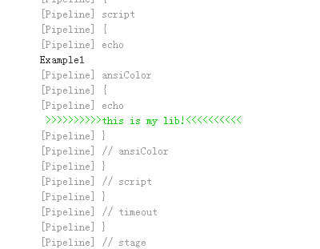

# pipeline是什么

流水线==pipeline

部署流水线通常是指从软件版本控制库到用户手中这一过程的自动化表现形式。

Jenkins 1.x只能通过界面手动操作来描述部署流水线。Jenkins 2.x支持pipeline as code了，可以通过代码来描述部署流水线。

**使用代码而不是UI的意义**

- 更好的版本化：将pipeline提交到软件版本库中进行版本控制。

- 更好的协作：pipeline的每次修改对所有人都是可见的。初次之外，还可以对pipeline进行代码审查。

- 更好的重要性：手动操作没法重用，但是代码可以重用。

# Jenkinsfile是什么

Jenkinsfile是部署流水线概念在Jenkins中的表现形式，就像是Dockerfile之于Docker。所有部署流水线的逻辑都写在Jenkinsfile中。大家一直在说pipeline as code，这个code就是写在一个名为Jenkinsfile的文本文件中。

Jenkins默认不支持Jenkinsfile。需要安装pipeline插件。安装完成后就可以创建pipeline类型的项目了。

在同一个代码项目下可以按需创建多个不同名的Jenkinsfile。

# peieline语法选择

**脚本式：使用Groovy语言，提供了巨大的灵活性和可扩展性。缺点就是复杂，学习成本高。**

node为根节点的是脚本式语法：

```GROOVY
node {
	stage('Build') {
		//build
	}
	stage('Test') {
		//test
	}
	stage('Deploy') {
		try{
			//deploy
		}catch(err){
			currentBuild.result = "FAILURE"
			mail body: "project build error is here:${env.BUILD_URL}",
			from: xxxx@yyyy.com,
			replyTo: yyyy@yyyy.com,
			subject: project build failed,
			to: zzzz@yyyy.com
			throw err
		}
	}
}
```

**声明式：2.5版本的piepline插件才支持。提供了更简单、更结构化的语法。**

pipeline为根节点的是声明式语法：

```GROOVY
pipeline {
	agent any
	stages {
		stage('Build') {
			steps {
				echo 'Building...'
			}
		}
		stage('Test') {
			steps {
				echo 'Testing...'
			}
		}
		stage('Deploy') {
			steps {
				echo 'Deploying...'
			}
		}
	}
}
```

# pipeline语法

## Groovy知识

Groovy同时支持静态类型和动态类型，但是在定义变量的时候，在Groovy中我们习惯使用def关键字，比如`def X="abc"、def y=1`。

和java不一样，Groovy语句最后的分号不是必需的。

Groovy中的方法表用可以省略括号，比如`System.out.println "Hello world"`

支持命名参数，比如：

```groovy
def createName（String giveName, String familyName){
	return giveName + "" + familyName
}
//调用时可以
createName familyName = "Lee", giveName = "Bruce"
```

支持默认参数值，比如：

```groovy
def sayHello(string name = "humans"){
    return "hello ${name}"
}
sayHello() //此时括号不能省略
```

支持单引号、双引号。双引号支持插值，单引号不支持。比如：

```GROOVY
def name = 'world'
print "hello ${name}" //结果：hello world
print 'hello ${name}' //结果：hello ${name}
```

支持三引号。三引号分为三单引号和三双引号。它们都支持换行，区别在于只有三双引号支持插值。比如：

```GROOVY
def name = 'world'
def aString = '''line one
line two
line three
${name}
'''

def bString = """line one
line two
line three
${name}
"""
```

支持闭包，定义方法如下：

```GROOVY
// 定义闭包
def codeBlock = {print "hello closure"}
// 闭包还可以直接被当成函数调用
codeBlock() // 结果打印：hello closure
```

还可以将闭包看做一个参数传递给另一个方法

```groovy
// 定义一个pipeline函数，它接受一个闭包参数
def pipeline(closure){
	closure()
}
// 在调用pipeline函数时，可以这样
pipeline(codeBlock)
// 如果把闭包定义的语句去掉
pipeline({print "hello closure"})
// 由于括号是非必需的，所以
pipeline {
    print "hello closure"
}
```

闭包的另类用法

```groovy
// 在正常情况下，我们这样使用stage函数
stage("stage name", {println "closure"})
//最终打印
/**
stage name
closure
**/
// 但是，Groovy提供了另一种写法
stage("stage name"){
    print "closure"
}
```

## pipeline的语法

Jenkins pipeline是基于Groovy语言实现的一种DSL（Domain-Specific-Language），用于描述整条流水线是如何进行的。流水线的内容包括：执行编译、打包、测试、输出测试报告等步骤。

### 最简结构

从软件版本控制库到用户手中这一过程可以分为多个阶段，每个阶段只专注处理一件事情，而这件事情有可能是通过多个步骤完成。

```GROOVY
pipeline {
    agent any
    stages {
        stage('build') {
            steps {
                echo "hello world"
            }
        }
    }
}
```

pipeline：代表整条流水线（声明式），包含整条流水线逻辑。

agent：流水线的执行位置（在哪台机器上）。

stages：流水线中多个stage的容器。至少要包含一个stage。

stage：流水线的阶段，每个阶段必须有名称。

- echo和sh都是Jenkins pipeline内置的大量步骤中的两个。
- 适配了Jenkins pipeline的插件列表：https://github.com/jenkinsci/pipeline-plugin/blob/master/COMPATIBILITY.md
- pipeline步骤参考文档：https://jenkins.io/doc/pipeline/steps/

steps：代表阶段中一个或多个具体steps的容器。至少要包含一个步骤，上面那个示例中，echo就是一个步骤。

以上每一个部分都是必须的，少一个都会报错。

### pipeline

```groovy
pipeline {
    //run
}
```

在声明式Pipeline中的基本语句和表达式遵循Groovy的语法。但是有以下例外：

- 流水线顶层必须是一个块，特别是pipeline{}。
- 不需要分号作为分割符，是按照行分割的。
- 语句块只能由阶段、指令、步骤、赋值语句组成。例如：input被视为input()。

### agent

支持的参数

- any 在任何可用的节点上执行pipeline。
- none 没有指定agent的时候默认。
- label 在指定标签上的节点上运行Pipeline。
- node 允许额外的选项。

这两种是一样的：

```groovy
agent { node { label 'labelname' }}
aget { label ' labelname '}
```

处于功能性的考虑（可以增加额外参数）建议使用下面这种语法：

```GROOVY
String workspace = "/opt/jenkins/workspace"
pipeline {
    agent {
        node {
            label "master"
            customWorkspace "${workspace}"
        }
    }
}
```

### post部分

post部分包含的是在整个pipeline或stage完成后的一些附加步骤。这些步骤根据流水线或阶段的完成情况而运行（取决于流水线中post部分的位置）。post支持以下条件块中的其中之一，根据pipeline或阶段的完成状态，post分为多种条件块，包括：

- always：无论流水线或阶段的完成状态是什么都执行。
- changed：只有当流水线或阶段的完成状态与之前（上次构建）不同时执行。
- aborted：只有当流水线或阶段状态为aborted（例如：手动取消）时运行。
- failure：只有当流水线或阶段状态为failure时运行。
- success：只有当流水线或阶段状态为success时运行。
- unstable：只有当流水线或阶段状态为unstable（例如：测试失败）是运行。
- fixed：上一次流水线或阶段状态为failure或unstable，且当前流水线或阶段状态为success时执行。
- regression：上一次流水线或阶段状态为success，且当前完成状态为failure、unstable或aborted时执行。
- cleanup：清理条件块。不论当前完成状态是什么，在其他所有条件块执行完成后都执行。

示例：

```GROOVY
pipeline {
    agent any
    stages {
        stage()'build') {
            steps {
                echo "build stage"
            }
            post {
                always {
                    echo "stage post always"
                }
            }
        }
    }
    post {
        changed {
            echo "pipeline post changed"
        }
        always {
            echo "pipeline post always"
        }
        success {
            echo "pipeline post success"
        }
        // 省略其他条件块
    }
}
```

实际执行时Console输出如下：

可以看出来，如果同时匹配post条件块中的多个条件，那这多个条件都会执行。

```
Started by user jenkins
Running in Durability level: MAX_SURVIVABILITY
[Pipeline] Start of Pipeline
[Pipeline] node
Running on Jenkins in /opt/jenkins/workspace/1111
[Pipeline] {
[Pipeline] stage
[Pipeline] { (build)
[Pipeline] echo
build stage
Post stage
[Pipeline] echo
stage post always
[Pipeline] }
[Pipeline] // stage
[Pipeline] stage
[Pipeline] { (Declarative: Post Actions)
[Pipeline] echo
pipeline post always	##匹配了always
[Pipeline] echo
pipeline post success	##又匹配了success
[Pipeline] }
[Pipeline] // stage
[Pipeline] }
[Pipeline] // node
[Pipeline] End of Pipeline
Finished: SUCCESS
```

### stages

包含一系列一个或多个 stage 指令, 建议 stages 至少包含一个 stage 指令用于连续交付过程的每个离散部分,比如构建, 测试, 和部署。

```GROOVY
pipeline {
    agent any
    stages { 
        stage('Example1') {
            steps {
                echo 'Hello World1'
            }
        }
        stage('Example2') {
            steps {
                echo 'Hello World2'
            }
        }
    }
}
```

### steps

step是每个阶段中要执行的每个步骤。每个阶段中只允许有一个steps。

tips：将post放在steps下面就代表这个post工作在stage阶段。

```GROOVY
pipeline {
    agent any
    stages {
        stage('Example') {
            steps { 
                echo 'Hello World'
            }
        }
    }
}
```

### script

script步骤需要[scripted-pipeline]块并在声明式流水线中执行。对于大多数用例来说，声明式流水线中的“脚本”步骤是不必要的，但是它可以提供一个有用的”逃生出口”。

```GROOVY
pipeline {
    agent any
    stages {
        stage('Example') {
            steps {
                echo 'Hello World'

                script {
                    def browsers = ['chrome', 'firefox']
                    for (int i = 0; i < browsers.size(); ++i) {
                        echo "Testing the ${browsers[i]} browser"
                    }
                }
            }
        }
    }
}
```

### 指令

#### environment

environment 指令指定一个键值对序列，该序列将被定义为所有步骤的环境变量，或者是特定于阶段的步骤，这取决于 environment 指令在流水线内的位置。

该指令支持一个特殊的方法 credentials() ，该方法可用于在Jenkins环境中通过标识符访问预定义的凭证。对于类型为 “Secret Text”的凭证, credentials() 将确保指定的环境变量包含秘密文本内容。对于类型为 “SStandard username and password”的凭证, 指定的环境变量指定为 username:password ，并且两个额外的环境变量将被自动定义 :分别为 MYVARNAME_USR 和 MYVARNAME_PSW 。

```GROOVY
pipeline {
    agent any
    environment { 
        CC = 'clang'
    }
    stages {
        stage('Example') {
        //定义了一个环境变量，通过credentials()提取mysql-123123这个密码复制给AN_ACCESS_KEY。mysql-123123是在jenkins凭据中定义的，是凭据的ID
            environment { 
                AN_ACCESS_KEY = credentials('mysql-123123')
            }
            steps {
                sh 'printenv'
            }
        }
    }
}
```

Console输出内容

```bash
Started by user jenkins
Running in Durability level: MAX_SURVIVABILITY
[Pipeline] Start of Pipeline
[Pipeline] node
Running on Jenkins in /opt/jenkins/workspace/1111
[Pipeline] {
[Pipeline] withEnv
[Pipeline] {
[Pipeline] stage
[Pipeline] { (Example)
[Pipeline] withCredentials
Masking supported pattern matches of $AN_ACCESS_KEY
[Pipeline] {
[Pipeline] sh
+ printenv		##执行printenv命令会打印环境变量，下面我截取了一部分环境变量
JENKINS_NODE_COOKIE=0b3550b1-faf6-46f0-a244-0e384a7340cd
AN_ACCESS_KEY=****		##为了安全jenkins将这个变量隐藏了
XDG_SESSION_ID=53744
BUILD_URL=https://jenkins-netadm.leju.com/job/1111/7/
HUDSON_SERVER_COOKIE=78aca6293b2a464f
HISTSIZE=100000
STAGE_NAME=Example
SSH_CLIENT=10.208.98.15 1314 22
BUILD_TAG=jenkins-1111-7
TIME_STYLE=+%Y-%m-%d %H:%M:%S
SSH_TTY=/dev/pts/2
JOB_URL=https://jenkins-netadm.leju.com/job/1111/
WORKSPACE=/opt/jenkins/workspace/1111
RUN_CHANGES_DISPLAY_URL=https://jenkins-netadm.leju.com/job/1111/7/display/redirect?page=changes
HISTFILESIZE=100000
USER=root
JENKINS_HOME=/opt/jenkins
PATH=/usr/local/sbin:/usr/local/bin:/usr/sbin:/usr/bin:/root/bin
MAIL=/var/spool/mail/root
RUN_DISPLAY_URL=https://jenkins-netadm.leju.com/job/1111/7/display/redirect
_=/usr/bin/printenv
PWD=/opt/jenkins/workspace/1111
JAVA_HOME=/usr/java/jdk1.8.0_191-amd64
HUDSON_URL=https://jenkins-netadm.leju.com/
LANG=en_US.UTF-8
PAHT=/usr/java/jdk1.8.0_191-amd64:/bin:/usr/java/jdk1.8.0_191-amd64/jre/bin:/usr/local/sbin:/usr/local/bin:/usr/sbin:/usr/bin
JOB_NAME=1111
BUILD_DISPLAY_NAME=#7
JENKINS_URL=https://jenkins-netadm.leju.com/
BUILD_ID=7
HISTCONTROL=ignoredups
JOB_BASE_NAME=1111
SHLVL=3
EXECUTOR_NUMBER=1
JENKINS_SERVER_COOKIE=durable-509310558f3a0b070b26314afd019817
NODE_LABELS=master
LOGNAME=root
HUDSON_HOME=/opt/jenkins
SSH_CONNECTION=10.208.98.15 1314 10.208.3.24 22
NODE_NAME=master
LESSOPEN=||/usr/bin/lesspipe.sh %s
JOB_DISPLAY_URL=https://jenkins-netadm.leju.com/job/1111/display/redirect
BUILD_NUMBER=7
HUDSON_COOKIE=3671c164-9358-4e5d-b0a3-268671d8fc64
CC=clang
[Pipeline] }
[Pipeline] // withCredentials
[Pipeline] }
[Pipeline] // stage
[Pipeline] }
[Pipeline] // withEnv
[Pipeline] }
[Pipeline] // node
[Pipeline] End of Pipeline
Finished: SUCCESS
```

#### options

options指令允许从流水线内部配置特定于流水线的选项。 流水线提供了许多这样的选项（比如`buildDiscarder`），但有些选项也可以由插件提供（比如timestamps选项就是timestamper插件提供的）。

- buildDiscarder：为最近的流水线运行的特定数量保存组件和控制台输出。
- disableConcurrentBuilds：不允许同时执行流水线。 可被用来防止同时访问共享资源等。
- overrideIndexTriggers：允许覆盖分支索引触发器的默认处理。
- skipDefaultCheckout：在agent 指令中，跳过从源代码控制中检出代码的默认情况。
- skipStagesAfterUnstable：一旦构建状态变得UNSTABLE，跳过该阶段。
- checkoutToSubdirectory：在工作空间的子目录中自动地执行源代码控制检出。
- timeout：设置流水线运行的超时时间, 在此之后，Jenkins将中止流水线。
- retry：在失败时, 重新尝试整个流水线的指定次数。
- timestamps：输出每个步骤的时间戳。

```GROOVY
//指定整个pipeline的执行超时时间为1小时。如果pipeline执行了1小时还没完成就直接终止。
pipeline {
	agent any
	options {
        timestamps()
	    timeout(time: 1, unit: 'HOURS')
        buildDiscarder(logRotator(numToKeepStr: '1'))		//pipeline保持构建的最大个数
	}
	stages {
	    stage('Example') {
	        steps {
	            echo 'Hello World'
        	}
    	}
	}
}
```

#### parameters

为流水线运行时设置项目相关的参数。不管是哪种类型的参数，都支持这三个：

- name：参数名
- defaultValue：默认值
- description：参数的描述信息

string字符串类型的参数, 例如：

```GROOVY
pipeline {
    agent any
	parameters {
        string(name: 'DEPLOY_ENV', defaultValue: 'staging', description: '')
    }
    stages {
        stage("foo") {
            steps {
                echo "ENV: ${params.DEPLOY_ENV}"
            }
        }
    }
}
```

booleanParam布尔参数, 例如：

```GROOVY
parameters {
    booleanParam(name: 'DEBUG_BUILD', defaultValue: true, description: '')
}
```

text多行文本类型（换行使用\n）

```GROOVY
parameters {
    text(name: 'DEPLOY_TEXT', defaultValue: 'One\nTwo\nThree\n', description: '')
}
```

file文件类型

```GROOVY
parameters {
	choice(name: 'CHOICES', choices: 'dev\ntest\nstaging', description: '请选择部署的环境')
}
```

password密码类型

```groovy
parameters {
	password(name: 'PASSWORD', defaultValue: 'SECRET', description: 'A secret password')
}
```

parameters指令中可以同时指定多个参数

```GROOVY
parameters {
    booleanParam(defaultValue: true, description: '', name: 'userFlag')
    string(name: 'DEPLOY_ENV', defaultValue: 'staging', description: '')
    text(name: 'DEPLOY_TEXT', defaultValue: 'One\nTwo\nThree', description: '')
    choice(name: 'CHOICES', choices: 'dev\ntest\nstaging', description: '请选择部署的环境')
    password(name: 'PASSWORD', defaultValue: 'SECRET', description: 'A secret password')
}
```

#### triggers

构建触发器

cron计划任务定期执行构建。

```groovy
pipeline {
	agent any
    triggers {
        cron('H */4 * * 1-5')
    }
    stages {
    	stage('Example') {
        	steps {
            	echo 'Hello World'
        	}
    	}
    }
}
```

pollSCM 与cron定义类似，但是由jenkins定期检测源码变化。

```GROOVY
triggers { pollSCM('H */4 * * 1-5') }
```

upstream 接受逗号分隔的工作字符串和阈值。 当字符串中的任何作业以最小阈值结束时，当前流水线被触发。

```GROOVY
triggers { upstream(upstreamProjects: 'job1,job2', threshold: hudson.model.Result.SUCCESS) }
```

#### tools

获取通过自动安装或手动放置工具的环境变量。支持maven/jdk/gradle。工具的名称必须在系统设置->全局工具配置中定义。

建议手动安装，然后将工具的路径写到全局工具配置中。

```GROOVY
pipeline {
    agent any
    tools {
        maven 'apache-maven-3.0.1' 			
    }	//左侧的工具类型名必须是在Manage Jenkins → Global Tool Configuration中存在的，比如想支持npm就需要安装nodejs插件，想支持ant就安装ant插件。这个名字必须全是小写。
    stages {
        stage('Example') {
            steps {
                sh 'mvn --version'
            }
        }
    }
}
#######################################
pipeline {
    agent any
    stages {
        stage('Example') {
            steps {
                script {
                    mavenHome = tool 'apache-maven-3.0.1' 
                	sh '${mavenHome}/bin/mvn --version'
                }
            }
        }
    }
}
```

#### input

input用户在执行各个阶段的时候，由人工确认是否继续进行。

- message 呈现给用户的提示信息。
- id 可选，默认为stage名称。
- ok 默认表单上的ok文本。
- submitter 可选的,以逗号分隔的用户列表或允许提交的外部组名。默认允许任何用户。
- submitterParameter 环境变量的可选名称。如果存在，用`submitter`的值名称设置。
- parameters 提示提交者提供的一个可选的参数列表。

```GROOVY
pipeline {
    agent any
    stages {
        stage('Example') {
            input {
                message "Should we continue?"
                ok "Yes, we should."
                submitter "alice,bob"
                parameters {
                    string(name: 'PERSON', defaultValue: 'Mr Jenkins', description: 'Who should I say hello to?')
                }
            }
            steps {
                echo "Hello, ${PERSON}, nice to meet you."
            }
        }
    }
}
```

#### when

when 指令允许流水线根据给定的条件决定是否应该执行阶段。 when 指令必须包含至少一个条件。 如果`when` 指令包含多个条件, 所有的子条件必须返回True，阶段才能执行。 这与子条件在allOf条件下嵌套的情况相同。

**内置条件如下：**

branch: 当正在构建的分支与模式给定的分支匹配时，执行这个阶段,这只适用于多分支流水线例如:

```GROOVY
When { branch 'master' }
```

environment：如果环境变量的值与指定的值相同，则执行

```GROOVY
when { environment name: 'DEPLOY_TO', value: 'production' }
```

equals：如果期望值与给定值相同，则执行

```GROOVY
when { equals expected: 2, actual: currentBuild.number }
```

expression：如果Groovy表达式返回的是true，则执行。当表达式返回的是字符串时，它必须转换成布尔类型或null；否则，所有的字符串都被当做true处理。

```GROOVY
when { expression { return params.DEBUG_BUILD } }
```


not：当嵌套条件是错误时，执行这个阶段,必须包含一个条件，例如:

```groovy
when { not { branch 'master' } }
```

buildingTag：如果pipeline所执行的代码都被打了tag，则执行

```GROOVY
when { buildingTag() }
```

tag：如果pipeline所执行的代码被打了tag，且tag名称符合规则；如果tag参数为空tag()，则表示不论tag名称是什么都执行，与buildingTag的效果相同

```GROOVY
when { buildingTag() }
```

tag条件还支持comparator参数，支持的值如下：

- EQUALS：简单的文本比较
- GLOB（默认值）：Ant风格路径表达式。因为是默认值，所以使用时一般省略
- REGEXP：正则表达式。

```GROOVY
when { tag pattern: "release-3.1", comparator: "EQUALS" }
######################################################
when { tag pattern: "release-*", comparator: "GLOB" }
######################################################
when { tag pattern: "release-\\d+", comparator: "REGEXP" }
```

allOf：所有条件都必须符合。下列表示当前分支为master且环境变量DEPLOY_TO的值为production时，才符合条件。多个条件之前使用分号间隔

```GROOVY
when { allOf { branch 'master'; environment name: 'DEPLOY_TO', value: 'production' } }
```

anyOf：其中一个条件为true就符合。下列表示master分支或staging分支都符合条件。

```groovy
when { anyOf { branch 'master'; branch 'staging' } }
```

changelog：如果版本控制库的changelog符合正则表达式，则执行

changeset：如果版本控制库的变更集合包含一个或多个文件符合指定的Ant风格路径表达式，则执行。

**beforeAgent选项**

默认情况下，如果定义了某个阶段的agent，则在进入该阶段的agent之后将对其进行评估。但是，可以通过在when块中指定beforeAgent选项来更改此选项。如果beforeAgent被设置为true，那么将首先对when条件进行评估，只有在条件计算为true时才会输入agent。

**示例**

```GROOVY
pipeline {
    agent any
    stages {
        stage('Example Build') {
            steps {
                echo 'Hello World'
            }
        }
        stage('Example Deploy') {
            when {
                branch 'production'
            }
            steps {
                echo 'Deploying'
            }
        }
    }
}
########################################################################################
pipeline {
    agent any
    stages {
        stage('Example Build') {
            steps {
                echo 'Hello World'
            }
        }
        stage('Example Deploy') {
            when {			//这其实就等于allOf了
                branch 'production'
                environment name: 'DEPLOY_TO', value: 'production'
            }
            steps {
                echo 'Deploying'
            }
        }
    }
}
########################################################################################
pipeline {
    agent any
    stages {
        stage('Example Build') {
            steps {
                echo 'Hello World'
            }
        }
        stage('Example Deploy') {
            when {
                allOf {
                    branch 'production'
                    environment name: 'DEPLOY_TO', value: 'production'
                }
            }
            steps {
                echo 'Deploying'
            }
        }
    }
}
########################################################################################
pipeline {
    agent any
    stages {
        stage('Example Build') {
            steps {
                echo 'Hello World'
            }
        }
        stage('Example Deploy') {
            when {
                expression { BRANCH_NAME ==~ /(production|staging)/ }
                anyOf {
                    environment name: 'DEPLOY_TO', value: 'production'
                    environment name: 'DEPLOY_TO', value: 'staging'
                }
            }
            steps {
                echo 'Deploying'
            }
        }
    }
}
########################################################################################
pipeline {
    agent none
    stages {
        stage('Example Build') {
            steps {
                echo 'Hello World'
            }
        }
        stage('Example Deploy') {
            agent {
                label "some-label"
            }
            when {
                beforeAgent true		##当正在构建的分支是production时，才会交给匹配some-label这个标签的agent处理
                branch 'production'
            }
            steps {
                echo 'Deploying'
            }
        }
    }
}
########################################################################################
```

#### parallel

声明式流水线的阶段可以在它们内部声明多个嵌套阶段，它们将并行执行。

 注意：

- 一个阶段必须只有一个 steps 或 parallel的阶段。 

- 嵌套阶段本身不能包含进的parallel阶段，

- 其他的阶段的行为与任何其他stage的parallel的阶段不能包含 agent或 tools`阶段, 因为他们没有相关 steps。

- 另外, 通过添加failFast true到包含parallel的stage中， 当其中一个进程失败时，强制所有的 parallel 阶段都被终止。

```GROOVY
pipeline {
    agent any
    stages {
        stage('Non-Parallel Stage') {
            steps {
                echo 'This stage will be executed first.'
            }
        }
        stage('Parallel Stage') {
            when {
                branch 'master'
            }
            failFast true
            parallel {
                stage('Branch A') {
                    agent {
                        label "for-branch-a"
                    }
                    steps {
                        echo "On Branch A"
                    }
                }
                stage('Branch B') {
                    agent {
                        label "for-branch-b"
                    }
                    steps {
                        echo "On Branch B"
                    }
                }
            }
        }
    }
}
#####################################################################################
pipeline {
    agent none
    stages {
        stage('Test') {
            agent {label "swarm-node-10.208.3.18" }
            steps {
        		parallel (
					jdk8: {
						echo "jdk8 build"
                        sleep(25)
					},
					jdk9: {
						echo "jdk9 build"
                        sleep(25)
					}
                )// end of parallel
            }
        }
    }// end of stages
}// end of pipeline
#####################################################################################
除了parallel stage，单个parallel里的多个step也可以使用并行的方式运行，表面上看并行阶段与并行步骤并没有太大区别。但是它们有一个关键的不同：并行阶段运行在不同的executor上，而并行步骤运行在同一个executor上。
```


## pipeline支持的指令

## pipeline本身

## 在声明式pipeline中使用脚本

在声明式pipeline的steps快中写if-else或者定义一个变量，Jenkins都会报错。也不能直接在steps块中写Groovy代码。

Jenkins pipeline提供了一个script，可以再script中，像写代码一样写pipeline逻辑。

```groovy
pipeline {
    agent any
    stages {
        stage('Test') {
            steps {
                script {
                    def browsers = ['chrome', 'firefox']
                    for (int i = 0; i < browsers.size(); ++i) {
                        echo "Testing the ${browsers[i]} browser"
                    }
                }
            }
        }
    }
}
```

# pipeline内置基础步骤

## 文件目录相关

dir：切换目录

deleteDir：删除当前目录，通常与dir一起使用

```groovy
dir("/var/logs"){
	deleteDir()		//这会把/var/logs目录删除
}
```

fileExists：判断文件是否存在`fileExists("/tmp/a.jar")`，如果参数是相对路径则判断下相对于当前工作目录下，该文件是否存在。结果返回布尔型。

isUnix：判断是否为类UNIX系统，如果是则返回true。

pwd：打印当前目录。他有一个布尔类型的可选参数：tmp，如果tmp为true，则返回与当前工作目录关联的临时目录。

writeFile：将内容写入到指定文件中

- file：文件路径，可以是相对路径或绝对路径
- text：要写入文件的内容
- encoding（可选）：目标文件的标靶，如果留空，则使用系统默认编码。如果写的是Base64，则知行为Base64。

readFile：读取指定文件内容，以文本返回。

- file：路径
- encoding（可选）：读取文件时使用的编码


## 制品相关步骤

stash步骤可以讲一些文件保存起来，以便被同义词够贱的其他步骤或阶段使用。通常stash的文件都是要跨Jenkins node使用的。

unstash步骤是取出之前stash的文件。


## 命令相关步骤

# 环境变量与构建工具

## 环境变量

环境变量可以被看做是pipeline与Jenkins交互的媒介。比如，可以在pipeline中通过BUILD_NUMBER变量知道构建任务的当前构建次数。环境变量分为内置变量和自定义变量。

**Jenkins内置变量**

可以通过env全局变量将内置环境变量暴露出来。方法如下：

```groovy
${envBUILD_BUMBER}
$env.BUILD_BUMBER
$BUILD_BUMBER	//不推荐，因为如果出现变量冲突，比较难排查
```

获取env变量的可用属性列表，可访问：`<jenkins master地址>/pipeline-syntax/globals#env`

列表中，如果变量的描述里带有For a multibranch project，则表示只有多分支项目才会有此变量。

**自定义pipeline变量**

声明式pipeline提供了environment指令来自定义变量。

environment可以在pipeline中定义，这代表变量作用域为整个pipeline。也可以在stage中定义，这代表变量只在该阶段有效。但是通过environment定义的变量都不跨pipeline使用。

如果environment中定义的变量与env中的变量重名，则重名的变量将以environment中定义的为准。所以为了避免冲突，可以在变量名前加上前缀。

```groovy
[10.208.3.24 root@test-6:~/testapp1-maven1]# cat Jenkinsfile
pipeline {
	agent { label "slave-10.208.3.19" }
	environment {
		project_dir = "${env.WORKSPACE}"
		project_name = "${env.JOB_NAME}"
	}

	tools {
		maven 'mvn-3.6.3'
	}

	stages {
		stage('Build') {
		steps {
			sh "mvn clean package"
		}
		post {
			success {
				sh '''
					tm=`date +%Y%m%d%H%M%S`
					if ! [ -e "/tmp/$project_name" ] ; then mkdir /tmp/$project_name/ ; fi
					cp -r $project_dir /tmp/$project_name/$tm
				'''
				script {
					deleteDir()
				}
			}
		}
		}
	}
}
```

**自定义全局环境变量**

自定义全局变量会被加入到env属性列表中，他的使用方法与内置变量无异。

进入Manage Jenkins--Configure System--Global properties，勾选Environment variables。然后点击add按键，并在输入框中输入变量名和变量值。


## 构建工具

Jenkins只负责执行构建工具提供的命令，本省没有实现任何构建功能，但是它提供了工具的自动安装功能。

tools指令

它能帮助我们自动下载并安装所指定的构建工具，并将其将入到PATH变量中。这样我们就可以直接在sh步骤中使用了。但是在agent none的情况下不会生效。

tools默认支持3中工具，JDK、Maven、Grade。通过安装插件，tools指令还可以支持更多工具。

**Maven**

[自动安装Maven的示例](#pipeline示例：使用Maven构建Java应用)

**利用环境变量支持更多构建工具**

```GROOVY
pipeline {
    agent any
    environment {
        PATH = '/usr/lib/customtool/bin:$PATH'
    }
    stages {
        state('build') {
            steps {
                sh "customtool build"
            }
        }
    }
}
```

**利用tools作用域实现多版本编译**

实际工作中，有时候需要对同一份源码使用多个版本的编译器进行编译。tools指令除了支持pipeline作用域，还支持stage作用域。所以我们可以在同一个pipeline中实现多版本编译。代码如下：

```GROOVY
pipelin {
    agent any
    stages{
        stage("build with jdk-10.0.2"){
            tools {
                jdk "jdk-10.0.2"
            }
            steps{
                sh "printenv"
            }
        }
        stage("build with jdk-9.0.4"){
            tools {
                jdk "jdk-9.0.4"
            }
            steps{
                sh "printenv"
            }
        }
    }
}
```

在打印出来的日志中，会发现每个stage下的JAVA_HOME变量的值都不一样。

# 创建pipeline项目的两种方式

安装pipeline插件后，可以创建pipeline类型的项目。

点击New Item，选择Pipeline


## 在web界面手动输入pipeline内容

创建流水线类型的项目，在Jenkins界面手动输入pipeline内容

不推荐手动输入pipeline内容，因为这样无法做到pipeline的版本化


## 从版本控制库中拉取pipeline

首先要在Jenkins上安装Git插件

**配置凭据**

因为要使用SSH方式拉取代码，所以需要将Jenkins服务器的公钥放到Git仓库中，然后将Jenkins服务器的私钥输入到Jenkins系统中。也可以直接将Git服务器的私钥放到Jenkins中。

方法是：进入Jenkins--Credentials--System--Global credentials，然后根据说明输入私钥


已经准备好了一个Gitlab中的项目，项目中只有一个Jenkinsfile文件，内容就是echo一个Hello World

```BASH
[10.208.3.24 root@test-6:~/testapp1]# ll 
total 4
-rw-r--r-- 1 root root 134 2020-04-24 22:25:16 Jenkinsfile
[10.208.3.24 root@test-6:~/testapp1]# cat Jenkinsfile 
pipeline {
   agent any

   stages {
      stage('Build') {
         steps {
            echo 'Hello World'
         }
      }
   }
}
```

**更改pipeline设置**

这会从SCM中下载pipeline，Credential就是用户拉取代码的凭据（公钥在Git服务器），Script Path就是pipeline的文件名。


执行这个pipeline，Console中也会显示出git clone的过程。

# pipeline示例：使用Maven构建Java应用

Maven是非常流行的一个Java应用构建工具。

**安装Maven**

在Jenkins上安装Maven：可以选在登录Jenkins服务器手动安装，然后在Jenkins中指定Maven的位置；也可以让Jenkins自动安装。

后者的安装方法：进入Manage Jenkins--Global Tool Configuration--Maven


对于安装JDK也是一样的两种方式，如果选择自动安装JDK，还额外需要输入Oracle的用户名和密码才行。

**在本地构建一个Maven项目**

仓库中项目的目录结构如下，源代码是克隆[jackson2-api-plugin](https://github.com/jenkinsci/jackson2-api-plugin)而来的，只更改了Jenkinsfile的内容

```BASH
[10.208.3.24 root@test-6:~/testapp1]# tree -L 1 ./
./
├── CHANGELOG.md
├── Jenkinsfile
├── LICENSE.txt
├── pom.xml
├── README.md
└── src
```

**Jenkinsfile内容如下**

当Jenkins执行到Tools时，就会根据Maven的设置自动下载指定版本的Maven并安装。tools是pipeline中的一个指令，用于自动安装工具，同时将其路径放到PATH变量中。通过命令sh “printenv”，可以看到tools将MAVEN_HOME放到了当前任务环变量中。

```BASH
[10.208.3.24 root@test-6:~/testapp1]# cat Jenkinsfile 
pipeline {
   agent any
   tools {
      maven 'mvn-3.6.3'
   }
   stages {
      stage('Build') {
         steps {
         	sh "printenv"
		    sh "mvn clean package"
         }
      }
   }
}
```

**开始构建**

点击build之后，在Jenkins的执行日志中，可以看到Maven被下载和安装，然后mvn打包的过程


# JenkinsShareLibrary

src目录（必须）类似于标准Java源目录结构，放的是类。执行流水线时，此目录将添加到此类路径中。

vars目录托管脚本文件，放的是变量，这些脚本文件在管道中作为变量公开。

resources目录（用得少一些）允许libraryResource从外部库中使用步骤来加载相关联的非Groovy文件。


package 的作用就是 c++ 的 namespace 的作用，防止名字相同的类产生冲突。Java 编译器在编译时，直接根据 package 指定的信息直接将生成的 class 文件生成到对应目录下。如 package aaa.bbb.ccc 编译器就将该 .java 文件下的各个类生成到 ./aaa/bbb/ccc/ 这个目录。


这是全局的不用写package


Manage Jenkins--Configure System找到GlobalPipeline Libraries


在GitHub的项目中上创建一个Jenkinsfile文件

> 等号前面是要实例化的对象，new是实例化的意思，new后面是类方法的路径

```GROOVY
@Library('jenkinslib')		//加载jenkinslib库，这个库就是GlobalPipeline Libraries定义的
def tools = new org.devops.tools()    //引用org/devops/tools.groovy这个文件
hello()		//引用的是var/hello.groovy里面的call方法
pipeline {
    agent any
    stages {
        stage('Example1'){
            steps {
                timeout(time:30, unit:"MINUTES"){
                    script{
                        print("Example1")
                        tools.PrintMes("this is my lib!")		//我上面定义了一个tools，tools引用的就是org/devops/tools.groovy文件。
                    }											//此时使用tools.PrintMes就是使用tools.groovy文件里面的printMe
                }
            }
        }
    }
}
```


实际输出

```BASH
Started by user jenkins
Obtained Jenkinsfile from git https://github.com/AllenLTB/jenkinslib.git		##获取Jenkinsfile
Running in Durability level: MAX_SURVIVABILITY
Loading library jenkinslib@master		##因为Jenkins上引用了库，所以需要加载库
Examining AllenLTB/jenkinslib
Attempting to resolve master as a branch
Resolved master as branch master at revision fa2d190355e7af6d97c47aadbdfddc54e19dc1db
using credential github-username_and_password
 > /usr/bin/git rev-parse --is-inside-work-tree # timeout=10
Fetching changes from the remote Git repository
 > /usr/bin/git config remote.origin.url https://github.com/AllenLTB/jenkinslib.git # timeout=10
Fetching without tags
Fetching upstream changes from https://github.com/AllenLTB/jenkinslib.git
 > /usr/bin/git --version # timeout=10
using GIT_ASKPASS to set credentials 
 > /usr/bin/git fetch --no-tags --progress https://github.com/AllenLTB/jenkinslib.git +refs/heads/master:refs/remotes/origin/master # timeout=10
Checking out Revision fa2d190355e7af6d97c47aadbdfddc54e19dc1db (master)
 > /usr/bin/git config core.sparsecheckout # timeout=10
 > /usr/bin/git checkout -f fa2d190355e7af6d97c47aadbdfddc54e19dc1db # timeout=10
Commit message: "Create Jenkinsfile"
 > /usr/bin/git rev-list --no-walk d285b02f504b01537168359300238f08edef3759 # timeout=10
[Pipeline] Start of Pipeline
[Pipeline] node
Running on Jenkins in /opt/jenkins/workspace/1111
[Pipeline] {
[Pipeline] stage
[Pipeline] { (Declarative: Checkout SCM)
[Pipeline] checkout
using credential github-username_and_password
Cloning the remote Git repository
Cloning repository https://github.com/AllenLTB/jenkinslib.git
 > /usr/bin/git init /opt/jenkins/workspace/1111 # timeout=10
Fetching upstream changes from https://github.com/AllenLTB/jenkinslib.git
 > /usr/bin/git --version # timeout=10
using GIT_ASKPASS to set credentials 
 > /usr/bin/git fetch --tags --progress https://github.com/AllenLTB/jenkinslib.git +refs/heads/*:refs/remotes/origin/* # timeout=10
 > /usr/bin/git config remote.origin.url https://github.com/AllenLTB/jenkinslib.git # timeout=10
 > /usr/bin/git config --add remote.origin.fetch +refs/heads/*:refs/remotes/origin/* # timeout=10
 > /usr/bin/git config remote.origin.url https://github.com/AllenLTB/jenkinslib.git # timeout=10
Fetching upstream changes from https://github.com/AllenLTB/jenkinslib.git
using GIT_ASKPASS to set credentials 
 > /usr/bin/git fetch --tags --progress https://github.com/AllenLTB/jenkinslib.git +refs/heads/*:refs/remotes/origin/* # timeout=10
 > /usr/bin/git rev-parse refs/remotes/origin/master^{commit} # timeout=10
 > /usr/bin/git rev-parse refs/remotes/origin/origin/master^{commit} # timeout=10
Checking out Revision fa2d190355e7af6d97c47aadbdfddc54e19dc1db (refs/remotes/origin/master)
 > /usr/bin/git config core.sparsecheckout # timeout=10
 > /usr/bin/git checkout -f fa2d190355e7af6d97c47aadbdfddc54e19dc1db # timeout=10
Commit message: "Create Jenkinsfile"
[Pipeline] }
[Pipeline] // stage
[Pipeline] withEnv
[Pipeline] {
[Pipeline] stage
[Pipeline] { (Example1)
[Pipeline] timeout
Timeout set to expire in 30 min
[Pipeline] {
[Pipeline] script
[Pipeline] {
[Pipeline] echo
Example1
[Pipeline] echo
this is my lib!
[Pipeline] }
[Pipeline] // script
[Pipeline] }
[Pipeline] // timeout
[Pipeline] }
[Pipeline] // stage
[Pipeline] }
[Pipeline] // withEnv
[Pipeline] }
[Pipeline] // node
[Pipeline] End of Pipeline
Finished: SUCCESS
```

**打印有颜色的文件**

更改tools.groovy文件

```GROOVY
[10.208.3.24 root@test-6:~/jenkinslib]# cat src/org/devops/tools.groovy 
package org.devops

def PrintMes(value,color){
	colors = ['red'    :  "\033[40;31m >>>>>>>>>>${value}<<<<<<<<<< \033[0m",
			  'bule'   :  "\033[47;34m >>>>>>>>>>${value}<<<<<<<<<< \033[0m",
			  'green1' :  "\033[32m >>>>>>>>>>${value}<<<<<<<<<< \033[0m",
			  'green2' :  "\033[40;32m >>>>>>>>>>${value}<<<<<<<<<< \033[0m"]
	ansiColor('xterm') {
		println(colors[color])
	}
}
```

更改Jenkinsfile

```GROOVY
[10.208.3.24 root@test-6:~/jenkinslib]# cat Jenkinsfile 
@Library('jenkinslib')		//加载jenkinslib库，这个库就是GlobalPipeline Libraries定义的
def tools = new org.devops.tools()    //引用org/devops/tools.groovy这个文件
hello()		//引用的是var/hello.groovy里面的call方法
pipeline {
    agent any
    stages {
        stage('Example1'){
            steps {
                timeout(time:30, unit:"MINUTES"){
                    script{
                        print("Example1")
                        tools.PrintMes("this is my lib!","green1")		//我上面定义了一个tools，tools引用的就是org/devops/tools.groovy文件。
                    }													//此时使用tools.PrintMes就是使用tools.groovy文件里面的printMe
                }
            }
        }
    }
}
```

效果如下




# Groovy语法

## 下载并安装Groovy解析器


如果在mac上安装后打开，可以输入下面这些命令

- groovyconsole：打开一个可以执行groovy脚本的窗口

- groovysh：进入一个特殊的命令行

在windows系统上安装groovy，会生成两个程序

- groovy console，在cmd中输入groovyconsole也可以打开一个窗口

- groovy shell


执行一个保存好的groovy脚本

```powershell
C:\Users\LTB>groovy C:\Users\LTB\Desktop\test.groovy
Hello World!
```

## Groovy数据类型

### String

**常用方法**

- contains()：是否包含特定内容，包含则返回true，不包含则返回false
- size()、length()：字符串数量大小长度
- toString()：转换成string类型
- indexOf()：元素的索引
- endsWith()：是否以指定字符结尾
- minus()、plus()：去掉、增加字符串
- reverse()：反向排序
- substring(1,2)：字符串的指定索引开始的子字符串
- toUpperCase()、toLowerCase()：字符串大小写转换
- split()：字符串分割，返回列表，默认用空格分隔。如果想使用点"."，方法为`split('\\.')`

**引号**

字符串表示：单引号、双引号、三引号

在groovy中，只有属性才可以直接在命令行中写出。如果是字符则必须使用引号包围，否则可能会看到此类错误`No such property: hello1 for class: ConsoleScript27`。

而双引号和单引号的区别在于，双引号中的变量会被groovy解释，而单引号中的内容会全被当做字符串。

```GROOVY
groovy> name = 'Allen' 
groovy> println("my name is ${name}") 
groovy> println("my name is $name") 
groovy> println('my name is ${name}') 
groovy> println('my name is $name') 

my name is Allen
my name is Allen
my name is ${name}
my name is $name
```

**示例**

```GROOVY
groovy> "devopstestops".contains("ops") 		//判断是否包含ops字符，包含则返回true
Result: true 
groovy> "devopstestops".contains("users") 		//判断是否包含user，不包含则返回false
Result: false 
groovy> "devopstestops".endsWith("ops") 		//判断是否是以ops结尾，是则返回true
Result: true 
groovy> "devopstestops".endsWith("abc") 		//判断是否是以abc结尾，不是则返回false
Result: false 
groovy> "devopstestops".size() 					//返回前面字符串的大小是多少
Result: 13 
groovy> "devopstestops".length() 				//返回前面字符串的长度是多少
Result: 13 
groovy> "devopstestops" + "123" 				//做加法，这表示在前面字符串中的结尾加上后面字符串的内容
Result: devopstestops123 
groovy> "devopstestops" - "123" 				//做减法，这表示从前面字符串中减去后面字符串的内容
Result: devopstestops 
groovy> "devopstestops" - "ops" 				//做减法，这表示从前面字符串中减去后面字符串的内容，从头开始减去，可以看出来减的是第一个ops
Result: devtestops 
groovy> "devopstestops" - "ops" - "ops" 		//做减法，这表示从前面字符串中减去后面字符串的内容，连续减了两次，所以两个ops都没了
Result: devtest 
groovy> "devops".toUpperCase() 					//将前面的字符串转换为大写
Result: DEVOPS 
groovy> "DEVOPS".toLowerCase() 					//将前面的字符串转换为小写
Result: devops 
groovy> "host01,host02,host03" 					//在命令行中输入字符串可以直接打印
Result: host01,host02,host03
groovy> "host01-host02-host03".split('-')		//用括号中指定的字符分隔前面的字符串
Result: [host01, host02, host03]
groovy> "host01,host02,host03".split(',')		//用括号中指定的字符分隔前面的字符串
Result: [host01, host02, host03]
#################################################################################
hosts =  "host01,host02,host03".split(',')
for (i in hosts){
    println(i)
}
//下面是执行的结果
host01
host02
host03
```

### list

列表符号：[]

list中的值，-1是倒数第一个（右边第一个），0是正数第一个（左边第一个）

**常用方法**

+ `+  -  +=  -=`：元素的增加与减少
+ add()、<<：添加元素
+ isEmpty()：判断是否为空
+ intersect([2,3])、disjointed([1])：取交集、判断是否有交集
+ flatten()：合并嵌套的列表
+ unique：去重
+ reverse()、sort()：反转、升序
+ count()：元素个数
+ join()：将元素按照参数链接
+ sum()、min()、max()：求和、最小值、最大值
+ contains()：包含特定元素
+ remove(2)、removeAll()
+ each{}：遍历
+ toList()：转换为列表
+ replace("old_value","new_value")

**示例**

```GROOVY
groovy> [1,2,3,4] + 5 				//添加元素
Result: [1, 2, 3, 4, 5]
groovy> [1,2,3,4] << 5 				//添加元素
Result: [1, 2, 3, 4, 5]
groovy> [1,1,2,2,3,3,4,4,5,6,7].unique() 		//去重
Result: [1, 2, 3, 4, 5, 6, 7]
groovy> [1,1,2,2,3,3,4,4,5,6,7].join("^") 		//将元素用^链接
Result: 1^1^2^2^3^3^4^4^5^6^7 
groovy> [1,1,2,2,3,3,4,4,5,6,7].join("-") 		//将元素用-链接
Result: 1-1-2-2-3-3-4-4-5-6-7
groovy> list = (1..3).toList() 		//转换为列表
groovy> println(list)
[1, 2, 3]
groovy> pomVersion = newArtificatUrl.split('/').toList()[-2].replace("SNAPSHOT","RELEASE")
#################################################################################
[1,1,2,2,3,3].each{ 				//遍历
    println it 
}
1
1
2
2
3
3
Result: [1, 1, 2, 2, 3, 3]
```

### map

表示：[:]

**常用方法**

- size()：map大小
- [key].values()：获取value
- [key].keySet()：获取key的列表
- isEmpty()：是否为空
- containValue()：是否包含指定的value
- each{}：遍历map
- remove('a')

list中没有冒号

```GROOGY
groovy> [1:2][1] 
Result: 2
groovy> [1:2,3:4,5:6] 
Result: [1:2, 3:4, 5:6] 
groovy> [1:2,3:4,5:6].keySet() 
Result: [1, 3, 5] 
groovy> [1:2,3:4,5:6].values()
Result: [2, 4, 6]
groovy> [1:2,3:4,5:6] - [3:4] 
Result: [1:2, 5:6]
groovy> a = [1:2,3:4,5:6].remove(3) ; println(a) 
4
groovy> def test = [aaa:2, bbb:4, ccc:6] 
groovy> println test["aaa"] 
2
```

## 条件语句

### if-else语句

**语法**

```GROOVY
if (condition1) {
    //xxx
} else if (condition2) {
    //xxx
} else {
    //xxx
}
```

**示例**

```GROOVY
buildType = "maven"
if (buildType == "maven"){
    println("This is a maven project!")
} else if (buildType == "gradle"){
    println("This is a gradle project!")
} else {
    println("Project Type Error!")
}
################################################
This is a maven project!		//结果
```

### switch语句

**语法**

```GROOVY
switch("${buildType}") {
    case "xxxx":
    	//xxxx
    	break;
    case "xxxx":
    	//xxxx
    	break;
    case "xxxx":
    	//xxxx
    	break;
}
```

**示例**

```GROOVY
默认情况下，$buildType会对每个case都进行匹配，匹配成功就打印，然后继续向下匹配。下面这个语句打印了两个语句。针对这个问题可以通过在每个case中添加break命令来解决
buildType = "gradle"
switch("${buildType}"){
    case 'maven':
    	println("This is a maven project!")
    ;;
    case 'gradle':
    	println("This is a gradle project!")
    ;;
   	default:
        println("Project Type Error!")
    ;;
}
##########################################################		//下面是结果
This is a gradle project!
Project Type Error!
##########################################################
buildType = "gradle"
switch("${buildType}"){
    case 'maven':
    	println("This is a maven project!")
    	break;
    ;;
    case 'gradle':
    	println("This is a gradle project!")
    	break;
    ;;
   	default:
        println("Project Type Error!")
        break;
    ;;
}
##########################################################//下面是结果
This is a gradle project!
```

### for语法

**语法**

```GROOGY
test = [1,2,3]
for ( i in test ) {
	//xxxx
}
```

**示例**

```GROOGY
langs = ['java','python','groovy']
for ( lang in langs ){
    if (lang == 'java') {
        println("lang error in java")
    }else {
        println("lang is ${lang}")
    }
}
```

### while语法

**语法**

```GROOGY
while(true) {
	//xxxx
}
```

**示例**

```GROOVY
n = 1
while(true) {
    println("$n")  
    if (n == 5) {
        println('number is to big')
        break;
    }
    n++
}
####################################
1
2
3
4
5
number is to big
```

## 函数

def定义函数

**语法**

```GROOGY
def xxxxx(value) {
	println(value)
	//xxxx
	return value
}
```

**示例**

```GROOVY
mes1 = 'hello1'
def PrintMes(test){
    println(test)
}
PrintMes(mes1)			//我传给函数的值会被复制给test，然后函数里println会打印test
#######################
hello1
```


```GROOVY
mes1 = 'hello1'
def PrintMes(){
    println("$mes1")
}
PrintMes()
######################
hello1
```

**return的作用**

```GROOVY
mes1 = 'hello1'
def PrintMes(){
    println("$mes1")
}
response = PrintMes()
println(response)
######################
hello1		//println("$mes1")打印的值
null		//response的值为null，这是因为println打印出来的值不等于返回值，返回值需要用return来做
```

更改成下面这个

```GROOVY
mes1 = 'hello1'
def PrintMes(){
    println("$mes1")
    return "$mes1"
}
response = PrintMes()
println(response)
######################
hello1		//println("$mes1")打印的值
hello1
```

## 正则表达式

**示例**

```GROOVY
@NonCPS		//为重复运行这个正则表达式的时候会出现JSON序列化的问题，所以需要加上这个解释器
String getBranch(String branchName) {			//定义了一个方法，方法返回的是String
    def matcher = (branchName =~ "RELEASE-[0-9]{4}")
    if (matcher.find()) {
        newBranchName = matcher[0]		//如果匹配了
    } else {
        newBranchName = "branch"
    }
    newBranchName
}
newBranchName = getBranch(branchName)
println("新分支名 ----> ${newBranchName}")
#################################################
我在Groogy console中执行时：
手工变量branchName = "RELEASE-815229"，运行后得到结果：新分支名 ----> RELEASE-8152
手工变量branchName = "RELEASE-a815229"，运行后得到结果：新分支名 ----> branch
```

# 常用的pipeline DSL方法

### withCredentials

```GROOVY
withCredentials([string(credentialsId: "xxxx", variable: "sonarToken")])	//ID就是凭据的ID，可以在创建的时候指定，如果不指定会自动生成
{
    println(sonarToken)
}
```

### withDockerContaine

pipeline中启动docker镜像运行

```GROOVY
withDockerContainer(args: '-e "http_proxy=xxxxx" -e "https_proxy=yyyyyy" -v "/home/my/workspace:/home/my/workspace"', 
	image: 'myimages:latest')	 {
		sh "cd /home/my/workspace && ls -l"
}
```

### emailext

pipeline中实现邮件发送

```groovy
emailext (
	subject:"标题",
	body:"""
	正文
	""",
	to:"xxxx@126.com"  
)
```

### checkout

示例

这感觉这有点像`git clone -b branch_name url_address`

```groovy
checkout([$class: 'GitSCM', branches: [[name: '*/master']], doGenerateSubmoduleConfigurations: false, extensions: [], submoduleCfg: [], userRemoteConfigs: [[credentialsId: '4eaf63a6-52b2-4d8b-ba14-26322a3135e0', url: 'ssh://git@gitlab-netadm.leju.com:2223/test/testapp1.git']]])
```

- url Type: String
- branch (optional) Type: String
- changelog (optional) Type: boolean
- credentialsId (optional) Type: String
- poll (optional) Type: boolean

可以在Pipeline Syntax中生成


### publishHTML

生成HTML报告

```GROOVY
publishHTML (target: [
    allowMissing: false,
    alwaysLinkToLastBuild: false,
    keepAll: true,
    reportDir: './report/',
    reportFiles: 'manifest.html, report.html',
    reportName: "Summary Report",
    reportTitles: 'HTML'
])
```

### INPUT


### BuildUser

安装插件user build vars。

这个插件定义了一些用来描述构建用户的环境变量

- BUILD_USER：Full name (first name + last name)
- BUILD_USER_FIRST_NAME：First name
- BUILD_USER_LAST_NAME：Last name
- BUILD_USER_ID：Jenkins user ID
- BUILD_USER_EMAIL：Email address

示例

```GROOVY
stage('Hello') {
	steps {
		script {
			echo "123"
			wrap([$class: 'BuildUser']) {
				echo "User is ${env.BUILD_USER}"
				echo "User first name is ${env.BUILD_USER_FIRST_NAME}"
				echo "User last name is ${env.BUILD_USER_LAST_NAME}"
				echo "User id is ${env.BUILD_USER_ID}"
				echo "User email is ${env.BUILD_USER_EMAIL}"
			}
		}
    }      
}
```

最终会打印的消息：

```BASH
User is jenkins
User first name is jenkins
User last name is null
User id is jenkins
User email is jenkins@leju.com
```


### httpRequest

需要安装HTTP Request插件

示例

```groovy
stage('Hello') {
	steps {
		script {
		    def apiurl = 'http://10.208.3.11/ip'
			def response = httpRequest(
			    authentication: 'github-username_and_password',	//如果这个url中开启了bash authentication则需要使用
			    consoleLogResponseBody: true,		//是否在console中显示响应的body。默认情况下只会显示状态码等一些信息。
			    ignoreSslErrors: true,				//是否忽略ssh错误
			    responseHandle: 'NONE',
			    contentType: 'TEXT_PLAIN',			//相应的内容类型
			    url: "${apiurl}",					//请求的URL
			    timeout: 5,							//请求的超时时间
			    quiet: true,						//是否采取静默，如果开启的话console将不会打印httpRequest产生的信息，默认情况下会将一些信息输出到console中。
			    wrapAsMultipart: false)
			println("Status: "+response.status)
            println("Content: "+response.content)
		}
    }      
}
```

最终打印了

```bash
Status: 200
Content: 10.208.3.24
```

### cleanWs()、deleteDir()

删除工作目录

```GROOVY
cleanWs() //删除${WORKSPACE}目录
dir("${env.WORKSPACE}@tmp") { //删除${WORKSPACE}@tmp目录
    deleteDir()
}
dir("${env.WORKSPACE}@script") { //删除@script目录
    deleteDir()
}
dir("${env.WORKSPACE}@script@tmp") { //删除@script@tmp目录
    deleteDir()
}
```

### archiveArtifacts归档文件

构建的hpi存放 WORKSPACE目录 (workspace\target)，存档文件写为`target/*.hpi` ，而且记录指纹信息

```GROOGY
stage('Hello') {
	steps {
    	script {
        	sh "mvn clean install"
        }
    }
    post {
    	success {
        	archiveArtifacts(artifacts: "target/*.hpi", fingerprint: true)
            deleteDir()
        }
    }
}
```

执行后的效果


### Pipeline: Nodes and Processes

#### bat: Windows Batch Script

#### node: Allocate node

#### powershell: PowerShell Script

#### pwsh: PowerShell Core Script

#### sh: Shell Script

- script：执行批量脚本。允许多行。当使用了returnStdout是，可以在此前面加上@，以免命令本身包含在输出中。
  - Type: String
- returnStdout (optional)：将标准输出作为字符串返回，而不是打印到console中（标准错误还是会打印到日志里）。可以在结果的最后加上`.trim()`来删除换行符。
  - Type: boolean
- encoding(optional)：输出的编码集，通常为UTF-8
  - Type: String
- label (optional)：在pipeline step中现实的标签，以及该步骤在blue ocean中详细信息（不指定会显示步骤类型）。
  - Type: String
- returnStatus(optional)：如果使用了此选项，则步骤返回的将是状态码而不是标准输出，从而你可以对比这个值。返回的状态码尾部不会有换行为，所以不用配合，也无法配合`.trim()`。
  - Type: boolean

获取标准输出示例

```GROOVY
//第一种
result = sh returnStdout: true ,script: "<shell command>"
result = result.trim()
//第二种
result = sh(script: "<shell command>", returnStdout: true).trim()
//第三种
sh "<shell command> > commandResult"
result = readFile('commandResult').trim()
```

获取执行状态示例

```GROOVY
result = sh returnStatus: true ,script: "<shell command>"
```

#### ws: Allocate workspace

### Pipeline: Basic Steps

#### error

发出错误信号。可以打断程序执行。比如将它放在if-else中。

支持的参数

- message
  - Type: String

示例

```GROOVY
stage（'check_snapshot'){
    steps {
        script {
        	def exitValue = sh(script: "ls $workspace/business_cas/target/business_cas/WEB-INF/lib |grep 'SNAPSHOT.jar'", returnStatus: true)
    		echo "return exitValue :${exitValue}"
            
    		if(exitValue == 0){
        		error("ERROR：此版本包含SNAPSHOT软件包，不允许使用SNAPSHOT")
    		}
        }
    }
}
```

#### fileExists

校验文件是否存在于workspace中。检查给定文件（作为当前目录的相对路径）是否存在。返回true | false。

支持的参数

- file
  - Type: String

示例

```GROOGY
stage("fileExists") {
	steps{
		script {
			json_file = "${env.WORKSPACE}/testdata/test_json.json"
			if(fileExists(json_file) == true) {
				echo("json file is exists")
			}else {
				error("here haven't find json file")
			}
		}
	}
}
```

#### withEnv

在一个块内设置一个或多个环境变量。这变量可用于该块内产生的任何外部进程。例如：

```GROOVY
node {
  withEnv(['MYTOOL_HOME=/usr/local/mytool']) {
    sh '$MYTOOL_HOME/bin/start'
  }
}
```

设置JENKINS_NODE_COOKIE来让Jenkins不自动杀掉部署过程中的子进程（在pipeline的job中，执行启动tomcat的时候）

在Pipeline运行结束后，Jenkins缺省会kill掉该Pipeline的子进程。因此在pipeline中通过nohup java -jar app.jar > app.log & 的方式启动的java后台进程在Pipeline结束后会被Jenkins杀掉。

在Pipeline中是通过设置JENKINS_NODE_COOKIE来让Jenkins不要kill掉Pipeline后台子进程，而在Freestyle job中是通过设置BUILD_ID。

如果要在一个Pipeline中后台启动多个是script，把多个nohup启动命令放到一个withEnv(['JENKINS_NODE_COOKIE=background_job']) {...}中启动

```GROOVY
withEnv(['JENKINS_NODE_COOKIE=dontkillme']) {
    sh 'sh ${tomcatHome}/bin/startup.sh'
}
```

#### 其他

- catchError: Catch error and set build result to failure
- deleteDir: Recursively delete the current directory from the workspace
- dir: Change current directory
- echo: Print Message
- isUnix: Checks if running on a Unix-like node
- mail: Mail
- pwd: Determine current directory
- readFile: Read file from workspace
- retry: Retry the body up to N times
- sleep: Sleep
- stash: Stash some files to be used later in the build
- step: General Build Step
- timeout: Enforce time limit
- tool: Use a tool from a predefined Tool Installation
- unstable: Set stage result to unstable
- unstash: Restore files previously stashed
- waitUntil: Wait for condition
- warnError: Catch error and set build and stage result to unstable
- wrap: General Build Wrapper
- writeFile: Write file to workspace
- archive: Archive artifacts
- getContext: Get contextual object from internal APIs
- unarchive: Copy archived artifacts into the workspace
- withContext: Use contextual object from internal APIs within a block

### Pipeline Utility Steps

安装插件：Pipeline Utility Steps

https://www.jenkins.io/doc/pipeline/steps/pipeline-utility-steps/

#### readJson

Reads a file in the current working directory or a String as a plain text JSON file. The returned object is a normal Map with String keys or a List of primitives or Map.

支持从文件读取或者从字符串汇总读取JSON数据

JSON数据是这个：

```json
{"branches":[{"name":"master","isMain":true,"type":"LONG","status":{"qualityGateStatus":"OK"},"analysisDate":"2020-05-06T16:59:00+0800"}]}
```

使用这个方法，取出一个OK。

```groovy
def GetProjectStatus(projectName){
    apiUrl = "project_branches/list?project=${projectName}"
    response = HttpReq("GET",apiUrl,'')
    response = readJSON text: """${response.content}"""
    result = response["branches"][0]["status"]["qualityGateStatus"]
    return result
}
```

#### readMavenPom

Reads a [Jar Manifest](https://docs.oracle.com/javase/7/docs/technotes/guides/jar/jar.html#JAR_Manifest) file or text and parses it into a set of Maps. The returned data structure has two properties: `main` for the main attributes, and `entries` containing each individual section (except for main).

pom文件内容是：

```XML
[10.208.3.24 root@test-6:~/simple-java-maven-app]# cat pom.xml
<project xmlns="http://maven.apache.org/POM/4.0.0" xmlns:xsi="http://www.w3.org/2001/XMLSchema-instance"
  xsi:schemaLocation="http://maven.apache.org/POM/4.0.0 http://maven.apache.org/maven-v4_0_0.xsd">
  <modelVersion>4.0.0</modelVersion>
  <groupId>com.mycompany.app</groupId>
  <artifactId>my-app</artifactId>
  <packaging>jar</packaging>
  <version>1.0-SNAPSHOT</version>
  <name>my-app</name>
  <url>http://maven.apache.org</url>
  <dependencies>
    <dependency>
      <groupId>junit</groupId>
      <artifactId>junit</artifactId>
      <version>4.11</version>
      <scope>test</scope>
    </dependency>
  </dependencies>
  <build>
    <plugins>
      <plugin>
        <!-- Build an executable JAR -->
        <groupId>org.apache.maven.plugins</groupId>
        <artifactId>maven-jar-plugin</artifactId>
        <version>3.0.2</version>
        <configuration>
          <archive>
            <manifest>
              <addClasspath>true</addClasspath>
              <classpathPrefix>lib/</classpathPrefix>
              <mainClass>com.mycompany.app.App</mainClass>
            </manifest>
          </archive>
        </configuration>
      </plugin>
    </plugins>
  </build>
</project>
```

groovy是

    def pom = readMavenPom file: 'pom.xml'
    pomVersion = "${pom.version}"
    pomArtifact = "${pom.artifactId}"
    pomPackaging = "${pom.packaging}"
    pomGroupId = "${pom.groupId}"
    println("${pomGroupId}-${pomArtifact}-${pomVersion}-${pomPackaging}")
最终结果是：

```BASH
com.mycompany.app-my-app-1.0-SNAPSHOT-jar
```

#### findFiles

查找在workspace中的文件

findFiles的参数

- glob (optional)
  - Type: String
  - ant分隔的
- excludes (optional)
  - Type: String

示例

```GROOVY
pipeline {
	agent any
	stages {
    	stage('Clone'){
        	steps {
            git branch: 'maven1', credentialsId: '4eaf63a6-52b2-4d8b-ba14-26322a3135e0', url: 'ssh://git@gitlab-netadm.leju.com:2223/test/testapp1.git'
            }
        }
        stage('Hello') {
        	steps {
            	script {
                	def files = findFiles(glob: "**/index.jelly")
                	echo "${files[0].name} ${files[0].path} ${files[0].directory} ${files[0].length} ${files[0].lastModified}"
            	}
            }
        }
    }
}
```

`echo "${files[0].name} ${files[0].path} ${files[0].directory} ${files[0].length} ${files[0].lastModified}"`打印的值是：

`index.jelly src/main/resources/index.jelly false 120 1588343788000`

files[0].path的值是，files变量中的所以0的名字，其实也就是findFiles找到的第一个文件。其他的也是一样。

#### sha1

计算文件的sha1码

示例

```GROOVY
stage('Hello') {
	steps {
    	script {
            files = findFiles(glob: "**/index.jelly")
            def code = sha1 "${files[0].name}"
            println(code)
        }
    }
}
```

#### zip

略，参考官网

#### unzip

略，参考官网

#### touch

略，参考官网

#### readJSON

从当前工作目录的文件或String作为纯文本JSON文件。返回的对象是字具有符串key的常规Map或基元列表或Map。