# Jenkins架构

Jenkins采用的是master+agent架构（有时候也被称为master+slave架构）。Jenkins master负责提供界面、处理HTTP请求及管理构建环境；构建的执行则由Jenkins agent负责（早起agent也被称为slave）。

对于这样的架构，只需要增加agent就可以支持更多的项目同时执行。这种方式被称为Jenkins agent的横向扩展。

Jenkins master的单点故障问题现在并没有什么好的解决方法。

 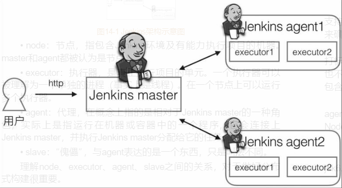

一些术语：

- node：节点，指包括Jenkins环境及有能力执行项目的机器。master和agent都被认为是节点。
- executor：执行器，是真正的执行单元。一个执行器可以被理解为一个单独的进程（实际上线程）。在一个节点上可以运行多个执行器。
- agent：代理，在概念上指的是相对于Jenkins master的一种角色，实际指运行在机器或容器中的一个程序，它会连接上Jenkins master，并执行Jenkins master分配给他的任务。
- slave：傀儡，与agent表达的一个东西，只是叫法不同。

总而言之，executor的概念是相对于node的，没有node也谈不上executor。node通常是指机器（不管是物理机或是虚拟机）。agent有时指一个程序，有时指一种角色（相对于master而言），这决定于上下文。对于slave，可以等同于agent。

# 增加agent

## 标签的意义

当agent数量变多时，如何清除的知道哪些agent支持JDK8，哪些agent支持JDK11。哪些支持Node.js环境？

为了实现这个，需要通过给agent打标签来实现。

通过变量将多个agent分配到同一个逻辑组中。这个过程被称为打标签。一个agent可以有多个标签。标签名中不能包含`!、&、<、>、(、)`这些特殊字符。因为这可能与标签表达式（过滤标签的）冲突。

示例：

对于支持JDK8的agent，打上jdk8标签；多余支持Node.js的agent，打上nodejs标签；如果一个agent同时支持JDK8和Node.js，那么就同时打上两个标签。

## 通过JNLP协议增加agent

Java网络启动协议（JNLP）是一种允许客户端启动托管在远程Web服务器上的应用程序的协议。Jenkins master与agent通过JNLP协议提供通信。Java Web Start（JWS）可以被理解为JNLP协议的一个客户端。

很多文章都说在Manage Jenkins--Global Security--Agents中，开一来开启JNLP服务，截图如下。但是我的Jnekins2.222中找不到这个页面。

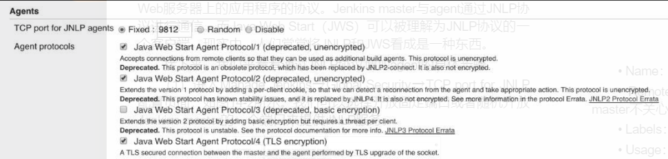

我搜了搜官方文档，看这意思应该是现在改名了

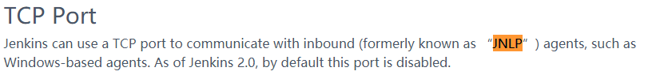

我在Jnekins2.222上找到的是这个，截图如下，仔细对比可以看出来下面的这个选项和上面的最后一个选项描述是一样的。而上面的其它三个选项后面都写着deprecated，可能在我这个版本之前已经被弃用了。

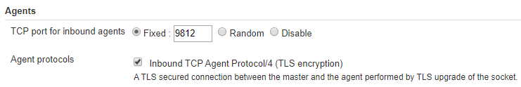

由于随机开发端口不利于自动化，所以选择开放固定端口。子端口用于master与agent之间的通信。

如果不开启这个选项，agent和master之间的流量应该是不加密的。

## 添加permanent agents

在Manage Configure--Manage Nodes and Clouds创建一个新节点

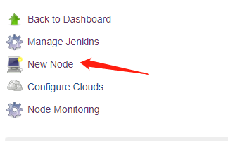

选择Permanagent Agent，输入一个名字

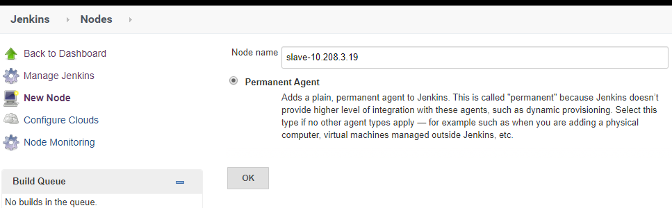

因为接下来要是用SSH在slave上启动agent，所以需要安装此插件


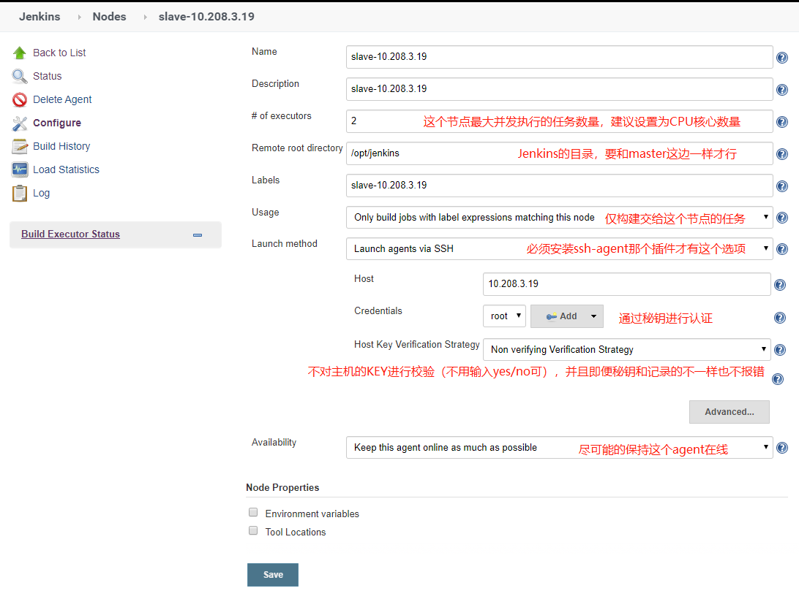

另外需要点开高级，设置JavaPath为/usr/java/jdk1.8.0_191-amd64/jre/bin/java，防止在目标主机上找错了java。默认情况下，连接到slave的时候，默认会找$JENKINS_HOME/jdk/bin/java，如果找不到的话会提示没有这个文件。然后再去根据$PATH找。

如果想让zabbix监控这个agent，那还需要配置JVM Options选项。


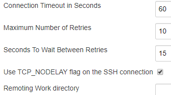

启动slave

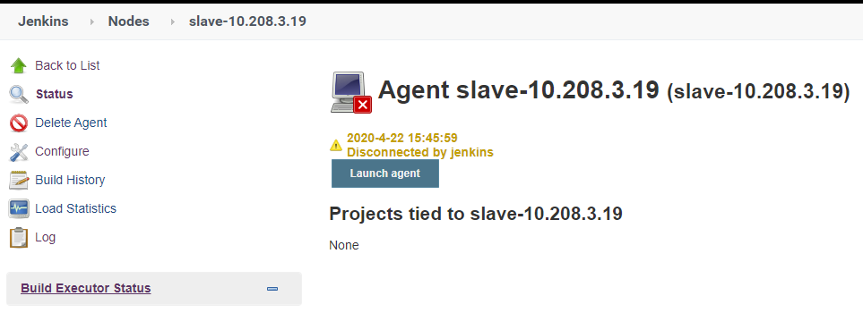

查看日志

```BASH
SSHLauncher{host='10.208.3.19', port=22, credentialsId='4eaf63a6-52b2-4d8b-ba14-26322a3135e0', jvmOptions='', javaPath='/usr/java/jdk1.8.0_191-amd64/jre/bin/java', prefixStartSlaveCmd='', suffixStartSlaveCmd='', launchTimeoutSeconds=60, maxNumRetries=10, retryWaitTime=15, sshHostKeyVerificationStrategy=hudson.plugins.sshslaves.verifiers.NonVerifyingKeyVerificationStrategy, tcpNoDelay=true, trackCredentials=true}
[04/22/20 15:38:29] [SSH] Opening SSH connection to 10.208.3.19:22.
[04/22/20 15:38:29] [SSH] WARNING: SSH Host Keys are not being verified. Man-in-the-middle attacks may be possible against this connection.
[04/22/20 15:38:29] [SSH] Authentication successful.
[04/22/20 15:38:29] [SSH] The remote user's environment is:
BASH=/usr/bin/bash
BASHOPTS=cmdhist:extquote:force_fignore:hostcomplete:interactive_comments:progcomp:promptvars:sourcepath
BASH_ALIASES=()
BASH_ARGC=()
BASH_ARGV=()
BASH_CMDS=()
BASH_EXECUTION_STRING=set
BASH_LINENO=()
BASH_SOURCE=()
BASH_VERSINFO=([0]="4" [1]="2" [2]="46" [3]="2" [4]="release" [5]="x86_64-redhat-linux-gnu")
BASH_VERSION='4.2.46(2)-release'
CLASSPATH=.:/usr/java/jdk1.8.0_191-amd64/lib:/usr/java/jdk1.8.0_191-amd64/jre/lib:/usr/java/jdk1.8.0_191-amd64/lib/tools.jar
DIRSTACK=()
EUID=0
GREP_COLORS='ms=38;5;214;48;5;30'
GREP_OPTIONS=--color=auto
GROUPS=()
HISTFILESIZE=100000
HISTSIZE=100000
HISTTIMEFORMAT='%F %T '
HOME=/root
HOSTNAME=test-2
HOSTTYPE=x86_64
ID=0
IFS=$' \t\n'
JAVA_HOME=/usr/java/jdk1.8.0_191-amd64
JENKINS_HOME=/opt/jenkins
LANG=en_US.UTF-8
LESSOPEN='||/usr/bin/lesspipe.sh %s'
LOGNAME=root
MACHTYPE=x86_64-redhat-linux-gnu
MAIL=/var/mail/root
OPTERR=1
OPTIND=1
OSTYPE=linux-gnu
PAHT=/usr/java/jdk1.8.0_191-amd64:/bin:/usr/java/jdk1.8.0_191-amd64/jre/bin:/usr/local/sbin:/usr/local/bin:/usr/sbin:/usr/bin
PATH=/usr/local/sbin:/usr/local/bin:/usr/sbin:/usr/bin
PIPESTATUS=([0]="0")
PPID=13500
PS1='[\[\e[1;31m\]10.208.3.19\[\e[m\] \[\e[1;32m\]\u\[\e[m\]\[\e[1;33m\]@\[\e[m\]\[\e[1;35m\]\h\[\e[m\]:\w]\$ '
PS4='+ '
PWD=/root
SHELL=/bin/bash
SHELLOPTS=braceexpand:hashall:interactive-comments
SHLVL=1
SSH_CLIENT='10.208.3.24 53954 22'
SSH_CONNECTION='10.208.3.24 53954 10.208.3.19 22'
TERM=dumb
TIME_STYLE='+%Y-%m-%d %H:%M:%S'
UID=0
USER=root
XDG_RUNTIME_DIR=/run/user/0
XDG_SESSION_ID=53262
_=/etc/bashrc
[04/22/20 15:38:29] [SSH] Starting sftp client.
[04/22/20 15:38:29] [SSH] Copying latest remoting.jar...
Source agent hash is 0146753DA5ED62106734D59722B1FA2C. Installed agent hash is 0146753DA5ED62106734D59722B1FA2C
Verified agent jar. No update is necessary.
Expanded the channel window size to 4MB
[04/22/20 15:38:29] [SSH] Starting agent process: cd "/opt/jenkins" && /usr/java/jdk1.8.0_191-amd64/jre/bin/java  -jar remoting.jar -workDir /opt/jenkins -jar-cache /opt/jenkins/remoting/jarCache
Apr 22, 2020 3:38:29 PM org.jenkinsci.remoting.engine.WorkDirManager initializeWorkDir
INFO: Using /opt/jenkins/remoting as a remoting work directory
Apr 22, 2020 3:38:29 PM org.jenkinsci.remoting.engine.WorkDirManager setupLogging
INFO: Both error and output logs will be printed to /opt/jenkins/remoting
<===[JENKINS REMOTING CAPACITY]===>channel started
Remoting version: 4.2
This is a Unix agent
Evacuated stdout
Agent successfully connected and online
```

在slave上看到Jenkins已经启动了，而且/opt/jenkins目录下已经生成了一些文件

```bash
[10.208.3.19 root@test-2:~]# ps aux | grep jav[a]
root      12101  0.0  0.0 113180  1596 ?        Ss   15:21   0:00 bash -c cd "/opt/jenkins" && java  -jar remoting.jar -workDir /opt/jenkins -jar-cache /opt/jenkins/remoting/jarCache
root      12112  7.4  3.5 3566600 144808 ?      Sl   15:21   0:07 java -jar remoting.jar -workDir /opt/jenkins -jar-cache /opt/jenkins/remoting/jarCache
[10.208.3.19 root@test-2:~]# tree -afi /opt/jenkins/
/opt/jenkins
/opt/jenkins/remoting
/opt/jenkins/remoting/jarCache
/opt/jenkins/remoting/jarCache/14
/opt/jenkins/remoting/jarCache/14/0904381276BD2C1FDCD762678FF20E.jar
/opt/jenkins/remoting/jarCache/1A
/opt/jenkins/remoting/jarCache/1A/CDB58409227B1D312F2BB7DC09209C.jar
/opt/jenkins/remoting/jarCache/21
/opt/jenkins/remoting/jarCache/21/06F1EF0FB710683187C98FE4AA61C3.jar
/opt/jenkins/remoting/jarCache/68
/opt/jenkins/remoting/jarCache/68/275882C8D31CAC88CDDAFAD86DA00E.jar
/opt/jenkins/remoting/jarCache/6E
/opt/jenkins/remoting/jarCache/6E/D9515E7C2CC6225B491AAA082AFF86.jar
/opt/jenkins/remoting/jarCache/96
/opt/jenkins/remoting/jarCache/96/455C4416B1DFC9256F9617336C0F7D.jar
/opt/jenkins/remoting/jarCache/9A
/opt/jenkins/remoting/jarCache/9A/6A4B56B50338925829E7BDD00689E7.jar
/opt/jenkins/remoting/jarCache/9E
/opt/jenkins/remoting/jarCache/9E/2AF9045A0E0FBF520FE664585A9E4F.jar
/opt/jenkins/remoting/jarCache/A6
/opt/jenkins/remoting/jarCache/A6/CB95C009758BF0FBB26BB4A3EFBFAF.jar
/opt/jenkins/remoting/jarCache/C3
/opt/jenkins/remoting/jarCache/C3/A0F258782CEED655E52D9CE9936A97.jar
/opt/jenkins/remoting/jarCache/DB
/opt/jenkins/remoting/jarCache/DB/8A4DF2E81A8CAD5CE8FFDC86EB96D0.jar
/opt/jenkins/remoting/jarCache/DD
/opt/jenkins/remoting/jarCache/DD/891A07A8C64C7162B75516CD586859.jar
/opt/jenkins/remoting/jarCache/E9
/opt/jenkins/remoting/jarCache/E9/4E6E66FB804E72A378FEB39C4689CF.jar
/opt/jenkins/remoting/jarCache/F2
/opt/jenkins/remoting/jarCache/F2/84FCC8C54FBFD68EF9E319A863DC13.jar
/opt/jenkins/remoting/jarCache/F3
/opt/jenkins/remoting/jarCache/F3/D242560AF5B707558485E723CB0CCF.jar
/opt/jenkins/remoting/logs
/opt/jenkins/remoting/logs/remoting.log.0
/opt/jenkins/remoting/logs/remoting.log.0.lck
/opt/jenkins/remoting.jar
```

node列表中slave显示In sync，正常了

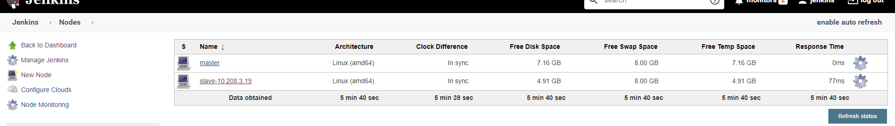

点击Launch agent只有，通过console输出的日志，可以看出来，启动Agent的方式，就是Master连接到Agent，使用`cd "/opt/jenkins" && /usr/java/jdk1.8.0_191-amd64/jre/bin/java  -jar remoting.jar -workDir /opt/jenkins -jar-cache /opt/jenkins/remoting/jarCache`命令启动Agent

我试了试，我自己在命令行这个agent的命令行中使用此命令启动，会有问题。

## 通过Swarm插件增加agent

在Jenkins上安装Swarm插件

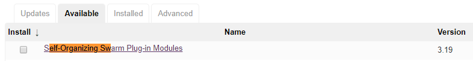

客户端也需要下载Swarm客户端（JDK也需要提前安装好）

https://repo.jenkins-ci.org/releases/org/jenkins-ci/plugins/swarm-client

在客户端上启动

```BASH
[10.208.3.18 root@test-1:~]# mkdir -p /opt/jenkins/swarm-client
[10.208.3.18 root@test-1:~]# export SWARM_PASSWORD=admin123 ; java -jar swarm-client-3.19.jar -username jenkins -passwordEnvVariable SWARM_PASSWORD -master https://jenkins-netadm.leju.com -name swarm-node-10.208.3.18 -disableClientsUniqueId -executors 5 -labels "linux jdk8u212" -mode exclusive -internalDir /opt/jenkins/swarm-client -workDir /opt/jenkins/swarm-client &> /opt/jenkins/swarm-client/run.log &
```

客户端上启动之后，jenkins上就可以看到这个agent

这不是永久的agent，当断开连接之后，jenkins上就看不到这个agent了么（如果没有任务使用这个agent的话）

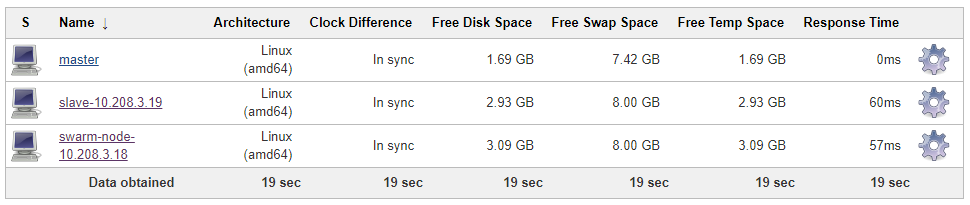

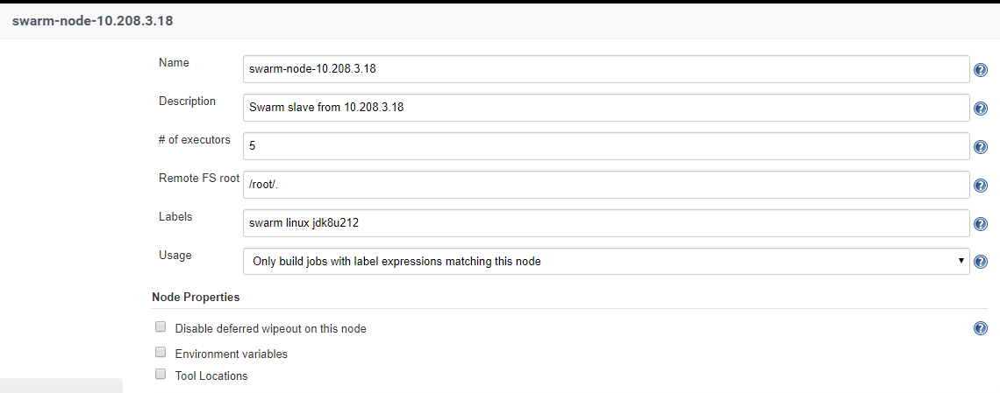

我感觉这种方式有点不稳定，点这个agent，经常出现404，看日志发现每分钟都会重连（后来我又部署了一台机器，就没有这个问题）。而且通过日志也可以看出来，会通过9812进行通信。

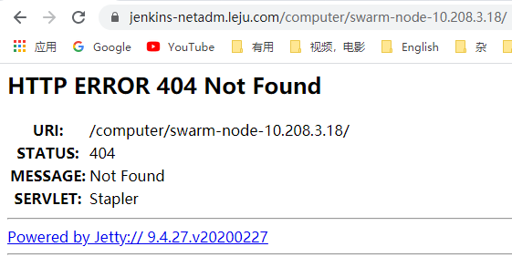

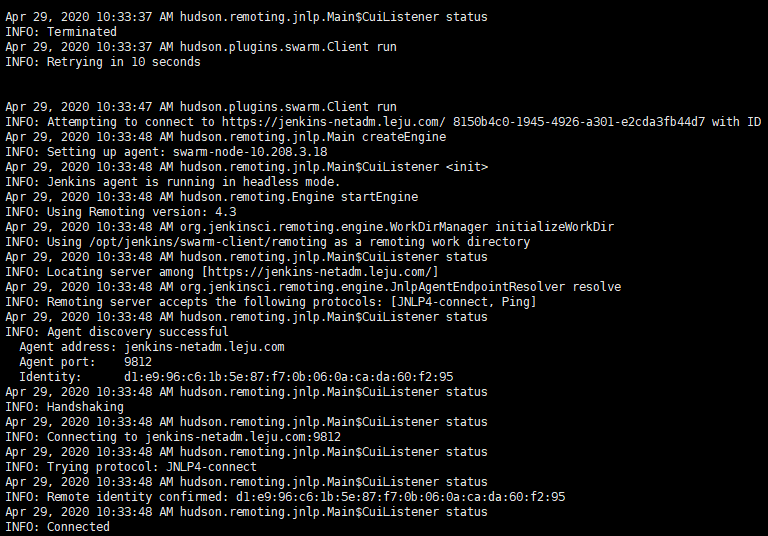

我试了试将TCP port for inbound agents设置为Disable，但之后立即报错了，删了这个Agent重新添加也不行（上面那种permanent agent就没有这个问题）

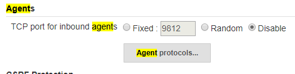

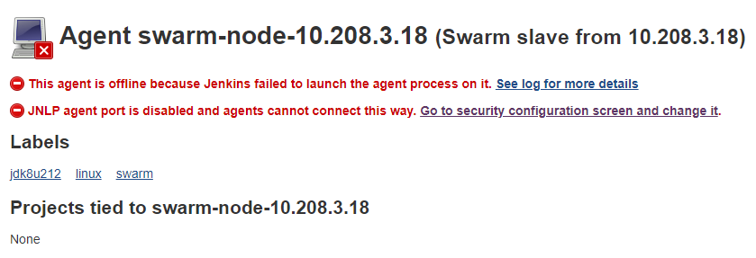

还有一点需要注意：

我这个环境是Jenkins地址为10.208.3.24:8080，它前面有一台代理，地址是10.208.3.11。平常访问都通过jenkins-netadm.leju.com来访问。对于持久agent来说，通过SSH启动Agent，是master直连slave。而通过swarm是客户端连接代理jenkins-netadm.leju.com（对应10.208.3.24:8080），通过交互一些信息之后，知道了需要通过9812接口（JNLP）去连接master。所以他就会连接jenkinsnetadm.leju.com的9812端口。如果没有做好四层代理的话，就有问题了。

# pipeline中使用agent

agent部分描述的是整个pipeline或特定阶段运行任务是在哪个agent。agent部分必须在pipeline块顶层定义，而stage块内的定义是可选的。

如果指定的标签同时可以匹配多个agent，则选一个agent来执行，而不是全部agent都执行。

在pipeline顶部指定agent。指定为any，表示任何可用的agent都可以执行

```GROOVY
pipeline {
    agent any
}
```

将agent放在阶段中，就是指定stage执行时使用的agent

```GROOVY
pipeline {
    agent any
    stages {
        stage('Build') {
            agent linux
            steps {
                echo "build"
            }
        }
    }
}
```

通过标签指定agent，这表示只有拥有这个标签的agent可以执行，以下两种方式都可以，上面这种看起来清晰一些

```GROOVY
pipeline {
    agent {
        label 'jdk8u212'
    }
    stages {
        stage('Build') {
            steps {
                echo "build"
            }
        }
    }
}
###############################################################
###############################################################
pipeline {
    agent {
        node {
            label 'jdk8u212'
        }
    }
    stages {
        stage('Build') {
            steps {
                echo "build"
            }
        }
    }
}
```

通过匹配多个标签的agent主机才可以执行（&&表示与）

```GROOVY
pipeline {
    agent {
        label 'windows && jdk8'
    }
    stages {
        stage('Build') {
            steps {
                echo "build"
            }
        }
    }
}
```

创建agent时，已经配置好了agent的morning工作目录，但是我们也可以在agent部分对目录进行重新定义。这需要使用customWorkspace

```GROOVY
pipeline {
    agent {
        node {
            label 'jdk8u212'
        	customWorspace '/var/lib/custom'
        }
    }
    stages {
        stage('Build') {
            steps {
                echo "build"
            }
        }
    }
}
```

**不分配节点**

agent none就表示不分配全局agent，如果希望每个stage都在指定的agent上运行，那么pipeline中就可以配置为agent none

其实在pipeline顶部配置了agent none后，即便在stage中不指定agent也是可以的。。。。

```GROOVY
pipeline {
    agent none
    stages {
        stage('Build1') {
            agent { label 'mvn1' }
            steps {
                echo "build1"
            }
        }
        stage('Build2') {
            agent { label 'mvn2' }
            steps {
                echo "build2"
            }
        }
    }
}
```

**when指令的beforeAgent选项**

默认情况下，阶段内的所有代码都在指定的agent上执行。当设置beforeAgent为true时，只有符合when条件才会进入该agent，这就避免了不必要的工作空间分配。也就不需要等待可用的jenkins agent了。

多了一层条件，除了满足指定label之外，只有满足是指定branch才会执行。

```GROOVY
pipeline {
    agent none
    stages {
        stage('Example Build') {
            agent {
                label "linux"
            }
            when {
                beforeAgent true
                branch 'development'
            }
            steps {
                echo 'Hellow World'
            }
        }
        stage('Example Deploy') {
            agent {
                label "windows"
            }
            when {
                beforeAgent true
                branch 'production'
            }
            steps {
                echo 'Deploying'
            }
        }
    }
}
```

# 将构建任务交给Docker

## 使用docker的agent

Jenkins master要将构建任务分配给Docker，就必须在Jekins agent上安装docker。

```GROOVY
pipeline {
    agent {
        docker {
            label 'docker'
            image 'maven:3-alpine'
        }
    }
    stages {
        stage('clone') {
            steps {
                git branch: 'maven1', credentialsId: '4eaf63a6-52b2-4d8b-ba14-26322a3135e0', url: 'ssh://git@gitlab-netadm.leju.com:2223/test/testapp1.git'
            }
        }
        stage('build') {
            steps {
                sh 'mvn clean compile'
            }
        }
    }
}
```

docker的常用选项：

- label（可选）：字符串类型，与node的label的作用一样。

- image：字符串类型，指定构建时使用的Docker镜像。

- args（可选）：字符串类型，Jenkins执行docker run命令时所带的参数，比如`args'-v /tmp:/tmp'`

- alwaysPull（可选）：布尔类型，强制每次执行docker pull命令时都重新拉取镜像。

## 配置docker的私有仓库

Manage Jenkins--Configure Syste页面，找到下面这个

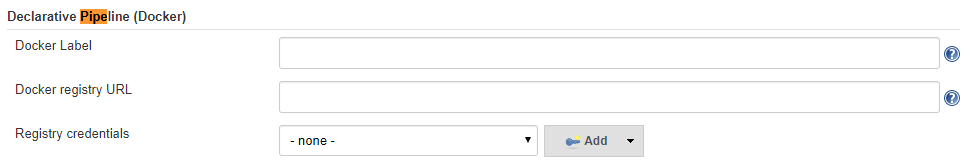

Docker Label：当pipeline中的agent部分美欧指定lable选项时，就会使用此选项。

Docker registry URL：Docker私有仓库地址。

Registry credentials：登录Docker私有仓库的凭据。

# 并行构建

如果有一个需求：分别在Chrome、Firefox、IE等浏览器的各个不同版本对同一个web应用进行UI测试，你该怎么做？

根据之前的只是，可能这样写：

```GROOVY
piepeline {
    agent any
    stages {
        stage('Build') {
            steps {
                echo 'Building..'
            }
        }
        stage('Test on Chrome') {
            steps {
                echo 'Testing..'
            }
        }
        stage('Test on Firfox') {
            steps {
                echo 'Testing..'
            }
        }
    }
}
```

按照上面这些写法，实际上还是按顺序执行。可能整个pipeline执行完需要数个小时。

## Stage级别的并行执行

对于上面那种耗时长，相互不存在依赖的stage可以使用此parallel提升运行效率。

```GROOVY
pipeline {
    agent none
    stages {
        stage('Run Tests') {
            failFast true
            parallel {
                stage('Test On Chrome') {
                    agent {label "chrome" }
                    steps {
                        echo "Chrome UI测试"
                    }
                }
                stage('Test On Firefox') {
                    agent {label "firefox" }
                    steps {
                        echo "Firefox UI测试"
                    }
                stage('Test On IE') {
                    agent {label "ie" }
                    steps {
                        echo "IE UI测试"
                    }
                }
            }// end of parallel
        }// end of run tests
    }// end of stages
}// end of pipeline
```

在stages部分包含的一个Run Tests阶段，Run Test阶段里包含一个parallel块，parallel块里面又包含了多个阶段。位于parallel块里面的阶段都将并行执行，并且并行阶段还可以被分到不通的Jenkins agent上执行。

因为parallel本身不包含任何步骤，所以在parallel块本省不允许包含agent和tools。

默认情况下，Jenkins pipeline要等待parallel块下面的所有阶段都执行完成，才能确定结果。如果希望所有并行阶段中的某个阶段失败后，就让其他正在执行的阶段都停止，那么只需要在于parallel块同级的位置加入failFast true就可以了。

## Step级别的并行执行

除了parallel stage，单个parallel里的多个step也可以使用并行的方式运行

```GROOVY
pipeline {
    agent none
    stages {
        stage('Test') {
            agent {label "swarm-node-10.208.3.18" }
            steps {
        		parallel (
					jdk8: {
						echo "jdk8 build"
                        sleep(25)
					},
					jdk9: {
						echo "jdk9 build"
                        sleep(25)
					}
                )// end of parallel
            }
        }
    }// end of stages
}// end of pipeline
```

## step并行和stage并行的区别

除了写法不同，表面上看并行阶段与并行步骤并没有太大区别。但是它们有一个关键的不同：并行阶段运行在不同的executor上，而并行阶段运行在同一个executor上。

# 一个错误的并行构建pipeline

问题：下面这个pipeline需要执行多长时间？

有人可能会说是75s左右，但是我试了试，pipeline整体执行时间需要100s左右。

```GROOVY
pipeline {
    agent any
    stages {
        stage('Parallel Stage') {
            failFast true
            parallel {
                stage('Branch master') {
                    agent any
                    steps {
                        echo "On Branch master"
                        sleep(25)
                    }
                }
                stage('Branch dev') {
                    agent any
                    steps {
                        echo "On Branch dev"
                        sleep(25)
                    }
                }
                stage('Branch staging') {
                    agent any
                    stages {
                        stage('嵌套staging 1') {
                        	steps {
                            	echo "staging 1"
                                sleep(25)
                        	}
                        }
                        stage('嵌套staging 2') {
                        	steps {
                            	echo "staging 2"
                                sleep(25)
                        	}
                        }
                    }
                }// end of staging
            }// end of parallel
        }
    }
}// end of pipeline
```

实际执行日志

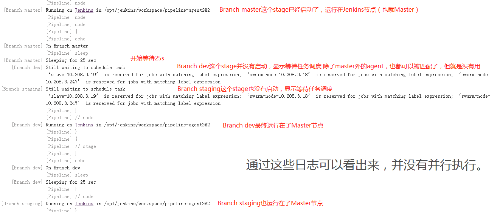

原因：没有明确指定agent是谁。

修改后

```GROOVY
pipeline {
    agent any
    stages {
        stage('Parallel Stage') {
            failFast true
            parallel {
                stage('Branch master') {
                    agent {label "slave-10.208.3.19" }
                    steps {
                        echo "On Branch master"
                        sleep(25)
                    }
                }
                stage('Branch dev') {
                    agent {label "swarm-node-10.208.3.247" }
                    steps {
                        echo "On Branch dev"
                        sleep(25)
                    }
                }
                stage('Branch staging') {
                    agent {label "swarm-node-10.208.3.18" }
                    stages {
                        stage('嵌套staging 1') {
                        	steps {
                            	echo "staging 1"
                                sleep(25)
                        	}
                        }
                        stage('嵌套staging 2') {
                        	steps {
                            	echo "staging 2"
                                sleep(25)
                        	}
                        }
                    }
                }// end of staging
            }// end of parallel
        }
    }
}// end of pipeline
```

