# 什么是参数化pipeline

参数化pipeline是指可以通过传参来决定pipeline的行为。参数化让写pipeline就像写函数，而函数意味着可重用、更抽象。所以，通常使用参数化pipeline来实现一些通用的pipeline。

# 使用parameters指令

在Jenkins pipeline中定义参数使用的是parameters指令，其只允许放到pipeline块下面。

```GROOVY
pipeline {
    agent any
    parameters {
        booleanParam(defaultValue: true, description: '', name: 'userFlag')
    }
    stages {
        stage("foo") {
            steps {
                echo "flag: ${params.userFlag}"
            }
        }
    }
}
```

booleanParam：定义一个布尔类型的参数。它支持三个参数

- defaultValue：默认值
- description：参数的描述信息
- name：参数名

booleanParam的工作过程：被传入的参数被放到一个名为params的对象中，在pipeline中可以被直接使用。而上面这个示例中，params.userFlag就是引用parameters指令中定义的userFlag参数。

注意：新增此pipeline之后，至少要手动执行一次，他才会被Jenkins加载生效。生效后，在执行项目时，就可以使用参数值了。

刚刚保存这个pipeline的时候

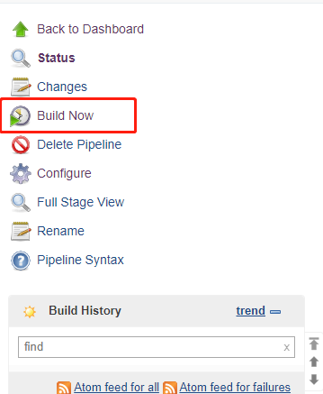

点击Build Now执行，然后刷新页面之后，Build Now就变成了Build with Parameters

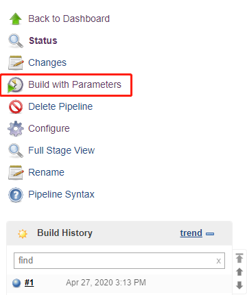

配置中除了之前设置的pipeline，在General中还勾选了This project is parameterized

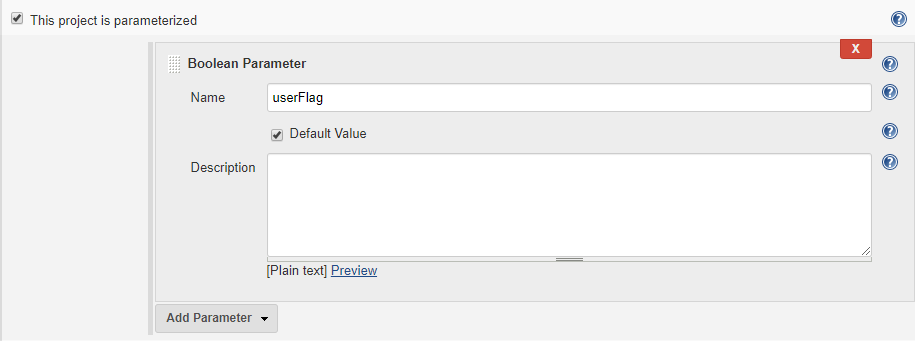

点击Build with Parameter会显示西面这个界面，勾选之后echo输出的就是true，不勾选echo输出的就是false

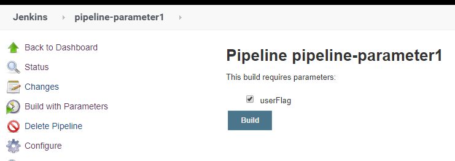

## parameters指令支持的参数类型

string：字符串类型

```GROOVY
parameter {
    string(name: 'DEPLOY_ENV', defaultValue: 'staging', description: '')
}
```

text：多行文本类型，换行使用\n

```GROOVY
parameters {
    text(name: 'DEPLOY_TEXT', defaultValue: 'One\nTwo\nThree\n', description: '')
}
```

bolleanParam：布尔类型，参考上面的示例

choice：选择参数类型，使用\n来分隔多个选项。

```GROOVY
parameters {
	choice(name: 'CHOICES', choices: 'dev\ntest\nstaging', description: '请选择部署的环境')
}
```

file：文件类型，用户可上传文件。看书上说此类型有BUG，参考ISSUE：JENKINS-27413

password：密码类型

```GROOVY
parameters {
	password(name: 'PASSWORD', defaultValue: 'SECRET', description: 'A secret password')
}
```

## 多参数

pipeline同时定义多个参数示例

```GROOVY
pipeline {
    agent any
    parameters {
        booleanParam(defaultValue: true, description: '', name: 'userFlag')
        string(name: 'DEPLOY_ENV', defaultValue: 'staging', description: '')
        text(name: 'DEPLOY_TEXT', defaultValue: 'One\nTwo\nThree', description: '')
        choice(name: 'CHOICES', choices: 'dev\ntest\nstaging', description: '请选择部署的环境')
        password(name: 'PASSWORD', defaultValue: 'SECRET', description: 'A secret password')
    }
    stages {
        stage("foo") {
            steps {
                echo "flag: ${params.userFlag}"
                echo "ENV: ${params.DEPLOY_ENV}"
                echo "TEXT: ${params.DEPLOY_TEXT}"
                echo "CHOICE: ${params.CHOICE}"
                echo "PASSWORD: ${params.PASSWORD}"
            }
        }
    }
}
```

先点击构建，然后jenkins读取pipeline设置。之后再次点击构建是可以看到

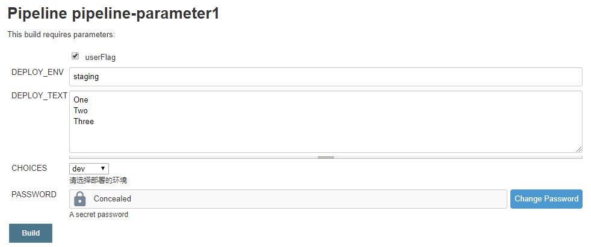

Console输入如下

```BASH
Started by user jenkins
Running in Durability level: MAX_SURVIVABILITY
[Pipeline] Start of Pipeline
[Pipeline] node
Running on Jenkins in /opt/jenkins/workspace/pipeline-parameter1
[Pipeline] {
[Pipeline] stage
[Pipeline] { (foo)
[Pipeline] echo
flag: true
[Pipeline] echo
ENV: staging
[Pipeline] echo
TEXT: One
Two
Three
[Pipeline] echo
CHOICE: dev
[Pipeline] echo
PASSWORD: SECRET
[Pipeline] }
[Pipeline] // stage
[Pipeline] }
[Pipeline] // node
[Pipeline] End of Pipeline
Finished: SUCCESS
```

# 由另一个pipeline传参并触发

Jenkins pipeline中可以使用build步骤实现：“在一个pipeline中调用另一个pipeline”，build步骤是pipeline插件的一个组件，不需要额外安装插件就可以实现。

build步骤也算是一种触发pipeline执行的方式，他与triggers指令中的upstream方式有两个区别：

- build步骤是由上游pipeline使用的，而upstream方式是由下游pipeline使用的。
- build步骤是可以带参数的，而upstream方式是只能被动触发，且无法带参数的。

示例如下：

```GROOVY
pipeline {
    agent any
    stages {
        stage('Pass') {
			steps {
			    build(
			    	job:"pipeline-parameter1",
			    	parameters: [
 			       	booleanParam(name: 'userFlag', value: true),
 			       	string(name: 'DEPLOY_ENV', value: 'staging'),
 			       	text(name: 'DEPLOY_TEXT', value: 'One\nTwo\nThree'),
 			       	string(name: 'CHOICES', value: 'dev'),
   			     	password(name: 'PASSWORD', value: 'SECRET')
 			  		]
				)
			}
    	}
    }
}
```

build支持的参数说明：

- job：必选参数，指定目标Jenkins任务的名称

- parameters：可选参数，数组类型，传入目标pipeline的参数列表。传参方法配置方法与直接在pipeline中使用parameters指令基本一样。这里不支持choice类型，只能使用string类型来代替。

除此之外build还支持其他三个参数可选参数

- propagate：布尔类型，如果值为true，则只有当下游pipeline 的最终构建状态为SUCCESS时，上游pipeline才算成功；如果值为false，则不论下游pipeline的最终构建状态是什么，上游pipeline都忽略。默认值为true。

- quietPeriod：整形，触发下游pipeline后，下游pipeline等待多久后执行。如果不设置此参数，则等待时长由下游pipeline决定，单位是秒。

- wait：布尔类型，是否等待下游pipeline执行完成。默认为true。

我执行上面这个pipeline之后，他会触发pipeline-parameter1，console显示的信息如下：

可以看出来，他出发了pipeline-parameter11的第18此构建

```BASH
Started by user jenkins
Running in Durability level: MAX_SURVIVABILITY
[Pipeline] Start of Pipeline
[Pipeline] node
Running on Jenkins in /opt/jenkins/workspace/pipeline-parameter2
[Pipeline] {
[Pipeline] stage
[Pipeline] { (Pass)
[Pipeline] build (Building pipeline-parameter1)
Scheduling project: pipeline-parameter1
Starting building: pipeline-parameter1 #18
[Pipeline] }
[Pipeline] // stage
[Pipeline] }
[Pipeline] // node
[Pipeline] End of Pipeline
Finished: SUCCESS
```

在pipeline-parameter1的console中显示的信息如下：

这里写明了本次启动是由上游项目是pipeline-parameter2的第5次构建引起的。

```bash
Started by upstream project "pipeline-parameter2" build number 5
originally caused by:
 Started by user jenkins
Running in Durability level: MAX_SURVIVABILITY
[Pipeline] Start of Pipeline
[Pipeline] node
Running on Jenkins in /opt/jenkins/workspace/pipeline-parameter1
[Pipeline] {
[Pipeline] stage
[Pipeline] { (foo)
[Pipeline] echo
flag: true
[Pipeline] echo
ENV: staging
[Pipeline] echo
TEXT: One
Two
Three
[Pipeline] echo
CHOICE: dev
[Pipeline] echo
PASSWORD: SECRET
[Pipeline] }
[Pipeline] // stage
[Pipeline] }
[Pipeline] // node
[Pipeline] End of Pipeline
Finished: SUCCESS
```

# 使用Conditional BuildStep插件处理复杂的判断逻辑

**有些场景要求我们根据传入的参数进行一些逻辑判断。我们可以使用script函数中的if-else方式**

```GROOVY
pipeline {
    agent any
    parameters {
        booleanParam(defaultValue: true, description: '', name: 'userFlag')
        string(name: 'DEPLOY_ENV', defaultValue: 'staging', description: '')
        text(name: 'DEPLOY_TEXT', defaultValue: 'One\nTwo\nThree', description: '')
        choice(name: 'CHOICES', choices: 'dev\ntest\nstaging', description: '请选择部署的环境')
        password(name: 'PASSWORD', defaultValue: 'SECRET', description: 'A secret password')
    }
    stages {
        stage("foo") {
            steps {
                script {
                    if (params.DEPLOY_ENV == 'staging') {
                        echo "flag: ${params.userFlag}"
                        echo "ENV: ${params.DEPLOY_ENV}"
                        echo "TEXT: ${params.DEPLOY_TEXT}"
                        echo "CHOICE: ${params.CHOICES}"
                        echo "PASSWORD: ${params.PASSWORD}"
                    }
                }
            }
        }
    }
}
```

注意：我试了一下，配置成 if (params.userFlag== 'true') {就不可以，我感觉可能是无法对booleanParam类型的参数进行判断吧。

**除此之外，用声明式pipeline中when指令来实现相同的效果，我使用的是equals条件。**

```GROOVY
pipeline {
    agent any
    parameters {
        booleanParam(defaultValue: true, description: '', name: 'userFlag')
        string(name: 'DEPLOY_ENV', defaultValue: 'staging', description: '')
        text(name: 'DEPLOY_TEXT', defaultValue: 'One\nTwo\nThree', description: '')
        choice(name: 'CHOICES', choices: 'dev\ntest\nstaging', description: '请选择部署的环境')
        password(name: 'PASSWORD', defaultValue: 'SECRET', description: 'A secret password')
    }
    stages {
        stage("foo") {
            when {
                equals expected: 'staging', actual: params.DEPLOY_ENV
            }
            steps {
				echo "flag: ${params.userFlag}"
				echo "ENV: ${params.DEPLOY_ENV}"
				echo "TEXT: ${params.DEPLOY_TEXT}"
				echo "CHOICE: ${params.CHOICES}"
				echo "PASSWORD: ${params.PASSWORD}"
            }
        }
    }
}
```

**除了上面的两种方法之外还可以安装Conditional BuildStep，然后像上面使用when语句一样使用判断。**

Conditional BuildStep提供了expression表达式。expression本质上就是一个Groovy代码块，这大大提高了表达式的灵活性。以下是常用的例子：

逻辑或

```GROOVY
stage("foo") {
    when {
    	expression { return params.CHOICES == 'test' || params.DEPLOY_TEXT == 'Two' }
	}
    steps {
        echo "xxx"
    }
}
```

逻辑与

```GROOVY
stage("foo") {
    when {
    	expression { return params.CHOICES == test && params.DEPLOY_TEXT == 'Two' }
	}
    steps {
        echo "xxx"
    }
}
```

从文件中内容然后进行判断（我感觉有点像grep）

```GROOVY
stage("clone") {
	steps {
		git credentialsId: '4eaf63a6-52b2-4d8b-ba14-26322a3135e0', url: 'ssh://git@gitlab-netadm.leju.com:2223/test/testapp1.git'
	}
}
stage("foo") {
    when {
    	expression { return readFile('pom.xml').contains('mycomponent') }
	}
    steps {
        echo "xxx"
    }
}
```

正则表达式

```GROOVY
stage("foo") {
    when {
    	expression { return params.CHOICES ==~ /(?i)(Y|YES|T|TRUE|ON|RUN)/ }
	}		//对CHOICES参数的值进行判断，需要完全匹配，但不区分大小写
    steps {
        echo "xxx"
    }
}
```

# 使用input步骤

执行input步骤会暂停pipeline，直到用户输入参数。这是一种特殊的参数化pipeline方法。我们可以在下面两种场景中使用input步骤：

- 实现建议的审批流程。例如，pipeline暂停在部署前的阶段，由负责人点击确认后，才能部署。
- 实现手动测试阶段，在pipeline中增加一个手动测试阶段，该阶段中只有一个input步骤，当手动测试通过后，测试人员才可以通过这个input步骤。

## input步骤的简单用法

```groovy
pipeline {
    agent any
    stages {
        stage('deploy') {
            steps {
                input message: "发布或停止"
            }
        }
    }
}
```

点击构建后，当pipeline执行到deploy阶段就会暂停，像下面这样

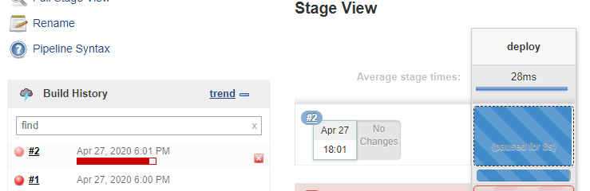

将鼠标放到虚线方块上后，就会出现提示信息浮层，想下面这样

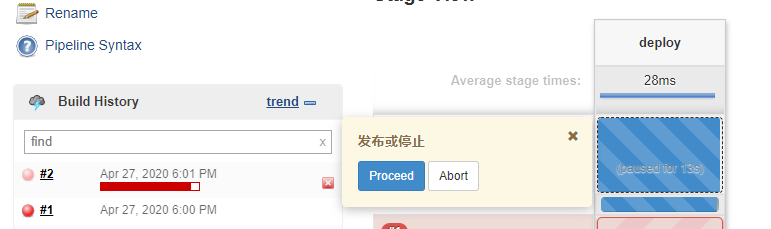

点击Proceed按钮，将会进入下一个步骤。如果点击Abort，则pipeline中止。

不论是点击Proceed还是Abort，日志中都会记录是谁手动操作的

```bash
Started by user jenkins
Running in Durability level: MAX_SURVIVABILITY
[Pipeline] Start of Pipeline
[Pipeline] node
Running on Jenkins in /opt/jenkins/workspace/pipeline-input1
[Pipeline] {
[Pipeline] stage
[Pipeline] { (deploy)
[Pipeline] input
发布或停止
Proceed or Abort
Approved by jenkins
[Pipeline] }
[Pipeline] // stage
[Pipeline] }
[Pipeline] // node
[Pipeline] End of Pipeline
Finished: SUCCESS
```

这就是input操作的基础用法，手动确定是否通过。

## input步骤的复杂用法

input步骤的简单用法很难满足更复杂的场景。下面是一个input步骤的复杂用法示例：

```GROOVY
def approvalMap
pipeline {
    agent any
    stages {
        stage('pre deploy') {
            steps {
                script {
                    approvalMap = input(
                        message: '准备发布到哪个场景?',
                        ok: '确定',
                        parameters: [
                            choice(choices: 'dev\ntest\nprod',
                                   description: '发布到什么环境?',
                                   name: 'ENV'),
                            string(defaultValue: '', description: '', name: 'myparam')
                        ],
                        submitter: 'admin,admin2,releaseGroup',
                        submitterParameter: 'APPROVER'
                   	)
                }
            }
        }
        stage('deploy') {
            steps {
                echo "操作者是 ${approvalMap['APPROVER']}"
                echo "发布到什么环境? ${approvalMap['ENV']}"
                echo "自定义参数 ${approvalMap['myparam']}"
            }
        }
    }
}
```

我们在pipeline外定义了一个变量approvalMap。这是因为定义在stage内的变量的作用域只是在这个阶段中，而input步骤的返回值需要跨阶段使用，所以需要将其定义在pipeline外。这样变量approvalMap的作用域就是整个pipeline了。

approvalMap除了定义在pipeline外面，还可以放在environment中。这样就不用在pipeline顶部定义变量了。

```GROOVY
environment {
    approvalMap = ’‘
}
```

pipeline中使用的是声明表达式，所以需要将approvalMap=input(...)放到script快中。

input步骤的返回值类型取决于要返回的值的个数。如果只有一个值，返回值类型就是这个值的类型；如果有多个值，则返回值的类型是Map类型。上面例子中返回的approvalMap就是一个map。Map的key是每个参数的name属性。比如ENV、myparam。

input步骤的参数：

- message：input步骤的提示消息。

- ok（可选）：自定义确定按钮的文本。

- parameters（可选）：手动输入的参数列表。在上面[使用parameters指令](#使用parameters指令)一节中提到的parameters指令参数类型，input步骤都支持，而且写法一样。

- submitter（可选），字符串类型，可以进行操作的用户ID或用户组名，使用逗号分隔，在逗号左右不允许有空格。意思就是，只有这写名称的对应用户登陆jenkins，才能提交这个input动作，如果不写，默认是任何人都可以提交input。这个参数在做input步骤的权限控制方面比较实用。

- submitterParameter（可选）：字符串类型，保存input步骤的实际操作者的用户名的变量。

**上面pipeline的执行结果**

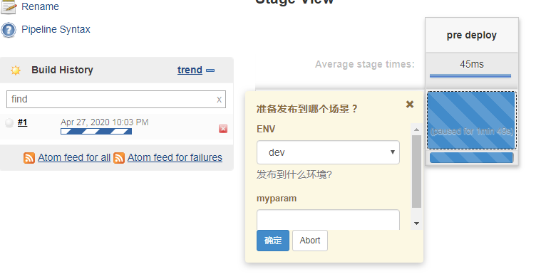·

```bash
Started by user jenkins
Running in Durability level: MAX_SURVIVABILITY
[Pipeline] Start of Pipeline
[Pipeline] node
Running on Jenkins in /opt/jenkins/workspace/pipeline-input2
[Pipeline] {
[Pipeline] stage
[Pipeline] { (pre deploy)
[Pipeline] script
[Pipeline] {
[Pipeline] input
Input requested
Approved by jenkins
[Pipeline] }
[Pipeline] // script
[Pipeline] }
[Pipeline] // stage
[Pipeline] stage
[Pipeline] { (deploy)
[Pipeline] echo
操作者是 jenkins
[Pipeline] echo
发布到什么环境? dev
[Pipeline] echo
自定义参数 php
[Pipeline] }
[Pipeline] // stage
[Pipeline] }
[Pipeline] // node
[Pipeline] End of Pipeline
Finished: SUCCESS
```

最开始我使用jenkins（我没有admin用户，我的管理员就是jenkins用户，在安装的创建的）用执行，发现可以执行成功。后来发现是因为jenkins有所有权限，所以submitter对他没有限制。后来我创建了一个普通用户，授予了build的权限，然后他可以点击build，他也可以输入参数，但是就是一直卡住。我点进console中，发现一只卡在下面这个页面：

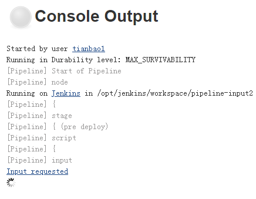

我点击了一下Input requested显示如下

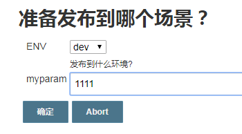

输入号内容一点击提交，就显示error

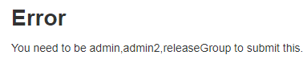

## input步骤设置超时时间

input步骤可以与timeout步骤结合来实现超时自动终止pipeline，防止无限等待（等待就会占用Build executor）。

这会使用到timeout闭包，他有两个参数：

- time：输入时间
- unit：时间的单位，支持DAYS、HOURS、MINUTES、SECONDS

示例如下：

```GROOVY
def approvalMap
pipeline {
    agent any
    stages {
        stage('pre deploy') {
            steps {
                timeout(time: 1, unit: 'MINUTES') {
                    script {
                        approvalMap = input(
                            message: '准备发布到哪个场景？',
                            ok: '确定',
                            parameters: [
                                choice(choices: 'dev\ntest\nprod',
                                    description: '发布到什么环境?',
                                    name: 'ENV'),
                                string(defaultValue: '', description: '', name: 'myparam')
                            ],
                            submitter: 'admin,admin2,releaseGroup',
                            submitterParameter: 'APPROVER'
                   	    )
                    }
                }
            }
        }
        stage('deploy') {
            steps {
                echo "操作者是 ${approvalMap['APPROVER']}"
                echo "发布到什么环境? ${approvalMap['ENV']}"
                echo "自定义参数 ${approvalMap['myparam']}"
            }
        }
    }
}
```

