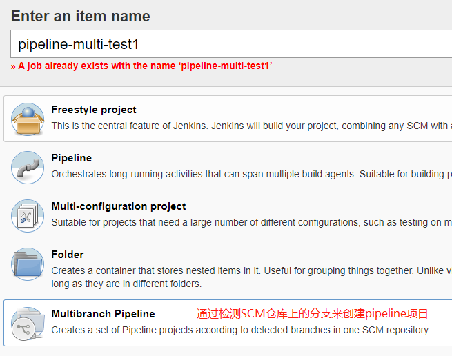
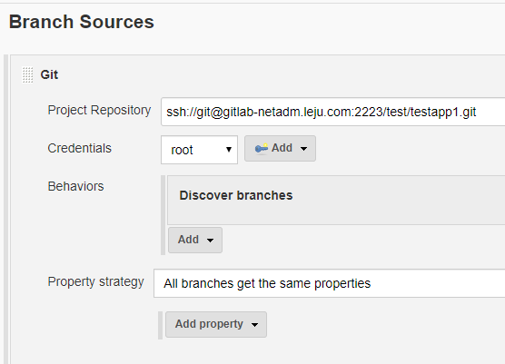
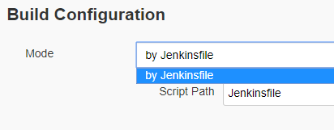
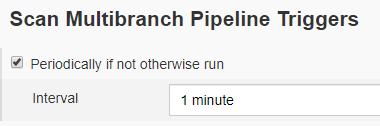
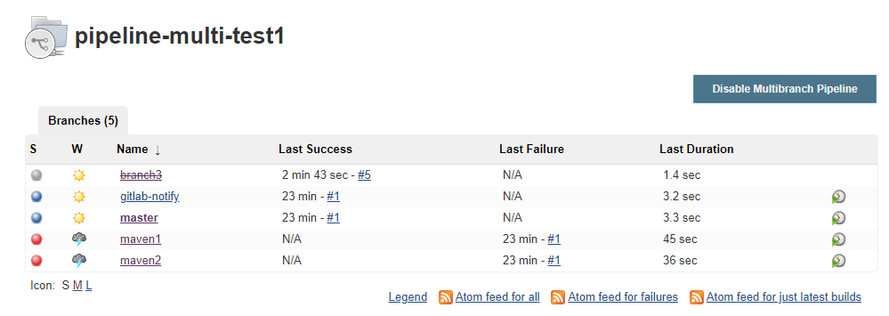
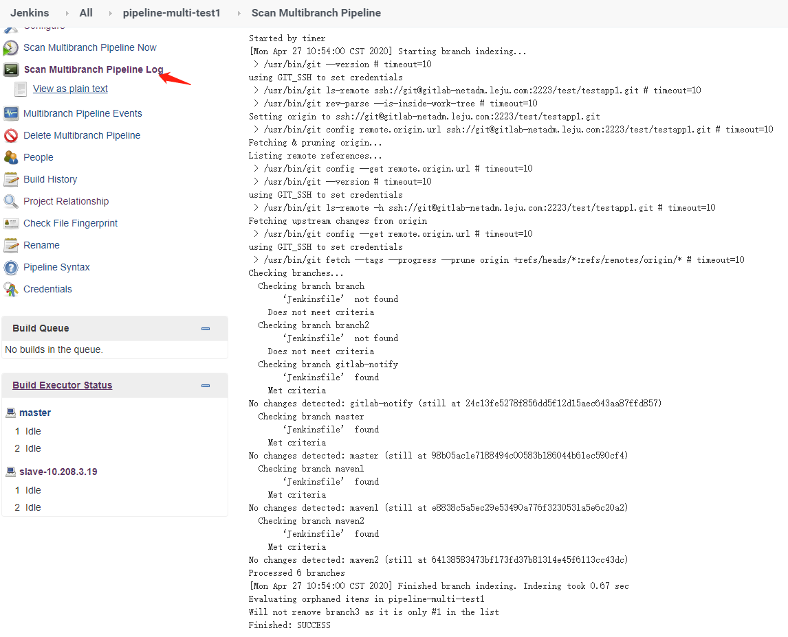
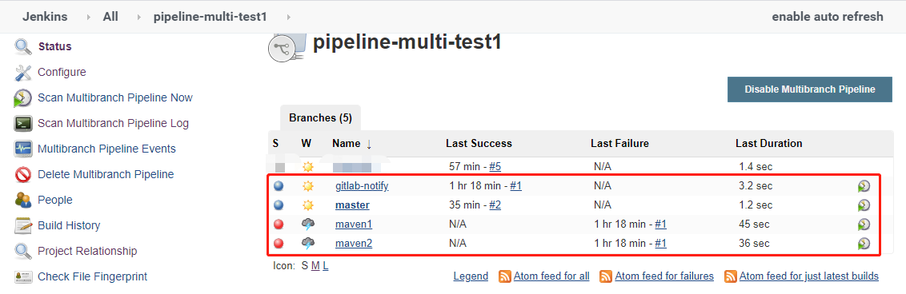
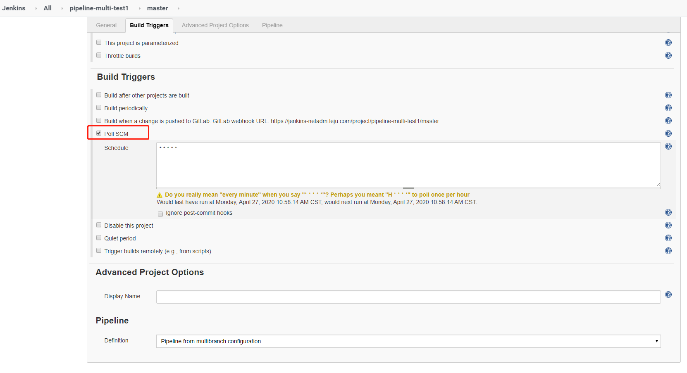

# 多分支创建

在实际项目中，往往需要多分支同时进行开发。如果为每个分支都创建一个Jnekins项目，有些多余。型号Jnekins支持多分支pipeline。在这种情况下，就需要创建一个Multibranch Pipeline类型的项目

**创建多分支项目**

多分支类型的项目是通过检测SCM仓库中的分支来创建pipeline项目的



**在Branch Source中配置SCM**



**指定Build Configuration**

我这里只有一个by Jenkinsfile，这表示，每个分支具体的操作是根据分支内的Jenkinsfile来决定（如果分支内没有Jenkins，那么无法在Jnekins中创建分支）



**指定Scan Multibranch Pipeline Triggers**

这表示每个多长时间扫描一次多分支。如果Git仓库中多了一个分支，则扫描时会在Jenkins中创建。如果Git仓库中少了一个分支，则扫描时会从Jenkins中删除。执行创建和删除操作就是在扫描期间的。这个间隔最小为1m，可以根据分支变更的频率来设置。

如果Jenkinsfile变动了，新的Jnekinsfile也是在扫描之后才生效的。



**指定Orphaned Item Strategy**

如果项目变更最频繁的时候一共有10个分支，之后陆续进行合并，分支数量变为3个。在默认情况下（仅勾选了Discard old items），在扫描到Git仓库中分支减少后，Jenkins上也会将创建的分支删除。这有一点不会，那就是之前那个分支在Jenkins上的构建记录全都不见了。如果想保留构建分支的构建记录，那么可以更改这个选项。

Discard old items：表示不会删除旧的分支（对象），即便扫描到了Git仓库中将分支删除了，Jenkins上本地也不会删除这个分支，只是将这个分支置为孤儿（这个分支之后不会进行任何操作了）

在开始Discard old items之后，还可以配置下面这两个参数来实现一些更精细的控制：

- Days to keep old items：保留孤儿（已删除分支）几天，超过这个时间的孤儿会被移除。

- Max # of old items to keep：最多保留多少个孤儿，旧的孤儿会被移除。

branch3就是孤儿分支，其在Jenkins上的显示效果如下



**点击保存后就会立即开启扫描**



只有包含了Jenkinsfile的分支才会被创建



伺候这些分支的任务会按照他们各自的Jenkins设定来执行。

点开了master分支，查看其中的配置。可以看见里面勾选了PollScm，且设置为`* * * * *`



这是因为他的Jenkinsfile就是这样设置的

```GROOVY
[10.208.3.24 root@test-6:~/testapp1]# cat Jenkinsfile
pipeline {
	agent any
	triggers {
		pollSCM('* * * * *')
	}
	stages {
		stage('Build') {
			steps {
				script {
					sh"""
						echo `date  +%Y%m%d%H%M%S`
					"""
				}
			}
		}
	}
}
```

有人可能疑惑为什么maven1和maven2会执行失败。事实上它们的执行失败和Jenkins多分支是没有关系的。单纯是它们的Jenkinsfile配置有问题。

# 根据分支部署到不通的环境

Jenkins 2.x实践指南中说：

无论哪种分支管理方法，都可能设计一个问题：如何根据不同的分支做不同的事情，比如根据不通的分支部署到不同的环境。这样的事情可以使用if-else来实现。

```groovy
stage ("deploy to test"){
    steps{
        script {
            if (env.GIT_BRANCH == 'master') {
                echo "deploy to test"
            }
        }
    }
}
stage("deploy to prod"){
    steps{
        script {
            if (env.GIT_BRANCH == 'release') {
                echo "deploy to prod"
            }
        }
    }
}
```

而且除了if-else（它不是声明式的），还可以用when来让pipeline看起来更优雅。

```groovy
stage("deploy to test"){
    when {
        branch 'master'
    }
    steps{
        echo "deploy to test"
    }
}
stage("deploy to prod"){
    when {
        branch 'release'
    }
    steps{
        echo "deploy to prod"
    }
}
```

**关于When的支持的更多参数可以去官网查看。**

------------------------

最开始我有个疑问，虽然if-else很好吧，但是直接在不同分支中配置不同的Jenkinsfile不就行了，不同的分支按照不同的Jenkinsfile来部署。

后来请教了一下别人：如果项目分支少的话可能区别不是很大，如果项目有100个，每个项目的分支有50个呢。这种情况下，想要维护5000个Jenkinsfile就有些扯了。所以在这种情况下可以使用 "传参" + if-else 的方式进行控制。

# GitLab trigger对多分支pipeline的支持

对于GitLab来说，并没有Jenkins多分支pipeline的概念，所以GitLab只会触发Jenkins进行分支索引（branch index），Jenkins可根据索引结果决定是否执行购进。对于多分会pipeline，Jenkins GitLab插件只监听push时间，不监听merge request事件。

在Jenkins多分支pipeline的设置页面中找不到GitLab配置项的。只能通过修改每个分支的Jenkinsfile来实现（在triggers指令中加入gitlab配置）。

我上面的示例中，gitlab-notify分支就是这样设置的，pipeline如下：

```groovy
[10.208.3.24 root@test-6:~/testapp1]# cat Jenkinsfile
pipeline {
	agent any
	triggers {
		gitlab(triggerOnPush: true,
		branchFilterType: 'NameBasedFilter',
		includeBranchesSpec: "master",
		secretToken: "2ea2b02efbfda2e0f962f52c9fcdea1b")
	}
	stages {
		stage('Build') {
			steps {
				script {
					sh"""
						echo `date  +%Y%m%d%H%M%S`
					"""
				}
			}
		}
	}
}
```

当构建成功一次之后，只有master分支才会被Jenkins触发构建。

# Generic Webhook Trigger插件在多分支pipeline场景下的应用

这其实和GitLab大同小异。


