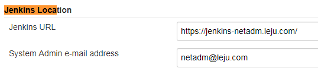

# 邮件通知

## 配置Jenkins内置的邮件通知功能

**进入Manage Jenkins--Configure System--Jenkins Location，配置管理员邮箱。**



**进入Manage Jenkins--Configure System--Jenkins Location，设置SMTP服务器等相关参数**

可以勾选Test configuration by sending test e-mail，并输入一个邮箱来测试，发送成功就会显示Email was successfully sent


**配置pipeline的post部分，在其中添加mail步骤**

```GROOVY
pipeline {
   agent any

   stages {
      stage('code clone') {
         steps {
            git credentialsId: '4eaf63a6-52b2-4d8b-ba14-26322a3135e0', url: 'ssh://git@gitlab-netadm.leju.com:2223/test/testapp1.git'
         }
      }
      stage('stop app') {
         steps {
            sh 'ssh -o StrictHostKeyChecking=no 10.208.3.21 /usr/local/src/apache-tomcat-7.0.88/bin/catalina.sh stop'
            sh 'ssh -o StrictHostKeyChecking=no 10.208.3.23 /usr/local/src/apache-tomcat-7.0.88/bin/catalina.sh stop'
         }
      }
      stage('code deploy') {
         steps {
            sh 'cd /opt/jenkins/workspace/pipeline-test/ && scp -o StrictHostKeyChecking=no ./index.html 10.208.3.21:/data/jsp/test/testapp/'
            sh 'cd /opt/jenkins/workspace/pipeline-test/ && scp -o StrictHostKeyChecking=no ./index.html 10.208.3.23:/data/jsp/test/testapp/'
         }
      }
      stage('start app') {
         steps {
            sh 'ssh -o StrictHostKeyChecking=no 10.208.3.21 /usr/local/src/apache-tomcat-7.0.88/bin/catalina.sh start'
            sh 'ssh -o StrictHostKeyChecking=no 10.208.3.23 /usr/local/src/apache-tomcat-7.0.88/bin/catalina.sh start'
         }
      }
   }
   post {
       always {
           mail to: 'xxxxxx@leju.com', from: 'netadm@leju.com',
               subject: "Status of pipeline: ${currentBuild.fullDisplayName}",
               body: "${env.BUILD_URL} har result ${currentBuild.result}"
       }
   }
}
```

mail步骤的关键参数如下：

- subject：邮件主题

- to：收件地址

- body：邮件内容

- from：发件地址

更多参数可以参考https://www.jenkins.io/doc/pipeline/steps/workflow-basic-steps/#mail-mail

**构建之后我就收到了邮件**


## 配置Email Extension插件发送通知

mailer插件提供的功能过于简答。Email Extension插件（https://plugins.jenkins.io/email-ext）对mailer插件进行了扩展。支持更多的特性。

- 可以定制接收人的邮件列表。
- 可以构建日志以以附件形式附加到邮件中，还可以对日志进行压缩。
- 可以发送附件。

具体配置步骤略


pipeline设置

```GROOVY
pipeline {
   agent any
   stages {
      stage('code clone') {
         steps {
            git credentialsId: '4eaf63a6-52b2-4d8b-ba14-26322a3135e0', url: 'ssh://git@gitlab-netadm.leju.com:2223/test/testapp1.git'
         }
      }
   }
   post {
       always {
           emailext body:
		   """<!DOCTYPE html>
				<html>
				<head>
				<meta charset="UTF-8">
				<title>${env.JOB_NAME}-第${env.BUILD_NUMBER}次构建日志</title>
				</head>
				<body leftmargin="8" marginwidth="0" topmargin="8" marginheight="4" offset="0">
					<table width="95%" cellpadding="0" cellspacing="0"  style="font-size: 11pt; font-family: Tahoma, Arial, Helvetica, sans-serif">
						<tr>
							<td>各位同事，大家好，以下为${env.JOB_NAME}项目构建信息</td>
						</tr>
						<tr>
							<td><br />
							<b><font color="#0B610B">构建信息</font></b>
							<hr size="2" width="100%" align="center" /></td>
						</tr>
						<tr>
							<td>
								<ul>
									<li>项目名称： ${env.JOB_NAME}</li>
									<li>构建编号： 第${env.BUILD_NUMBER}次构建</li>
									<li>持续时间： ${currentBuild.durationString}</li>
									<li>构建状态： ${currentBuild.result}</li>
									<li>构建日志： <a href="${env.BUILD_URL}console">${env.BUILD_URL}console</a></li>
									<li>构建 URL： <a href="${env.BUILD_URL}">${env.BUILD_URL}</a></li>
									<li>项目 URL： <a href="${env.JOB_URL}">${env.JOB_URL}</a></li>
								</ul>
							</td>
						</tr>
					</table>
				</body>
				</html>""",
			compressLog: true,
			attachLog: true,
			recipientProviders: [culprits(), developers(), requestor(), brokenBuildSuspects()],
			replyTo: 'do-not-reply@leju.com',
			subject: "Status: ${currentBuild.result?:'SUCCESS'} - Job \'${env.JOB_NAME}: #${env.BUILD_NUMBER}\'",
			to: "tianbao1@leju.com"
       }
   }
}
```

常用的收件人列表类型：

- culprits：如果选择了developers与本选项，则会将电子邮件发给自最后一次成功构建以来，该项目新增所有提交的提交者（可能引发构建失败的人）。

- developers：如果选择了本选项，将发邮件给此次构建所涉及的变更的所有提交者。该插件将基于提交者的ID和在Jenkins上的配置页面中定义的"default email suffix"来生成默认eamil地址。例如，如果更改是由ID为"allen"的人提交的，并且默认电子邮件后缀为“ @ somewhere.com”，则电子邮件将发送到"allen@somewhere.com"

- requestor：如果选择了本选项，且构建是由用户手动触发的，则发邮件给出发了这次构建的用户。

- Recipient List：发送给"Global Recipient Listt"列表中定义的所有人

点击构建后收到的邮件


点击回复后，收件人就是之前设置的replyTo用户


# 钉钉通知

配置方法完全参考官方文档：https://jenkinsci.github.io/dingtalk-plugin/

网上很多文章中的配置都过时了。

登录PC端的钉钉，创建一个群，为群里生成一个机器人


机器人类型选择自定义


安全设置选择加签，然后记录下这个字符串

SECdbc8edc3477d857a619f2d9fb47ab50c89fbd7cc5e865c2e6db9a271a446eab8


记录下Webhook的地址

https://oapi.dingtalk.com/robot/send?access_token=0622bcc9a3c3425ecf2b9902565d816a9d05cb3635b0969902b24419f12a5e34


在Jenkins上安装插件


在Jenkins上的Manage Jenkins--Configure System页面上，设置DingTalk notifications部分

id会在保存后自动生成（刷新一下页面就出来了），这个id后面会用。

security policy选择sign，然后之前在钉钉群里创建机器人的加签字符串，粘贴进去。

点击test，如果显示测试完成，且钉钉群里手打了测试消息，则表示对接成功。


创建一个pipeline类型的项目，并配置pipeline如下

我下面使用的是TEXT类型的通知

```GROOVY
pipeline {
    agent any
    stages {
        stage('text'){
            steps {
                echo '测试 TEXT 消息...'
            }
            post {
                success {
                    dingtalk (
                        robot: 'cfc36955-2b57-44c8-8b62-9276d15a84d3',
                        type: 'TEXT',
                        text: [
                            "项目名称： ${env.JOB_NAME}",
                            "构建编号： 第${env.BUILD_NUMBER}次构建",
                            "持续时间： ${currentBuild.durationString}",
                            "构建状态： ${currentBuild.result}",
                            "构建日志： ${env.BUILD_URL}console",
                            "构建 URL： ${env.BUILD_URL}",
                            "项目 URL： ${env.JOB_URL}"
                        ],
                        at: [
                            '183xxxxxxxx'
                        ]
                    )
                }
            }
        }
    }
}
```

点击构建之后，顶顶群中就会收到机器人艾特我的信息（根据手机号）


Console如下

```BASH
Started by user jenkins
Running in Durability level: MAX_SURVIVABILITY
[Pipeline] Start of Pipeline
[Pipeline] node
Running on Jenkins in /opt/jenkins/workspace/pipeline-dingding1
[Pipeline] {
[Pipeline] stage
[Pipeline] { (text)
[Pipeline] echo
测试 TEXT 消息...
Post stage
[Pipeline] dingtalk
[Pipeline] }
[Pipeline] // stage
[Pipeline] }
[Pipeline] // node
[Pipeline] End of Pipeline
Finished: SUCCESS
```

我之后又试了试，dingding告警这个，好像不能放到stages之后，只放放到steps后面

