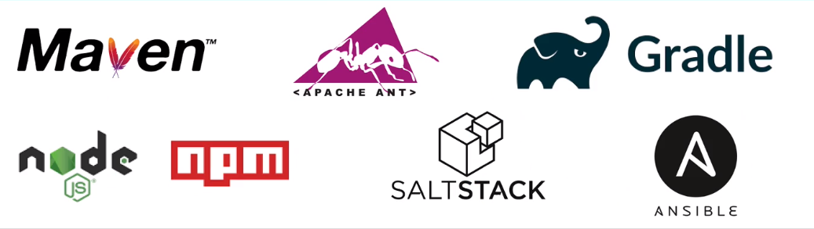
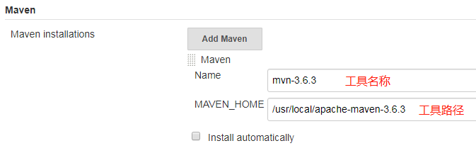
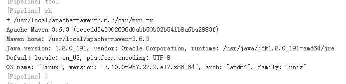
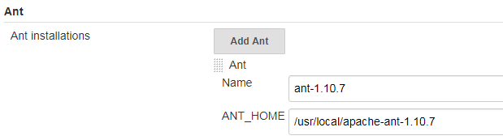
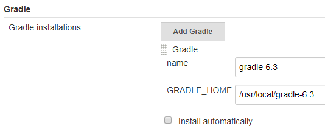
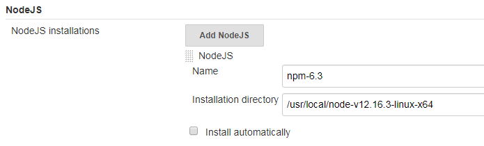
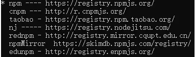
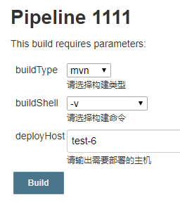
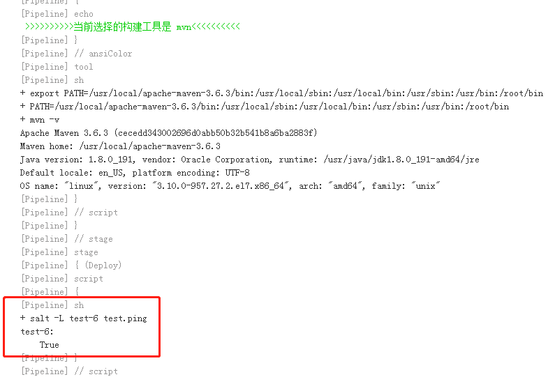

在我的理解中。Jenkins主要做的是一个调度工作。调用git/snv+maven/gradle/ant实现CI。调用ansible/saltstack实现CD


# 集成maven

## maven是什么

### 优秀的构建工具

通过简单的命令，能够完成清理、编译、测试、打包、部署等一系列过程。同时，不得不提的是，Maven是跨平台的，无论是在Windows、还是在Linux或Mac上，都可以使用同样的命令。

### 依赖管理工具

项目依赖的第三方的开源类库，都可以通过依赖的方式引入到项目中来。代替了原来需要首先下载第三方jar，再加入到项目中的方式。从而更好的解决了合作开发中依赖增多、版本不一致、版本冲突、依赖臃肿等问题。

具体是怎么实现的呢？Maven通过坐标系统准确的定位每一个构件，即通过坐标找到对应的Java类库。

### 项目信息管理工具

能够管理项目描述、开发者列表、版本控制系统地址、许可证等一些比较零散的项目信息。除了直接的项目信息，通过Maven自动生成的站点，以及一些已有的插件，还能够轻松获得项目文档、测试报告、静态分析报告、源码版本、日志报告等非常具有价值的项目信息。

## 为什么要是用maven

使用Maven管理项目的好处主要有两点:

其一是使用Maven管理的Java 项目都有着相同的项目结构。 有一个pom.xml 用于维护当前项目都用了哪些jar包；所有的java代码都放在 src/main/java 下面； 所有的测试代码都放在src/test/java 下面 。

```BASH
[10.208.3.24 root@test-6:~/api]# tree -L 6 src/
src/
├── main
│   ├── java
│   │   └── cn
│   │       └── doways
│   │           └── api
│   │               ├── ApiApplication.java
│   │               ├── auth
│   │               ├── config
│   │               ├── controller
│   │               ├── dto
│   │               ├── entity
│   │               ├── mapper
│   │               ├── repository
│   │               ├── service
│   │               ├── utils
│   │               └── vo
│   └── resources
│       ├── application.yml
│       ├── banner.txt
│       ├── logback-boot.xml
│       └── mapper
│           └── UsersMapper.xml
└── test
    └── java
        └── cn
            └── doways
                └── api
                    └── ApiApplicationTests.java
```

其二是便于统一维护jar包。
maven风格的项目，把所有的jar包都放在了本地"仓库“ 里，然后哪个项目需要用到这个jar包，只需要给出jar包的名称和版本号就行了，这样就实现了jar包共享，避免每一个项目都有自己的jar包带来的麻烦。
如下所示pom.xml文件声明项目所需要的jar包版本:

```XML
<dependency>
    <groupId>org.springframework.security</groupId>
    <artifactId>spring-security-test</artifactId>
    <scope>test</scope>
</dependency>
<dependency>
    <groupId>com.alibaba</groupId>
    <artifactId>druid-spring-boot-starter</artifactId>
    <version>1.1.18</version>
</dependency>
```

Maven提供了一种思想让团队更科学的管理、构建项目。用配置文件的方式对项目的描述、名称、版本号、项目依赖等等信息进行描述。使之项目描述结构清晰，任何人接手的成本比较低。在项目构建时，利用Maven的“约定大于配置”的思想，可以比Ant脚本构建项目省去不少配置文件的内容。而且一个项目可能依赖于其他的项目和第三方的组件才能顺利完成，Maven提供了仓库的概念，让这些依赖项放进仓库中，项目想要从仓库中去取，其他项目组也需要，OK，从仓库中去取，不必每个人去开源项目的站点去苦苦搜寻了。如此人员的成本、软件维护的成本、沟通的成本、硬件的成本都降下来了。

## 安装maven

**先决条件**

- JDK：在maven3.3 以上的版本需要JDK版本1.7+。内存：没有最低限制。

- 磁盘：1G+可用磁盘空间。 操作系统：没有限制。

**yum安装**

```BASH
yum install maven
```

**二进制安装**

```BASH
wget https://mirrors.tuna.tsinghua.edu.cn/apache/maven/maven-3/3.6.3/binaries/apache-maven-3.6.3-bin.tar.gz
tar zxf apache-maven-3.6.3-bin.tar.gz -C /usr/local/
#设置全局变量（/etc/profile）
export MAVEN_HOME=/usr/local/apache-maven-3.6.3
export PATH=$PATH:$MAVEN_HOME/bin
source /etc/profile
```

**测试**

```BASH
# mvn -v
Apache Maven 3.6.3 (cecedd343002696d0abb50b32b541b8a6ba2883f)
Maven home: /usr/local/apache-maven-3.6.3
Java version: 1.8.0_191, vendor: Oracle Corporation, runtime: /usr/java/jdk1.8.0_191-amd64/jre
Default locale: en_US, platform encoding: UTF-8
OS name: "linux", version: "3.10.0-957.27.2.el7.x86_64", arch: "amd64", family: "unix"
```

## Jenkins配置ant

安装插件：Maven Integration plugin

系统设置->全局工具配置



在web界面上或Jenkinsfile中编写pipeline

```GROOVY
pipeline {
    agent any
    stages {
        stage('Example') {
            steps {
                script {
                    mavenHome = tool 'mvn-3.6.3' 
                	sh "${mavenHome}/bin/mvn --version"
                }
            }
        }
    }
}
```

执行日志



通过传参的方式来指定要执行的maven命令

```GROOVY
pipeline {
    agent any
    parameters {
        choice(name: 'MAVEN_EXEC', choices: 'clean\nclean package\nclean install\nclean test', description: '要执行执的maven命令')
    }
    stages {
    	stage('Clone'){
        	steps {
            git branch: 'maven1', credentialsId: '4eaf63a6-52b2-4d8b-ba14-26322a3135e0', url: 'ssh://git@gitlab-netadm.leju.com:2223/test/testapp1.git'
            }
        }
        stage('Example') {
            steps {
                script {
                    mavenHome = tool "mvn-3.6.3" 
                	sh "${mavenHome}/bin/mvn ${MAVEN_EXEC}"
                }
            }
        }
    }
    post {
        success {
            archiveArtifacts(artifacts: "target/*.hpi", fingerprint: true)
            deleteDir()
        }
    }
}
```

## maven常用命令

```bash
mvn clean 						##清理构建目录（清除各个模块target目录及里面的内容）
mvn clean package				##测试并打包（据用户配置进行打包，生成各个模块下面的target目录及里面的内容，war、jar）
mvn clean test					##单元测试
mvn clean install				##跑测试、打包、最后部署
mvn clean install -DskipTests	##执行打包和部署，跳过测试
mvn deploy						##部署，把包发布到远程仓库
mvn compile						##静态编译，根据xx.java生成xx.class文件

mvn clean install -Pxxx			##对指定环境打包
##比如你有2个环境，一个dev,一个prod，然后你在mvn打包的时候，可以通过-P来打包，是打dev包，还是prod包。
##pom.xml可以这样配置
<profiles>
    <profile>
        <id>dev</id>
        <properties>
            <env>dev</env>
        </properties>
        <activation>
            <activeByDefault>true</activeByDefault>  //如果不带-P但是，默认是dev
        </activation>
    </profile>
    <profile>
        <id>devtest</id>
        <properties>
            <env>devtest</env>
        </properties>
    </profile>
    <profile>
        <id>prod</id>
        <properties>
            <env>prod</env>
        </properties>
    </profile>
</profiles>
最终如果要对dev打包就执行mvn clean install -Pdev，如果要对prod打包就执行mvn clean install -Pprod

mvn clean install -Ptest -U		##-U,--update-snapshots Forces a check for missing releases and updated snapshots on remote repositories
意思是：强制刷新本地仓库不存在release版和所有的snapshots版本。
1、对于release版本，本地已经存在，则不会重复下载
2、对于snapshots版本，不管本地是否存在，都会强制刷新，但是刷新并不意味着把jar重新下载一遍。只下载几个比较小的文件，通过这几个小文件确定本地和远程仓库的版本是否一致，再决定是否下载
```

## 理解Maven中的SNAPSHOT版本和正式版本

Maven中建立的依赖管理方式基本已成为Java语言依赖管理的事实标准，Maven的替代者Gradle也基本沿用了Maven的依赖管理机制。在Maven依赖管理中，唯一标识一个依赖项是由该依赖项的三个属性构成的，分别是groupId、artifactId以及version。这三个属性可以唯一确定一个组件（Jar包或者War包）。

其实在Nexus仓库中，一个仓库一般分为public(Release)仓和SNAPSHOT仓，前者存放正式版本，后者存放快照版本。如果在项目配置文件中（无论是build.gradle还是pom.xml）指定的版本号带有’-SNAPSHOT’后缀，比如版本号为’Junit-4.10-SNAPSHOT’，那么打出的包就是一个快照版本。

快照版本和正式版本的主要区别在于，本地获取这些依赖的机制有所不同。假设你依赖一个库的正式版本，构建的时候构建工具会先在本次仓库中查找是否已经有了这个依赖库，如果没有的话才会去远程仓库中去拉取。所以假设你发布了Junit-4.10.jar到了远程仓库，有一个项目依赖了这个库，它第一次构建的时候会把该库从远程仓库中下载到本地仓库缓存，以后再次构建都不会去访问远程仓库了。所以如果你修改了代码，向远程仓库中发布了新的软件包，但仍然叫Junit-4.10.jar，那么依赖这个库的项目就无法得到最新更新。你只有在重新发布的时候升级版本，比如叫做Junit-4.11.jar，然后通知依赖该库的项目组也修改依赖版本为Junit-4.11,这样才能使用到你最新添加的功能。

这种方式在团队内部开发的时候会变的特别蛋痛。假设有两个小组负责维护两个组件，example-service和example-ui,其中example-ui项目依赖于example-service。而这两个项目每天都会构建多次，如果每次构建你都要升级example-service的版本，那么你会疯掉。这个时候SNAPSHOT版本就派上用场了。每天日常构建时你可以构建example-service的快照版本，比如example-service-1.0-SNAPSHOT.jar，而example-ui依赖该快照版本。每次example-ui构建时，会优先去远程仓库中查看是否有最新的example-service-1.0-SNAPSHOT.jar，如果有则下载下来使用。即使本地仓库中已经有了example-service-1.0-SNAPSHOT.jar，它也会尝试去远程仓库中查看同名的jar是否是最新的。有的人可能会问，这样不就不能充分利用本地仓库的缓存机制了吗？别着急，Maven比我们想象中的要聪明。在配置Maven的Repository的时候中有个配置项，可以配置对于SNAPSHOT版本向远程仓库中查找的频率。频率共有四种，分别是always、daily、interval、never。当本地仓库中存在需要的依赖项目时，always是每次都去远程仓库查看是否有更新，daily是只在第一次的时候查看是否有更新，当天的其它时候则不会查看；interval允许设置一个分钟为单位的间隔时间，在这个间隔时间内只会去远程仓库中查找一次，never是不会去远程仓库中查找（这种就和正式版本的行为一样了）。

maven版本的配置方式

```XML
<repository>
    <id>myRepository</id>
    <url>...</url>
    <snapshots>
        <enabled>true</enabled>
        <updatePolicy>XXX</updatePolicy>
    </snapshots>
</repository>
```

其中updatePolicy就是那4种类型之一。如果配置间隔时间更新，可以写作interval:XX(XX是间隔分钟数)。daily配置是默认值。

而在Gradle，可以设置本地缓存的更新策略。

```XML
configurations.all {
	// check for updates every build
	resolutionStrategy.cacheChangingModulesFor  0,'seconds'
}
```

当然也可以按照分钟或者小时来设置

```GROOVY
configurations.all {
	resolutionStrategy.cacheChangingModulesFor  10, ‘minutes'
}
#######################################
configurations.all {
	resolutionStrategy.cacheChangingModulesFor  4, ‘hours'
}
```

所以一般在开发模式下，我们可以频繁的发布SNAPSHOT版本，以便让其它项目能实时的使用到最新的功能做联调；当版本趋于稳定时，再发布一个正式版本，供正式使用。当然在做正式发布时，也要确保当前项目的依赖项中不包含对任何SNAPSHOT版本的依赖，保证正式版本的稳定性。

## pom.xml中更换远程仓库

pom.xml中repositories标签的作用是：用来配置maven项目的远程仓库。

```xml
<repositories>
    <repository>
        <id>aliyun</id>
        <name>aliyun</name>
        <url>https://maven.aliyun.com/repository/public</url>
        <releases>
            <enabled>true</enabled>		<!--告诉Maven可以从这个仓库下载releases版本的构件-->
            <updatePolicy>daily</updatePolicy>
        </releases>
        <snapshots>
            <enabled>false</enabled>  	<!--告诉Maven不要从这个仓库下载snapshot版本的构件，对于内部的制品库可以设置为true-->
            <checksumPolicy>warn</checksumPolicy>
        </snapshots>
        <layout>default</layout>
    </repository>
</repositories>
```

> 按照上面配置是实现了配置maven项目的远程仓库。但是，这样的配置只是当前项目生效，我们每创建一个其他项目，就需要配置一次，很麻烦。可以将上面的远程仓库配置在maven的setting.xml里面。这样就可以实现只配置一次。

- repository：在repositories元素下，可以使用repository子元素声明一个或者多个远程仓库。
- id：仓库声明的唯一id，尤其需要注意的是，Maven自带的中央仓库使用的id为central，如果其他仓库声明也使用该id，就会覆盖中央仓库的配置。
- name：仓库的名称，让我们直观方便的知道仓库是哪个。
- url：指向了仓库的地址，一般来说，该地址都基于http协议，Maven用户都可以在浏览器中打开仓库地址浏览构件。
- releases和snapshots：用来控制Maven对于发布版构件和快照版构件的下载权限。需要注意的是enabled子元素，该例中releases的enabled值为true，表示开启aliyun仓库的发布版本下载支持，而snapshots的enabled值为false，表示关闭aliyun仓库的快照版本的下载支持。根据该配置，Maven只会从aliyun仓库下载发布版的构件，而不会下载快照版的构件。
- layout：元素值default表示仓库的布局是Maven2及Maven3的默认布局，而不是Maven1的布局。基本不会用到Maven1的布局。可以不配置。
- 其他：对于releases和snapshots来说，除了enabled，它们还包含另外两个子元素updatePolicy和checksumPolicy。可以不配置。
  - 元素updatePolicy用来配置Maven从远处仓库检查更新的频率，默认值是daily，表示Maven每天检查一次。其他可用的值包括：never-从不检查更新；always-每次构建都检查更新；interval：X-每隔X分钟检查一次更新（X为任意整数）。
  - 元素checksumPolicy用来配置Maven检查校验和文件的策略。当构建被部署到Maven仓库中时，会同时部署对应的检验和文件。在下载构件的时候，Maven会验证校验和文件，如果校验和验证失败，当checksumPolicy的值为默认的warn时，Maven会在执行构建时输出警告信息，其他可用的值包括：fail-Maven遇到校验和错误就让构建失败；ignore-使Maven完全忽略校验和错误。

如果你只是配置了repositories，那么你会发现在mvn在下载依赖的时候，一部分从aliyun仓库下载，一部分还是从默认的仓库（https://repo.maven.apache.org ）下载。这是因为只有项目本身的依赖，走了aliyun的repository，maven命令需要的插件（比如clean、install都是maven的插件），走的还是默认的repository。这是因为还需要在pom中增加一个pluginRepositories才可以。

pom.xml中pluginRepository标签的作用是：用来配置maven插件的远程仓库。

    <pluginRepositories>
        <pluginRepository>
            <id>aliyun-plugin</id>
            <url>https://maven.aliyun.com/repository/public</url>
            <releases>
                <enabled>true</enabled>
            </releases>
            <snapshots>
                <enabled>false</enabled>
            </snapshots>
        </pluginRepository>
    </pluginRepositories>

现在，你可以清空本地maven仓库中的包，然后再次执一下mvn clean install，看看是不是都走了阿里云的仓库了。

## settings.xml中配置远程仓库的镜像

为所有POM使用唯一的一个远程仓库（这个远程仓库代理的所有必要的其它仓库），你可以使用settings.xml中的mirror配置。

举个例子，https://maven.aliyun.com/repository/public是中央仓库http://repo1.maven.org/maven2/在阿里云山的镜像，由于地理位置的因素，该镜像往往能够提供比中央仓库更快的服务。因此，可以配置Maven使用该镜像来替代中央仓库。

```XML
<settings>
...
  <mirrors>
    <mirror>
      <id>aliyun</id>
      <name>aliyun</name>
      <url>https://maven.aliyun.com/repository/public</url>
      <mirrorOf>*</mirrorOf>
    </mirror>
  </mirrors>
...
</settings>
```

该例中，mirrorOf的值为central，表示该配置为中央仓库的镜像，任何对于中央仓库的请求都会转至该镜像，用户也可以使用同样的方法配置其他仓库的镜像。id表示镜像的唯一标识符，name表示镜像的名称，url表示镜像的地址。

关于镜像的一个更为常见的用法是结合私服。由于私服可以代理任何外部的公共仓库(包括中央仓库)，因此，对于组织内部的Maven用户来说，使用一个私服地址就等于使用了所有需要的外部仓库，这可以将配置集中到私服，从而简化Maven本身的配置。在这种情况下，任何需要的构件都可以从私服获得，私服就是所有仓库的镜像。这时，可以配置这样的一个镜像：

```XML
<mirrors>
  <mirror>
    <id>maven_internal_public</id>
    <name>maven_internal_public</name>
    <url>http://10.208.3.247:8881/repository/maven-public/</url>
    <mirrorOf>*</mirrorOf>
  </mirror>
</mirrors>
```

该例中`<mirrorOf>`的值为星号，表示该配置是所有Maven仓库的镜像，任何对于远程仓库的请求都会被转至http://10.208.3.247:8881/repository/maven-public/。如果该镜像仓库需要认证，则配置一个id为maven_internal_public的认证信息即可。

需要注意的是，由于镜像仓库完全屏蔽了被镜像仓库，当镜像仓库不稳定或者停止服务的时候，Maven仍将无法访问被镜像仓库，因而将无法下载构件。

## settings.xml中配置本地仓库路径

默认位置是${user.home}/.m2/repository

修改Maven根目录下的conf文件夹中的setting.xml文件，代码如下：

```XML
<localRepository>/data/maven_local_repository</localRepository>
```

## 远程仓库的认证

大部分公共的远程仓库无须认证就可以直接访问，但我们在平时的开发中往往会架设自己的Maven远程仓库，出于安全方面的考虑，我们需要提供认证信息才能访问这样的远程仓库。配置认证信息和配置远程仓库不同，远程仓库可以直接在pom.xml中配置，但是认证信息必须配置在settings.xml文件中。这是因为pom往往是被提交到代码仓库中供所有成员访问的，而settings.xml一般只存在于本机。因此，在settings.xml中配置认证信息更为安全。

```XML
<servers>
........
  <!--maven连接私服是需要验证用户名和密码-->
  <server>
      <id>maven_internal_public</id>
      <username>admin</username>
      <password>admin123</password>
  </server>
</servers>
```

上面代码我们配置了一个id为maven_internal_public的远程仓库认证信息。Maven使用settings.xml文件中的servers元素及其子元素server配置仓库认证信息。认证用户名为admin，认证密码为admin123。这里的关键是id元素，settings.xml中server元素的id必须与pom.xml中需要认证的repository元素的id或者settings.xml文件中需要认证的mirror元素的id完全一致。正是这个id将认证信息与仓库配置联系在了一起。

## 部署构件至远程仓库

我们使用自己的远程仓库的目的就是在远程仓库中部署我们自己项目的构件以及一些无法从外部仓库直接获取的构件。这样才能在开发时，供其他对团队成员使用。

Maven除了能对项目进行编译、测试、打包之外，还能将项目生成的构件部署到远程仓库中。首先，需要编辑项目的pom.xml文件。配置distributionManagement元素，代码如下：

```XML
<!-- 在pom.xml中使用distributionManagement将项目打包上传到nexus私服 -->
<!-- 使用分发管理将本项目打成jar包，直接上传到指定服务器 -->
<distributionManagement>
  <!--正式版本-->
  <repository>
    <!-- 在settings.xml中<server>的id-->
    <id>maven-releases</id>
    <name>public</name>
    <!--仓库的URL-->
    <url>http://10.208.3.247:8881/repository/maven-releases/</url>
  </repository>
  <snapshotRepository>
    <id>maven-snapshots</id>
    <name>Snapshots</name>
    <url>http://10.208.3.247:8881/repository/maven-snapshots/</url>   
  </snapshotRepository>
</distributionManagement>
```

distributionManagement包含repository和snapshotRepository子元素，前者表示发布版本（稳定版本）构件的仓库，后者表示快照版本（开发测试版本）的仓库。这两个元素都需要配置id、name和url，id为远程仓库的唯一标识，name是为了方便人阅读，关键的url表示该仓库的地址。

往远程仓库部署构件的时候，往往需要认证，配置认证的方式同上。

配置正确后，运行命令mvn clean deploy，Maven就会将项目构建输出的构件部署到配置对应的远程仓库，如果项目当前的版本是快照版本，则部署到快照版本的仓库地址，否则就部署到发布版本的仓库地址。

# 集成ant

当一个代码项目大了以后，每次重新编译，打包，测试等都会变得非常复杂而且重复，因此c语言中有make脚本来帮助这些工作的批量完成。在Java 中应用是平台无关性的，当然不会用平台相关的make脚本来完成这些批处理任务了，ANT本身就是这样一个流程脚本引擎，用于自动化调用程序完成项目的编译，打包，测试等。除了基于JAVA是平台无关的外，脚本的格式是基于XML的，比make脚本来说还要好维护一些。

每个ant脚本（缺省叫build.xml）中设置了一系列任务(target)：比如对于一个一般的项目可能需要有以下任务。

- 任务1：usage 打印本脚本的帮助信息（缺省）
- 任务2：clean <-- init 清空初始化环境
- 任务3：javadoc <-- build <-- init 生成JAVADOC
- 任务4：jar <-- build <-- init 生成JAR
- 任务5：all <-- jar + javadoc <-- build <-- init 完成以上所有任务：jar javadoc 

而多个任务之间往往又包含了一定了依赖关系：比如把整个应用打包任务(jar)的这个依赖于编译任务(build)，而编译任务又依赖于整个环境初始化任务(init)等。

## 安装ant

需要java8

**yum安装**

```BASH
yum install maven
```

**二进制安装**

```shell
wget https://mirror.bit.edu.cn/apache/ant/binaries/apache-ant-1.10.7-bin.tar.gz
tar zxf apache-ant-1.10.7-bin.tar.gz -C /usr/local/
#添加全局变量（/etc/profile）
export ANT_HOME=/usr/local/apache-ant-1.10.7
export PATH=$PATH:$MAVEN_HOME/bin:$ANT_HOME/bin
source /etc/profile
```

**测试**

```GROOVY
[10.208.3.24 root@test-6:~]# ant -version
Apache Ant(TM) version 1.10.7 compiled on September 1 2019
```

## Jenkins配置ant

安装插件：Ant

系统设置->全局工具配置



在web界面上或Jenkinsfile中编写pipeline

```GROOVY
pipeline {
    agent any
    stages {
        stage('Example') {
            steps {
                script {
                    antHome = tool 'ant-1.10.7'
                	sh "${antHome}/bin/ant -version"
                }
            }
        }
    }
}
```

## ant常用命令

```BASH
ant -buildfile -f build.xml
```

# 集成gradle

Gradle是一个基于JVM的构建工具，是一款通用灵活的构建工具，支持maven， Ivy仓库，支持传递性依赖管理，而不需要远程仓库或者是pom.xml和ivy.xml配置文件，基于Groovy，build脚本使用Groovy编写。

## 安装gradle

**二进制安装**

```BASH
unzip gradle-6.3-bin.zip -d /usr/local/
#添加全局变量（/etc/profile）
export GRADLE_HOME=/usr/local/gradle-6.3
export PATH=$PATH: $GRADLE_HOME/bin
source /etc/profile
```

测试

```BASH
[10.208.3.24 root@test-6:~]# gradle -v
Welcome to Gradle 6.3!
Here are the highlights of this release:
 - Java 14 support
 - Improved error messages for unexpected failures
For more details see https://docs.gradle.org/6.3/release-notes.html
------------------------------------------------------------
Gradle 6.3
------------------------------------------------------------
Build time:   2020-03-24 19:52:07 UTC
Revision:     bacd40b727b0130eeac8855ae3f9fd9a0b207c60
Kotlin:       1.3.70
Groovy:       2.5.10
Ant:          Apache Ant(TM) version 1.10.7 compiled on September 1 2019
JVM:          1.8.0_191 (Oracle Corporation 25.191-b12)
OS:           Linux 3.10.0-957.27.2.el7.x86_64 amd64
```

## Jenkins配置gradle

安装插件：Gradle

系统设置->全局工具配置



在web界面上或Jenkinsfile中编写pipeline

```GROOVY
pipeline {
    agent any
    stages {
        stage('Example') {
            steps {
                script {
                    gradleHome = tool 'gradle-6.3' 
                	sh "${gradleHome}/bin/gradle --version"
                }
            }
        }
    }
}
```

## gradle常用命令

```BASH
gradle -v 版本号，首次运行，没有gradle的要下载的哦。
gradle clean 删除HelloWord/app目录下的build文件夹
gradle build 检查依赖并编译打包
gradle assembleDebug 编译并打Debug包
gradle assembleRelease 编译并打Release的包
gradle installRelease Release模式打包并安装
gradle uninstallRelease 卸载Release模式包
```

# 集成npm

npm是随同NodeJS一起安装的包管理工具，能解决NodeJS代码部署上的很多问题，常见的使用场景有以下几种：

- 允许用户从NPM服务器下载别人编写的第三方包到本地使用。
- 允许用户从NPM服务器下载并安装别人编写的命令行程序到本地使用。
- 允许用户将自己编写的包或命令行程序上传到NPM服务器供别人使用。

## 安装npm

**yum安装**

```BASH
[10.208.3.24 root@test-6:~]# yum install npm
```

**二进制安装**

```BASH
wget https://nodejs.org/dist/v12.16.3/node-v12.16.3-linux-x64.tar.xz
tar xf node-v12.16.3-linux-x64.tar.xz -C /usr/local/
#添加全局变量（/etc/profile）
export NODE_HOME=/usr/local/node-v12.16.3-linux-x64
export PATH=$PATH:$NODE_HOME/bin
source /etc/profile
```

测试

```BASH
[10.208.3.24 root@test-6:~]# node -v
v12.16.3
[10.208.3.24 root@test-6:~]# npm -v
6.14.4
```

## Jenkins配置npm

安装插件：NodeJS

系统设置->全局工具配置



在web界面上或Jenkinsfile中编写pipeline

```GROOVY
pipeline {
    agent any
    tools {
        nodejs 'npm-6.3'
    }
    stages {
        stage('Example') {
            steps {
                script {
                    sh "npm -v"
                }//执行npm的时候还会查找node命令的位置，使用tools的方式会将nodejs的路径加到全局变量中。而采用之前的方式会报错，提示找不到node
            }
        }
    }
}
```

## npm常用命令

```BASH
npm install		##安装软件包及其依赖的任何软件包（可以缩写成npm i）。（npm install (with no args, in package dir)）
npm run build	##上线打包，项目目录下执行
```


## npm和cnpm

**npm**

- 允许用户从NPM服务器下载别人编写的第三方包到本地使用。
- 允许用户从NPM服务器下载并安装别人编写的命令行程序到本地使用。
- 允许用户将自己编写的包或命令行程序上传到NPM服务器供别人使用

**npm命令**

- `npm -v` 来测试是否成功安装
- 查看当前目录已安装插件：`npm list`
- 更新全部插件： `npm update [ --save-dev ]`
- 使用 npm 更新对应插件： `npm update  [ -g ] [ --save-dev]`
- 使用 npm 卸载插件： `npm uninstall  [ -g ] [ --save-dev ]`

**cnpm**

- cnpm是指的淘宝团队做的国内镜像源，因为npm的服务器位于国外可能会影响安装。淘宝镜像与官方同步频率目前为 10分钟 一次以保证尽量与官方服务同步。只有这些区别，命令一样用，但是下载速度不一样
- 安装：命令提示符执行
   `npm install cnpm -g --registry=https://registry.npm.taobao.org`
- `cnpm -v` 来测试是否成功安装

**通过改变地址来使用淘宝镜像**

- npm的默认地址是`https://registry.npmjs.org/`
- 可以使用`npm config get registry`查看npm的仓库地址
- 可以使用`npm config set registry https://registry.npm.taobao.org`来改变默认下载地址，达到可以不安装`cnpm`就能采用淘宝镜像的目的，然后使用上面的get命令查看是否成功。

**nrm**

- `nrm`包安装命令： `npm i nrm -g`
- `nrm`能够管理所用可用的镜像源地址以及当前所使用的镜像源地址，但是只是单纯的提供了几个url并能够让我们在这几个地址之间方便切换
- `nrm ls`即nrm list，查看所有可用的镜像，并可以切换。*号表示当前npm使用的地址，可以使用命令`nrm use taobao`或 `nrm use npm`来进行两者之间的切换。



**-g -S -D**

- `-g`：全局安装。 将会安装在C：\ Users \ Administrator \ AppData \ Roaming \ npm，**并且写入系统环境变量**；非全局安装：将会安装在当前定位目录;全局安装可以通过命令行任何地方调用它，本地安装将安装在定位目录的node_modules文件夹下，通过要求调用;
- `-S`：即`npm install module_name --save`,写入`package.json`的`dependencies` ,`dependencies` 是需要发布到生产环境的，比如jq，vue全家桶，ele-ui等ui框架这些项目运行时必须使用到的插件就需要放到`dependencies`
- `-D`：即`npm install module_name --save-dev`,写入`package.json`的`devDependencies` ,`devDependencies` 里面的插件只用于开发环境，不用于生产环境。比如一些babel编译功能的插件、webpack打包插件就是开发时候的需要，真正程序打包跑起来并不需要的一些插件。

> 为什么要保存在`package.json`  因为node_module包实在是太大了。用一个配置文件保存，只打包安装对应配置文件的插件，按需导入。

# 使用ShareLibrary整合封装工具

共享库

```GROOVY
[10.208.3.24 root@test-6:~/jenkinslib]# cat src/org/devops/tools.groovy 
package org.devops

def PrintMes(value,color){
	colors = ['red'    :  "\033[40;31m >>>>>>>>>>${value}<<<<<<<<<< \033[0m",
			  'bule'   :  "\033[47;34m >>>>>>>>>>${value}<<<<<<<<<< \033[0m",
			  'green1' :  "\033[32m >>>>>>>>>>${value}<<<<<<<<<< \033[0m",
			  'green2' :  "\033[40;32m >>>>>>>>>>${value}<<<<<<<<<< \033[0m"]
	ansiColor('xterm') {
		println(colors[color])
	}
}
[10.208.3.24 root@test-6:~/jenkinslib]# cat src/org/devops/build.groovy
package org.devops
def Build(buildType,buildShell){
	def tools = new org.devops.tools()
    def buildTools = ["mvn":"mvn-3.6.3","gradle":"gradle-6.3","ant":"ant-1.10.7","npm":"npm-6.3"]
    tools.PrintMes("当前选择的构建工具是 ${buildType}","green1")
    buildHome = tool buildTools[buildType]
	sh """
    	export PATH=${buildHome}/bin:$PATH
    	${buildType} ${buildShell}
   	"""
}
```

pipeline

```GROOVY
@Library('jenkinslib@master')
def build = new org.devops.build()
pipeline {
    agent { node{label "master"} }
    parameters {
        choice(name: 'buildType', choices: 'mvn\ngradle\nant\nnpm', description: '请选择构建类型')
        choice(name: 'buildShell', choices: '-v\nclean package\nclean install\nclean test', description: '请选择构建命令')
    }
    stages {
        stage('Example') {
            steps{
                script{
                    build.Build("${buildType}","${buildShell}")
                }
            }
        }
    }
}
```

# 集成saltstack

## 安装saltstack

yum安装

```BASH
yum -y install salt-master salt-minion
```

在minion配置文件中，写master的ip

```BASH
# cat /etc/salt/minion
master: 10.208.3.24
```

启动master和minion

```BASH
systemctl start salt-master.service 
systemctl start salt-minion.service 
```

在master上列出所有公钥，可以看到有一些未接受的key：test-6

```BASH
[10.208.3.24 root@test-6:~]# salt-key -L
Accepted Keys:
Denied Keys:
Unaccepted Keys:
test-6
Rejected Keys:
[10.208.3.24 root@test-6:~]# salt-key -y -a test-6

```

接受key

```BASH
[10.208.3.24 root@test-6:~]# salt-key -y -a test-6
[10.208.3.24 root@test-6:~]# salt-key -L
Accepted Keys:
test-6
Denied Keys:
Unaccepted Keys:
Rejected Keys:
```

测试master和minion之间的联通性

```BASH
[10.208.3.24 root@test-6:~]# salt "test-6" test.ping
test-6:
    True
```

## 在Jenkins配置saltstack

可以在Jenkins上安装SaltStack来集成saltstack。此处不做介绍，只是用命令行。

共享库

```GROOVY
[10.208.3.24 root@test-6:~/jenkinslib]# cat src/org/devops/deploy.groovy
package org.devops
def SlatDeploy(hosts,func){
	sh "salt -L \"${hosts}\" \"${func}\""
}
```

pipeline

```GROOVY
@Library('jenkinslib@master')
def build = new org.devops.build()
def deploy = new org.devops.deploy()
pipeline {
    agent { node{label "master"} }
    parameters {
        choice(name: 'buildType', choices: 'mvn\ngradle\nant\nnpm', description: '请选择构建类型')
        choice(name: 'buildShell', choices: '-v\nclean package\nclean install\nclean test', description: '请选择构建命令')
        string(name: 'deployHost', defaultValue: '', description: '请输出需要部署的主机')
    }
    stages {
        stage('Build') {
            steps{
                script{
                    build.Build("${buildType}","${buildShell}")
                }
            }
        }
        stage('Deploy') {
            steps{
                script{
                    deploy.SlatDeploy("${deployHost}","test.ping")
                }
            }
        }
    }
}
```





# 集成ansible

## 安装ansible

略

## 在Jenkins上配置ansible

安装插件：Ansible Plugin

系统设置->全局工具配置


