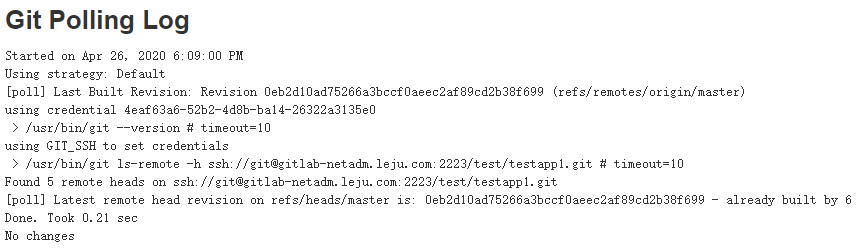
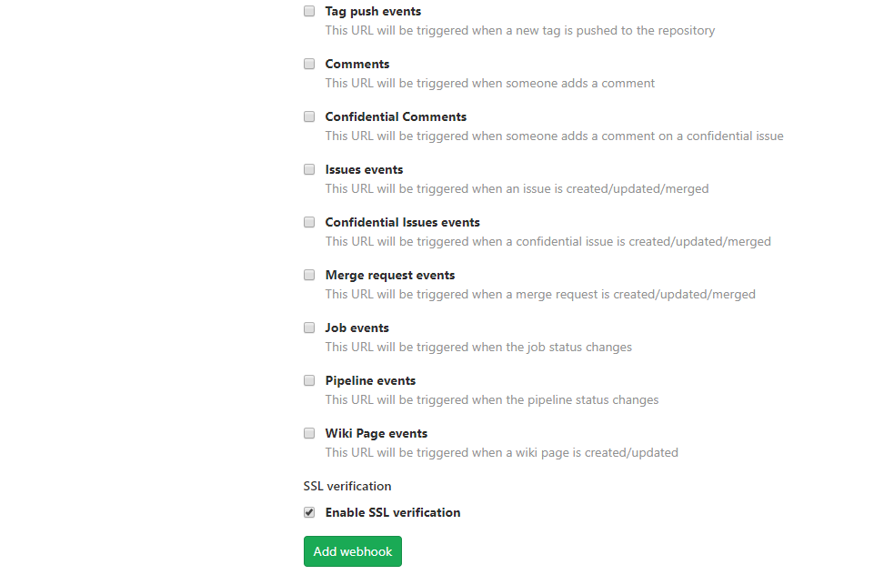

# 触发pipeline执行

之前都是手动推送代码后，在切换到Jenkins界面，首动触发构建。显然这不够自动化。自动化是指pipeline按照一定的规则自动执行。而这些规则被称为pipeline触发条件。下面从两个维度说明触发条件

- 时间触发
- 事件触发

**注意：这些触发任务最开始都需要手动触发一次，来让Jenkins加载pipeline，使triggers指令生效**

## 时间触发

时间触发是指定义一个时间，时间到了就触发pipeline执行。在Jenkins pipeline中使用triggers指令来定义时间触发。

triggers指令只能被定义在pipeline块下，Jenkins内置支持cron、pollSCM、upstream三种方式。其他方式可以通过插件来实现

### 定时执行：cron

和linux的crontab区别不大，都是“分时日月周”。在此之外还有一个H，H表示hash，用来防止同一时刻执行大量定时任务。

我没有设置Build Triggers，只是配置了pipeline，执行一次pipeline之后就自动生成了Build Triggers。之后我尝试把Build trigger删了，但是在那之后即便在执行也不会出现了Build Triggers了，而且这个项目再也不会定时执行了。。。。


pipeline设置

```GROOVY
pipeline {
   agent any
    triggers {
        cron('* * * * *')
    }
   stages {
      stage('Build') {
         steps {
             script{
            sh"""
            echo `date +%Y%m%d%H%M%S`
            """
            }
         }
      }
   }
}
```

效果


### 轮询代码仓库：pollSCM

轮询代码仓库是指定期到代码仓库询问代码是否有变化，如果有变化就执行。轮询间隔越小越好，以防一次构建内就可能会包含多次代码提交（否则当构建失败时，无法立刻知道是哪一次代码提交导致了构建失败）。

事实上如果代码有变化，最好的方式是代码仓库主动通知Jenkins，而不是Jenkins频繁去代码仓库检查。这种方式的意义在于，有一些特殊情况下，比如外网的代码仓库无法调用内网的Jenkins，或者反过来，此时会采用这种方法。

和cron的Build Triggers一样，都是执行一次只有自动生成的


pipeline设置

```GROOVY
[10.208.3.24 root@test-6:~/testapp1]# cat Jenkinsfile
pipeline {
	agent any
	triggers {
		pollSCM('* * * * *')
	}
	stages {
		stage('Build') {
			steps {
				script {
					sh"""
						echo `date  +%Y%m%d%H%M%S`
					"""
				}
			}
		}
	}
}
```

效果


Git Polling Log中会保存最近一次polling的记录，根据设置的频率自动更新。上面设置的频率是每分钟，所及每分钟都会变。




## 事件触发

事件触发就是发生了某个时间就触发pipeline执行。这个事件可以是在界面上手动触发、其他job主动触发、HTTP API Webhook触发等等。

### 由上游任务触发：upstream

当B任务的执行依赖A任务的执行结果时，A任务就被称为B任务的上游任务。在Jenkins2.22及以上版本中，trigger指令开始支持upstream类型的触发条件。

需要手动触发一次任务，让Jenkins加载pipeline后，trigger指令才会生效。

Build Triggers是执行一次之后自动生成的。


pipeline

```GROOVY
pipeline {
   agent any
    triggers {
        upstream(upstreamProjects: 'pipeline-cron',threshold: hudson.model.Result.SUCCESS)
    }
   stages {
      stage('Hello') {
         steps {
            echo 'Hello World'
         }
      }
   }
}
```

upstreamProjects接收到多个任务时，用逗号分隔，多个任务之间是或的关系（如果想要是与，我感觉可以通过串行的方式来做，比如：a做b的上游，b做a的上游）。示例：

```GROOVY
triggers {
	upstream(upstreamProjects: 'pipeline-cron',threshold: hudson.model.Result.SUCCESS)
}
```

threshold参数是指上游任务的执行结果是什么时触发。hudson.model.Result是一个枚举，包括以下值：

- ABORTED：任务被手动中止
- FAILURE：构建失败
- SUCCESS：构建成功
- UNSTABLE：存在一些错误，但不至于构建失败
- NOT_BUILT：多阶段构建时，前面阶段的问题导致后面阶段无法执行。

手动触发一次之后 ，此后只有pipeline-cron任务执行成功一次，pipeline-upstream任务就会开始执行一次。


### GitLab通知触发，在Jenkins网页上配置GitLab trigger

这是指当GitLab发现源码有变化时，触发Jenkins执行构建。换句话说就是：开发推代码触发Jenkins执行构建。


这种方式比pollSCM更优，Jenkins不需要无谓的消耗资源去做探测，而且每一次代码的变化都可以触发一次构建。

#### 配置方式

##### 安装插件

实现这种方式，需要在Jenkins上安装GitLab插件和git插件。


我现在使用的GitLab版本是12.9.3-ee。在Jenkins上使用的是GitLab插件，而不是GitLab Hook插件（已废弃，截止至20200426已经4年没更新了）。

##### 在Jenkins上创建与GitLab仓库同名的项目

Jenkins上的项目名有讲究了，不可以看心情创建了。

在GitLab上我的项目是test组下的Testapp1，项目地址为https://gitlab-netadm.leju.com/test/Testapp1，因此我要在Jenkins上创建一个名为Testapp1的pipeline类型项目（单分支类型的pipeline项目）。

##### 在Jenkins上配置该项目的Build Triggers

勾选Build when a change is pushed to GitLab


可以看到Jenkins页面上写着webhook的URL为https:///jenkins-netadm.leju.com/project/Testapp1，记住这个URL下面会用到。

这个webhook的地址格式为：Jenkins_URL/project/<项目名>

##### 这个webhook的安全问题

在此时任何人都可以请求这个webhook。但是这个webhook的调用权限最终取决于以下两个设置项：

- Jenkins全局权限设置
- 该pipeline项目是否设置了“Secret token”

不论Jenkins全局权限如何设置，基于安全考取，我们一般都会为该pipeline生成一个单独的Secret token。只有带上Secret token的请求才会被处理。

生成方式：在上面的页面上，点击Advanced。然后点击右下角的Generate。然后Secret token输入框中就会生成一个字符串


将这个字符串保留好`2ea2b02efbfda2e0f962f52c9fcdea1b`，下面会用到。

注意：如果想针对指定branch启用这个trigger，可以在Allowed branches中勾选Filter branches.....，然后输入相应的参数。

##### 在GitLab上的项目里配置通知Jenkins

进入Testapp1项目的配置，找到Settings--Webhooks（不同版本可能不一样，有的可能是Settings--Integrations）

- 在URL中输入Jenkins 项目的weebhook url

- 在Secret Token中输入为上面这个Jenkins项目生成的Secret Token
- 勾选Push event（可以需求勾选触发事件，如果不熟悉就勾选Push event即可）
- 勾选SSL verification
- 点击Add webhook




上面有很多选项，比如根据tag、comment、issue等等一些情况进行处罚， 我们这里只选择push event。注意根据这里的描述，可以看出来，可以指定具体的branch名称或者通配符，来进一步限定触发webhook的条件。

添加完成过后，可以在下面看到一个Hook Project


点击Test，然后选择Push event进行测试，这表示进测试Push event事件。

如果显示`Hook executed successfully: HTTP 200`，则表示成功。

##### GitLab添加webhook时报错：Url is blocked: Requests to the local network are not allowed

如果点击 add webhook时提示"Url is blocked: Requests to the local network are not allowed"，则需要勾选下面这个选项


#### 测试效果

在上面配置pipeline的时候，仅说明了如何配置Build Triggers，可能有人会问：pipeline语句要怎么写呀？

这就要看你的业务需求了，正常来说，如果有变动了，那你就要拉取代码，本地构建，然后部署分发。但是在咱们这个示例中明显不需要。所以我的pipeline脚本中仅仅包含以个echo来做测试

```GROOVY
pipeline {
   agent any

   stages {
      stage('Hello') {
         steps {
            echo 'Hello World'
         }
      }
   }
}
```

之后，我在我的本地上push了两次代码。每次都会触发Jenkins构建。


### GitLab通知触发，在Jenkinsfile中配置GitLab trigger

在[GitLab通知触发，在Jenkins网页上配置GitLab trigger](##GitLab通知触发，在Jenkins网页上配置GitLab trigger)中，需要手动操作的步骤不少。其实这部分手工操作，也可以通过Jenkinsfils实现。

**Jenkinsfile的具体配置**

```GROOVY
[10.208.3.24 root@test-6:~/testapp1]# cat Jenkinsfile 
pipeline {
	agent any
	triggers {
		gitlab(triggerOnPush: true,
		branchFilterType: 'All',		//A是大写的，ll是小写的
		secretToken: "2ea2b02efbfda2e0f962f52c9fcdea1b")
	}
	stages {
		stage('Build') {
			steps {
				script {
					sh"""
						echo `date  +%Y%m%d%H%M%S`
					"""
				}
			}
		}
	}
}
```

secretTokne可以使用所及字符串生成器生成即可。如果Jenkins在内网使用，并且安全性有一定保证，我们可以将secretToken定义为一个Jenkins全局变量，供所有项目使用。这样就不用为每个项目单独生成一个Token了。

GitLab trigger支持很多参数，下面对一些常用的参数进行说明：

triggerOnPush：当GitLab触发push事件时，是否执行构建。

triggerOnMergeRequest：当GitLab触发mergeRequest事件时，是否执行构建。

branchFilterType：只有复合条件的分支才会被触发。必选，否则无法实现触发，支持以下的值：

- NameBasedFilter：基于分支名进行过滤，多个分支之间使用逗号分隔。
- RegexBasedFilter：基于正则表达式对分支名进行过滤。
- All：所有分支都会被触发构建。
- includeBranchesSpec：基于branchFilterType值，输入期望包括的分支的规则。
- excludeBranchesSpec：基于branchFilterType值，输入期望排除的分支的规则。

更多参数可以查看GitLab plugin的GitHub页面。

**想要生效需要先手动构建一次，构建之后打开configure看一看到Jenkinsfile中的配置已经出现在这里**


**示例：设置只有master分支变动了才触发构建**

```groovy
[10.208.3.24 root@test-6:~/testapp1]# cat Jenkinsfile 
pipeline {
	agent any
	triggers {
		gitlab(triggerOnPush: true,
		branchFilterType: 'NameBasedFilter',
		includeBranchesSpec: "master",
		secretToken: "2ea2b02efbfda2e0f962f52c9fcdea1b")
	}
	stages {
		stage('Build') {
			steps {
				script {
					sh"""
						echo `date  +%Y%m%d%H%M%S`
					"""
				}
			}
		}
	}
}
```

## 将构建状态信息推送到GitLab

当Jenkins执行完构建之后，我们还可以将构建结果推送到GitLab响应的commit记录上，这样可以将构建状态与commit关联起来。

其他信息参考Jenkins 2.x实践指南-6.4

## 使用Generic Webhook Trigger插件实现触发

Generic Webhook Trigger插件（以下简称：GWT），GWT接收到JSON或XML的HTTP POST请求后，根据我们配置的规则决定触发哪个Jenkins项目。

## Generic Webhook Trigger

详细信息参考：https://plugins.jenkins.io/generic-webhook-trigger/

在Jenkins上安装了GitLab插件之后，GitLab系统可以发送Webhook触发Jnekins项目执行。但是对于其他系统来说，也可以通过Generic Webhook Trigger（下面简称GWT）来实现同样的效果。关于这个插件：

- 可以从<JENKINS_URL>/generic-webhook-trigger/invoke接收请求，然后处理此API收到的请求。

- 可以从带有JSONPath或XPath的POST内容中提取值。从query参数中提取值。从headers中提取值。

- 使用这些值作为变量触发构建

**触发指定JOB**

当在一些job上使用这个插件的时候，你将有一个相同的URL用来触发所有job。如果你只是想触发某项工作，则可以：

- 在不同的job上使用不同的token参数。使用不同的token意味着对于该请求，只有具有该token的job才可见。这也会提高性能并减少每次调用的响应。
- 或者，添加一些请求参数（header、post内容）并使用regexp filter。这样只有参数拥有指定值的时候才会来触发

**从webhook请求中提取参数值**

一个HTTP POST请求可以从三个维度提取参数：POST BODY、URL参数、HEADER。GWT插件提供了三个参数分别对这三个维度的数据进行提取。

genericVariables：提取POST BODY中的参数

- value：JSONPath表达式，或者XPath表达式，取决于expressionType参数值，用户从POST BODY中提取该值。
- key：从POST BODY中提取出的值的新变量名，可用于pipeline的其他步骤
- expressionType：可选，value的表达式类型，默认为JSONPath，当请求为XML内容时，必须指定XPath值。
- defaultValue：可选，当提取不到值，且defaultValue不为空时，则使用defaultValue作为返回值。
- regexpFilter：可选，过滤表达式，对提取出来的值进行过滤。regexpFilter做的事情其实就是string.replaceAll（regexpFilter, ""）;。string是从HTTP请求中提取出来的值。

genericRequestVariables：从URL参数中提取值。

- key：从URL参数中提取出的值的新变量名，可用于pipeline的其他步骤
- regexpFilter：对提取出来的值进行过滤。

genericHeaderVariables：从HTTP Header中提取值。

genericHeaderVariables的用法和genericRequestVariables一样，唯一的区别就是genericHeaderVariables是从HTTP HEADER中提取出来的。

**根据Token触发具体某个Jenkins项目**

GenericTrigger方法有个token参数。

```GROOGY
triggers {
	GenericTrigger（
		token： ‘secret’
	)
}
```

token参数的作用是标识一个pipeline在Jenkins中的唯一性（也可以让所有pipeline使用一个token）。当Jenkins接收到Generic-webhook-trigger/invoke接口的请求时，会将请求代理给GWT插件处理。GWT插件内部会从Jenkins实例对象中提取所有的参数化Jenkins项目，包括pipeline，然后进行遍历。如果在参数化项目中Generic Trigger配置的token的值与webhook请求时的token值一样，则触发此项目。

如果多个参数化项目的token都一样，则他们都会被触发。

**根据请求参数值判触发Jenkins项目**

GWT并不只是根据token的值来判断是否触发，还可以根据我们提取出来的值进行判断。

- regexpFilterText：需要进行匹配的key。例子中我们使用从POST BODY中提取的`$object_kind $before $after`.
- regexpFilterExpression：正则表达式，如果regexpFilterText参数的值复合regexpFilterExpression参数的正则表达式，则触发执行。

示例：PUSH操作会触发Jenkins执行，但是过滤掉了创建和删除分支时的PUSH操作。所以创建和删除分支时不会触发Jenkins执行。

```GROOVY
pipeline {
    agent { node{label "master"} }
    triggers {
        GenericTrigger(
        	genericVariables: [
                [key: "branch", value: "\$.ref", expressionType: "JSONPath", regexpFilter: "", defaultValue: ""],
                [key: "buildUser", value: "\$.user_username", expressionType: "JSONPath", regexpFilter: "", defaultValue: ""],
                [key: "srcUrl", value: "\$.project.git_ssh_url", expressionType: "JSONPath", regexpFilter: "", defaultValue: ""],
                [key: "projectId", value: "\$.project.id", expressionType: "JSONPath", regexpFilter: "", defaultValue: ""],
                [key: "commitSha", value: "\$.checkout_sha", expressionType: "JSONPath", regexpFilter: "", defaultValue: ""],
                [key: "before", value: "\$.before", expressionType: "JSONPath", regexpFilter: "", defaultValue: ""],
                [key: "after", value: "\$.after", expressionType: "JSONPath", regexpFilter: "", defaultValue: ""],
                [key: "object_kind", value: "\$.object_kind", expressionType: "JSONPath", regexpFilter: "", defaultValue: ""]
            ],
        	genericRequestVariables: [
                [key: "runOpts", regexpFilter: ""]
            ],
            genericHeaderVariables: [
            ],
            token: 'demon-maven-service_PUSH',
            causeString: 'Triggered on $branch',
            printContributedVariables: true,
            printPostContent: true,
            silentResponse: true,
			regexpFilterText: '$object_kind $before $after',
			regexpFilterExpression: '^push\\s(?!0{40}).{40}\\s(?!0{40}).{40}$'
        )
    }
}
```

**控制打印内容**

- printPostContent：布尔型，将webhook请求信息打印到日志中。

- printContributedVariables：布尔型，将提取后的变量名及变量值打印出来。

- causeString：字符串类型，定义触发原因，可以直接引用提取后的变量。

**控制相应**

- silentResponse：布尔型，正常情况下，当webhook请求成功后，gwt插件会返回HTTP 200状态码和触发结果给对方。但是当silentResponse设置为true时，就只返回HTTP 200状态码。

### 提交流水线（提交即触发）：GWT

#### 示例：在web界面上配置GWT

**提交代码触发流水线构建**


**配置pipeline**

```GROOVY
@Library('jenkinslib@master')
def build = new org.devops.build()
def tools = new org.devops.tools()
pipeline {
    agent { node{label "master"} }
    stages {
        stage('Checkout') {
            steps{
                script{
                    if ( "${runOpts}" =="GitlabPush" ) {
                        branchName = branch - '/refs/heads/'
                    }
                    tools.PrintMes("${branchName}","green1")
                    checkout([$class: 'GitSCM', branches: [[name: "${branchName}"]],
                              doGenerateSubmoduleConfigurations: false, extensions: [], submoduleCfg: [],
                              userRemoteConfigs: [[credentialsId: '4eaf63a6-52b2-4d8b-ba14-26322a3135e0',
                              url: "${srcUrl}"]]])
                }
            }
        }
        stage('Build') {
            steps{
                script{
                    buildHome = tool "mvn-3.6.3"
                    sh "${buildHome}/bin/mvn -v"
                }
            }
        }
    }
}
```

**在GitLab中配置Webhooks**

URL写成这个：https://jenkins-netadm.leju.com/generic-webhook-trigger/invoke?token=demon-maven-service_PUSH&runOpts=GitlabPush


测试 PUSH Event


此时会触发项目执行，在Console中就可以看到下面这些，以后每次push的触发也会如此


我将上面这个内容复制到json.cn中，可以看到下面这个内容

```JSON
{
    "object_kind":"push",
    "event_name":"push",
    "before":"0d85b7e1fd39bc6978511f92381aa10534ca4c1b",
    "after":"1c56750391d89fc9f7cf185a4808f1a8708dbed1",
    "ref":"refs/heads/master",
    "checkout_sha":"1c56750391d89fc9f7cf185a4808f1a8708dbed1",
    "message":null,
    "user_id":1,
    "user_name":"Administrator",		//这里的用户名和邮箱不是GitLab Token所属用户的信息，而且这次提交的用户在GitLab上的用户账户信息（注意：不是git config那个）
    "user_username":"root",				//可以理解为，
    "user_email":"",
    "user_avatar":"https://secure.gravatar.com/avatar/9ebd62de627a9ebaaeb2ef2d787c4a40?s=80&d=identicon",
    "project_id":5,
    "project":{
        "id":5,
        "name":"simple-java-maven-app",
        "description":"",
        "web_url":"https://gitlab-netadm.leju.com/test/simple-java-maven-app",
        "avatar_url":null,
        "git_ssh_url":"ssh://git@gitlab-netadm.leju.com:2223/test/simple-java-maven-app.git",
        "git_http_url":"https://gitlab-netadm.leju.com/test/simple-java-maven-app.git",
        "namespace":"test",
        "visibility_level":0,
        "path_with_namespace":"test/simple-java-maven-app",
        "default_branch":"master",
        "ci_config_path":null,
        "homepage":"https://gitlab-netadm.leju.com/test/simple-java-maven-app",
        "url":"ssh://git@gitlab-netadm.leju.com:2223/test/simple-java-maven-app.git",
        "ssh_url":"ssh://git@gitlab-netadm.leju.com:2223/test/simple-java-maven-app.git",
        "http_url":"https://gitlab-netadm.leju.com/test/simple-java-maven-app.git"
    },
    "commits":[
        {
            "id":"1c56750391d89fc9f7cf185a4808f1a8708dbed1",
            "message":"test,tianbao1",
            "title":"test,tianbao1",
            "timestamp":"2020-05-04T09:24:47+08:00",
            "url":"https://gitlab-netadm.leju.com/test/simple-java-maven-app/-/commit/1c56750391d89fc9f7cf185a4808f1a8708dbed1",
            "author":{
                "name":"tianbao1",
                "email":"tianbao1@leju.com"
            },
            "added":[
            ],
            "modified":[
                "README.md"
            ],
            "removed":[
            ]
        },
        {
            "id":"0c6f2e67e440392c0fa5b62e140449ce1803fae8",
            "message":"test,tianbao1",
            "title":"test,tianbao1",
            "timestamp":"2020-05-04T09:19:52+08:00",
            "url":"https://gitlab-netadm.leju.com/test/simple-java-maven-app/-/commit/0c6f2e67e440392c0fa5b62e140449ce1803fae8",
            "author":{
                "name":"tianbao1",
                "email":"tianbao1@leju.com"
            },
            "added":[

            ],
            "modified":[
                "README.md"
            ],
            "removed":[
            ]
        },
        {
            "id":"0d85b7e1fd39bc6978511f92381aa10534ca4c1b",
            "message":"Amend README.md",
            "title":"Amend README.md",
            "timestamp":"2017-12-18T20:53:10+11:00",
            "url":"https://gitlab-netadm.leju.com/test/simple-java-maven-app/-/commit/0d85b7e1fd39bc6978511f92381aa10534ca4c1b",
            "author":{
                "name":"Giles Gaskell",
                "email":"gilesgas@gmail.com"
            },
            "added":[

            ],
            "modified":[
                "README.md"
            ],
            "removed":[
            ]
        }
    ],
    "total_commits_count":3,
    "push_options":{
    },
    "repository":{
        "name":"simple-java-maven-app",
        "url":"ssh://git@gitlab-netadm.leju.com:2223/test/simple-java-maven-app.git",
        "description":"",
        "homepage":"https://gitlab-netadm.leju.com/test/simple-java-maven-app",
        "git_http_url":"https://gitlab-netadm.leju.com/test/simple-java-maven-app.git",
        "git_ssh_url":"ssh://git@gitlab-netadm.leju.com:2223/test/simple-java-maven-app.git",
        "visibility_level":0
    }
}
```

#### 示例：在pipeline中配置GWT

执行的结果和上面那个示例一样

```GROOVY
@Library('jenkinslib@master')
def build = new org.devops.build()
def tools = new org.devops.tools()
if ( "${runOpts}" =="GitlabPush" ) {
	branchName = branch - '/refs/heads/'
}
pipeline {
    agent { node{label "master"} }
    triggers {
        GenericTrigger(
        	genericVariables: [
                [key: "branch", value: "\$.ref", expressionType: "JSONPath", regexpFilter: "", defaultValue: ""],
                [key: "srcUrl", value: "\$.project.git_ssh_url", expressionType: "JSONPath", regexpFilter: "", defaultValue: ""]
            ],
        	genericRequestVariables: [
                [key: "runOpts", regexpFilter: ""]
            ],
            genericHeaderVariables: [
            ],
            token: 'demon-maven-service_PUSH',
            causeString: "Triggered on $branch",
            printContributedVariables: true,
            printPostContent: true,
            silentResponse: true
        )
    }
    stages {
        stage('Checkout') {
            steps{
                script{
                    tools.PrintMes("${branchName}","green1")
                    checkout([$class: 'GitSCM', branches: [[name: "${branchName}"]],
                              doGenerateSubmoduleConfigurations: false, extensions: [], submoduleCfg: [],
                              userRemoteConfigs: [[credentialsId: '4eaf63a6-52b2-4d8b-ba14-26322a3135e0',
                              url: "${srcUrl}"]]])
                }
            }
        }
        stage('Build') {
            steps{
                script{
                    buildHome = tool "mvn-3.6.3"
                    sh "${buildHome}/bin/mvn -v"
                }
            }
        }
    }
}
```

### 优化：在Jenkins Build History中显示触发信息

实现下面这个效果，可以在build history中显示一些额外的提示信息


**操作方法，增加currentBuild.description**

```GROOVY
[10.208.3.24 root@test-6:~/jenkinslib]# cat Jenkinsfile2 
@Library('jenkinslib@master')
def build = new org.devops.build()
def tools = new org.devops.tools()
if ( "${runOpts}" =="GitlabPush" ) {
	branchName = branch - '/refs/heads/'
	currentBuild.description = "Trigger by ${buildUser} - ${branch}"				//这样就可以了
}
pipeline {
    agent { node{label "master"} }
    triggers {
        GenericTrigger(
        	genericVariables: [
                [key: "branch", value: "\$.ref", expressionType: "JSONPath", regexpFilter: "", defaultValue: ""],
                [key: "buildUser", value: "\$.user_username", expressionType: "JSONPath", regexpFilter: "", defaultValue: ""],
                [key: "srcUrl", value: "\$.project.git_ssh_url", expressionType: "JSONPath", regexpFilter: "", defaultValue: ""]
            ],
        	genericRequestVariables: [
                [key: "runOpts", regexpFilter: ""]
            ],
            genericHeaderVariables: [
            ],
            token: 'demon-maven-service_PUSH',
            causeString: "Triggered on $branch",
            printContributedVariables: true,
            printPostContent: true,
            silentResponse: true
        )
    }
    stages {
        stage('Checkout') {
            steps{
                script{
                    tools.PrintMes("${branchName}","green")
                    //tools.PrintMes("${currentBuild.number}","green")
                    checkout([$class: 'GitSCM', branches: [[name: "${branchName}"]],
                              doGenerateSubmoduleConfigurations: false, extensions: [], submoduleCfg: [],
                              userRemoteConfigs: [[credentialsId: '4eaf63a6-52b2-4d8b-ba14-26322a3135e0',
                              url: "${srcUrl}"]]])
                }
            }
        }
        stage('Build') {
            steps{
                script{
                    buildHome = tool "mvn-3.6.3"
                    sh "${buildHome}/bin/mvn -v"
                }
            }
        }
    }
}
```

### 优化：调用GitLab API将Pipeline的执行状态告诉GitLab

这部分主要是说，除了提交到GitLab时触发Jenkins构建之外，还将构建的状态传到GitLab上，这部分需要调用GitLab的API。

流程：开发提交代码到GitLab，GitLab通过Webhook触发Jenkins执行流水线（拉取代码进行构建），最终Jenkins通过调用API将流水线的执行状态告诉GitLab。调用API需要安装插件`HTTP Request`。

**这方面可以参考GitLab的官方文档：**

**[Post the build status to a commit](https://docs.gitlab.com/ee/api/commits.html#post-the-build-status-to-a-commit)**

`POST /projects/:id/statuses/:sha`

| Attribute           | Type           | Required | Description                                                  |
| :------------------ | :------------- | :------- | :----------------------------------------------------------- |
| `id`                | integer/string | yes      | The ID or [URL-encoded path of the project](https://docs.gitlab.com/ee/api/README.html#namespaced-path-encoding) owned by the authenticated user |
| `sha`               | string         | yes      | The commit SHA                                               |
| `state`             | string         | yes      | The state of the status. Can be one of the following: `pending`, `running`, `success`, `failed`, `canceled` |
| `ref`               | string         | no       | The `ref` (branch or tag) to which the status refers         |
| `name` or `context` | string         | no       | The label to differentiate this status from the status of other systems. Default value is `default` |
| `target_url`        | string         | no       | The target URL to associate with this status                 |
| `description`       | string         | no       | The short description of the status                          |
| `coverage`          | float          | no       | The total code coverage                                      |
| `pipeline_id`       | integer        | no       | The ID of the pipeline to set status. Use in case of several pipeline on same SHA. |

```BASH
curl --request POST --header "PRIVATE-TOKEN: <your_access_token>" "https://gitlab.example.com/api/v4/projects/17/statuses/18f3e63d05582537db6d183d9d557be09e1f90c8?state=success"
```

Example response

```JSON
{
   "author" : {
      "web_url" : "https://gitlab.example.com/thedude",
      "name" : "Jeff Lebowski",
      "avatar_url" : "https://gitlab.example.com/uploads/user/avatar/28/The-Big-Lebowski-400-400.png",
      "username" : "thedude",
      "state" : "active",
      "id" : 28
   },
   "name" : "default",
   "sha" : "18f3e63d05582537db6d183d9d557be09e1f90c8",
   "status" : "success",
   "coverage": 100.0,
   "description" : null,
   "id" : 93,
   "target_url" : null,
   "ref" : null,
   "started_at" : null,
   "created_at" : "2016-01-19T09:05:50.355Z",
   "allow_failure" : false,
   "finished_at" : "2016-01-19T09:05:50.365Z"
}
```

**这种奇葩情况，需要注意：**

其实多个项目使用同一个TOKEN是没啥问题的，但是下面这种情况有问题：

我在Jenkins上有一个项目A，对应GitLab上的一个仓库A。最开始我配置了触发，没有任何问题，很成功。后来我想把Jenkins的执行结果告诉GitLab，也没问题。

有一天出于调试目的，我把Jenkins上的项目A复制了一份（pipeline啥的完全拷贝了一份），命名成项目B。然后我再项目B上测试其他功能。结果我就发现项目B总是失败（经常400，偶尔成功），而且连带着项目A也总是出问题。后来发现是因为我两个项目都会被仓库A的PUSH操作触发，所以它们也就都会将执行结果同时提交给GitLab，就是因为同时提交给GitLab导致了这个问题。最理想的情况是项目A成功，项目B就失败。最坏的情况是两个都失败（找到这个问题只有，我后面就没有继续观察了）。

**下面是调试的步骤**

**在GitLab上创建一个Access Token（选择一个用户，为这个用户创建）**

然后记录生成的Token：`oydKLbknUQoFjgsH-9U3`


**在Jenkins上创建一个访问GitLab API的凭据**

类型是Scret Text，里面的Secret是上面生成的Token


**定义一个共享库，里面存调用gitlab api的的方法**

```GROOVY
[10.208.3.24 root@test-6:~/jenkinslib]# cat src/org/devops/gitlab.groovy
package org.devops
def HttpReq(reqType,reqUrl,reqBody){
	def gitServer = "https://gitlab-netadm.leju.com/api/v4"
	def tools = new org.devops.tools()
	withCredentials([string(credentialsId: 'gitlab-root-token2', variable: 'gitlabToken')]) {
		result = httpRequest(
					customHeaders: [[maskValue: true, name: 'PRIVATE-TOKEN', value: "${gitlabToken}"]],
					httpMode: reqType,
					contentType: "APPLICATION_JSON",
					consoleLogResponseBody: true,
					ignoreSslErrors: true,
					requestBody: reqBody,
					//quiet: true,
					url: "${gitServer}/${reqUrl}")
	}
	return result
}
def ChangeCommitStatus(projectId,commitSha,status){
	def tools = new org.devops.tools()
	commitApi = "projects/${projectId}/statuses/${commitSha}?state=${status}"
	response = HttpReq('POST',commitApi,'')
	tools.PrintMes("Status: ${response}","green")
	tools.PrintMes("Content: ${response}","green")
	return response
}
```

**定义Jenkinsfile**

```GROOVY
[10.208.3.24 root@test-6:~/jenkinslib]# cat Jenkinsfile2
@Library('jenkinslib@master')
def build = new org.devops.build()
def tools = new org.devops.tools()
def gitlab = new org.devops.gitlab()
if ( "${runOpts}" =="GitlabPush" ) {
	branchName = branch - '/refs/heads/'
	currentBuild.description = "Trigger by ${buildUser} - ${branch}"
    gitlab.ChangeCommitStatus(projectId,commitSha,"running")
}
pipeline {
    agent { node{label "master"} }
    triggers {
        GenericTrigger(
        	genericVariables: [
                [key: "branch", value: "\$.ref", expressionType: "JSONPath", regexpFilter: "", defaultValue: ""],
                [key: "buildUser", value: "\$.user_username", expressionType: "JSONPath", regexpFilter: "", defaultValue: ""],
                [key: "srcUrl", value: "\$.project.git_ssh_url", expressionType: "JSONPath", regexpFilter: "", defaultValue: ""],
                [key: "projectId", value: "\$.project.id", expressionType: "JSONPath", regexpFilter: "", defaultValue: ""],
                [key: "commitSha", value: "\$.checkout_sha", expressionType: "JSONPath", regexpFilter: "", defaultValue: ""]
            ],
        	genericRequestVariables: [
                [key: "runOpts", regexpFilter: ""]
            ],
            genericHeaderVariables: [
            ],
            token: 'demon-maven-service_PUSH',
            causeString: "Triggered on $branch",
            printContributedVariables: true,
            printPostContent: true,
            silentResponse: true
        )
    }
    stages {
        stage('Checkout') {
            steps{
                script{
                    tools.PrintMes("${branchName}","green")
                    checkout([$class: 'GitSCM', branches: [[name: "${branchName}"]],
                              doGenerateSubmoduleConfigurations: false, extensions: [], submoduleCfg: [],
                              userRemoteConfigs: [[credentialsId: '4eaf63a6-52b2-4d8b-ba14-26322a3135e0',
                              url: "${srcUrl}"]]])
                }
            }
        }
        stage('Build') {
            steps{
                script{
                    buildHome = tool "mvn-3.6.3"
                    sh "${buildHome}/bin/mvn -v"
                }
            }
        }
    }
	post {
		success{
			script{
				tools.PrintMes("success","green")
				gitlab.ChangeCommitStatus(projectId,commitSha,"success")
			}
		}
		failure{
			script{
				tools.PrintMes("failed","red")
				gitlab.ChangeCommitStatus(projectId,commitSha,"failed")
			}
		}
		aborted{
			script{
				tools.PrintMes("canceled","buie")
				gitlab.ChangeCommitStatus(projectId,commitSha,"canceled")
			}
		}
	}
}
```

**查看效果**


在GitLab中，查看commit可以以看到一些不同


### 优化：过滤创建新分支和删除新分支的PUSH操作

我创建了一个新分支也等于执行PUSH操作，删除一个分支也等于执行PUSH操作，所以这都会触发Jenkins执行。对于这个情况可以匹配before和after字段的值来过滤。

**对于新建分支，before字段是40个0**

```JSON
Triggered on refs/heads/master
GenericWebhookEnvironmentContributor
 Received:
{"object_kind":"push","event_name":"push","before":"0000000000000000000000000000000000000000","after":"8d9dd1d88ea05aef22771e217b1738e695d2c757","ref":"refs/heads/branch1","checkout_sha":"8d9dd1d88ea05aef22771e217b1738e695d2c757","message":null,"user_id":14,"user_name":"李天宝","user_username":"tianbao1","user_email":"","user_avatar":"https://secure.gravatar.com/avatar/32156beaf3f802d92d1a2b772f2094e5?s=80\u0026d=identicon","project_id":5,"project":{"id":5,"name":"simple-java-maven-app","description":"","web_url":"https://gitlab-netadm.leju.com/test/simple-java-maven-app","avatar_url":null,"git_ssh_url":"ssh://git@gitlab-netadm.leju.com:2223/test/simple-java-maven-app.git","git_http_url":"https://gitlab-netadm.leju.com/test/simple-java-maven-app.git","namespace":"test","visibility_level":0,"path_with_namespace":"test/simple-java-maven-app","default_branch":"master","ci_config_path":null,"homepage":"https://gitlab-netadm.leju.com/test/simple-java-maven-app","url":"ssh://git@gitlab-netadm.leju.com:2223/test/simple-java-maven-app.git","ssh_url":"ssh://git@gitlab-netadm.leju.com:2223/test/simple-java-maven-app.git","http_url":"https://gitlab-netadm.leju.com/test/simple-java-maven-app.git"},"commits":[],"total_commits_count":0,"push_options":{},"repository":{"name":"simple-java-maven-app","url":"ssh://git@gitlab-netadm.leju.com:2223/test/simple-java-maven-app.git","description":"","homepage":"https://gitlab-netadm.leju.com/test/simple-java-maven-app","git_http_url":"https://gitlab-netadm.leju.com/test/simple-java-maven-app.git","git_ssh_url":"ssh://git@gitlab-netadm.leju.com:2223/test/simple-java-maven-app.git","visibility_level":0}}
Contributing variables:
    branch = refs/heads/branch1
    buildUser = tianbao1
    commitSha = 8d9dd1d88ea05aef22771e217b1738e695d2c757
    projectId = 5
    runOpts = GitlabPush
    runOpts_0 = GitlabPush
    srcUrl = ssh://git@gitlab-netadm.leju.com:2223/test/simple-java-maven-app.git
```

**对于删除分支，after字段是40个0**

```JSON
Triggered on refs/heads/branch1
GenericWebhookEnvironmentContributor
 Received:
{"object_kind":"push","event_name":"push","before":"3f49e2a9d8e89d8311a4d97ca24615059b5db3ad","after":"0000000000000000000000000000000000000000","ref":"refs/heads/branch1","checkout_sha":null,"message":null,"user_id":14,"user_name":"李天宝","user_username":"tianbao1","user_email":"","user_avatar":"https://secure.gravatar.com/avatar/32156beaf3f802d92d1a2b772f2094e5?s=80\u0026d=identicon","project_id":5,"project":{"id":5,"name":"simple-java-maven-app","description":"","web_url":"https://gitlab-netadm.leju.com/test/simple-java-maven-app","avatar_url":null,"git_ssh_url":"ssh://git@gitlab-netadm.leju.com:2223/test/simple-java-maven-app.git","git_http_url":"https://gitlab-netadm.leju.com/test/simple-java-maven-app.git","namespace":"test","visibility_level":0,"path_with_namespace":"test/simple-java-maven-app","default_branch":"master","ci_config_path":null,"homepage":"https://gitlab-netadm.leju.com/test/simple-java-maven-app","url":"ssh://git@gitlab-netadm.leju.com:2223/test/simple-java-maven-app.git","ssh_url":"ssh://git@gitlab-netadm.leju.com:2223/test/simple-java-maven-app.git","http_url":"https://gitlab-netadm.leju.com/test/simple-java-maven-app.git"},"commits":[],"total_commits_count":0,"push_options":{},"repository":{"name":"simple-java-maven-app","url":"ssh://git@gitlab-netadm.leju.com:2223/test/simple-java-maven-app.git","description":"","homepage":"https://gitlab-netadm.leju.com/test/simple-java-maven-app","git_http_url":"https://gitlab-netadm.leju.com/test/simple-java-maven-app.git","git_ssh_url":"ssh://git@gitlab-netadm.leju.com:2223/test/simple-java-maven-app.git","visibility_level":0}}
Contributing variables:
    branch = refs/heads/branch1
    buildUser = tianbao1
    commitSha = 
    projectId = 5
    runOpts = GitlabPush
    runOpts_0 = GitlabPush
    srcUrl = ssh://git@gitlab-netadm.leju.com:2223/test/simple-java-maven-app.git
```

**实际操作**

参考：https://github.com/jenkinsci/generic-webhook-trigger-plugin/blob/master/src/test/resources/org/jenkinsci/plugins/gwt/bdd/gitlab/gitlab-push-ignore-create-remove-branch.feature

regexpFilterText指定key对应的值必须满足regexpFilterExpression表达式，通过这种方式，实现不被创建分支或删除分支的操作触发。

```GROOVY
@Library('jenkinslib@master')
def build = new org.devops.build()
def tools = new org.devops.tools()
def gitlab = new org.devops.gitlab()
if ( "${runOpts}" =="GitlabPush" ) {
	branchName = branch - '/refs/heads/'
	currentBuild.description = "Trigger by ${buildUser} - ${branch}"
    gitlab.ChangeCommitStatus(projectId,commitSha,"running")
}
pipeline {
    agent { node{label "master"} }
    triggers {
        GenericTrigger(
        	genericVariables: [
                [key: "branch", value: "\$.ref", expressionType: "JSONPath", regexpFilter: "", defaultValue: ""],
                [key: "buildUser", value: "\$.user_username", expressionType: "JSONPath", regexpFilter: "", defaultValue: ""],
                [key: "srcUrl", value: "\$.project.git_ssh_url", expressionType: "JSONPath", regexpFilter: "", defaultValue: ""],
                [key: "projectId", value: "\$.project.id", expressionType: "JSONPath", regexpFilter: "", defaultValue: ""],
                [key: "commitSha", value: "\$.checkout_sha", expressionType: "JSONPath", regexpFilter: "", defaultValue: ""],
                [key: "before", value: "\$.before", expressionType: "JSONPath", regexpFilter: "", defaultValue: ""],
                [key: "after", value: "\$.after", expressionType: "JSONPath", regexpFilter: "", defaultValue: ""],
                [key: "object_kind", value: "\$.object_kind", expressionType: "JSONPath", regexpFilter: "", defaultValue: ""]
            ],
        	genericRequestVariables: [
                [key: "runOpts", regexpFilter: ""]
            ],
            genericHeaderVariables: [
            ],
            token: 'demon-maven-service_PUSH',
            causeString: 'Triggered on $branch',
            printContributedVariables: true,
            printPostContent: true,
            silentResponse: true,
			regexpFilterText: '$object_kind $before $after',
			regexpFilterExpression: '^push\\s(?!0{40}).{40}\\s(?!0{40}).{40}$'		////在web界面配置的话，不用加转义符，但这里需要
        )
    }
    stages {
        stage('Checkout') {
            steps{
                script{
                    tools.PrintMes("${branchName}","green")
                    checkout([$class: 'GitSCM', branches: [[name: "${branchName}"]],
                              doGenerateSubmoduleConfigurations: false, extensions: [], submoduleCfg: [],
                              userRemoteConfigs: [[credentialsId: '4eaf63a6-52b2-4d8b-ba14-26322a3135e0',
                              url: "${srcUrl}"]]])
                }
            }
        }
        stage('Build') {
            steps{
                script{
                    buildHome = tool "mvn-3.6.3"
                    sh "${buildHome}/bin/mvn -v"
                }
            }
        }
    }
	post {
		success{
			script{
				tools.PrintMes("success","green")
				gitlab.ChangeCommitStatus(projectId,commitSha,"success")
			}
		}
		failure{
			script{
				tools.PrintMes("failed","red")
				gitlab.ChangeCommitStatus(projectId,commitSha,"failed")
			}
		}
		aborted{
			script{
				tools.PrintMes("canceled","buie")
				gitlab.ChangeCommitStatus(projectId,commitSha,"canceled")
			}
		}
	}
}
```

额外：如果想对分支进行过滤，可以执行

```json
regexpFilterText: '$branch',
regexpFilterExpression: '(master|dev)'
```

### 优化：构建后邮件通知

增加一个共享库

```GROOVY
package org.devops
def toemail(emailUser){
	emailext body: """
		<!DOCTYPE html>
		<html>
		<head>
		<meta charset="UTF-8">
		<title>${env.JOB_NAME}-第${env.BUILD_NUMBER}次构建日志</title>
		</head>
		<body leftmargin="8" marginwidth="0" topmargin="8" marginheight="4" offset="0">
			<table width="95%" cellpadding="0" cellspacing="0"  style="font-size: 11pt; font-family: Tahoma, Arial, Helvetica, sans-serif">
				<tr>
					<td>各位同事，大家好，以下为${env.JOB_NAME}项目构建信息</td>
				</tr>
				<tr>
					<td><br />
					<b><font color="#0B610B">构建信息</font></b>
					<hr size="2" width="100%" align="center" /></td>
				</tr>
				<tr>
					<td>
						<ul>
							<li>项目名称： ${env.JOB_NAME}</li>
							<li>构建编号： 第${env.BUILD_NUMBER}次构建</li>
							<li>持续时间： ${currentBuild.durationString}</li>
							<li>构建状态： ${currentBuild.result}</li>
							<li>构建日志： <a href="${env.BUILD_URL}console">${env.BUILD_URL}console</a></li>
							<li>构建 URL： <a href="${env.BUILD_URL}">${env.BUILD_URL}</a></li>
							<li>项目 URL： <a href="${env.JOB_URL}">${env.JOB_URL}</a></li>
						</ul>
					</td>
				</tr>
			</table>
		</body>
		</html>""",
	compressLog: true,
	attachLog: true,
	recipientProviders: [culprits(), developers(), requestor(), brokenBuildSuspects()],
	replyTo: 'do-not-reply@leju.com',
	subject: "Status: ${currentBuild.result?:'SUCCESS'} - Job \'${env.JOB_NAME}: #${env.BUILD_NUMBER}\'",
	to: emailUser
}
```

jenkinsfile

```GROOVY
@Library('jenkinslib@master')
def build = new org.devops.build()
def tools = new org.devops.tools()
def gitlab = new org.devops.gitlab()
def toemail = new org.devops.toemail()
if ( "${runOpts}" =="GitlabPush" ) {
	branchName = branch - '/refs/heads/'
	currentBuild.description = "Trigger by ${buildUser} - ${branch}"
}
pipeline {
    agent { node{label "master"} }
    triggers {
        GenericTrigger(
        	genericVariables: [
                [key: "branch", value: "\$.ref", expressionType: "JSONPath", regexpFilter: "", defaultValue: ""],
                [key: "buildUser", value: "\$.user_username", expressionType: "JSONPath", regexpFilter: "", defaultValue: ""],
                [key: "srcUrl", value: "\$.project.git_ssh_url", expressionType: "JSONPath", regexpFilter: "", defaultValue: ""],
                [key: "projectId", value: "\$.project.id", expressionType: "JSONPath", regexpFilter: "", defaultValue: ""],
                [key: "commitSha", value: "\$.checkout_sha", expressionType: "JSONPath", regexpFilter: "", defaultValue: ""],
                [key: "before", value: "\$.before", expressionType: "JSONPath", regexpFilter: "", defaultValue: ""],
                [key: "after", value: "\$.after", expressionType: "JSONPath", regexpFilter: "", defaultValue: ""],
                [key: "object_kind", value: "\$.object_kind", expressionType: "JSONPath", regexpFilter: "", defaultValue: ""],
                [key: "mailUser", value: "\$.user_email", expressionType: "JSONPath", regexpFilter: "", defaultValue: ""]
            ],
        	genericRequestVariables: [
                [key: "runOpts", regexpFilter: ""]
            ],
            genericHeaderVariables: [
            ],
            token: 'demon-maven-service_PUSH',
            causeString: 'Triggered on $branch',
            printContributedVariables: true,
            printPostContent: true,
            silentResponse: true,
			regexpFilterText: '$object_kind $before $after',
			regexpFilterExpression: '^push\\s(?!0{40}).{40}\\s(?!0{40}).{40}$'
        )
    }
    stages {
        stage('Checkout') {
            steps{
                script{
                    tools.PrintMes("${branchName}","green")
                    checkout([$class: 'GitSCM', branches: [[name: "${branchName}"]],
                              doGenerateSubmoduleConfigurations: false, extensions: [], submoduleCfg: [],
                              userRemoteConfigs: [[credentialsId: '4eaf63a6-52b2-4d8b-ba14-26322a3135e0',
                              url: "${srcUrl}"]]])
                }
            }
        }
        stage('Build') {
            steps{
                script{
                    buildHome = tool "mvn-3.6.3"
                    sh "${buildHome}/bin/mvn -v"
                }
            }
        }
    }
	post {
		success{
			script{
				tools.PrintMes("success","green")
				gitlab.ChangeCommitStatus(projectId,commitSha,"success")
				toemail.toemail("${mailUser}")
			}
		}
		failure{
			script{
				tools.PrintMes("failed","red")
				gitlab.ChangeCommitStatus(projectId,commitSha,"failed")
				toemail.toemail("${mailUser}")
			}
		}
		aborted{
			script{
				tools.PrintMes("canceled","buie")
				gitlab.ChangeCommitStatus(projectId,commitSha,"canceled")
				toemail.toemail("${mailUser}")
			}
		}
	}
}
```


### 合并流水线

**需求**

想实现一个需求，在进行Merge Request的时候，分支当前的流水线执行状态必须为success，否则无法成功

**步骤**

在GitLab上打开一个项目，找到Settings--General，将Merge checks配置为Pipelines must succeed


最终效果：

举例：我将test05合并到test02中，则test05当前commit的流水线状态必须为success，否则无法合并，但test02即便失败也可以合并。

下面就是无法合并的时候，因为test05分支上次的流水线故障


新的提交解决了之前的故障，test05当前提交的流水线成功，所以可以合并了


