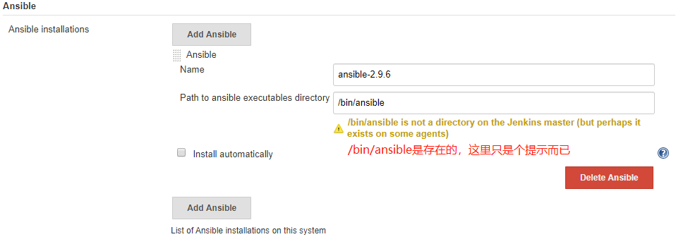
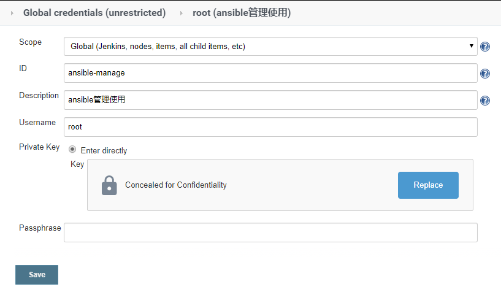
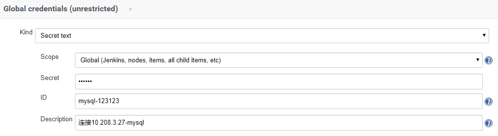
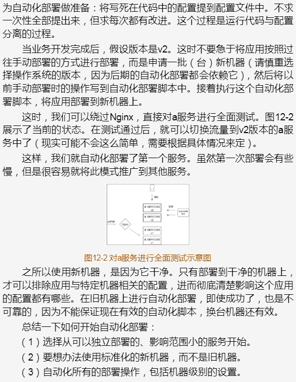

# 什么是自动化部署

我认为自动化就是一个按照事先设定的步骤执行的流程。比如：第一步安装Nginx、第二步配置Nginx、第三步启动Nginx服务.........至于第一步是使用yum还是apt实现，是工具的事情；第二步是如何将Nginx配置复制到指定目录下，那也是工具的事情。

对于工具，我们可以使用Puppet、Chef、Ansible等等。使用他们提供的运维领域特定语言来描述整个流程。

# 自动化部署的优势

一天内使用自动化部署执行同一个部署任务1000次，不会有任何怨言，而且每次执行都会保证结果一致。而手动部署的话.....

# Jenkins集成Ansible实现自动化部署

## Ansible介绍

Ansible才用了与Puppet、Chef不一样的解决方案，不需要在受控机器上安装额外的客户端软件。原因是Ansible使用的是SSH协议与受控机器进行通信，一般服务器默认都有SSH服务。Ansible因此也被成为agentless。

Ansible使用大家都熟悉的YAML格式；且不需要自己设计DSL，不需要自己写编译器（YAML可以直接映射到Python对象）。

Ansible将部署逻辑放在一个成为“playbook”的yaml文件中。通常，文件名为playbook.yml。

```YAML
---
- hosts: web
  tasks:
    - name: install nginx
      apt: name=nginx state=latest
- hosts: db
  tasks:
    - name: install mysql
      yum: name={{item}}
      with_items:
        - 'mysql-common'
        - 'mysql-client'
        - 'mysql-server'
```

组织受控机器的逻辑放在inventory文件中。这个文件是ini格式的。默认文件名为hosts。

```INI
[web]
192.168.55.31
[db]
192.168.55.21
```

上面这两个问仅构成了Ansible自动化运维的基础。

只要运行`ansible-playbook -u remote_user --ask-vault-pass template.zabbix.yaml`，输入SSH登录时用户的密码，就可以执行我们在playbook中定义的流程了。为了简单起见，通常会使用SSH密码方式登录，并在playbook中指定remote_user，所以只需要运行`ansible-playbook template.zabbix.yaml`即可。

**Ansible的隐喻**

Asnible是导演，受控机器列表（inventory）为演员列表，开发者则是编剧。开发者只要把具备（playbook.yml）写好，Ansible拿着具备与inventory对上号，演员就会按照具备如实表演，不存在任何个人发挥的空间。

## Jenkins与Ansible集成

关于这个Ansible插件可以参考下面两个链接：

- https://github.com/jenkinsci/ansible-plugin/blob/master/README.md

- https://plugins.jenkins.io/ansible/

Jenkins与Ansible集成能让Jenkins执行ansible命令。具体步骤如下：

1. 安装Ansible插件（在https://plugins.jenkins.io/ansible下载后导入，或者直接在Jenkins上搜索Ansible插件）
2. 在主控机器上安装Ansible，并设置不进行host key检查。

主控机器指的是真正执行Ansible命令的机器，也就是Jenkins。需要在主控机器上自行安装Ansible，然后修改主控机器的Ansible配置，不进行host key检查。

```BASH
$ grep "^[^#]" /etc/ansible/ansible.cfg
[defaults]
host_key_checking = False
```

如果要求安全级别高，则应该提前将所有受控机器的fingerprint放到主控机器的know_hosts文件中。

3. 在Jenkins的Manage Jenkins--Global Tool Configuration页面中，配置Ansible的执行路径。在这里可以同时添加多个Ansible版本。对于Jenkins来说每个版本用Name字段区分。pipeline中的ansiblePlaybook步骤也会使用到Name字段。



4. 在Jenkins上添加受控机器的凭证。Ansible与受控机器连接的凭证需要手动在Jenkins上添加。根据实际情况选择“用户名和密码方式”或者“用户名和密码方式”。



5. 在pipeline中加入ansiblePlaybook步骤。

部署项目的目录结构如下：

```BASH
$ tree -i ./
./
hosts
Jenkinsfile
playbook.yml
```

hosts文件内容如下：

```ini
[development]
10.208.3.21
[production]
10.208.3.23
```

playbook.yml文件内容如下：

```yaml
---
- hosts: development
  tasks:
    - debug: msg="{{ lookup('env', 'BUILD_TAG') }}"
```

Jenkinsfiles的内容如下：

```GROOVY
pipeline {
	agent any
	stages {
		stage('Build') {
			steps {
				ansiblePlaybook(
					playbook: "${env.WORKSPACE}/playbook.yml",
					inventory: "${env.WORKSPACE}/hosts",
					credentialsId: 'ansible-manage'
				)
				script {
					sh"""
						echo `date  +%Y%m%d%H%M%S`
					"""
				}
			}
		}
	}
}
```

ansiblePlaybook步骤执行的是ansible-playbook命令，其中playbook参数是playbook文件的路径，inventory参数是inventory文件的路径，credentialsId参数是之前添加的凭证的ID。

最后打印日志如下（截取了部分）

```BASH
......略
[Pipeline] // stage
[Pipeline] withEnv
[Pipeline] {
[Pipeline] stage
[Pipeline] { (Build)
[Pipeline] ansiblePlaybook
[pipeline-ansible1] $ ansible-playbook /opt/jenkins/workspace/pipeline-ansible1/playbook.yml -i /opt/jenkins/workspace/pipeline-ansible1/hosts --private-key /opt/jenkins/workspace/pipeline-ansible1/ssh8583456897778470406.key -u root
PLAY [development] *************************************************************

TASK [Gathering Facts] *********************************************************
ok: [10.208.3.21]

TASK [debug] *******************************************************************
ok: [10.208.3.21] => {
    "msg": "jenkins-pipeline-ansible1-4"
}

PLAY RECAP *********************************************************************
10.208.3.21                : ok=2    changed=0    unreachable=0    failed=0    skipped=0    rescued=0    ignored=0   
......略
```

在执行日志中，密码并不会被打印出来。

这是最基础的Jenkins与Ansible的集成。在实际工作中，我们还需要考虑自定义的role应该放在哪里等与Ansible相关的问题。

## Ansible插件详解

### ansiblePlaybook步骤

ansiblePlaybook步骤除了支持playbook、inventory、credetialsld三个参数外，还支持以下参数：

- installation：字符串类型，值为在Manage Jenkins--Global Tool Configuration页面上为Ansible路径指定的Name字段的值。此参数的作用就是指定不同版本的Ansible（当前步骤用哪个版本的Ansible执行）。

- vaultCredentialsId：Ansible vault密码在Jenkins中的凭证ID。它相当于ansible命令行的--vault-password-file参数。
- disableHostKeyChecking：布尔类型，是否进行host key检查。这个参数可以用来代替在/etc/ansible/ansible.cfg文件中`[default]`输入`host_key_checking = False`
- become：布尔类型，在执行操作的时候是否加上sudo。他相当于ansible命令行的--become参数。
- becomeUser：字符串类型，切换到超级管理员用户名，默认是root。它相当于ansible命令行的--become-user参数。
- limit：字符串类型，指定执行的主机（在inventory的基础上在进行一次过滤）。相当于ansible命令行的-l参数。多个主机之间使用逗号分隔。
- tag：指定执行有特定tag的任务。相当于ansible命令行的-t参数。多个tag之间使用逗号分隔。
- skippedTags：字符串类型，指定跳过哪些tag的任务。它相当于ansible命令行的--skip-tags参数。多个tag之间使用逗号分隔。
- startAtTask：字符串类型，从指定任务开始执行。它相当于ansible命令行的--start-at-task参数。
- forks：并行执行的进程数（一次在可以在多少个主机上执行命令）。相当于ansible命令行的-f参数。
- extras：字符串类型，扩展餐胡。当ansiblePlaybook步骤的参数无法满足需求是，可以使用此参数。比如`extras: '--syntax-check'`
- extraVars：List < org.jenkinsci.plugins.ansible.ExtraVar>类型，扩展变量。它相当于ansible命令行的-e参数。使用它的方式如下：

```GROOVY
extraVars: [
	<key>: '<value>',
	<key>: [value: '<value>', hidden: true|false]
]
```

extraVars支持hidden属性，当其值为true时，在执行日志中会隐藏参数值。

**下面的这个示例将上面讲述的参数都使用上了**

项目目录

```bash
[10.208.3.24 root@test-6:~/testapp1]# tree -i ./
./
fstab
hosts
Jenkinsfile
playbook.yml
```

Jnekinsfile

```GROOVY
pipeline {
    agent any
    stages {
        stage('Syntax check ansible playbook'){
            steps {
                ansiblePlaybook(
                	disableHostKeyChecking: true,
                    playbook: "${env.WORKSPACE}/playbook.yml",
                    inventory: "${env.WORKSPACE}/hosts",
                    credentialsId: 'vagrant',
                    extras: '--syntax-check'
                )
            }
        }
        stage('Deploy') {
            steps {
                ansiblePlaybook(
                	disableHostKeyChecking: true,
                    playbook: "${env.WORKSPACE}/playbook.yml",
                    inventory: "${env.WORKSPACE}/hosts",
                    credentialsId: 'ansible-manage',
                    skippedTags: 'tag3',
                    forks: 5,
                    limit: '10.208.3.21',
                    //tags: 'tag1,tag2,tag3,tag4,tag5,tag6,tag7,tag8,tag9',
                        //如果开启这个tags参数，则只有这里列出的，且不再skipedTags中的tag才执行，
                        //如果startAtTask指定任务所属tag不再这里，这个playbook无法执行。
                    extraVars: [
                        login: 'mylogin',
                        secret_key: [value: 'aldfjoiuae32498c', hidden: true]
                    ],
                    startAtTask: 'test2'
                )
            }
        }
    }
}
```

playbook.yml

```GROOVY
---
- hosts: development
  tasks:
    - name: test1
      tags: tag1
      debug: msg="{{ lookup('env', 'BUILD_TAG') }}"
    - name: test2
      tags: tag2
      debug: msg="{{ lookup('env', 'NODE_NAME') }}"
    - name: test3
      tags: tag3
      debug: msg="{{ lookup('env', 'WORKSPACE') }}"
    - name: test4
      tags: tag4
      debug: msg="{{ lookup('env', 'WORKSPACE_TMP') }}"
    - name: test5
      tags: tag5
      debug: msg="{{ lookup('env', 'JENKINS_HOME') }}"
    - name: test6
      tags: tag6
      debug: msg="{{ lookup('env', 'JENKINS_URL') }}"
    - name: test7
      tags: tag7
      debug: msg="{{ lookup('env', 'BUILD_URL') }}"
    - name: test8
      tags: tag8
      debug: msg="{{ lookup('env', 'JOB_URL') }}"
    - name: test9 {{ login }}
      tags: tag9
      debug: msg="{{ login }}, {{ secret_key }}" 
```

hosts

```GROOVY
[development]
10.208.3.21
10.208.3.22
10.208.3.23
[production]
10.208.3.23
```

点击Build之后，Console打印的日志

```BASH
[Pipeline] }
[Pipeline] // stage
[Pipeline] withEnv
[Pipeline] {
[Pipeline] stage
[Pipeline] { (Syntax check ansible playbook)
[Pipeline] ansiblePlaybook
[pipeline-ansible2] $ ansible-playbook /opt/jenkins/workspace/pipeline-ansible2/playbook.yml -i /opt/jenkins/workspace/pipeline-ansible2/hosts --syntax-check

playbook: /opt/jenkins/workspace/pipeline-ansible2/playbook.yml
[Pipeline] }
[Pipeline] // stage
[Pipeline] stage
[Pipeline] { (Deploy)
[Pipeline] ansiblePlaybook
[pipeline-ansible2] $ ansible-playbook /opt/jenkins/workspace/pipeline-ansible2/playbook.yml -i /opt/jenkins/workspace/pipeline-ansible2/hosts -l 10.208.3.21 --skip-tags=tag3 --start-at-task=test2 -f 5 --private-key /opt/jenkins/workspace/pipeline-ansible2/ssh6988097900659605725.key -u root -e login=mylogin -e ********

PLAY [development] *************************************************************

TASK [Gathering Facts] *********************************************************
ok: [10.208.3.21]

TASK [test2] *******************************************************************
ok: [10.208.3.21] => {
    "msg": "master"
}

TASK [test4] *******************************************************************
ok: [10.208.3.21] => {
    "msg": ""
}

TASK [test5] *******************************************************************
ok: [10.208.3.21] => {
    "msg": "/opt/jenkins"
}

TASK [test6] *******************************************************************
ok: [10.208.3.21] => {
    "msg": "https://jenkins-netadm.leju.com/"
}

TASK [test7] *******************************************************************
ok: [10.208.3.21] => {
    "msg": "https://jenkins-netadm.leju.com/job/pipeline-ansible2/18/"
}

TASK [test8] *******************************************************************
ok: [10.208.3.21] => {
    "msg": "https://jenkins-netadm.leju.com/job/pipeline-ansible2/"
}

TASK [test9 mylogin] ***********************************************************
ok: [10.208.3.21] => {
    "msg": "mylogin, aldfjoiuae32498c"
}

PLAY RECAP *********************************************************************
10.208.3.21                : ok=8    changed=0    unreachable=0    failed=0    skipped=0    rescued=0    ignored=0   

[Pipeline] }
[Pipeline] // stage
[Pipeline] }
[Pipeline] // withEnv
[Pipeline] }
[Pipeline] // node
[Pipeline] End of Pipeline
Finished: SUCCESS
```

### ansibleVault步骤

ansiblePlaybook步骤只是Ansible插件提供的两个步骤中的一个，还有AnsibleVault步骤。这个步骤和ansible-vault命令是一个意思。

放到配置文件中的MySQL连接密码，是不想让所有人看到的，Ansible vault是Ansbile的一个特性，它能帮助我们加/解密配置文件或者某个配置项。

在ansiblePlaybook步骤中，vaultCredentialsld参数的作用，是在ansible-playbook的执行过程中，对实现放在playbook中的密文进行解密，解密需要密码，vaultCredentialsld就是我们实现存储在Jenkins中的密码的凭证ID。

而ansibleVault步骤所做的事情就是执行Ansible提供的ansible-vault命令。该命令通常用于对敏感数据进行加解密。

ansibleVault支持以下参数：

- action（必填）：字符串类型，ansibleVault执行的操作类型包括：
  - encrypt：用于加密文件
  - encrypt_string：用于加密字符串
  - rekey：使用一个新的密码重新加密文件，但是仍然需要提供旧的密码
  - decrypt：用于解密
- content：字符串类型，使用encrypt_string时，想要加密的字符串内容
- input：字符串类型，追加到ansible-vault命令行后面的参数。
- installation：字符串类型，与ansiblePlaybook步骤的installation参数一样。指定ansible程序的
- newVaultCredentialsId：字符串类型，使用新的凭证进行重新加密时，输入新的凭证。相当于ansible-vault命令的--new-vault-password-file参数。
- output：字符串类型，一般用于将解密后的文件内容输出到指定文件中。
- VaultCredentialsId（必填）：字符串类型，密码的凭证ID。

对文件进行加密

```BASH
ansibleVault(
	action: "encrypt",
	vaultCredentialsId: "mysql-123123",
	input: "${env.WORKSPACE}/playbook.yml"
)
```

对文本内容进行加密（对content参数，通常通过参数化传入，而不是下面这样写死）

```GROOVY
ansibleVault(
	action: "encrypt_string",
	vaultCredentialsId: "mysql-123123",
	content: "${secret}"
)
```

更换vault密码

```GROOVY
ansibleVault(
	action: "rekey",
	vaultCredentialsId: "mysql-123123",
    newvaultCredentialsId: "mysql-456456",
	input: "${env.WORKSPACE}/playbook.yml"
)
```

对文件进行解密

```GROOVY
ansibleVault(
	action: "decrypt",
	vaultCredentialsId: "mysql-123123",
	input: "${env.WORKSPACE}/playbook.yml"
)
```

我个人感觉，除了对文件进行解密有些用处意外，其余的基本不会使用。对文本进行解密的场景如下。

playbook中有一些很重要的密码，比如mysql的。为了安全，先对playbook中进行加密。然后jenkins执行的时候，使用定义好的凭据进行解密然后成功执行。

有人可能会问，应该什么时候做playbook的加密，我认为这应该先在本地机密，然后将加密的playbook推送到git中。然后jenkins执行的时候解密就可以了。如果将明文的playbook推送到git仓库，那就没有安全性可言了。

项目目录

```bash
[10.208.3.24 root@test-6:~/testapp1]# tree -i ./
./
fstab
hosts
Jenkinsfile
playbook.yml
```

添加凭据，种类是Secret text



Jenkinsfile

```GROOVY
pipeline {
    agent any
	stages {
        stage('Deploy') {
            steps {
                ansibleVault(
					action: "decrypt",
					vaultCredentialsId: "mysql-123123",		//调用上面创建的凭据进行解密
					input: "${env.WORKSPACE}/playbook.yml"	//要解密的文件是playbook.yml
				)
                ansiblePlaybook(
                	disableHostKeyChecking: true,
                    playbook: "${env.WORKSPACE}/playbook.yml",
                    inventory: "${env.WORKSPACE}/hosts",
                    credentialsId: 'ansible-manage',
                    skippedTags: 'tag3',
                    forks: 5,
                    limit: '10.208.3.21',
                    extraVars: [
                        login: 'mylogin',
                        secret_key: [value: 'aldfjoiuae32498c', hidden: true]
                    ]
                )
            }
        }
	}
}
```

playbook（已经使用ansible-vault加密了，密码123）

```BASH
[10.208.3.24 root@test-6:~/testapp1]# ansible-vault encrypt playbook.yml
[10.208.3.24 root@test-6:~/testapp1]# ansible-vault view playbook.yml
Vault password: 
---
- hosts: development
  tasks:
    - name: test1
      tags: tag1
      debug: msg="{{ lookup('env', 'JOB_URL') }}"
    - name: test2
      tags: tag2
      debug: msg="{{ login }}, {{ secret_key }}" 
```

如果把Jenkinsfile中的ansibleVault步骤去掉，然后点击Build。Console中会显示报错，提示无法无法解密，找不到vault secret。

```bash
....略
[pipeline-ansible3] $ ansible-playbook /opt/jenkins/workspace/pipeline-ansible3/playbook.yml -i /opt/jenkins/workspace/pipeline-ansible3/hosts -l 10.208.3.21 --skip-tags=tag3 -f 5 --private-key /opt/jenkins/workspace/pipeline-ansible3/ssh4653301928866726946.key -u root -e login=mylogin -e ********
ERROR! Attempting to decrypt but no vault secrets found
FATAL: command execution failed
hudson.AbortException: Ansible playbook execution failed
....略
```

按照上面的Jnekinsfile构建，Console日志如下

```BASH
[Pipeline] }
[Pipeline] // stage
[Pipeline] withEnv
[Pipeline] {
[Pipeline] stage
[Pipeline] { (Deploy)
[Pipeline] ansibleVault
##将凭据放到一个临时文件里，先对playbook进行解密
[pipeline-ansible3] $ ansible-vault decrypt --vault-password-file /opt/jenkins/workspace/pipeline-ansible3/vault2955793952967861400.password /opt/jenkins/workspace/pipeline-ansible3/playbook.yml	
[Pipeline] ansiblePlaybook
[pipeline-ansible3] $ ansible-playbook /opt/jenkins/workspace/pipeline-ansible3/playbook.yml -i /opt/jenkins/workspace/pipeline-ansible3/hosts -l 10.208.3.21 --skip-tags=tag3 -f 5 --private-key /opt/jenkins/workspace/pipeline-ansible3/ssh2527546962997407896.key -u root -e login=mylogin -e ********

PLAY [development] *************************************************************

TASK [Gathering Facts] *********************************************************
ok: [10.208.3.21]

TASK [test1] *******************************************************************
ok: [10.208.3.21] => {
    "msg": "https://jenkins-netadm.leju.com/job/pipeline-ansible3/"
}

TASK [test2] *******************************************************************
ok: [10.208.3.21] => {
    "msg": "mylogin, aldfjoiuae32498c"
}

PLAY RECAP *********************************************************************
10.208.3.21                : ok=3    changed=0    unreachable=0    failed=0    skipped=0    rescued=0    ignored=0   

[Pipeline] }
[Pipeline] // stage
[Pipeline] }
[Pipeline] // withEnv
[Pipeline] }
[Pipeline] // node
[Pipeline] End of Pipeline
Finished: SUCCESS
```

## 关于不同的受控机器使用不同的登录方式

现实环境中，对不同环境下的机器可能使用不同的登录方式，甚至对同一个环境下的不同机器也会使用不同的登录方式。在这种情况下，我们可以使用Ansible的host变量来对不同机器使用不同的登录方式。

基于之前的例子，我们在项目根目录下创建一个名为host_vars的目录

# 如何开始自动化部署

**愿景**

开发人员惬意的坐在电脑前，轻轻的在“部署”按钮上点一下，拉取代码、编译、打包、自动化测试、部署......各个阶段在屏幕上如行云流水般的进行。一台台机器显示绿色（部署成功）。几分钟好，相关领导及团队成员就收到了成功上线后的验证报告邮件。

**现实**

有永远做不完的业务需求，人手永远不够，自动化部署的专项改造的优先级永远排在业务开发的后面。

在这情况下，开始自动化部署之路的方式方法：




